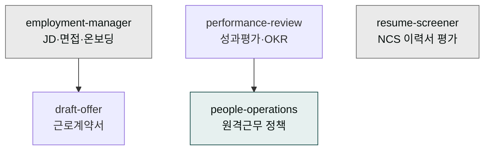
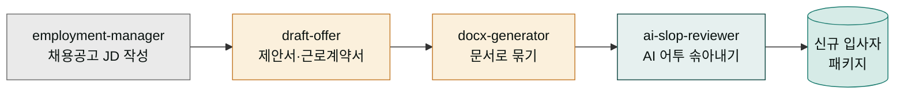

# moai-hr

> 한국 노동법·4대보험을 반영한 5개 스킬을 제공합니다.



## 무엇을 하는 플러그인인가

`moai-hr`는 채용공고(JD) 작성, 면접 질문 설계, 신입 온보딩, 채용 제안서·근로계약서, MBO·OKR·KPI 기반 성과평가, 원격·하이브리드 근무 정책까지 HR 전 영역을 커버합니다. 2026년 기준 4대보험 요율과 근로기준법 조항을 계약서 템플릿에 반영하며, 스톡옵션 부여계약서 표준 조항도 포함됩니다.

## 이 플러그인으로 무엇을 할 수 있나

한 사람이 새로 입사해서 정식 직원이 되기까지 거치는 일을 떠올려 보세요. 먼저 어떤 사람을 뽑을지 정하고 채용공고를 쓰고, 면접에서 무엇을 물어볼지 준비하고, 합격하면 연봉과 근무조건을 적은 제안서와 근로계약서를 씁니다. 입사한 뒤에는 일을 잘하고 있는지 정기적으로 평가하고, 원격으로 일할 때 지켜야 할 규칙도 정합니다. 회사라면 보통 인사팀이 이 모든 절차를 창구 한 곳에서 처리합니다.

`moai-hr`은 바로 이 "인사팀 창구" 역할을 하는 스킬 묶음입니다. 채용공고를 쓰는 일(JD 작성), 면접 질문을 만드는 일, 합격자에게 줄 근로계약서를 쓰는 일, 일하면서 성과를 평가하는 일(MBO·OKR·KPI), 원격근무 규칙을 정하는 일을 각각 전문으로 하는 스킬이 하나씩 들어 있습니다. 이 스킬들은 한국 노동 현실에 맞춰져 있어 4대보험(국민연금·건강보험·고용보험·산재보험) 요율과 근로기준법 조항을 계약서에 자동으로 반영합니다.

즉 "채용에서 정착까지, 인사 업무 전체를 한 창구에서" 처리하고 싶을 때 이 플러그인을 꺼내 쓰면 됩니다. 복잡한 노동 용어를 외울 필요 없이 상황을 말로 설명하면 알맞은 문서와 절차를 만들어 줍니다.

## 설치



1. `moai-core` 설치 후 `moai-hr` 옆의 **+** 버튼을 눌러 설치합니다.


[GitHub 저장소](https://github.com/modu-ai/cowork-plugins/tree/main/moai-hr)를 클론한 뒤 `~/.claude/plugins/`에 배치합니다.



## 핵심 스킬

| 스킬 | 용도 |
|---|---|
| `employment-manager` | JD 작성, 면접 질문, 신입 온보딩, 멘토링 |
| `draft-offer` | 채용 제안서·근로계약서 (연봉·4대보험·스톡옵션) |
| `performance-review` | MBO·OKR·KPI, 360도 평가, 피드백 면담 스크립트 |
| `people-operations` | 원격·하이브리드 근무 정책, 협업 도구, 직원 경험 |
| `resume-screener` | NCS 기반 이력서·자기소개서 적합성 평가, 보호 정보 마스킹 |

## 한국 실무 반영

- 2026년 기준 **4대보험 요율** 자동 반영
- **근로기준법** 조항 기반 계약서 템플릿
- **스톡옵션 부여계약서** 표준 조항 포함

## 대표 체인

**신규 입사자 패키지**

한 명을 채용해 입사시키는 과정은 스킬들을 거치며 하나의 산출물로 합쳐집니다. 공장의 컨베이어 벨트처럼 각 스킬이 한 단계씩 결과물을 만들어 다음 스킬에 넘기면, 최종적으로 "신규 입사자 패키지"라는 하나의 문서 묶음이 완성됩니다.



```text
employment-manager(JD) → draft-offer → docx-generator → ai-slop-reviewer
```

**분기 성과평가 운영**

```text
performance-review → docx-generator(면담 스크립트)
```

## 빠른 사용 예


> 시니어 백엔드 개발자 채용 JD 만들어줘. 연봉 밴드 5500-7500만.



> 수습 3개월 끝나는 직원에게 근로계약서 업데이트 초안 만들어줘.


## 다음 단계

- [`moai-finance`](../moai-finance/) — 급여 정산
- [`moai-legal`](../moai-legal/) — 근로계약 검토

---

### Sources

- [modu-ai/cowork-plugins](https://github.com/modu-ai/cowork-plugins)
- [moai-hr 디렉터리](https://github.com/modu-ai/cowork-plugins/tree/main/moai-hr)
