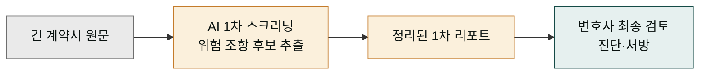
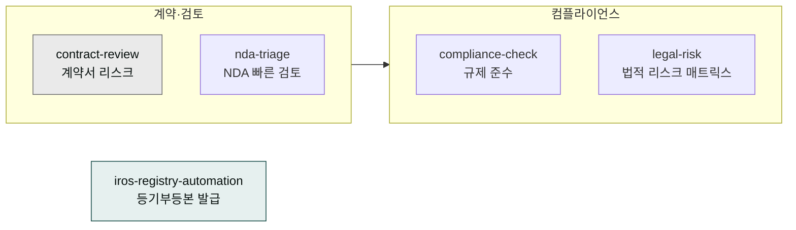
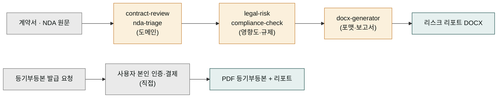

# moai-legal

> 법무 실무를 위한 5개 스킬을 제공합니다. 대한민국 민법·상법 기준으로 설계됐습니다.

## 이 플러그인으로 무엇을 할 수 있나

`moai-legal`을 건강검진 보조 간호사에 비유하면 이해가 쉽습니다. 간호사가 혈압과 혈액 수치 같은 기본 검사를 빠르게 찍어 "이 부분은 다시 정밀 검사해 보세요"라는 1차 리포트를 만들어 주듯, 이 플러그인은 수십 페이지짜리 계약서에서 "위험 조항 후보"를 먼저 걸러내는 역할을 합니다. 여기서 **1차 스크리닝**이란, 사람이 한 줄 한 줄 읽기 전에 AI가 전체를 빠르게 훑어 의심 가는 조항을 몇 가지로 좁혀 주는 사전 정리 단계를 뜻합니다.

중요한 점은 최종 진단과 처방은 여전히 전문의의 몫이라는 것입니다. 간호사의 혈압 측정이 의사의 진단을 대신하지 않듯, 이 플러그인이 내놓는 리스크 후보 목록은 변호사의 최종 검토를 대체하지 않습니다. AI는 "어디를 자세히 볼까"를 알려 주는 보조 도구이고, 계약을 맺을지 말지, 약관을 어떻게 고칠지의 결정은 반드시 법률 전문가가 내립니다. 즉 일상적으로는 계약서 초안 정리와 위험 조항 찾기를 빠르게 해주되, 법적 효력이 걸린 판단은 사람이 책임지는 구조입니다.





## 무엇을 하는 플러그인인가

`moai-legal`는 계약서·이용약관·개인정보처리방침·SLA 리스크 분석, NDA 빠른 검토, 규제 준수·내부 감사·ESG 보고, 기업 법적 리스크 매트릭스 및 IP 포트폴리오 분석까지 법무팀의 1차 스크리닝을 자동화합니다. korean-law MCP와 연동하면 국가법령정보센터·판례 검색을 체인에 포함시킬 수 있습니다.

## 설치



1. `moai-core` 설치 후 `moai-legal` 옆의 **+** 버튼을 눌러 설치합니다.


[GitHub 저장소](https://github.com/modu-ai/cowork-plugins/tree/main/moai-legal)를 클론한 뒤 `~/.claude/plugins/`에 배치합니다.



## 핵심 스킬 (5개)

| 스킬 | 용도 |
|---|---|
| `contract-review` | 계약서·이용약관·개인정보처리방침·SLA 10대 리스크 분석 |
| `nda-triage` | 비밀유지계약(NDA) 빠른 검토·위험 조항 식별 |
| `compliance-check` | 규제 준수 점검, 내부 감사, ESG 보고 |
| `legal-risk` | 기업 법적 리스크 매트릭스, IP 포트폴리오 분석 |
| `iros-registry-automation` | 인터넷등기소(IROS) 법인·부동산 등기부등본 일괄 발급 보조 |

## `iros-registry-automation` (인터넷등기소 자동화)

대법원 인터넷등기소(IROS, `iros.go.kr`)에서 **법인·부동산 등기부등본**을 묶음 단위로 발급해야 할 때, 사용자가 직접 로그인·결제하는 흐름 안에서 장바구니·열람·저장을 안전하게 보조합니다. 실사·법무 검토·법인 일괄 관리에 사용합니다.

### Hard Limits (사용자가 반드시 직접)

왜 로그인과 결제만큼은 에이전트가 아니라 사람이 직접해야 할까요. 은행 창구를 떠올려 보면 자연스럽습니다. 은행원이 대기표를 뽑아 주고 서류를 미리 정리해 주는 일(보조)은 할 수 있지만, 신분증 확인과 계좌 이체 비밀번호 입력만큼은 반드시 고객 본인의 손을 거쳐야 합니다. 등기부등본 발급도 같은 원리입니다. 등기소 로그인용 ID와 비밀번호, 공동인증서 비밀번호, OTP(일회용 비밀번호)는 모두 '본인 확인' 수단이라 법적으로 사용자 본인이 직접 입력해야 하고, 최종 결제 승인 역시 본인 동의가 필요한 행위라 AI가 대신 누를 수 없습니다.

- **로그인은 사용자가 브라우저에서 직접** — ID/PW, 공동인증서 비밀번호, OTP를 에이전트가 입력하지 않습니다.
- **결제는 사용자가 직접** — 카드 승인·결제 확인은 사람이 처리합니다.
- 법인 결제는 페이지당 10건 제약. TouchEn nxKey 사전 설치 필요.

### 본 스킬 vs 등기정보광장 OpenAPI (도메인 분리)

| 구분 | `iros-registry-automation` (본 스킬) | [등기정보광장 OpenAPI](https://data.iros.go.kr) |
|---|---|---|
| 목적 | IROS 사이트에서 등기부등본 **발급** 자동화 | 등기 통계·정보 조회용 **공식 OpenAPI** |
| 입력 | 법인등록번호·상호명·주소 목록 | 통계 코드·기준일자 |
| 출력 | PDF 등기부등본 + 종합 리포트 | JSON 통계 데이터 |
| 사용자 행위 | 사용자가 브라우저에서 로그인·결제 | API 키 발급 후 호출 |

본 스킬을 사용하기 전에 발급(다운로드)이 아닌 **통계·메타 조회**가 목적이라면 등기정보광장 OpenAPI가 더 적합할 수 있습니다.

### 출처 어트리뷰션

본 스킬은 **NomaDamas/k-skill** (MIT) 의 `iros-registry-automation`을 cowork 컨벤션에 맞춰 포팅했습니다. 원 저작자 참고 구현은 [`challengekim/iros-registry-automation`](https://github.com/challengekim/iros-registry-automation) 입니다.

## 선택 연동

- **korean-law MCP** — 국가법령정보센터, 판례 검색
- `moai-office` — 최종 DOCX·HWPX 저장

## 법무 워크플로: 원문이 들어와 산출물로 나가는 흐름

법무 작업은 세탁소 콘베이어 벨트를 떠올리면 한눈에 보입니다. 더러운 옷(계약서·NDA 원문)을 투입구에 넣으면 분류 → 본세탁 → 다림질 스테이션을 차례로 통과하고, 마지막에 깨끗하게 포장된 옷(검토 완료 문서)이 나옵니다. 이 플러그인도 같은 구조로 돌아갑니다. 원문이 들어오면 도메인 스킬이 리스크를 짚어내고, 포맷 스킬이 결과를 DOCX 같은 보고서로 감싸고, 마지막에 품질 스킬이 문장을 다듬어 변호사에게 넘길 수 있는 산출물을 만듭니다.

각 스테이션이 하는 일이 다르듯, 화살표마다 흐르는 것도 다릅니다. `contract-review`를 거치면 "위험 조항 목록"이 흘러나오고, 그 목록이 `legal-risk`에 들어가 "영향도 등급"으로 바뀝니다. `iros-registry-automation`은 흐름이 조금 다릅니다 — 등기부등본 원문 자체가 아니라 "발급 요청"이 들어가면 사용자 본인 인증 단계를 거쳐 PDF 등기부등본이 나옵니다. 아래 그림에서 계약서 원문이 어느 스킬을 거쳐 어떤 문서로 바뀌는지를 한 줄로 따라갈 수 있습니다.



## 대표 체인

**NDA 빠른 검토**

```text
nda-triage → docx-generator(수정본) → ai-slop-reviewer
```

**계약서 정식 리뷰**

```text
contract-review → legal-risk(영향도 평가) → docx-generator
```

**분기 컴플라이언스 감사**

```text
compliance-check → docx-generator(보고서)
```

## 주의


법률 자문의 **최종 결정**은 반드시 변호사가 검토해야 합니다. 이 플러그인은 초안 작성·리스크 1차 스크리닝용입니다. [Cowork 안전 사용](../../cowork/safety/)을 참고하세요.


## 빠른 사용 예

```text
> 상대측에서 보낸 NDA 검토해줘. 우리에게 불리한 조항 위주로.
```

```text
> 개인정보처리방침을 2026년 기준으로 업데이트해줘.
```

## 다음 단계

- [`moai-finance`](../moai-finance/) — 재무·세무 결합
- [Cowork 커넥터와 MCP](../../cowork/connectors-mcp/) — korean-law MCP 설정

---

### Sources

- [modu-ai/cowork-plugins](https://github.com/modu-ai/cowork-plugins)
- [moai-legal 디렉터리](https://github.com/modu-ai/cowork-plugins/tree/main/moai-legal)
- [korean-law MCP](https://korean-law-mcp.fly.dev) — 국가법령정보센터 통합 (compliance-check, legal-risk)
- [NomaDamas/k-skill](https://github.com/NomaDamas/k-skill) — MIT — `iros-registry-automation` 원본
- [challengekim/iros-registry-automation](https://github.com/challengekim/iros-registry-automation) — MIT — IROS 자동화 참고 구현
- [대법원 인터넷등기소 (iros.go.kr)](https://www.iros.go.kr) — 발급 사이트
- [등기정보광장 OpenAPI (data.iros.go.kr)](https://data.iros.go.kr) — 별개 서비스, 통계·메타 조회용
