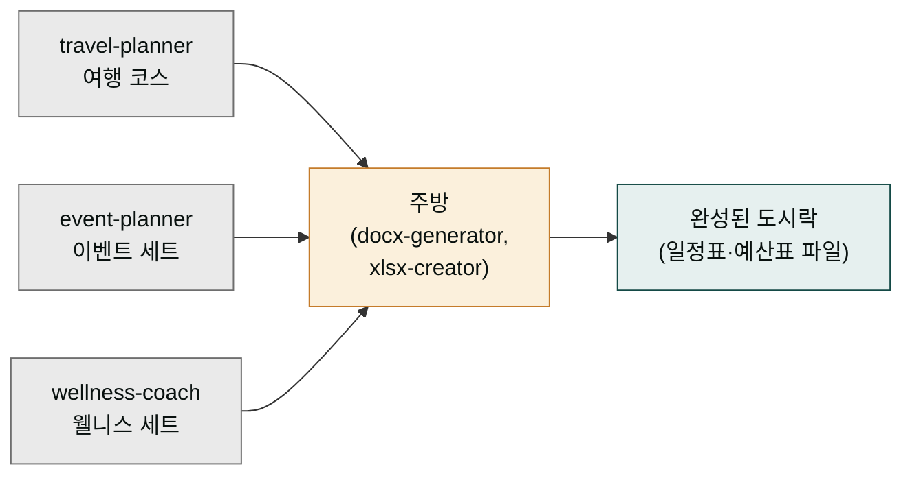

# moai-lifestyle

> 개인 일상과 이벤트 기획을 위한 3개 스킬을 제공합니다.



## 무엇을 하는 플러그인인가

`moai-lifestyle`는 개인 일상 영역을 자동화하는 3개의 스킬을 한 상자에 묶어둔 플러그입니다. 여기서 **플러그인**(plugin)은 "같은 주제의 스킬을 묶은 상자"이고, **스킬**(skill)은 "이런 요청이 오면 이렇게 처리해라"라는 절차적 지침 묶음입니다. 이 플러그인 한 상자를 설치하면 여행 에이전트, 이벤트 플래너, 퍼스널 웰니스 코치 세 명의 개인 비서를 한 번에 고용하는 셈이 됩니다.

- `travel-planner` — 여행 에이전트. 일정·맛집·숙소·예산을 짜고, 부동산 수익률이나 사이드 프로젝트 타당성까지 검토합니다.
- `event-planner` — 웨딩·행사 플래너. 행사·워크샵·웨딩 준비의 예산과 타임라인을 정리합니다.
- `wellness-coach` — 퍼스널 트레이너·영양사 겸 시니어 돌봄 매니저. 운동 루틴, 식단, 육아, 시니어 케어 플랜을 만듭니다.

사용자는 그냥 "제주 3박 4일 가족여행 짜줘" 한 줄을 던지면 됩니다. 비서는 알아서 일정을 구성하고, 엑셀 예산표와 워드 일정표 파일까지 만들어 건네줍니다. 세 비서가 꼭 함께 일할 필요는 없습니다 — 여행이 필요하면 `travel-planner`만, 웨딩을 준비하면 `event-planner`만 불러도 됩니다. **토큰**(token)이란 컴퓨터가 한 번에 읽는 텍스트 분량의 단위인데, 스킬 하나만 부르면 전체 스킬을 한꺼번에 읽지 않아도 돼 토큰이 절약됩니다.

## 설치



1. `moai-core` 설치 후 `moai-lifestyle` 옆의 **+** 버튼을 눌러 설치합니다.


[GitHub 저장소](https://github.com/modu-ai/cowork-plugins/tree/main/moai-lifestyle)를 클론한 뒤 `~/.claude/plugins/`에 배치합니다.



## 핵심 스킬

| 스킬 | 용도 |
|---|---|
| `travel-planner` | 여행 일정·맛집·숙소·예산, 부동산 수익률, 사이드 프로젝트 |
| `event-planner` | 행사·워크샵·웨딩 준비, 예산·타임라인 |
| `wellness-coach` | 운동 루틴, 식단, 육아, 시니어 케어 |

## 대표 체인

위 다이어그램은 요리 메뉴판에 비유하면 쉽습니다. 각 스킬은 주문 가능한 요리(여행 코스, 이벤트 세트, 웰니스 세트)이고, `docx-generator`·`xlsx-creator` 같은 포맷 스킬은 주방입니다. 주방이 주문을 받아 완성된 도시락(엑셀 예산표, 워드 일정표 파일)으로 포장해 내어줍니다. 세 요리를 한 번에 시킬 필요 없이 원하는 하나만 골라도 됩니다.

**여행 일정표**

```text
travel-planner → xlsx-creator(예산표) → docx-generator(일정표)
```

**이벤트 기획**

```text
> event-planner → docx-generator(기획서) → xlsx-creator(체크리스트)
```

**웰니스 플랜**

```text
wellness-coach → docx-generator(월간 플랜) → ai-slop-reviewer
```

## 빠른 사용 예

```text
제주 3박 4일 가족 여행(아이 7세) 일정 짜줘. 예산 150만원, 렌트카 포함.
```

```text
> 50명 규모 회사 워크샵 하루 프로그램 기획해줘. 팀빌딩 위주.
```

## 다음 단계

- [`moai-business`](../moai-business/) — 부업·사이드 프로젝트 기획
- [`moai-finance`](../moai-finance/) — 개인 재무

---

### Sources

- [modu-ai/cowork-plugins](https://github.com/modu-ai/cowork-plugins)
- [moai-lifestyle 디렉터리](https://github.com/modu-ai/cowork-plugins/tree/main/moai-lifestyle)
