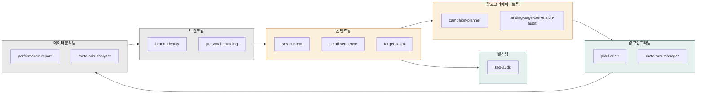
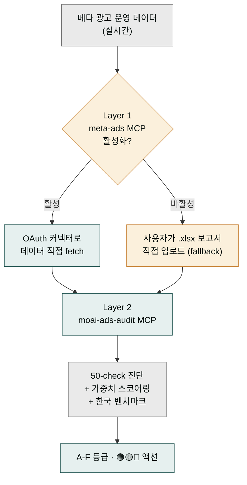
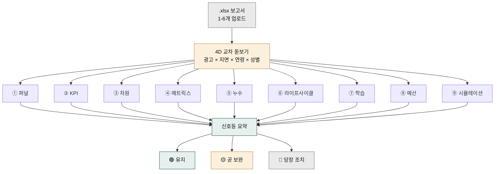
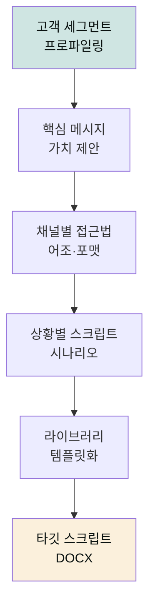

# moai-marketing

> 퍼스널·기업 브랜딩부터 퍼포먼스 마케팅까지 12개 스킬을 제공합니다. 광고 심리학 완전판·랜딩 페이지 CVR 진단·메타·구글 픽셀 검증 + 메타 광고 보고서 분석기 + 공식 커넥터 기반 라이브 광고 운영 + 자체 audit MCP 서버 인프라까지 한국 시장 특화 마케팅 풀스택을 한 플러그인에서 처리합니다.

## 무엇을 하는 플러그인인가

`moai-marketing`는 브랜드 아이덴티티 설계부터 SEO 감사, 이메일 드립 캠페인, GA4·메타·카카오모먼트 통합 ROAS 분석, 메타 광고관리자 `.xlsx` 보고서 audit까지 마케팅 실무 전 주기를 커버하는 플러그인입니다. 네이버·구글·생성형 검색(GEO)을 모두 포함한 한국 시장 SEO 감사, 정보통신망법을 준수하는 이메일 시퀀스 설계, 한국 시장 7 변화 영역(벤치마크·8 산업·5 규제·표현·출력·분석 차원·사용자 그룹) 특화 audit 등 국내 규제·채널 특성을 반영합니다.

`meta-ads-analyzer`는 메타 광고관리자 `.xlsx` 보고서 1-6개 업로드 한 번으로 9 분석 모듈(퍼널·KPI·차원·매트릭스·누수·라이프사이클·학습·예산·시뮬) + 4D 교차(광고×지면×연령×성별) + 3 사용자 그룹 톤(명시 입력) + 4 출력 형식(HTML/DOCX/PPTX/MD) + 🟢🟡🔴 강도별 액션 옵션을 한 번에 뽑아냅니다. 이와 함께 자체 MCP 서버 `mcp-servers/moai-ads-audit/`(Python uvx, MIT)가 동봉되어 — [agricidaniel/claude-ads](https://github.com/AgriciDaniel/claude-ads) v1.5.1 (MIT, 4,815 stars) 방법론을 한국 시장에 맞춰 차용한 50-check audit + 가중치 스코어링 + 한국 벤치마크 8 카테고리 + 5 규제 컴플라이언스를 제공합니다.

`campaign-planner`에는 광고 심리학 완전판(9 인지편향·6 방아쇠·PAS·후크 6종)이 통합되어 있고, 랜딩 페이지 CTR/CVR 분기·불안해소 처방은 `landing-page-conversion-audit`, 메타·구글 픽셀·CAPI·Lookalike 씨앗 품질 검증은 `pixel-audit`가 담당합니다.

## 설치



1. `moai-core` 설치 후 `moai-marketing` 옆의 **+** 버튼을 눌러 설치합니다.


[GitHub 저장소](https://github.com/modu-ai/cowork-plugins/tree/main/moai-marketing)를 클론한 뒤 `~/.claude/plugins/`에 배치합니다.



## 이 플러그인으로 무엇을 할 수 있나

`moai-marketing`에 들어있는 12개 스킬은 하나의 마케팅 에이전시에 여러 부서가 있는 것과 같습니다. 브랜드팀(`brand-identity`·`personal-branding`)이 이름과 톤을 정하고, 콘텐츠팀(`sns-content`·`email-sequence`·`target-script`)이 그 톤으로 글을 뿌리고, SEO팀(`seo-audit`)이 검색에서 잘 걸리게 손보고, 광고크리에이티브팀(`campaign-planner`·`landing-page-conversion-audit`)이 캠페인과 랜딩을 만들고, 광고인프라팀(`pixel-audit`·`meta-ads-manager`)이 픽셀과 라이브 광고를 점검하고, 데이터분석팀(`performance-report`·`meta-ads-analyzer`)이 성과를 읽어 보고서로 묶습니다.

핵심은 부서가 따로 노는 게 아니라 한 부서 산출물이 다음 부서의 입력이 된다는 점입니다. 브랜드팀이 정한 톤은 콘텐츠팀의 글에 스며들고, 콘텐츠팀이 만든 글은 SEO팀이 가공해 검색에 올라가며, 광고팀이 만든 캠페인의 결과는 데이터팀이 모아 다음 캠페인의 방향을 정하는 데 쓰입니다. 결국 여러 부서의 산출물이 모여 '하나의 캠페인 결과'라는 하나의 결과물로 조립됩니다. 플러그인이 12개 스킬로 나뉜 이유도 각 부서가 전문 분야만 깊이 파고들도록 역할을 나눠둔 덕분에, 단일 스킬이 모든 걸 얕게 처리하는 것보다 훨씬 정확한 결과를 냅니다.



한 부서의 산출물이 다음 부서로 흘러가 최종적으로 '캠페인 결과 보고서'라는 하나의 결과물로 조립되는 흐름입니다. 각 화살표는 앞 스킬의 결과물이 뒤 스킬의 입력이 됨을 뜻합니다.

## 핵심 스킬 (12개)

| 스킬 | 용도 |
|---|---|
| `brand-identity` | 네이밍·슬로건·톤앤매너·비주얼 가이드 |
| `personal-branding` | 전문가 포지셔닝, 링크드인·브런치·유튜브 전략 |
| `sns-content` | 인스타·네이버 블로그·카카오 브랜드 보이스 콘텐츠 + 글로벌 4채널(스레드·X·링크드인·유튜브쇼츠) + 채널별 심리 상태 매트릭스 |
| `campaign-planner` | 마케팅 캠페인·그로스해킹·인플루언서 + 광고 심리학 완전판(성과 공식·3 동기·6 방아쇠·9 편향·PAS·후크 6종·영상 30초·타겟 온도×3동기 매트릭스·CAC/LTV·단계별 예산 배분) |
| `seo-audit` | 네이버·구글·AI(GEO) 통합 SEO 감사 |
| `email-sequence` | 정보통신망법 준수 드립 캠페인·온보딩 시퀀스 |
| `performance-report` | GA4·네이버·메타·카카오모먼트 채널별 ROAS 분석 |
| `target-script` | 타깃 고객 스크립트, 맞춤형 메시지, 세그먼트별 콘텐츠 |
| `landing-page-conversion-audit` | 랜딩 페이지 6섹션 진단(히어로·공감·증명·사회증거·CTA·FAQ) + CTR/CVR 분기 + 불안해소·메시지 일치 처방 |
| `pixel-audit` | 메타·구글 픽셀 + CAPI + Lookalike 씨앗 품질 검증 (VIP 상위 20% 권장) + 1st Party 데이터 진단 |
| `meta-ads-analyzer` | 메타 광고관리자 `.xlsx` 보고서 1-6개 → 9 분석 모듈 + 4D 교차(광고×지면×연령×성별) + 3 사용자 그룹 톤(명시 입력) + 4 출력 형식(HTML/DOCX/PPTX/MD) + 🟢🟡🔴 강도별 액션 옵션. claude-ads v1.5.1 (MIT) 50-check 한국 매핑 |
| `meta-ads-manager` | Meta 공식 **Ads AI Connectors**(OAuth 커넥터)에 연결해 캠페인·광고세트·광고를 자연어로 **직접 생성·수정·예산조정·온오프**. 신규 리소스 PAUSED 기본 + 쓰기 동작 사용자 승인. 보고서 분석은 `meta-ads-analyzer`와 페어 분리 |

## MCP 서버 인프라

본 플러그인은 `.mcp.json`에 2개 MCP 서버를 등록합니다 — Layer 1 데이터 fetch + Layer 2 audit 비즈니스 로직. 자세한 발급 절차·환경변수는 [CONNECTORS.md](https://github.com/modu-ai/cowork-plugins/blob/main/moai-marketing/CONNECTORS.md) 참조.

| MCP 이름 | 책임 | 유형 | 환경변수 |
|---------|------|------|---------|
| `meta-ads` | Meta 공식 Ads AI Connectors — 라이브 운영 + Marketing API 데이터 fetch (Layer 1) | http (hosted at `mcp.facebook.com/ads`) | Meta Business OAuth 2.0 (정적 토큰 불필요) |
| `moai-ads-audit` | 50-check audit + 가중치 스코어링 + 한국 벤치마크/컴플라이언스 (Layer 2) | stdio (local uvx, `mcp-servers/moai-ads-audit/`) | `MOAI_LOG_LEVEL` (선택) |

**자체 MCP 서버 사양** (`moai-ads-audit`):

- Python uvx 패키지(MIT, v0.1.0) — cowork-plugins monorepo 첫 MCP 서버 패키지
- 가중치 스코어링: `S_total = Σ(C_pass × W_sev × W_cat) / Σ(C_total × W_sev × W_cat) × 100`
- Severity: Critical 5.0× · High 3.0× · Medium 1.5× · Low 0.5×
- 카테고리 가중치: Pixel/CAPI 30% · Creative 30% · Account 20% · Audience 20%
- A-F 등급: A ≥90 / B 75-89 / C 60-74 / D 40-59 / F <40
- 43 unique check matrix (Pixel/CAPI 10 + Creative 12 + Account 10 + Audience 7 + Andromeda 4)
- 한국 벤치마크 8 카테고리: 식품/음료, 패션/뷰티, 건강기능식품, IT/디지털, 가정용품, 교육, B2B, 기타
- 5 규제 검사: PIPA (개인정보), ITNA (정보통신망법), 전자상거래법, 표시광고법, 식약처 광고심의
- 우선 도구 3종 구현 (`audit_meta_account` · `audit_pixel_capi` · `calculate_health_score`) + 50/50 pytest pass
- 잔여 7 도구 (creative_diversity · account_structure · audience_targeting · andromeda_emq · quick_wins · korean_benchmarks · korean_compliance)는 v2.5.x 후속

**Attribution**: [agricidaniel/claude-ads](https://github.com/AgriciDaniel/claude-ads) v1.5.1 (MIT, 4,815 stars) 방법론 차용 — 한국 시장 7 변화 영역(벤치마크·산업·규제·사용자 그룹·표현·출력·분석 차원) 1차 시민 변환. 전체 attribution: [NOTICE.md §agricidaniel/claude-ads (MIT)](https://github.com/modu-ai/cowork-plugins/blob/main/NOTICE.md).

## MCP 서버가 왜 두 개로 나뉘어 있나

두 MCP 서버가 '데이터를 가져오는 일'과 '가져온 데이터를 검사하는 일'로 분리되어 있는 것은 레스토랑 주방에 두 역할이 나뉘어 있는 것과 같습니다. **Layer 1 `meta-ads`**는 '식자재 담당'입니다 — Meta(페이스북·인스타그램 광고 운영사) 창고에 OAuth(사용자가 한 번 로그인 권한을 주면 그 뒤로는 자동으로 들락날락하는 접속 방식)로 입장해 신선한 광고 데이터를 실시간으로 가져옵니다. **Layer 2 `moai-ads-audit`**는 '셰프'입니다 — 그 식자재를 50가지 점검 항목으로 맛보고, 점수를 매기고, 한국 시장 기준으로 평가합니다. 재료를 구하는 일과 요리를 하는 일을 분리해 두면 셰프는 검사 로직에만 집중할 수 있습니다.

여기서 한 가지 중요한 갈림길이 있습니다. 식자재 담당(Layer 1)이 있는 환경에서는 그냥 "광고 성과 좀 봐줘"라고만 해도 메타 창고에서 알아서 데이터를 가져옵니다. 하지만 Layer 1이 비활성화된 환경(연결을 안 했거나 메타 정책상 연결이 안 되는 경우)에서는 식자재 담당이 없는 주방이 됩니다. 이때 손님은 메타 광고관리자에서 직접 내려받은 `.xlsx` 보고서라는 '포장 식재료'를 가져와 셰프에게 건넵니다. 이 경로를 **fallback**(주된 길이 막혔을 때 쓰는 대체 경로)이라고 부릅니다. 어느 길로 들어와도 셰프(Layer 2)가 50가지 점검을 똑같이 수행합니다.



## 대표 체인

**브랜드 런칭 세트**

```text
brand-identity → personal-branding (선택) → moai-content:copywriting → ai-slop-reviewer
```

**광고 캠페인**

```text
campaign-planner (광고 심리학 완전판) → landing-page-conversion-audit (CTR/CVR 분기) → pixel-audit (CAPI·Lookalike 검증) → ai-slop-reviewer
```

**메타 광고 audit 풀세트**

```text
pixel-audit (인프라 검증) → landing-page-conversion-audit (랜딩 진단) → meta-ads-analyzer (보고서 분석, 9 모듈·4D 교차·🟢🟡🔴 액션) → ai-slop-reviewer
```

Layer 1 `meta-ads` MCP가 활성화된 환경에서는 보고서 업로드 없이 Meta Marketing API에서 직접 데이터를 fetch. 비활성 환경에서는 `.xlsx` 업로드 fallback이 자동 동작 (REQ-AUDIT-MCP-005).

### `meta-ads-analyzer`가 보고서 하나로 무엇을 뽑아내나

메타 광고관리자 보고서 `.xlsx` 파일을 올리면 `meta-ads-analyzer`가 종합 건강검진센터처럼 동작합니다. 한 번 접수하면 환자(보고서)가 9개 전문 검진실을 동시에 통과합니다 — 퍼널(고객이 광고를 보고 클릭해 구매까지 가는 단계별 흐름)·KPI(핵심 성과 지표)·차원(어떤 기준으로 데이터를 자를 것인가)·매트릭스(지표 간 교차표)·누수(중간에 고객이 빠져나가는 구멍)·라이프사이클(캠페인이 시작부터 끝까지 거치는 단계)·학습(메타 자동 최적화가 배운 것)·예산·시뮬레이션(예산을 바꾸면 어떻게 될까)을 각각 따져봅니다.

여기에 **4D 교차**라는 돋보기가 겹쳐집니다. 광고·지면(광고가 노출된 자리)·연령·성별, 이 네 차원을 서로 교차해 겉으로는 안 보이던 숨은 패턴을 찾아냅니다 — 예컨대 "30대 여성 대상 지면 A 광고만 전환율이 비정상적으로 낮다" 같은 신호가 한 번에 드러납니다. 마지막 단계에서 이 모든 분석 결과는 🟢🟡🔴 신호등으로 요약됩니다. 🟢은 "지금 잘 돌아가고 있으니 유지", 🟡는 "곧 보완이 필요한 부분", 🔴은 "당장 손을 대야 할 문제"를 뜻합니다. 검진을 마치면 이 신호등 순서대로 처방전(우선순위 액션 목록)이 나옵니다.



**메타 광고 라이브 운영** (공식 커넥터)

```text
meta-ads-manager (OAuth 커넥터 연결 → 캠페인·광고세트 생성, 신규 PAUSED) → 사용자 승인 → 활성화 → meta-ads-analyzer / moai-ads-audit (성과·진단)
```

`meta-ads-manager`는 Meta 공식 **Ads AI Connectors**(`mcp.facebook.com/ads`)에 OAuth로 연결해 광고를 자연어로 직접 만들고 켜고 끕니다. 신규 리소스는 항상 PAUSED로 생성되고, 활성화·예산·결제 동작은 실행 전 사용자 승인을 거칩니다. 자세한 연결·사용법은 [광고 트랙 쿡북](../../cookbook/tracks/track-advertising/)과 [커넥터와 MCP](../../cowork/connectors-mcp/) 문서를 참고하세요.

**SEO 리뉴얼**

```text
seo-audit → moai-content:blog(재작성) → ai-slop-reviewer
```

**월간 성과 보고서**

```text
performance-report → xlsx-creator → docx-generator
```

### `target-script` (타깃 스크립트)

#### 언제 쓰나요

- "특정 고객 그룹을 위한 맞춤형 스크립트를 만들고 싶어"
- "다양한 채널별 메시지를 체계화하고 싶어"
- "고객 세그먼트별 차별화된 콘텐츠를 개발해야 해"
- "영업이나 CS 팀을 위한 스크립트 라이브러리를 구축하고 싶어"

#### 준비물

- 타깃 고객 프로파일 (인구통계, 심리, 행동)
- 제품/서비스 핵심 가치 제안
- 경쟁사 메시지 분석
- 이전 고객 반응 데이터

#### 실행 흐름



**주요 특징**:
- 세분화된 고객 그룹별 맞춤 메시지
- 다양한 채널(이메일, SNS, CS, 영업)별 최적화
- 상황별 대응 시나리오 포함
- A/B 테스트용 다양한 버전 제공
- 지속적인 개선 및 업데이트 가이드

#### 빠른 사용 예

```text
> 30대 여성을 위한 뷰티 제품 영업 스크립트 5가지 버전 만들어줘. 핵심은 자연 유기 성분이야.
```

```text
> B2B 고객사별 맞춤 프레젠테이션 오프닝 스크립트 3종 제작해줘. IT 매니저와 C레벌용으로 분류.
```

## 빠른 사용 예

```text
> 친환경 생활용품 D2C 브랜드 아이덴티티 설계해줘. 20대 후반 여성 타깃.
```

```text
> 지난달 네이버·메타·카카오 광고 ROAS 통합 분석해서 경영진 보고서 만들어줘.
```

## 다음 단계

- [`moai-content`](../moai-content/) — 카피·블로그 본문 생성
- [`moai-media`](../moai-media/) — 광고 이미지·영상

---

### Sources

- [modu-ai/cowork-plugins](https://github.com/modu-ai/cowork-plugins)
- [moai-marketing 디렉터리](https://github.com/modu-ai/cowork-plugins/tree/main/moai-marketing)
