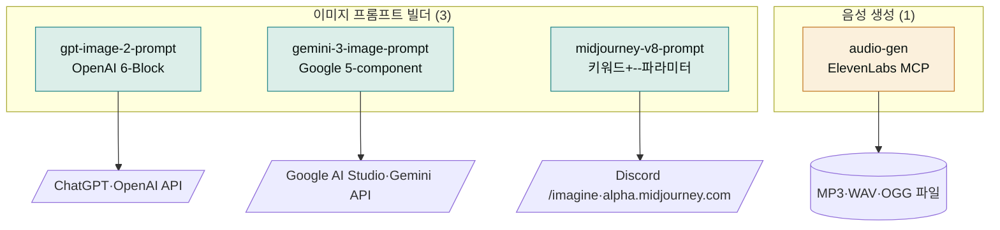
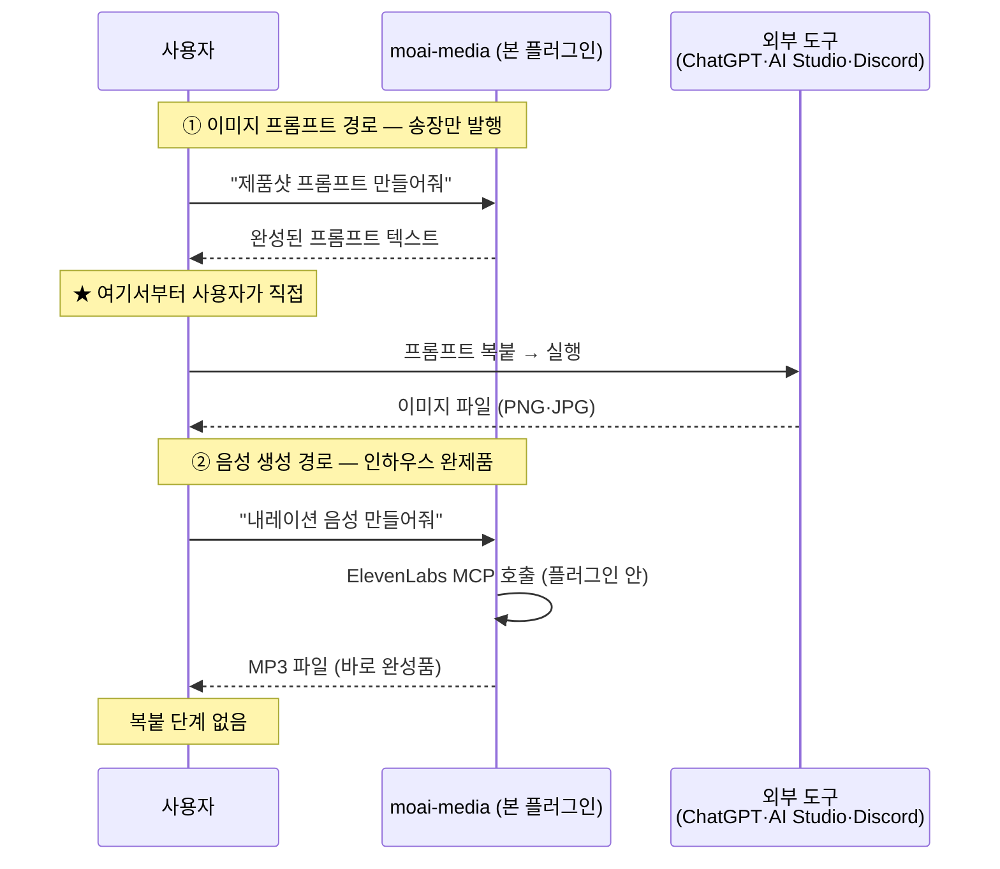

# moai-media

> AI 미디어 작업의 **프롬프트 산출과 음성 합성** 전담 플러그인. 이미지 프롬프트 빌더 3종(GPT-image-2·Gemini 3 Pro Image·Midjourney v8.1)과 음성 생성 1종(audio-gen)으로 구성된 4개 스킬 묶음입니다.

## 무엇을 하는 플러그인인가

이 플러그인을 **요리 레시피 카페**에 비유하면 이해하기 쉽습니다. 이 카페는 요리를 직접 해주는 곳이 아니라, 손님이 각 주방(ChatGPT·Google AI Studio·Discord)으로 가져가 바로 쓸 수 있도록 완벽하게 정리된 **레시피 카드**를 만들어주는 곳입니다. 여기서 레시피 카드가 바로 '프롬프트'입니다. 프롬프트란 컴퓨터에게 "이런 그림을 그려줘"라고 주문하는 상세한 지시문(텍스트)을 뜻합니다. "강아지" 한 단어만 던지면 결과가 제각각이지만, "햇살이 비치는 창가에 앉은 골든 리트리버, 따뜻한 톤, 정면 구도"처럼 구체적으로 적어줘야 AI가 원하는 그림을 그려줍니다. 이 플러그인은 그 구체적인 지시문을 모델별 공식 가이드에 맞춰 완성해 줍니다.

한 가지 역설적인 점이 있습니다. 레시피 카드는 받았지만 요리(이미지 렌더링)는 아직 되지 않은 상태라는 점입니다. 즉, 이 플러그인은 **이미지 파일을 직접 만들어주지 않습니다**. 완성된 프롬프트 텍스트를 받아 사용자가 직접 ChatGPT나 Discord에 가져가 붙여넣어야 비로소 그림이 완성됩니다. 대신 **음성 생성**만큼은 이 카페 안의 인하우스 공장처럼 플러그인 안에서 바로 완제품(MP3 파일)까지 만들어 줍니다. "레시피는 만들어주지만 요리는 각자의 주방에서"라는 책임 경계가 이 플러그인의 핵심입니다.

`moai-media`는 두 가지 작업에 집중합니다.

1. **이미지 프롬프트 텍스트 작성** — 모델별 공식 가이드(OpenAI Cookbook·Google AI Developers·Midjourney Parameter List)를 그대로 적용해 ChatGPT·Google AI Studio·Discord `/imagine`에서 바로 복붙할 수 있는 프롬프트를 출력합니다.
2. **음성 합성** — ElevenLabs MCP로 TTS·보이스 클로닝·다국어 더빙·효과음을 생성합니다.

**이미지·영상의 실제 렌더링은 본 플러그인 책임이 아닙니다.** 시네마틱 영상·캐릭터·말하는머리 등은 **Higgsfield MCP**(별도 설치)가 처리하고, 이미지 렌더링은 사용자가 외부 도구에서 직접 실행합니다. 본 플러그인은 그 앞단의 프롬프트 작성과 음성 합성을 담당하는 컴패니언입니다.



## 책임 경계 — 어디서부터 사용자가 직접 움직여야 하나

초보자가 가장 많이 하는 오해가 "프롬프트 만들어줘"라고 했는데 왜 이미지 파일이 나오지 않냐는 것입니다. **택배 송장**에 비유하면 명확해집니다. 택배 회사는 송장(프롬프트)을 정확하게 써줄 뿐, 물건을 직접 배송(이미지 렌더링)하지는 않습니다. 송장을 받은 사용자가 직접 택배 회사(ChatGPT·Google AI Studio·Discord)에 가져가 부쳐야 비로소 물건(이미지)이 도착합니다. 반면 **음성 생성**은 이 카페 안의 인하우스 공장처럼 플러그인 안에서 바로 완제품(MP3)까지 만들어 줍니다. 즉, 어느 단계는 플러그인 안에서 끝나고, 어느 단계는 사용자가 외부 도구로 가져가 한 번 더 실행해야 하는지가 이 플러그인의 책임 경계입니다.

아래 순서도는 두 산출물(이미지 프롬프트 vs 음성 파일)이 각각 어디까지 플러그인 안에서 완성되고 어디서 사용자의 손으로 넘어가는지를 보여줍니다. 화살표가 사용자 박스를 거쳐가는 지점이 바로 "여기서부터는 직접 실행"하는 경계입니다.



요약하면 이미지 프롬프트 3종은 **송장 작성**까지, 음성 생성은 **배송 완료**까지 담당합니다. 이 차이를 알면 "왜 이미지는 안 나오지?"라는 혼란 없이, 각 산출물을 어디서 마무리해야 할지 바로 알 수 있습니다.

## 설치



1. `moai-core` 설치 후 `moai-media` 옆의 **+** 버튼을 눌러 설치합니다.
2. `audio-gen`을 쓰려면 `ELEVENLABS_API_KEY`를 `.moai/credentials.env`에 등록합니다.
3. 이미지 프롬프트 빌더 3종은 **API 키 불필요** (텍스트 프롬프트만 생성).


[GitHub 저장소](https://github.com/modu-ai/cowork-plugins/tree/main/moai-media)를 클론한 뒤 `~/.claude/plugins/`에 배치합니다.



## 핵심 스킬 (4개)

### 이미지 프롬프트 빌더 3종

자연어 한 줄 + AskUserQuestion 프리셋(제품샷·인물·일러스트·풍경)으로 컨텍스트를 수집하고, 각 모델의 공식 가이드에 정렬된 프롬프트 텍스트를 출력합니다. **책임 경계: 프롬프트 텍스트 산출 전용** — 실제 이미지 생성은 사용자가 외부 도구에서 직접 실행합니다.

| 스킬 | 공식 가이드 | 핵심 특징 |
|---|---|---|
| `gpt-image-2-prompt` | [OpenAI Cookbook](https://developers.openai.com/cookbook/examples/multimodal/image-gen-models-prompting-guide) | Subject·Action·Scene·Composition·Lighting·Style&Text 6-Block. 편집 시 Change/Preserve/Constraints 2열. 텍스트 verbatim·ALL CAPS·다국어(한·일·중·힌·벵골) |
| `gemini-3-image-prompt` | [Google AI Developers](https://ai.google.dev/gemini-api/docs/models/gemini-3-pro-image-preview) | 영문 문장형 5-component, Creative Director 어조. 카메라 하드웨어(Fujifilm·GoPro·iPhone). Reference image 14 슬롯. Search Grounding. Thinking vs Fast 모드. SynthID 워터마크 |
| `midjourney-v8-prompt` | [Midjourney Parameter List](https://docs.midjourney.com/hc/en-us/articles/32859204029709-Parameter-List) | 키워드+`--파라미터`. `--sref`/`--oref`/`--cw`/`--p` 3대 reference deep dive. 6대 비용 함정 자동 검사 (`--hd --q 4` 16x cost, `--cw 100` 상속, `--cref` deprecation 교체) |

### 음성 생성

| 스킬 | 백엔드 | 산출물 |
|---|---|---|
| `audio-gen` | ElevenLabs MCP | TTS, 보이스 클로닝, 다국어 더빙(영·일·중·스 등), 효과음(SFX) — MP3·WAV·OGG |

## MCP 통합 (책임 분리)

`moai-media`는 ElevenLabs MCP 1개만 번들합니다. 이미지·영상 렌더링은 별도 MCP에 위임합니다.

| 영역 | 담당 | 비고 |
|---|---|---|
| 이미지 프롬프트 텍스트 작성 | **`moai-media` 빌더 3종** | API 키 불필요, 텍스트만 출력 |
| 음성·TTS·더빙·효과음 합성 | **`moai-media:audio-gen` (ElevenLabs MCP)** | `ELEVENLABS_API_KEY` 1개 필요 |
| 이미지 실제 렌더링 | 사용자가 ChatGPT·Google AI Studio·Discord에서 실행 | 본 플러그인 외부 |
| 시네마틱 영상·캐릭터·립싱크 | **Higgsfield MCP** (별도 설치) | Soul·DOP·말하는머리 |

## API 키 (1개)


**이미지 프롬프트 빌더 3종은 API 키 불필요**입니다. `audio-gen`만 ElevenLabs 키 1개를 요구합니다.


```bash
# .moai/credentials.env
ELEVENLABS_API_KEY=sk_...     # audio-gen 전용
```

| 변수 | 용도 | 발급처 |
|---|---|---|
| `ELEVENLABS_API_KEY` | `audio-gen` (TTS·보이스 클로닝·더빙·효과음) | [elevenlabs.io/app/settings/api-keys](https://elevenlabs.io/app/settings/api-keys) |

> Free 티어: 월 10,000자 TTS · Starter $5/월: 30,000자 + 음성 복제 10개 · Creator $22/월: 100,000자 + 더빙 30분.

## 빠른 사용 예 (한 줄 요청 + 시스템 자동 인터뷰)

> 모델·스타일·비율은 시스템이 인터뷰로 수집합니다. ([사용 패턴 가이드](../../cowork/patterns/) 참조)


> 비건 스킨케어 제품샷 GPT 프롬프트 만들어줘


→ 시스템 인터뷰: 프리셋(제품샷)·조명·구도 → `gpt-image-2-prompt` 출력 → 사용자가 ChatGPT에 복붙


> 한국어 타이포 카드뉴스 5장 Gemini 프롬프트 만들어줘


→ 시스템 인터뷰: 카메라·레퍼런스·텍스트 verbatim → `gemini-3-image-prompt` 출력 → 사용자가 Google AI Studio에 복붙


> 사이버펑크 도시 일러스트 Midjourney 프롬프트 만들어줘


→ 시스템 인터뷰: 스타일·`--sref` 레퍼런스·비율 → `midjourney-v8-prompt` 출력 → 사용자가 Discord `/imagine`에 복붙


> 30초 한국어 내레이션 음성 만들어줘 — 차분한 여성 목소리


→ 시스템 인터뷰: 목소리·속도·감정 → `audio-gen`이 ElevenLabs MCP 호출 → MP3 산출


> 이 영어 영상을 한국어로 더빙해줘


→ `audio-gen` — 원본 음성 분석 → 한국어 더빙 트랙 생성 (다국어 더빙은 한 번에 여러 언어 동시 산출 가능)

## 대표 체인

**이미지 제작 (외부 도구 연결)**

```text
moai-content:copywriting → gpt-image-2-prompt
                          (사용자가 ChatGPT에서 실행)
```

**나노바나나(Gemini 3 Image)로 한국어 타이포 카드뉴스**

```text
moai-content:card-news → gemini-3-image-prompt
                        (사용자가 Google AI Studio에서 실행)
```

**유튜브 내레이션**

```text
moai-content:blog → audio-gen (한국어 TTS) → 영상 편집기 import
```

**다국어 더빙**

```text
audio-gen (원본 업로드 → 영·일·중 동시 산출)
```

## 다음 단계

- [`moai-content`](../moai-content/) — 카드뉴스·블로그·랜딩페이지 카피 (본 플러그인 빌더와 페어)
- [`moai-commerce`](../moai-commerce/) — 상세페이지 카피·구조
- [`moai-core`](../moai-core/) — MCP 커넥터 셋업·`ai-slop-reviewer` 텍스트 검수
- [Cowork 커넥터와 MCP](../../cowork/connectors-mcp/)

---

### Sources

- [modu-ai/cowork-plugins](https://github.com/modu-ai/cowork-plugins)
- [moai-media 디렉터리](https://github.com/modu-ai/cowork-plugins/tree/main/moai-media)
- [OpenAI Image Gen Prompting Guide](https://developers.openai.com/cookbook/examples/multimodal/image-gen-models-prompting-guide)
- [Google Gemini 3 Pro Image Preview](https://ai.google.dev/gemini-api/docs/models/gemini-3-pro-image-preview)
- [Midjourney Parameter List](https://docs.midjourney.com/hc/en-us/articles/32859204029709-Parameter-List)
- [ElevenLabs MCP (GitHub)](https://github.com/elevenlabs/elevenlabs-mcp)
