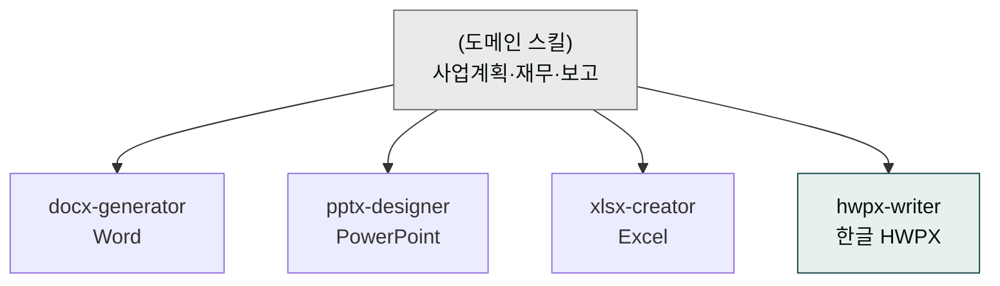
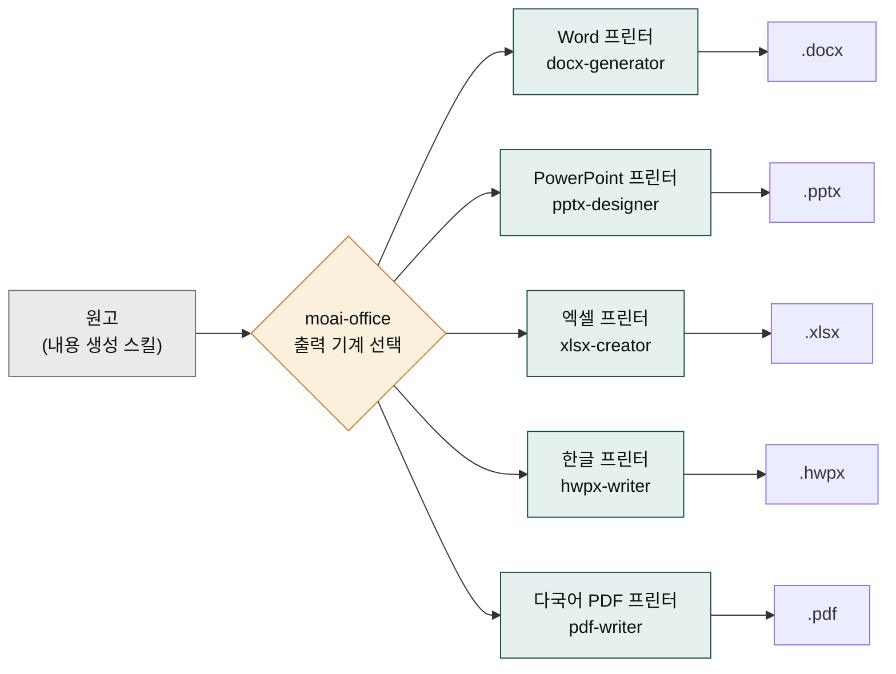
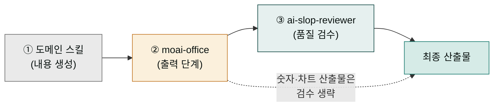

# moai-office

> 한국 기업 문서 양식에 맞춘 5가지 포맷 생성기입니다. 발표자료, 공문, 매출표, 한글 기안서, 한·중·일·영 다국어 PDF까지 한 번에 처리합니다.



## 이 플러그인으로 무엇을 할 수 있나

`moai-office`를 한마디로 비유하면 **"동네 인쇄소"**입니다. 손님이 가져온 원고를 받아 예쁜 양식으로 찍어내 주는 곳이지, 원고를 대신 써 주는 곳은 아닙니다. 사업계획서 본문은 `moai-business`가 쓰고, 매출표 숫자는 `moai-finance`가 계산하면, `moai-office`는 그 결과물을 받아 실제 파일로 인쇄·제본해 주는 마지막 단계를 맡습니다.

인쇄소에는 출력 기계가 여러 대 있습니다. Word 문서를 찍어내는 기계(`docx-generator`), PowerPoint 슬라이드로 묶어 주는 기계(`pptx-designer`), 엑셀 표와 차트로 엮어 주는 기계(`xlsx-creator`), 아래한글 공문서 양식으로 찍어내는 기계(`hwpx-writer`), 한·중·일·영 글자가 섞여도 깨지지 않는 다국어 PDF 기계(`pdf-writer`)까지 다섯 대입니다. 같은 원고라도 어떤 기계에 넣느냐에 따라 산출물이 달라집니다 — 발표 자료가 필요하면 PowerPoint 기계로, 공문이 필요하면 한글 기계로 보내는 식입니다.

이 다섯 대의 기계는 한국 기업·관공서에서 실제 쓰는 양식에 맞춰 조율돼 있습니다. 공문서 윗부분의 결재란, 표와 차트의 한국어 라벨, "12,345,678" 같은 세 자리 콤마 숫자 표기까지 기본값으로 들어 있습니다. 그래서 파일이 나오면 손질 없이 바로 실무에 올릴 수 있습니다.



## 무엇을 하는 플러그인인가

`moai-office`는 한국 기업·관공서에서 실제로 쓰이는 문서 양식을 그대로 자동 생성하는 플러그인입니다. PowerPoint(PPTX), Word(DOCX), Excel(XLSX), 한글(HWPX), 다국어 PDF 다섯 가지 포맷을 모두 지원하며, 폰트·결재란·숫자 표기·표 라벨 등 한국 문서 관례를 기본값으로 반영합니다.

각 스킬은 검증된 오픈소스 라이브러리(pptxgenjs, python-docx, openpyxl, python-hwpx, PyMuPDF) 위에서 동작하며, 다른 도메인 플러그인의 산출물(예: 사업계획서 본문, 결산 데이터)을 받아 최종 파일로 저장하는 **출력 단계**를 담당합니다. `pdf-writer`는 Noto Sans CJK 번들로 한·중·일 글리프 누락 없이 PDF를 생성합니다.

이 "출력 단계"라는 말이 이 플러그인의 핵심입니다. 다시 인쇄소 비유로 돌아가면, 인쇄소에 원고 없이 "A4 용지에 인쇄해 줘"라고만 말하면 빈 종이가 나옵니다. 먼저 원고를 써야 하듯, `moai-office` 앞에는 반드시 내용을 만드는 스킬이 와야 합니다. 그래서 (내용 생성 스킬) → (`moai-office` 파일 출력) → (`ai-slop-reviewer` 품질 검수) 순서가 늘 고정됩니다.

각 단계는 서로 다른 책임을 집니다. 내용이 타당한지, 문장이 자연스러운지는 앞선 도메인 스킬이 정합니다. `moai-office`는 그 내용을 지정한 양식으로 파일에 담아 인쇄할 뿐, 내용 자체를 평가하거나 고치지 않습니다. 인쇄된 파일에 AI 특유의 기계적 어투가 남았다면, 그건 인쇄소 잘못이 아니라 뒤따르는 검수 스킬(`ai-slop-reviewer`)이 잡아야 할 몫입니다. 그래서 숫자와 차트처럼 검수할 문장이 없는 산출물(매출표, KPI 대시보드)만 중간 검수를 생략하고 바로 출력으로 끝냅니다.



## 설치 시 유의

- Python 3.10+ 권장
- `python-hwpx`는 pip로 설치: `pip install python-hwpx --break-system-packages`
- 폰트: 시스템에 Pretendard·맑은고딕·바탕 설치 권장

## 설치



1. `moai-core` 설치 후 `moai-office` 옆의 **+** 버튼을 눌러 설치합니다.
2. Python 의존성을 설치합니다 (`python-docx`, `openpyxl`, `python-hwpx`).


[GitHub 저장소](https://github.com/modu-ai/cowork-plugins/tree/main/moai-office)를 클론한 뒤 `~/.claude/plugins/`에 배치합니다.



## 핵심 스킬

| 스킬 | 용도 | 기반 라이브러리 |
|---|---|---|
| `pptx-designer` | 발표자료·피칭덱·기안서 | pptxgenjs (Pretendard + 명조 기반) |
| `docx-generator` | 공문·보고서·계약서 | python-docx |
| `xlsx-creator` | KPI 대시보드·간트차트·매출표 | openpyxl (차트·수식·조건부서식 포함) |
| `hwpx-writer` | 한글(HWPX) 공문서·기안서 | python-hwpx (OWPML) |
| `pdf-writer` | 한·중·일·영 다국어 PDF (CJK 깨짐 0) | PyMuPDF + Noto Sans CJK 번들. Markdown·JSON·HTML·텍스트 4종 입력 |
| `notebooklm-slide-prompt` | NotebookLM 슬라이드 데크 프롬프트 + 슬라이드별 이미지 프롬프트 | NotebookLM Studio 4축 매핑 + 나노바나나(Gemini 3 Pro Image) 5-Component |

> `pptx-designer`는 바로 열리는 `.pptx` 파일을 만들고, `notebooklm-slide-prompt`는 NotebookLM에 넣을 준비물(소스·대본·구조·이미지 프롬프트)을 만듭니다. 결과물 형태로 둘을 구분하세요.

## 한국 문서 관례 반영

- 공문서 결재란·두문·본문·결문 구조
- HWPX는 아래한글 2020 이상 호환
- 표·차트 라벨 한국어 기본, 숫자 구분은 한국식 콤마(예: 12,345,678)

## 대표 체인

**사업계획서 → DOCX**

```text
moai-business:strategy-planner → docx-generator → ai-slop-reviewer
```

**IR 피칭덱 → PPTX**

```text
moai-business:investor-relations → pptx-designer → ai-slop-reviewer
```

**월간 매출 대시보드 → XLSX**

```text
moai-finance:variance-analysis → xlsx-creator
```

(숫자·차트이므로 `ai-slop-reviewer` 생략)

**관공서 기안서 → HWPX**

```text
moai-operations:process-manager → hwpx-writer → ai-slop-reviewer
```

**강연 본문 → NotebookLM 슬라이드 프롬프트**

```text
강연 본문 MD → notebooklm-slide-prompt → ai-slop-reviewer
```

(NotebookLM에 본문을 소스로 올린 뒤 산출된 Prompt를 붙여 넣어 데크를 생성합니다.)

## 빠른 사용 예


> 2026년 1분기 영업 실적 보고서 docx로 만들어줘.
  KPI는 매출·고객수·재구매율이야.



> 기업설명회용 IR 덱을 20장 피칭덱으로 pptx 만들어줘.



> 강연 본문 MD를 NotebookLM 슬라이드 프롬프트로 만들어줘.


## 다음 단계

- [`moai-business`](../moai-business/) — 사업계획·IR 본문 생성과 결합
- [`moai-finance`](../moai-finance/) — 결산표·예실 분석 데이터와 결합

---

### Sources

- [modu-ai/cowork-plugins README](https://github.com/modu-ai/cowork-plugins)
- [moai-office 디렉터리](https://github.com/modu-ai/cowork-plugins/tree/main/moai-office)
