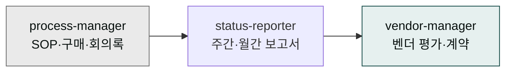
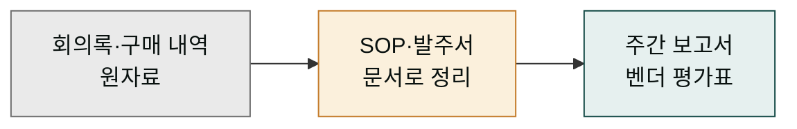
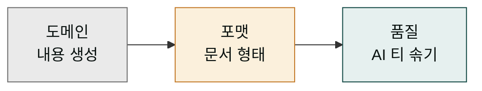

# moai-operations

> 운영·총무·구매 실무를 위한 3개 스킬을 제공합니다.



위 그림은 세 스킬이 보고서를 만드는 한 줄의 흐름을 보여줍니다. 요리 주방의 라인으로 생각하면 쉽습니다. 먼저 `process-manager`가 '재료 손질' 단계를 맡아 회의록·구매 내역 같은 원자료를 모으고 정리합니다. 그 결과를 `status-reporter`가 받아 '조리' 단계에서 주간·월간 보고서로 요리해 냅니다. `vendor-manager`는 별도 라인에서 거래처 평가를 담당합니다.

화살표는 데이터가 흐르는 방향을 보여줄 뿐, 세 스킬을 한 번에 모두 써야 하는 것은 아닙니다. 필요한 서류가 주간 보고서 하나라면 `status-reporter`만 써도 충분하고, 원자료부터 꼼꼼히 다듬고 싶으면 `process-manager`에서 `status-reporter`로 이어 쓰면 됩니다. 거래처 평가만 필요하면 `vendor-manager` 하나로도 충분합니다. 그림은 '이렇게 이어 쓸 수 있다'는 가능성을 보여주는 참고용입니다.

## 무엇을 하는 플러그인인가

회사의 운영·총무 담당자를 식당의 매니저에 비유하면 이해하기 쉽습니다. 손님(영업팀·경영진)이 눈에 보는 건 음식(제품)이지만, 매니저는 매장 뒤에서 매일 비슷한 서류를 반복합니다. 매장 운영 매뉴얼을 만들고, 매주 본사에 보낼 '이번 주 현황' 보고서를 쓰고, 새 우유 납품업체를 비교하는 평가표를 만듭니다. 회사의 운영·총무·구매 부서도 똑같은 일을 합니다. 다만 서류 이름이 SOP·발주서·벤더 평가로 바뀔 뿐입니다.

이 플러그인은 그 매니저의 서류 더미를 대신 써주는 보조 인력입니다. 운영 부서에서 매주 반복하는 문서 — SOP(표준작업지침서, '이렇게 일하세요'라는 업무 매뉴얼), 발주서(물건을 사겠다는 공식 주문서), 벤더 평가(거래처를 점수 매겨 비교하는 표) — 를 자동으로 만들어 줍니다. 담당자가 빈칸을 채우고 서식을 고치는 데 쓰던 시간을, 실제 업무 판단에 쓸 수 있게 돕는 것이 이 플러그인의 목적입니다.

`moai-operations`는 표준작업지침서(SOP), 구매 요청서·발주서, 회의록, 주간·월간·분기 보고서, OKR 현황, 리스크 매트릭스, 벤더 평가·계약 관리까지 운영 조직에서 반복적으로 작성하는 문서를 자동화합니다.



## 설치



1. `moai-core` 설치 후 `moai-operations` 옆의 **+** 버튼을 눌러 설치합니다.


[GitHub 저장소](https://github.com/modu-ai/cowork-plugins/tree/main/moai-operations)를 클론한 뒤 `~/.claude/plugins/`에 배치합니다.



## 핵심 스킬

| 스킬 | 용도 |
|---|---|
| `process-manager` | SOP, 구매 요청서, 발주서, 회의록 |
| `status-reporter` | 주간·월간·분기 보고서, OKR 현황, 리스크 매트릭스 |
| `vendor-manager` | 공급업체 평가, 계약 관리, 리스크 레지스터 |

## 대표 체인

**주간 보고서**

```text
status-reporter → xlsx-creator → docx-generator
```

**신규 벤더 온보딩**

```text
vendor-manager → docx-generator(계약서 초안) → ai-slop-reviewer
```

두 체인 모두 '도메인 → 포맷 → 품질'이라는 같은 설계 원칙을 따릅니다. 도메인 스킬이 내용(무엇을 말할지)을 만들고, 포맷 스킬이 그 내용을 문서 형태(어떻게 담을지)로 감싸고, 품질 스킬이 마지막에 AI 특유의 어투를 솎아냅니다. 이 순서를 지키는 이유는, 내용이 빈 문서 양식부터 만들면 "무엇을 채워야 할지 모르는 빈 칸"만 남기 때문입니다.

주간 보고서 체인을 예로 들면: `status-reporter`가 이번 주 현황(내용)을 쓰고 → `xlsx-creator`가 숫자표(엑셀)로 정리하고 → `docx-generator`가 보고서 파일(형태)로 마무리합니다. 이 순서를 바꿔 `docx-generator`를 먼저 돌리면, 빈 보고서 양식만 만들어놓고 나중에 숫자를 끼워 넣는 어색한 결과가 나옵니다. 벤더 온보딩 체인도 같은 원리로, `vendor-manager`가 평가표(내용)를 완성한 뒤 `docx-generator`가 계약서 초안(문서)으로 감싸고, 마지막에 `ai-slop-reviewer`가 문장을 다듬습니다.



## 빠른 사용 예

```text
> 영업팀용 월간 보고서 템플릿 만들어줘. 리드·전환·파이프라인 지표 포함.
```

```text
> 클라우드 서비스 벤더 3곳 평가표 만들어줘.
```

## 다음 단계

- [`moai-finance`](../moai-finance/) — 예산·정산 연계
- [`moai-legal`](../moai-legal/) — 벤더 계약 검토

---

### Sources

- [modu-ai/cowork-plugins](https://github.com/modu-ai/cowork-plugins)
- [moai-operations 디렉터리](https://github.com/modu-ai/cowork-plugins/tree/main/moai-operations)
