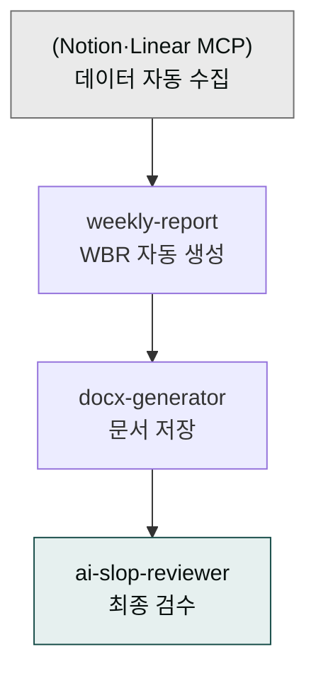
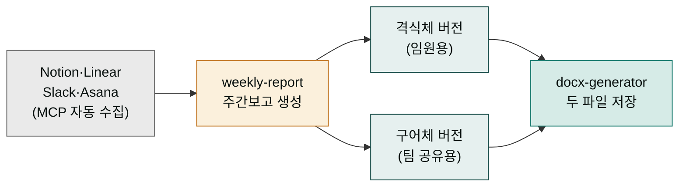
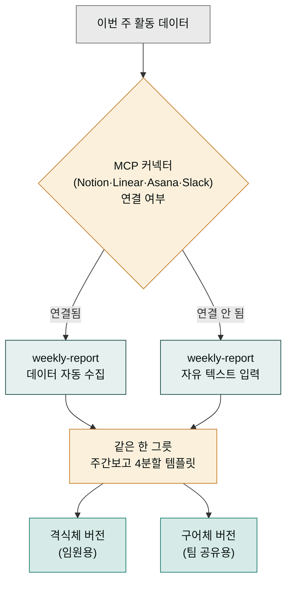
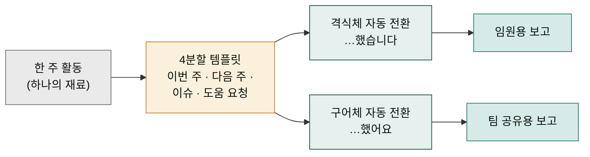

# moai-pm

> 한국 팀의 주간 비즈니스 리뷰(WBR)·OKR·회고를 자동 생성하는 프로젝트 관리 플러그인입니다. 임원용 격식체와 팀용 구어체 두 버전을 함께 출력합니다.



## 무엇을 하는 플러그인인가
## 주간보고 자동화 — 격식체와 구어체 두 버전을 한 번에

한국 사무실의 금요일 오후를 떠올려 보세요. 한 주 동안 팀이 한 일을 한 장으로 정리해 올리는 '주간보고'는, 식당에서 하루 종일 주문받은 내역을 마감 보고서로 정리하는 일과 같습니다. 정리하지 않으면 한 주가 어떻게 흘러갔는지 아무도 기억 못 하고, 다음 주 계획도 엉뚱하게 짜이기 쉽습니다. 그래서 한 주의 기록을 모아 한눈에 보이는 한 장으로 만드는 일이 매주 반복됩니다.

같은 보고라도 보는 사람에 따라 말투가 달라집니다. 사장님께 올리는 보고는 정중한 격식체("이번 주 매출 목표를 달성했습니다")로, 팀원끼리 공유하는 보고는 편한 구어체("이번 주 목표 달성했어요")로 씁니다. `moai-pm`은 이 두 종류 보고를 한 번에 만들어줍니다. 여기에 **MCP 커넥터**(Cowork가 다른 앱의 데이터를 가져오는 연결 통로)로 Notion·Linear·Asana·Slack 같은 업무 도구를 연결하면, 일일이 복사하지 않아도 그 도구들에 기록된 완료 태스크와 KPI(핵심 성과 지표, 매출·전환율처럼 목표 달성을 재는 숫자)를 알아서 끌어와 보고서를 채웁니다.



`moai-pm`는 한국 팀의 반복적인 보고 작업을 자동화합니다.

- **WBR(주간 비즈니스 리뷰)**: 일일 노트·완료 태스크·KPI 데이터를 입력받아 한 주 요약 보고서 생성
- **두 버전 동시 출력**: 임원 보고용(격식체) + 팀 공유용(구어체)
- **MCP 데이터 자동 fetch**: Notion·Linear·Asana·Slack MCP가 가용하면 자동 수집, 없으면 자유 텍스트 입력 fallback
- **한국 주간보고 문화**: 한국 팀 표준 양식(이번 주 / 다음 주 / 이슈·블로커 / 도움 요청) + 글로벌 베스트 프랙티스 결합

## 설치



1. `moai-core` 설치 후 `moai-pm` 옆의 **+** 버튼을 눌러 설치합니다.
2. Notion·Linear·Asana·Slack 데이터를 자동으로 가져오려면 해당 커넥터를 Cowork 설정에서 활성화하세요.


[GitHub 저장소](https://github.com/modu-ai/cowork-plugins/tree/main/moai-pm)를 클론한 뒤 `~/.claude/plugins/`에 배치합니다.



## 핵심 스킬

| 스킬 | 용도 | 대표 출력 |
|---|---|---|
| `weekly-report` | 한국 팀 주간 비즈니스 리뷰(WBR) 자동 생성 | 임원 격식체 + 팀 구어체 두 버전 |

OKR·회고·스탠드업처럼 주간보고에서 파생되는 산출물은 `weekly-report`가 입력 맥락에 맞춰 함께 정리합니다.

## 대표 체인

## 데이터를 어디서 가져올까 — MCP 자동 수집 vs 수동 입력

`weekly-report`가 보고서를 만들려면 먼저 "이번 주에 무슨 일이 있었나"라는 재료가 필요합니다. 이 재료를 어디서, 어떻게 가져오느냐에 따라 두 갈래 길이 갈립니다. 식당의 식자재 발주를 떠올리면 쉽습니다. 거래처(MCP 커넥터)와 연결되어 있면 냉장고 재고를 자동으로 불러와 영수증을 채우듯, Notion·Linear·Asana·Slack 같은 업무 도구에 기록된 완료 태스크와 KPI를 스킬이 알아서 끌어옵니다. 거래처가 연결되어 있지 않으면 직원이 손으로 적은 메모(자유 텍스트)를 점원에게 건네듯, 사용자가 채팅창에 한 주의 활동을 직접 적어 넘겨야 합니다.

두 길 모두 결국 같은 한 그릇(주간보고)에 도착합니다. 다만 재료를 스킬이 가져오느냐, 사람이 가져오느냐만 다를 뿐입니다. 거래처가 연결된 환경에서는 복사·붙여넣기를 반복할 필요 없이 보고서가 거의 저절로 채워지고, 연결되지 않은 환경에서는 "이번 주 A 기능 출시, B 버그 3건 해결"처럼 핵심만 적어주면 그 뒤의 정리·문장화·두 버전 분리는 스킬이 맡습니다. 어느 쪽이든 격식체·구어체 두 버전과 4분할 템플릿은 동일하게 적용됩니다.



**기본 주간보고 (수동 입력)**

```text
weekly-report → docx-generator → ai-slop-reviewer
```

**MCP 자동 수집 주간보고**

```text
(Notion·Linear MCP 자동 fetch) → weekly-report → docx-generator → ai-slop-reviewer
```

**임원 + 팀 두 버전 동시 출력**

```text
weekly-report (격식체 + 구어체 동시) → 두 파일 저장
```

## 한국 주간보고 특화

## 왜 일반 보고 도구와 다른가 — 4분할 그릇과 두 종류 포장

미국 실리콘밸리 스타일의 status report는 '한 일(Highlights) / 못 한 일(Lowlights) / 다음 주(Next)' 3칸이 보통입니다. 반면 한국 팀의 주간보고는 대체로 **이번 주 / 다음 주 / 이슈·블로커 / 도움 요청** 네 칸짜리 양식을 씁니다. 한 주치 활동을 4칸짜리 반찬통에 담는 것과 같습니다. 무엇을 했는지(이번 주), 앞으로 할 일(다음 주), 무엇이 막혔는지(이슈·블로커), 그래서 누구에게 무엇을 부탁할지(도움 요청)까지 한 장에 들어가야 위로 보고도 되고 옆 팀과도 공유됩니다. 이 4분할 템플릿이 한국 주간보고 문화에 가장 널리 퍼진 양식이라 `moai-pm`은 이를 기본 골격으로 삼습니다.

여기에 '두 종류 포장'이 더해집니다. 같은 4칸 반찬통이라도 사장님께 올릴 때는 정중한 차림표 문장(격식체)으로, 주방장 동료와 볼 때는 주방 은어(구어체)로 포장합니다. "이번 주 매출 목표를 **달성했습니다**"와 "이번 주 목표 **달성했어요**"는 같은 사실을 어미(말 끝)만 바꿔 두 벌로 내놓은 것입니다. `moai-pm`은 체언과 어미를 자동으로 바꿔 임원용과 팀용 두 문서를 한 번에 만듭니다. 사용자는 사실을 한 번만 적으면 되고, 받는 사람에 따른 말투 조정은 스킬이 맡습니다.



- **이번 주 / 다음 주 / 이슈·블로커 / 도움 요청** 4분할 템플릿 (가장 흔한 한국 팀 양식)
- **격식체 / 구어체 자동 전환**: 임원 보고는 `…했습니다`, 팀 공유는 `…했어요`
- **숫자·KPI 강조**: 정량 수치 누락 시 자동 보강 제안
- **이슈 에스컬레이션 표기**: 블로커는 "임원 결정 필요" 등 명시적 라벨

## 빠른 사용 예

```text
> 이번 주 주간보고 만들어줘.
  - 데이터 소스: Notion 'Team Tasks' 페이지의 이번 주 완료 태스크
  - 형식: 임원용 격식체 + 팀용 구어체 두 버전
  - 다음 주 계획 포함
  - 저장: 90_Output/wbr/2026-W17-{임원|팀}.docx
```

```text
> 지난 한 주 회의록 5개를 첨부했어. 주간보고로 정리해줘.
구어체로 슬랙 #weekly 채널에 올릴 거야.
```

## 다음 단계

- [`moai-bi`](../moai-bi/) — 경영진 1pager 요약
- [`moai-business`](../moai-business/) — 사업 전략·시장조사 자료 결합
- [`moai-product`](../moai-product/) — 제품 로드맵·UX 리서치
- [`moai-office`](../moai-office/) — DOCX·PPTX·PDF 출력

---

### Sources

- [modu-ai/cowork-plugins README](https://github.com/modu-ai/cowork-plugins)
- [moai-pm 디렉터리](https://github.com/modu-ai/cowork-plugins/tree/main/moai-pm)
