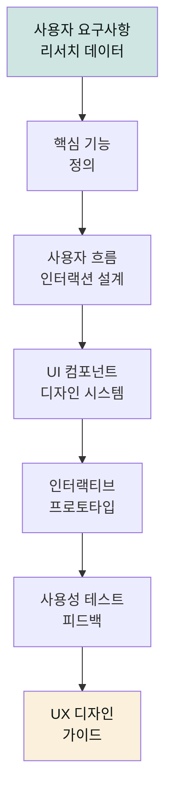

# moai-product

> 제품 매니저를 위한 4개 스킬을 제공합니다.

## 무엇을 하는 플러그인인가

`moai-product`는 제품 기획·UX 리서치·로드맵 관리에 필요한 문서를 자동으로 작성하는 플러그인입니다. PRD와 기능 명세뿐 아니라 AI 전략 보고서·정부 R&D 신청서, 분기 로드맵, 페르소나, 유저빌리티 테스트 계획, VOC·NPS 분석까지 제품 팀의 주요 산출물을 커버합니다.

## 이 플러그인으로 무엇을 할 수 있나

제품 매니저(PM)의 책상 위에는 항상 여러 장의 문서가 놓입니다. 고객의 목소리를 모은 조사 보고서, 무엇을 만들지 정하는 기획서, 언제까지 만들지 적는 일정표, 그리고 화면을 어떻게 그릴지 보여주는 시안입니다. 여기에 등장하는 전문 용어부터 짚고 가겠습니다.

- **PRD**(Product Requirements Document, 제품 요구사항 정의서) — "무엇을, 왜 만들 것인가"를 정리한 문서입니다.
- **VOC**(Voice of Customer, 고객의 소리) — 고객이 남긴 의견·불만·건의를 모은 원자료입니다.
- **NPS**(Net Promoter Score, 순추천고객점수) — "이 제품을 지인에게 추천하시겠습니까" 0-10 점으로 재는 고객 충성도 지표입니다.
- **페르소나**(persona) — 가상의 대표 사용자 한 명을 설정해 "이 사람을 위해 만든다"고 상상하는 기법입니다.
- **유저빌리티 테스트**(usability test) — 실제 사용자에게 시제품을 쥐여주고 얼마나 쉽게 쓰는지 관찰하는 평가입니다.

`moai-product`는 바로 이 책상 위 문서들을 한 번에 작성해주는 "제품 매니저용 문서 작성 비서"입니다. 건축에 비유하면 한 건물을 완성하는 단계별 도면을 각자 전문 비서가 맡아 그려주는 것과 같습니다. 먼저 땅을 살피는 조사팀(`ux-researcher`)이 고객의 의견과 사용 환경을 모아옵니다. 그 자료를 바탕으로 설계사(`spec-writer`)가 "무엇을 지을 것인가"를 담은 도면을 그립니다. 이어서 공사 일정을 짜는 관리자(`roadmap-manager`)가 "언제까지 지을 것인가"의 표를 만들고, 인테리어 디자이너(`ux-designer`)가 건물 안쪽을 사람이 쓰기 편하게 꾸밉니다.

이 네 비서가 하나의 플러그인으로 묶인 까닭은 제품 한 개를 완성하려면 "조사 → 명세 → 로드맵 → 디자인"의 순서가 거의 항상 같게 흘러가기 때문입니다. 비서가 그려준 도면은 `moai-office`(DOCX/PPTX/XLSX)에서 실제 파일로 인쇄되고, 마지막에 `ai-slop-reviewer`가 기계 어투를 솎아내 사람이 쓴 것처럼 다듬습니다.

## 플러그인 전체 워크플로

네 스킬이 하나의 산출물로 흘러가는 과정을 조립 라인에 비유해 보겠습니다. 리서치 팀(`ux-researcher`)이 고객 의견을 모아 재료를 가져오면, 기획 팀(`spec-writer`)이 그 재료로 무엇을 만들지 설계도를 그립니다. 그 다음 일정 팀(`roadmap-manager`)이 언제까지 만들지 표를 짜고, 디자인 팀(`ux-designer`)이 화면 시안을 입힙니다. 마지막으로 인쇄소(`moai-office`)가 파일로 뽑아주고, 교정 기사(`ai-slop-reviewer`)가 문장을 매끄럽게 다듬어 하나의 완성된 보고서로 내보냅니다.

```mermaid
flowchart LR
    subgraph Research["① 리서치"]
        R["ux-researcher<br/>페르소나 · VOC · NPS"]
    end

    subgraph Spec["② 명세"]
        S["spec-writer<br/>PRD · 기능 명세"]
    end

    subgraph Plan["③ 계획"]
        P["roadmap-manager<br/>로드맵 · 마일스톤"]
    end

    subgraph Design["④ 디자인"]
        D["ux-designer<br/>UI · 프로토타입"]
    end

    subgraph Output["⑤ 산출"]
        O["moai-office<br/>DOCX · PPTX · XLSX"]
    end

    subgraph Polish["⑥ 다듬기"]
        Q["ai-slop-reviewer<br/>자연스러운 문장"]
    end

    Research --> Spec --> Plan --> Design --> Output --> Polish

    style Research fill:#eaeaea,stroke:#6e6e6e,color:#09110f
    style Spec fill:#fbf0dc,stroke:#c47b2a,color:#09110f
    style Plan fill:#fbf0dc,stroke:#c47b2a,color:#09110f
    style Design fill:#fbf0dc,stroke:#c47b2a,color:#09110f
    style Output fill:#e6f0ef,stroke:#144a46,color:#09110f
    style Polish fill:#e6f0ef,stroke:#144a46,color:#09110f
```



항상 모든 단계를 밟아야 하는 것은 아닙니다. PRD만 빨리 써야 한다면 ①→②→⑤→⑥만 지나가고, 분기 로드맵만 만든다면 ③→⑤로 건너뛰어도 됩니다. 다만 산출(⑤)과 다듬기(⑥)는 텍스트 문서를 낼 때 거의 항상 함께 붙습니다.

## 설치



1. `moai-core` 설치 후 `moai-product` 옆의 **+** 버튼을 눌러 설치합니다.


[GitHub 저장소](https://github.com/modu-ai/cowork-plugins/tree/main/moai-product)를 클론한 뒤 `~/.claude/plugins/`에 배치합니다.



## 핵심 스킬 (4개)

| 스킬 | 용도 |
|---|---|
| `spec-writer` | PRD, 기능 명세, AI 전략 보고서, 정부 R&D 신청서 |
| `roadmap-manager` | 프로젝트 로드맵, 마일스톤, MOU 초안, ESG 감사 |
| `ux-researcher` | 페르소나, 유저빌리티 테스트 계획, VOC·NPS 분석 |
| `ux-designer` | UI 디자인, 프로토타입, 사용자 경험 최적화 |

### 신규 스킬 — `ux-designer` (UX 디자인)

#### 언제 쓰나요

- "사용자 인터페이스 디자인을 만들고 싶어"
- "프로토타입을 빠르게 개발해야 해"
- "사용자 경험을 개선하고 싶어"
- "디자인 시스템이나 가이드라인을 구축하고 싶어"

#### 준비물

- 사용자 리서치 결과
- 사용자 흐름도(User Flow)
- 경쟁사 UI/UX 분석 자료
- 브랜드 가이드라인

#### 실행 흐름



**주요 특징**:
- 웹/모바일 최적화 UI 디자인
- 인터랙티브 프로토타입 생성
- 디자인 시스템 컴포넌트
- 사용성 가이드라인 문서
- 접근성 및 웹 표준 준수

#### 빠른 사용 예

```text
> 모바일 앱의 결제 프로세스 UX 디자인 만들어줘. 사용자는 30대 이커머스 고객이야.
```

```text
> 웹사이트 메인 페이지 �자인 시스템과 컴포넌트 라이브러리 만들어줘. B2B 서비스 타겟이야.
```

## 대표 체인

**PRD 작성**

```text
ux-researcher → spec-writer → docx-generator → ai-slop-reviewer
```

**분기 로드맵**

```text
roadmap-manager → xlsx-creator(간트) → pptx-designer
```

**UX 디자인 프로세스**

```text
ux-researcher → ux-designer → spec-writer → docx-generator → ai-slop-reviewer
```

## 빠른 사용 예

```text
결제 모듈 리뉴얼 PRD 써줘. 대상 고객은 국내 전자상거래 소상공인.
```

```text
지난 분기 NPS 결과 50개 텍스트 응답 분석해서 개선 우선순위 뽑아줘.
```

## 다음 단계

- [`moai-business`](../moai-business/) — 사업 전략 연계
- [`moai-data`](../moai-data/) — 정량 리서치 결합

---

### Sources

- [modu-ai/cowork-plugins](https://github.com/modu-ai/cowork-plugins)
- [moai-product 디렉터리](https://github.com/modu-ai/cowork-plugins/tree/main/moai-product)
