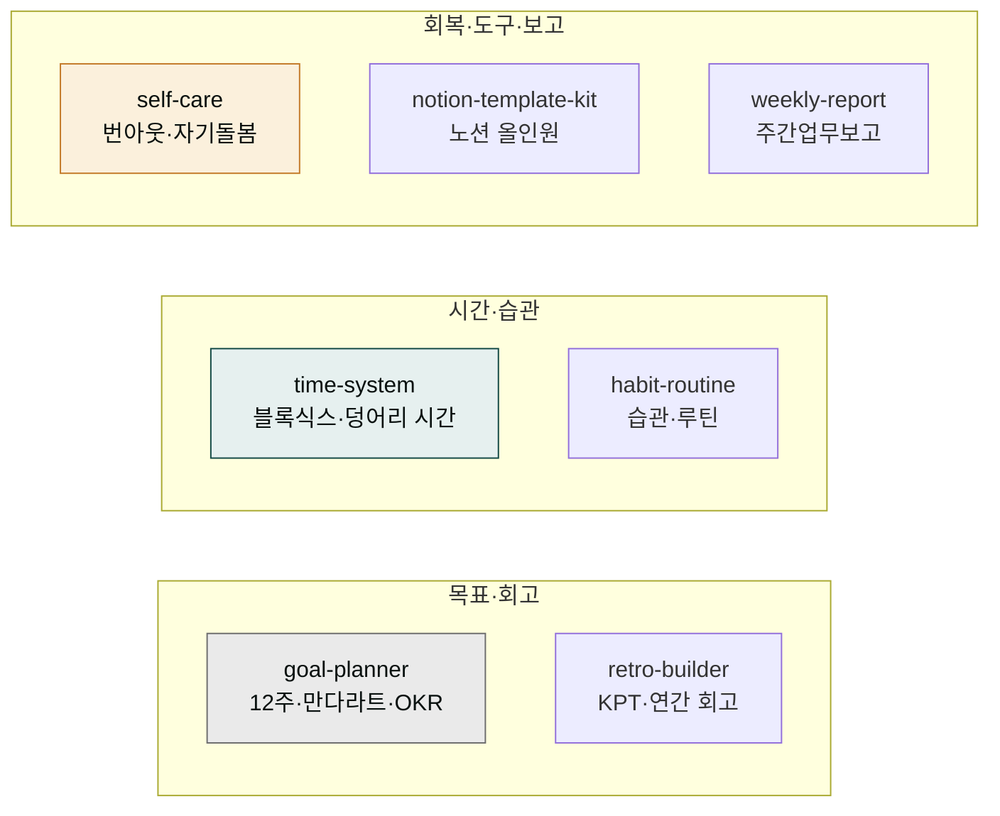
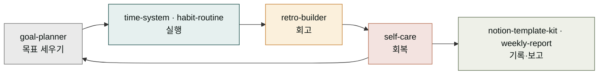

# moai-productivity

> 직장인·1인 워커·자기계발러의 개인 생산성과 자기관리 7개 스킬을 제공합니다.



## 무엇을 하는 플러그인인가

`moai-productivity`는 가볍게 한 주를 돌아보는 회고부터 12주 계획·만다라트로 목표를 실천으로 바꾸기, 덩어리 시간으로 야근 줄이기, 작심3일을 꾸준함으로, 번아웃 회복과 자기돌봄, 노션 올인원 대시보드 설계, 직장 주간업무보고까지 개인 생산성과 자기관리 전반을 돕습니다. 반성·자책이 아니라 지속 가능한 회고, 그리고 목표를 루틴으로 전환하는 실천 중심 프레임이 2026년 한국 기준으로 반영되어 있습니다.

팀 프로젝트 관리(스프린트·백로그·로드맵)는 [`moai-product`](../moai-product/)가 맡고, 개인 자기관리는 `moai-productivity`로 역할이 분리됩니다.

## 설치



1. `moai-core` 설치 후 `moai-productivity` 옆의 **+** 버튼을 눌러 설치합니다.


[GitHub 저장소](https://github.com/modu-ai/cowork-plugins/tree/main/moai-productivity)를 클론한 뒤 `~/.claude/plugins/`에 배치합니다.



## 이 플러그인으로 무엇을 할 수 있나

7개 스킬이 따로 노는 도구 모음이 아니라, 한 사람의 자기관리가 한 바퀴 도는 사이클을 이룹니다. 운동 선수가 시즌을 관리하는 흐름에 빗대어 보면 한눈에 잡힙니다. 먼저 시즌 목표를 세웁니다(`goal-planner` — 12주 단위로 목표를 쪼개는 도구). 그 목표를 매일 훈련 계획으로 옮깁니다(`time-system` — 하루 시간을 덩어리로 묶어 배치). 훈련이 매일 반복되도록 몸에 루틴으로 익힙니다(`habit-routine` — 작심3일을 꾸준함으로 바꾸는 구조). 경기가 끝나면 결과를 가볍게 돌아봅니다(`retro-builder` — 반성이 아니라 다음을 위한 점검). 지치면 회복합니다(`self-care` — 번아웃을 진단하고 쉬는 법). 이 모든 기록은 한곳에 모아둡니다(`notion-template-kit` — 노션 대시보드), 그리고 코치인 팀장에게 주간 보고를 올립니다(`weekly-report`).

요컨대 "계획 → 실행 → 회고 → 회복"이 한 바퀴 돌아야 자기계발도 지속됩니다. 한 단계만 반복하면 금방 한계가 오고, 회고와 회복이 빠지면 번아웃으로 이어집니다. 이 사이클 전체를 7개 스킬이 각 단계별로 받쳐주는 게 이 플러그인의 역할입니다.



## 핵심 스킬 (7개)

| 스킬 | 용도 |
|---|---|
| `goal-planner` | 목표관리 — 12주 계획, 만다라트, 개인 OKR, 신년 목표 로드맵. 목표를 루틴으로 전환 |
| `retro-builder` | 주간·연간 회고 — KPT, 한 줄 회고, 키워드 회고. 반성이 아니라 가볍게 돌아보기 |
| `time-system` | 시간관리 — 블록식스, 덩어리 시간, 우선순위, 야근 줄이기, 주간 계획 |
| `habit-routine` | 습관·루틴 설계 — 작심3일 극복, 모닝 루틴, 습관 트래커, 꾸준함의 구조 |
| `self-care` | 번아웃·자기돌봄 — 마음 기초체력, 회복 루틴, 멘탈 관리, 제대로 쉬는 법 |
| `notion-template-kit` | 노션 템플릿 생성 — 올인원 업무관리, 대시보드, 목표·회고 템플릿 구조 설계 |
| `weekly-report` | 직장 주간업무보고 — 한 주 성과·이슈·다음 주 계획 정리(격식체·구어체) |

## 한국 직장·자기계발 환경 특화

- **가볍게 돌아보기** 철학 — 반성·자책이 아니라 지속 가능한 회고
- **목표를 루틴으로** 전환하는 실천 중심 프레임(12주 계획·만다라트·OKR)
- **노션 올인원** 업무관리 구조를 한국 직장 맥락에서 설계
- **직장인·1인 워커**의 자기관리 흐름을 2026년 기준으로 반영

## 대표 체인

아래 체인들은 "한 번의 명령으로 자동 연결되는 파이프라인"이 아니라, 계절이나 주기에 맞춰 단계별로 실행하는 흐름입니다. 정원 가꾸기에 비유하면 이해가 쉽습니다. 가을이 오면 지난 정원을 돌아보고(retro), 봄이 오면 무엇을 심을지 정하고(goal), 그다음 매일 아침 물을 주는 루틴을 만듭니다(habit). 중간중간 덜 자란 식물에는 거름을 주고(self-care), 전체 현황은 노트 한 권에 정리해둡니다(notion).

체인 안의 화살표는 두 가지를 함께 뜻합니다. 하나는 "이전 스킬의 결과를 다음 스킬이 이어받는다"는 호출 순서이고, 다른 하나는 "시간적으로 먼저 할 일이 앞에 온다"는 흐름입니다. 예를 들어 `retro-builder → goal-planner → habit-routine`은 "지난해를 돌아본 뒤(연말) → 새해 목표를 세우고(연초) → 그 목표를 일상 루틴으로 녹인다(평상시)"는 시간 흐름이기도 합니다. 그래서 한 체인을 하루 안에 연달아 돌리기보다, 각 단계가 맞는 시점에 맞물려 돌아가도록 두는 편이 자연스럽습니다.

**한 해 정리 풀 코스**

```text
retro-builder(연말 회고) → goal-planner(내년 목표) → habit-routine(목표→루틴 설계)
```

**매주 자기관리 루틴**

```text
weekly-report(업무보고) → retro-builder(한 주 회고) → time-system(다음 주 계획)
```

**생산성 시스템 구축**

```text
goal-planner(목표 정의) → notion-template-kit(노션 대시보드) → habit-routine(습관 트래커)
```

**지쳤을 때 리커버리**

```text
self-care(번아웃 진단·회복) → time-system(업무량 재설계) → habit-routine(회복 루틴)
```

## 사용 예시


> 이번 주 가볍게 회고하고 싶은데 KPT로 정리해줘


→ `retro-builder` 자동 호출 → Keep·Problem·Try 3분할 → 한 주 핵심 정리 + 다음 주 시도 항목.


> 신년 목표 세웠는데 12주 계획법으로 실천 가능하게 쪼개줘


→ `goal-planner` 자동 호출 → 12주 단위 압축 → 주간 마일스톤 → 루틴 연결.


> 이번 주 한 일 정리해서 팀장님께 보낼 주간보고 작성해줘


→ `weekly-report` 자동 호출 → 성과·이슈·다음 주 계획 3분할 → 격식체·구어체 두 버전.

## 다른 플러그인과의 경계

| 비슷해 보이지만 다른 영역 | 사용해야 할 스킬 |
|---|---|
| 팀 프로젝트 관리(스프린트·백로그·로드맵) | [`moai-product`](../moai-product/) |
| 직장 대인 커뮤니케이션(보고 대화·회의·피드백) | [`moai-comms`](../moai-comms/) |
| 개인 재무·재테크·자산관리 | [`moai-wealth`](../moai-wealth/) |
| 코드 SPEC 워크플로우(plan·run·sync) | [`moai-core`](../moai-core/) |

## 다음 단계

- [`moai-comms`](../moai-comms/) — 보고·회의·피드백 대인 커뮤니케이션
- [`moai-wealth`](../moai-wealth/) — 개인 재무·재테크

---

### Sources

- [modu-ai/cowork-plugins](https://github.com/modu-ai/cowork-plugins)
- [moai-productivity 디렉터리](https://github.com/modu-ai/cowork-plugins/tree/main/moai-productivity)
