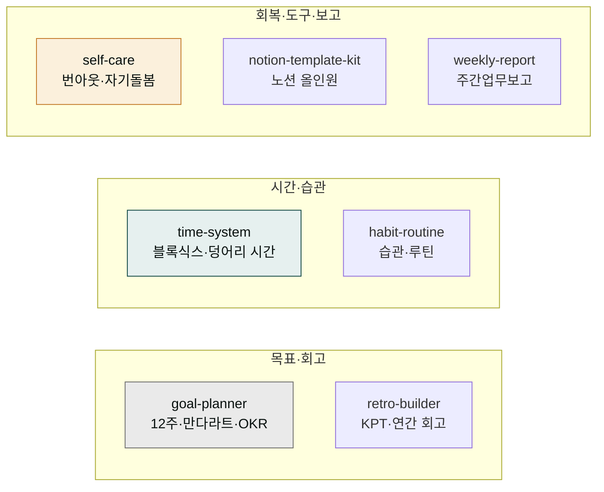

# moai-productivity

> 직장인·1인 워커·자기계발러의 개인 생산성과 자기관리 7개 스킬을 제공합니다.



## 무엇을 하는 플러그인인가

`moai-productivity`는 가볍게 한 주를 돌아보는 회고부터 12주 계획·만다라트로 목표를 실천으로 바꾸기, 덩어리 시간으로 야근 줄이기, 작심3일을 꾸준함으로, 번아웃 회복과 자기돌봄, 노션 올인원 대시보드 설계, 직장 주간업무보고까지 개인 생산성과 자기관리 전반을 돕습니다. 반성·자책이 아니라 지속 가능한 회고, 그리고 목표를 루틴으로 전환하는 실천 중심 프레임이 2026년 한국 기준으로 반영되어 있습니다.

팀 프로젝트 관리(스프린트·백로그·로드맵)는 [`moai-product`](../moai-product/)가 맡고, 개인 자기관리는 `moai-productivity`로 역할이 분리됩니다.

## 설치



1. `moai-core` 설치 후 `moai-productivity` 옆의 **+** 버튼을 눌러 설치합니다.


[GitHub 저장소](https://github.com/modu-ai/cowork-plugins/tree/main/moai-productivity)를 클론한 뒤 `~/.claude/plugins/`에 배치합니다.



## 핵심 스킬 (7개)

| 스킬 | 용도 |
|---|---|
| `goal-planner` | 목표관리 — 12주 계획, 만다라트, 개인 OKR, 신년 목표 로드맵. 목표를 루틴으로 전환 |
| `retro-builder` | 주간·연간 회고 — KPT, 한 줄 회고, 키워드 회고. 반성이 아니라 가볍게 돌아보기 |
| `time-system` | 시간관리 — 블록식스, 덩어리 시간, 우선순위, 야근 줄이기, 주간 계획 |
| `habit-routine` | 습관·루틴 설계 — 작심3일 극복, 모닝 루틴, 습관 트래커, 꾸준함의 구조 |
| `self-care` | 번아웃·자기돌봄 — 마음 기초체력, 회복 루틴, 멘탈 관리, 제대로 쉬는 법 |
| `notion-template-kit` | 노션 템플릿 생성 — 올인원 업무관리, 대시보드, 목표·회고 템플릿 구조 설계 |
| `weekly-report` | 직장 주간업무보고 — 한 주 성과·이슈·다음 주 계획 정리(격식체·구어체) |

## 한국 직장·자기계발 환경 특화

- **가볍게 돌아보기** 철학 — 반성·자책이 아니라 지속 가능한 회고
- **목표를 루틴으로** 전환하는 실천 중심 프레임(12주 계획·만다라트·OKR)
- **노션 올인원** 업무관리 구조를 한국 직장 맥락에서 설계
- **직장인·1인 워커**의 자기관리 흐름을 2026년 기준으로 반영

## 대표 체인

**한 해 정리 풀 코스**

```text
retro-builder(연말 회고) → goal-planner(내년 목표) → habit-routine(목표→루틴 설계)
```

**매주 자기관리 루틴**

```text
weekly-report(업무보고) → retro-builder(한 주 회고) → time-system(다음 주 계획)
```

**생산성 시스템 구축**

```text
goal-planner(목표 정의) → notion-template-kit(노션 대시보드) → habit-routine(습관 트래커)
```

**지쳤을 때 리커버리**

```text
self-care(번아웃 진단·회복) → time-system(업무량 재설계) → habit-routine(회복 루틴)
```

## 사용 예시


> 이번 주 가볍게 회고하고 싶은데 KPT로 정리해줘


→ `retro-builder` 자동 호출 → Keep·Problem·Try 3분할 → 한 주 핵심 정리 + 다음 주 시도 항목.


> 신년 목표 세웠는데 12주 계획법으로 실천 가능하게 쪼개줘


→ `goal-planner` 자동 호출 → 12주 단위 압축 → 주간 마일스톤 → 루틴 연결.


> 이번 주 한 일 정리해서 팀장님께 보낼 주간보고 작성해줘


→ `weekly-report` 자동 호출 → 성과·이슈·다음 주 계획 3분할 → 격식체·구어체 두 버전.

## 다른 플러그인과의 경계

| 비슷해 보이지만 다른 영역 | 사용해야 할 스킬 |
|---|---|
| 팀 프로젝트 관리(스프린트·백로그·로드맵) | [`moai-product`](../moai-product/) |
| 직장 대인 커뮤니케이션(보고 대화·회의·피드백) | [`moai-comms`](../moai-comms/) |
| 개인 재무·재테크·자산관리 | [`moai-wealth`](../moai-wealth/) |
| 코드 SPEC 워크플로우(plan·run·sync) | [`moai-core`](../moai-core/) |

## 다음 단계

- [`moai-comms`](../moai-comms/) — 보고·회의·피드백 대인 커뮤니케이션
- [`moai-wealth`](../moai-wealth/) — 개인 재무·재테크

---

### Sources

- [modu-ai/cowork-plugins](https://github.com/modu-ai/cowork-plugins)
- [moai-productivity 디렉터리](https://github.com/modu-ai/cowork-plugins/tree/main/moai-productivity)
