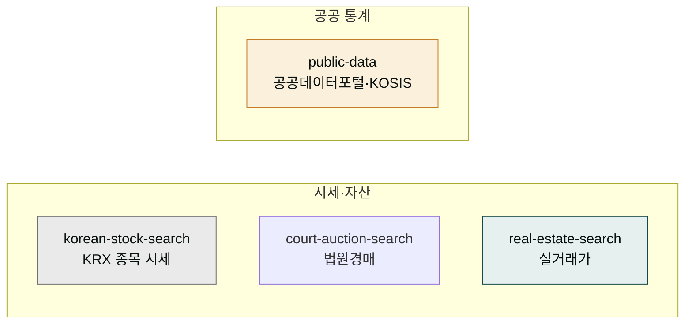

# moai-public-data

> 한국의 공공·시세 데이터를 별도 API 키 없이 조회하는 4개 스킬 묶음입니다.



## 무엇을 하는 플러그인인가

`moai-public-data`는 흩어져 있던 한국 공공·시세 조회 기능을 조회 전담 플러그인 하나로 모은 것입니다. KRX 상장 종목의 일별 시세, 대법원 법원경매 매각공고, 국토교통부 실거래가, 공공데이터포털·KOSIS 통계를 자연어로 조회합니다.

- **별도 API 키 불필요** — 프록시 경유 호출이라 사용자가 KRX·실거래가 API 키를 발급하거나 MCP 서버를 설치할 필요가 없습니다
- **read-only 조회** — 데이터를 수정·발송하지 않는 조회 전용. 시세는 일별 snapshot이며 실시간 호가·체결은 제공하지 않습니다


**조회 면책 고지**: 본 플러그인의 시세·통계 조회 결과는 정보 제공 목적이며, 투자 자문이 아닙니다. 실시간 호가·체결은 제공하지 않습니다. 실제 거래·투자·입찰 결정은 공식 출처와 전문가 확인을 거치세요.


## 설치



1. `moai-core` 설치 후 `moai-public-data` 옆의 **+** 버튼을 눌러 설치합니다.


[GitHub 저장소](https://github.com/modu-ai/cowork-plugins/tree/main/moai-public-data)를 클론한 뒤 `~/.claude/plugins/`에 배치합니다.



## 핵심 스킬 (4개)

| 스킬 | 용도 |
|---|---|
| `korean-stock-search` | KRX(한국거래소) 상장 종목 검색 + 종목 기본정보·일별 시세 조회 (read-only 일별 snapshot) |
| `court-auction-search` | 대법원 법원경매정보 부동산 매각공고를 매각기일·법원·기준으로 조회. 사건번호 단건 직접 조회 지원 |
| `real-estate-search` | 국토교통부 실거래가로 아파트·오피스텔·연립다세대·단독다가구·상업업무용 매매·전월세 시세 조회 |
| `public-data` | 공공데이터포털(data.go.kr)·KOSIS 통계청 실시간 통계 조회·분석 |

## 한국 공공 데이터 특화

- **국토부 실거래가** — 단지·면적·거래유형(매매/전세/월세)별 시세
- **법원경매** — 사건번호·용도·주소·감정평가액·최저매각가
- **KRX 종목** — 종목 기본정보 + 일별 시세 snapshot
- **공공데이터포털·KOSIS** — 인구·경제·산업 통계 직접 조회

## 대표 체인

**부동산 조사 + 보고**

```text
real-estate-search(실거래가 조회) → moai-content:html-report(단일 HTML 보고서)
```

**통계 조회 + 시각화**

```text
public-data(KOSIS 통계 조회) → moai-data:data-visualizer(차트) → moai-content:html-report
```

**경매 물건 검토**

```text
court-auction-search(매각공고 조회) → real-estate-search(주변 시세 비교)
```

## 사용 예시


> 잠실 리센츠 2024년 매매 실거래가 찾아줘


→ `real-estate-search` 자동 호출 → 국토부 실거래가 조회 → 면적·층·거래일별 매매가 정리.


> 삼성전자 최근 일별 시세 조회해줘


→ `korean-stock-search` 자동 호출 → KRX 종목 검색 → 종목 기본정보 + 일별 snapshot 시세.


> 강남구 아파트 경매 매각공고 보여줘


→ `court-auction-search` 자동 호출 → 매각기일·법원 기준 공고 조회 → 사건번호·감정평가액·최저매각가 정리.

## 다른 플러그인과의 경계

| 비슷해 보이지만 다른 영역 | 사용해야 할 스킬 |
|---|---|
| 개인 자산관리·재테크 로드맵 | [`moai-wealth`](../moai-wealth/) `wealth-roadmap` |
| 법인 세무·K-IFRS 재무제표 | [`moai-finance`](../moai-finance/) `financial-statements` |
| CSV 탐색·자체 데이터 분석 | [`moai-data`](../moai-data/) `data-explorer` |
| 조회한 데이터를 차트로 시각화 | [`moai-data`](../moai-data/) `data-visualizer` |

## 다음 단계

- [`moai-data`](../moai-data/) — 조회 데이터의 탐색·시각화
- [`moai-wealth`](../moai-wealth/) — 개인 자산관리·재테크
- [`moai-finance`](../moai-finance/) — 법인 세무·재무제표

---

### Sources

- [modu-ai/cowork-plugins](https://github.com/modu-ai/cowork-plugins)
- [moai-public-data 디렉터리](https://github.com/modu-ai/cowork-plugins/tree/main/moai-public-data)
- [국토교통부 실거래가 공개시스템](https://rt.molit.go.kr/)
- [대법원 법원경매정보](https://www.courtauction.go.kr/) · [공공데이터포털](https://www.data.go.kr/) · KOSIS 국가통계포털
