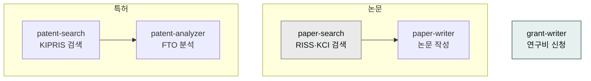
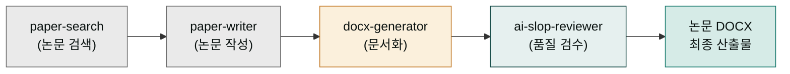

# moai-research

> 논문·특허·연구비 신청까지 연구자 워크플로우를 커버하는 5개 스킬을 제공합니다.



## 무엇을 하는 플러그인인가

`moai-research`는 한 명의 전담 도서관 사사(조수)처럼 작동합니다. 연구자가 "논문 찾아줘", "초안 써줘", "특허도 확인해줘", "연구비 신청서까지 만들어줘"라고 여러 번 나눠 부탁하는 대신, 연구 주제 한 가지만 말하면 사서가 알아서 일을 이어갑니다. 먼저 서가에서 관련 책을 찾아옵니다(`paper-search`). 그다음 독후감 초안을 써줍니다(`paper-writer`). 비슷한 특허가 있는지 서가를 또 뒤져보고(`patent-search`), 겹치는 게 없는지 확인한 뒤(`patent-analyzer`), 도서관 지원금 신청서까지 써줍니다(`grant-writer`). 즉, 논문 찾기부터 특허 확인, 연구비 신청까지 연구의 큰 줄기를 한 플러그인 안에서 처리합니다.

학술·R&D 과제 신청서가 필요하면 이 플러그인을 쓰시고, 창업·사업화 지원금은 [`moai-business`](../moai-business/)의 `kr-gov-grant`를 이용하세요.

`moai-research`는 RISS·KCI·DBpia·Google Scholar 통합 논문 검색, 서론–선행연구–방법론–결과–논의–결론 구조의 학술 논문 작성(APA/KCI/IEEE 참고문헌 포맷), KIPRIS 특허·실용신안·디자인·상표 검색과 FTO(자유실시 권한) 분석, NRF·IITP·KIAT·중기부 연구비 신청서 작성까지 연구자의 전 주기를 지원합니다.

## 설치



1. `moai-core` 설치 후 `moai-research` 옆의 **+** 버튼을 눌러 설치합니다.
2. (선택) KIPRIS·NRF API 키를 `.moai/credentials.env`에 등록합니다.


[GitHub 저장소](https://github.com/modu-ai/cowork-plugins/tree/main/moai-research)를 클론한 뒤 `~/.claude/plugins/`에 배치합니다.



## 핵심 스킬

| 스킬 | 용도 |
|---|---|
| `paper-search` | RISS·KCI·DBpia·Google Scholar 통합 논문 검색 |
| `paper-writer` | 서론–선행연구–방법론–결과–논의–결론 구조 작성, APA/KCI/IEEE 참고문헌 |
| `patent-search` | KIPRIS 특허·실용신안·디자인·상표 검색 |
| `patent-analyzer` | 특허 동향·선행기술·FTO 분석, 출원서 초안 |
| `grant-writer` | NRF·IITP·KIAT·중기부 연구비 신청서 |


**FTO(자유실시 권한)란?** 건물을 지을 땅에 비유하면 쉽습니다. FTO(Freedom To Operate) 분석은 "내가 지으려는 집이 남의 땅이나 남의 설계도를 침범하지 않는지, 내 마음대로 지어도 법적으로 문제 없는지 미리 확인하는 토지 감정"과 같습니다. 다른 사람의 특허(토지 소유권) 위에 내 제품(건물)을 올리면 나중에 소송·로열티 문제로 이어지므로, 특허 출원이나 제품 출시 전에 이 땅이 "자유롭게 지을 수 있는 땅"인지 미리 확인하는 작업입니다.


## 선택 API 키

| 변수 | 용도 | 발급처 |
|---|---|---|
| `KIPRIS_KEY` | 특허정보원 Plus API | [KIPRIS Plus](https://plus.kipris.or.kr) |
| `NRF_KEY` | 한국연구재단 API | [NRF](https://www.nrf.re.kr) |

## 대표 체인

스킬이 한 방향으로 흘러 하나의 산출물(DOCX)이 만들어지는 흐름은 요리 파이프라인과 같습니다. 재료 장보기(`paper-search`) → 요리하기(`paper-writer`) → 그릇에 담기(`docx-generator`) → 맛보기(`ai-slop-reviewer`) 순서로 한 방향으로만 흘러갑니다. 이 흐름은 [쿡북 — 스킬 체인 설계](../../cookbook/skill-chaining/)의 "도메인 → 포맷 → 품질" 3원칙과 동일한 구조입니다. 도메인 스킬이 내용을 만들고, 포맷 스킬이 문서 형태를 갖추고, 품질 스킬이 AI 특유 어투를 솎아내어 최종 결과물로 내보냅니다.



**연구 논문 초안**

```text
paper-search → paper-writer → docx-generator → ai-slop-reviewer
```

**특허 출원 준비**

```text
patent-search → patent-analyzer → docx-generator(출원서 초안)
```

**정부 과제 신청**

```text
grant-writer → docx-generator → ai-slop-reviewer
```

## 빠른 사용 예

```text
"스마트팩토리 AI 이상탐지" 주제로 최근 3년 KCI 논문 20편 찾고 서론 초안 써줘.
```

```text
> 2026년 NRF 중견연구자지원사업 신청서 초안 만들어줘. 주제는 ○○, 팀 구성은 …
```

## 다음 단계

- [`moai-product`](../moai-product/) — R&D 과제 기획서
- [`moai-education`](../moai-education/) — 교육 자료화

---

### Sources

- [modu-ai/cowork-plugins](https://github.com/modu-ai/cowork-plugins)
- [moai-research 디렉터리](https://github.com/modu-ai/cowork-plugins/tree/main/moai-research)
