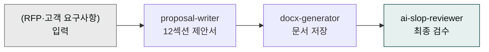

# moai-sales

> 한국 B2B 영업팀이 매주 작성하는 제안서·견적서·콜드메일·후속 시퀀스를 자동화하는 플러그인입니다.



## 무엇을 하는 플러그인인가

`moai-sales` (v1.8.0)는 한국 B2B SaaS·솔루션 회사의 영업 사이클을 압축합니다.

- **제안서 자동 생성**: 12섹션 표준 목차 + Three C's (Compliant·Complete·Compelling) 원칙
- **국세청 표준 양식 호환**: 견적서·세금계산서 형식 준수
- **고객사 RFP 답변**: RFP·고객 요구사항 입력 → 컴플라이언스 체크리스트와 함께 답변 초안

`kr-gov-grant`(moai-business)는 정부 지원사업 신청서, `investor-relations`(moai-business)는 투자자 IR 자료를 다룹니다 — 본 플러그인은 **B2B 영업 고객 대상**입니다.

향후 견적서, 콜드메일, 후속 시퀀스, 고객사 분석 스킬이 추가될 예정입니다 (v1.9.x 이후 로드맵).

## 설치



1. `moai-core` 설치 후 `moai-sales` 옆의 **+** 버튼을 눌러 설치합니다.
2. 회사 소개·레퍼런스 자료가 있다면 작업 폴더에 배치하면 자동 인용됩니다.


[GitHub 저장소](https://github.com/modu-ai/cowork-plugins/tree/main/moai-sales)를 클론한 뒤 `~/.claude/plugins/`에 배치합니다.



## 핵심 스킬 (1개 + 로드맵)

| 스킬 | 용도 | 대표 출력 |
|---|---|---|
| `proposal-writer` | RFP·고객 요구사항 기반 12섹션 B2B 제안서 자동 생성 | 컴플라이언스 체크리스트 + 본문 초안 |

향후 추가 예정 (로드맵): `quote-generator` · `cold-email` · `follow-up-sequence` · `account-research` · `objection-handler`.

## 12섹션 표준 목차

`proposal-writer`가 자동으로 채우는 한국 B2B 제안서 표준 구조:

1. 표지 (고객사명·제안일·제출처)
2. Executive Summary
3. 회사 소개
4. 시장·고객 이해
5. 솔루션 개요
6. 기술 스펙·아키텍처
7. 일정·마일스톤
8. 운영·SLA·지원
9. 레퍼런스·사례
10. 가격·라이선스
11. 리스크·완화안
12. 부록 (자격·인증·약관)

## Three C's 원칙

| 원칙 | 의미 | 자동 체크 |
|---|---|---|
| **Compliant** | RFP 요구사항 100% 충족 | 누락 항목 경고 |
| **Complete** | 12섹션 빠짐없이 작성 | 빈 섹션 표기 |
| **Compelling** | 차별점·USP 명확 강조 | 정량 수치 보강 제안 |

## 대표 체인

**RFP 답변 제안서**

```text
proposal-writer → docx-generator → ai-slop-reviewer
```

**고객사 분석 + 제안서**

```text
moai-business:market-analyst → proposal-writer → pptx-designer → ai-slop-reviewer
```

**제안 발표 자료까지**

```text
proposal-writer → docx-generator(본문) → pptx-designer(발표용 30장) → ai-slop-reviewer
```

## 빠른 사용 예 (한 줄 요청 + 시스템 자동 인터뷰)

> 매번 솔루션·차별점·가격·일정·저장 경로를 직접 작성할 필요 없습니다. RFP 파일만 첨부하고 한 줄로 요청하세요. ([사용 패턴 가이드](../../cowork/patterns/) 참조)


> RFP 첨부했어. B2B 제안서 만들어줘


→ 시스템 인터뷰: 우리 솔루션 한 줄·차별점 3개·가격대·일정·출력 형식 → `proposal-writer` (12섹션 + Three C's) 자동 체인


> 이번 주 RFP 3건 중 답변할 만한 것만 골라줘


→ 시스템 인터뷰: 우리 강점·예산 한도·우선 기준 → 매칭 분석 + 컴플라이언스 체크리스트


> 발표용 PPT 30장으로도 만들어줘


→ `proposal-writer → pptx-designer → ai-slop-reviewer` 자동 체인

## 다음 단계

- [`moai-business`](../moai-business/) — 시장조사·경쟁사 분석 결합
- [`moai-marketing`](../moai-marketing/) — 콜드메일·이메일 시퀀스 (현재는 marketing 측 사용)
- [`moai-finance`](../moai-finance/) — 견적서·세금계산서 양식
- [`moai-pm`](../moai-pm/) — 제안 후 프로젝트 관리

---

### Sources

- [modu-ai/cowork-plugins README](https://github.com/modu-ai/cowork-plugins)
- [moai-sales 디렉터리](https://github.com/modu-ai/cowork-plugins/tree/main/moai-sales)
- 국세청 전자세금계산서 표준 양식
