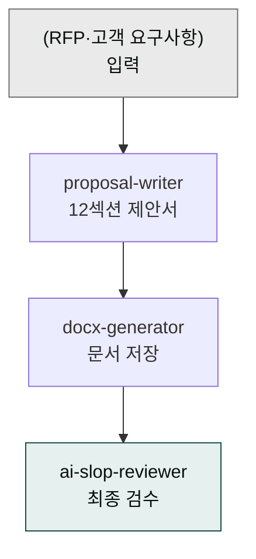
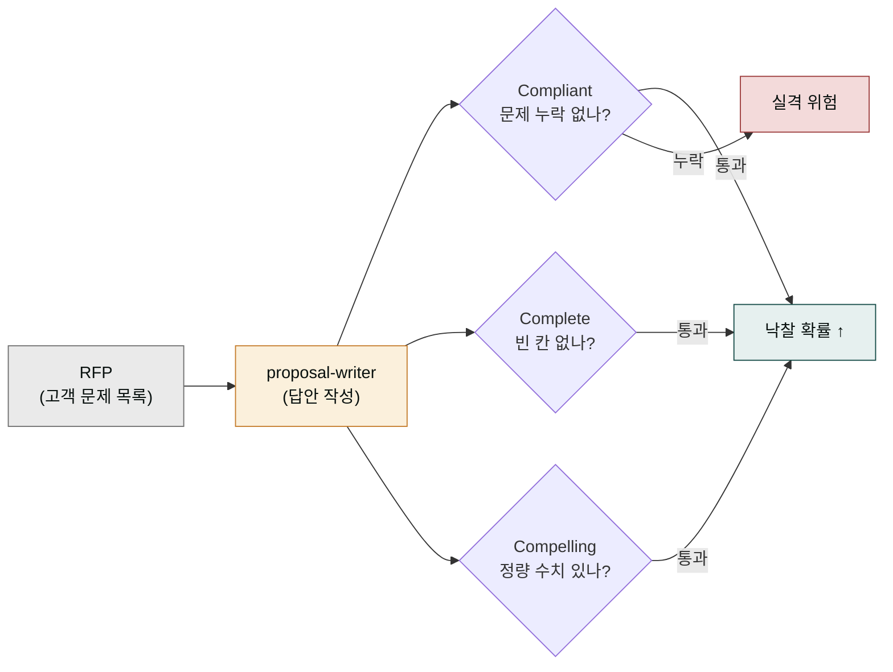
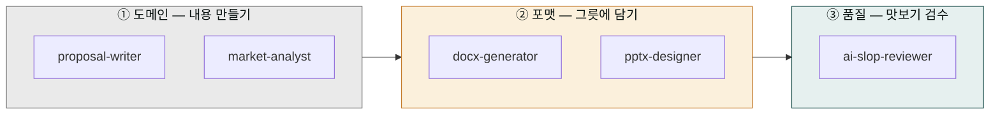

# moai-sales

> 한국 B2B 영업팀의 12섹션 제안서를 RFP·고객 요구사항 기반으로 자동 생성하는 플러그인입니다.



## 무엇을 하는 플러그인인가

B2B 제안서는 집을 짓기 전의 설계도와 비슷합니다. 고객이 "이 회사가 우리 문제를 어떻게 해결해 줄지"를 한눈에 볼 수 있도록 정해진 칸에 맞춰 쓴 정형 문서입니다. 집의 방 배치도처럼 표지에서 시작해 요약·회사 소개·해결책·가격·부록까지 일정한 순서로 구획이 있고, 한 칸이라도 비거나 어긋나면 입찰(제안 경쟁)에서 점수를 잃습니다. `proposal-writer`는 건축가처럼 이 설계도의 빈 칸을 고객이 준 요구사항에 맞춰 자동으로 채워 주는 역할을 합니다.

여기서 **RFP**(Request For Proposal, 입찰 요청서)란 고객이 "제안서에 반드시 이 항목들을 담아 달라"고 제시한 질문 목록입니다. 고객이 "보안 기준, 예산 한도, 도입 일정을 명시하라"라고 적어 보내면, 제안서는 그 항목 하나하나에 답해야 합니다. 12섹션은 이 RFP를 빠짐없이 흡수하면서도 설득력을 잃지 않기 위해 한국 B2B 실무에서 검증된 표준 목차입니다. "영업 사이클을 압축한다"는 말은 곧, 담당자가 과거에는 일주일 걸리던 빈 칸 채우기 작업을 스킬 한 번으로 줄인다는 뜻입니다.

`moai-sales`는 한국 B2B SaaS·솔루션 회사의 영업 사이클을 압축합니다.

- **제안서 자동 생성**: 12섹션 표준 목차 + Three C's (Compliant·Complete·Compelling) 원칙
- **국세청 표준 양식 호환**: 견적서·세금계산서 형식 준수
- **고객사 RFP 답변**: RFP·고객 요구사항 입력 → 컴플라이언스 체크리스트와 함께 답변 초안

`kr-gov-grant`(moai-business)는 정부 지원사업 신청서, `investor-relations`(moai-business)는 투자자 IR 자료를 다룹니다 — 본 플러그인은 **B2B 영업 고객 대상**입니다.

## 설치



1. `moai-core` 설치 후 `moai-sales` 옆의 **+** 버튼을 눌러 설치합니다.
2. 회사 소개·레퍼런스 자료가 있다면 작업 폴더에 배치하면 자동 인용됩니다.


[GitHub 저장소](https://github.com/modu-ai/cowork-plugins/tree/main/moai-sales)를 클론한 뒤 `~/.claude/plugins/`에 배치합니다.



## 핵심 스킬

| 스킬 | 용도 | 대표 출력 |
|---|---|---|
| `proposal-writer` | RFP·고객 요구사항 기반 12섹션 B2B 제안서 자동 생성 | 컴플라이언스 체크리스트 + 본문 초안 |

견적서·콜드메일·후속 시퀀스가 필요할 때는 [`moai-finance`](../moai-finance/)(견적·세금계산서 양식)·[`moai-marketing`](../moai-marketing/)(이메일 시퀀스)와 체이닝합니다.

## 12섹션 표준 목차

`proposal-writer`가 자동으로 채우는 한국 B2B 제안서 표준 구조:

1. 표지 (고객사명·제안일·제출처)
2. Executive Summary
3. 회사 소개
4. 시장·고객 이해
5. 솔루션 개요
6. 기술 스펙·아키텍처
7. 일정·마일스톤
8. 운영·SLA·지원
9. 레퍼런스·사례
10. 가격·라이선스
11. 리스크·완화안
12. 부록 (자격·인증·약관)

## Three C's 원칙

Three C's는 시험 답안지 채점 기준에 비유하면 쉽습니다. RFP는 출제자(고객)가 낸 문제 목록이고, 제안서는 답안지입니다. **Compliant**(준수)는 "문제를 하나도 빠뜨리지 않고 다 풀었나"를 따집니다. RFP가 묻는 항목 하나를 빼먹으면 그 문제는 0점이고, 심하면 실격 처리됩니다. **Complete**(완전)는 "답안지에 빈 칸 없이 끝까지 썼나"를 봅니다. 12섹션 중 한 칸이라도 비면 심사관이 성의 없다고 느낍니다. **Compelling**(설득력)은 "채점관이 읽고 감동할 만큼 우리만의 차별점이 드러나나"를 검사합니다. 추상적인 미사여구 대신 "도입 후 3개월간 응답 시간 40% 단축" 같은 정량 숫자가 들어가야 점수가 붙습니다.

이 세 가지를 동시에 만족해야 낙찰(계약 따내기) 확률이 오릅니다. `proposal-writer`는 제안서를 쓰면서 이 세 원칙을 자동으로 점검하고, 빠진 항목이나 빈 칸을 경고로 알려 줍니다.



| 원칙 | 의미 | 자동 체크 |
|---|---|---|
| **Compliant** | RFP 요구사항 100% 충족 | 누락 항목 경고 |
| **Complete** | 12섹션 빠짐없이 작성 | 빈 섹션 표기 |
| **Compelling** | 차별점·USP 명확 강조 | 정량 수치 보강 제안 |

## 대표 체인

체인 순서는 요리 파이프라인과 같습니다. 먼저 재료를 손질하고(도메인), 그릇에 담고(포맷), 마지막에 맛보기로 검수합니다(품질). `proposal-writer`가 제안 내용이라는 요리를 만들면 `docx-generator`나 `pptx-designer`는 그 내용을 DOCX·PPTX 파일이라는 그릇에 담아 저장합니다. 그리고 `ai-slop-reviewer`는 내기 직전에 맛보기로 "AI가 쓴 티가 나는 문장"을 솎아내는 마지막 검수 단계입니다.

핵심은 이 순서를 지켜야 검수 대상이 존재한다는 점입니다. `ai-slop-reviewer`를 맨 앞에 두면 검수할 원문이 없어 의미가 없고, `proposal-writer` 없이 포맷 스킬만 부르면 내용 없는 빈 그릇만 생깁니다. 도메인 → 포맷 → 품질 순서가 지켜져야 비로소 완성된 제안서가 나옵니다.



**RFP 답변 제안서**

```text
proposal-writer → docx-generator → ai-slop-reviewer
```

**고객사 분석 + 제안서**

```text
moai-business:market-analyst → proposal-writer → pptx-designer → ai-slop-reviewer
```

**제안 발표 자료까지**

```text
proposal-writer → docx-generator(본문) → pptx-designer(발표용 30장) → ai-slop-reviewer
```

## 빠른 사용 예 (한 줄 요청 + 시스템 자동 인터뷰)

> 매번 솔루션·차별점·가격·일정·저장 경로를 직접 작성할 필요 없습니다. RFP 파일만 첨부하고 한 줄로 요청하세요. ([사용 패턴 가이드](../../cowork/patterns/) 참조)


> RFP 첨부했어. B2B 제안서 만들어줘


→ 시스템 인터뷰: 우리 솔루션 한 줄·차별점 3개·가격대·일정·출력 형식 → `proposal-writer` (12섹션 + Three C's) 자동 체인


> 이번 주 RFP 3건 중 답변할 만한 것만 골라줘


→ 시스템 인터뷰: 우리 강점·예산 한도·우선 기준 → 매칭 분석 + 컴플라이언스 체크리스트


> 발표용 PPT 30장으로도 만들어줘


→ `proposal-writer → pptx-designer → ai-slop-reviewer` 자동 체인

## 다음 단계

- [`moai-business`](../moai-business/) — 시장조사·경쟁사 분석 결합
- [`moai-marketing`](../moai-marketing/) — 콜드메일·이메일 시퀀스 (현재는 marketing 측 사용)
- [`moai-finance`](../moai-finance/) — 견적서·세금계산서 양식
- [`moai-pm`](../moai-pm/) — 제안 후 프로젝트 관리

---

### Sources

- [modu-ai/cowork-plugins README](https://github.com/modu-ai/cowork-plugins)
- [moai-sales 디렉터리](https://github.com/modu-ai/cowork-plugins/tree/main/moai-sales)
- 국세청 전자세금계산서 표준 양식
