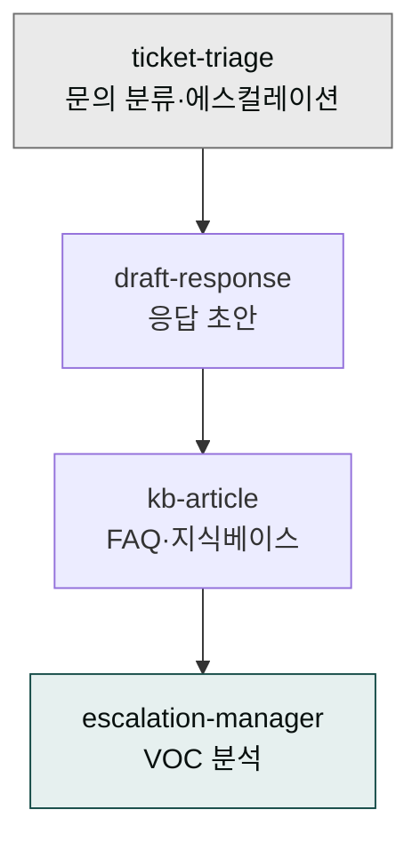
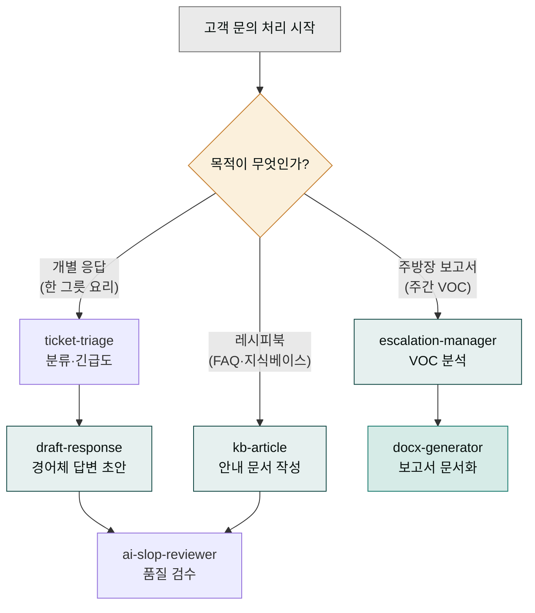

# moai-support

> CS·티켓·지식베이스 관리용 4개 스킬을 제공합니다.



## 이 플러그인으로 무엇을 할 수 있나

moai-support는 **가상 고객센터 팀**이라고 생각하면 쉽습니다. 콜센터 접수창구를 떠올려 보세요. 고객이 문의 전화를 걸면 ①접수원이 "이건 환불 건인지, 단순 질문인지" 종류를 가려내고(분류) → ②담당자가 정중하게 답변을 적어줍니다(응답 초안) → ③자주 묻는 질문은 안내 책자로 묶어두고(지식베이스) → ④일주일 치 문의를 모아 한 장의 보고서로 정리합니다(에스컬레이션·VOC 분석). 이 일련의 흐름을 AI가 대신 수행하는 게 이 플러그입니다.

여기에 등장하는 실무 용어를 먼저 풀어두겠습니다. **티켓**(ticket)은 고객 문의 접수 건 하나를 이르는 말입니다. 이메일 한 통, 채팅 한 건, 카카오채널 문의 하나가 각각 한 티켓입니다. **에스컬레이션**(escalation)은 일반 담당자가 해결하기 어려운 건을 상위 담당자나 관리자에게 "이건 올려보냅니다" 하고 넘기는 동작입니다. 단순 안내로 끝나는 사소한 건까지 관리자가 직접 보지 않도록, 그리고 VIP 고객이나 불만 건은 빠르게 위로 올려 대응하도록 돕는 역할입니다. **VOC**(Voice of Customer, 고객의 소리)는 쏟아지는 문의에서 고객 의견을 모아 "이번 주에 반복해서 불만이 나온 지점은 어디인가"를 분석하는 활동입니다.

이렇게 용어를 풀어두면 플러그인이 실제로 무슨 일을 하는지 보입니다. 고객 한 명에게 답장하는 일부터, 한 주 치 문의를 모아 경영진 보고서를 만드는 일까지 — 고객센터에서 하루에 반복되는 일을 스킬 네 개로 나눠 맡긴 셈입니다.

## 무엇을 하는 플러그인인가

`moai-support`는 고객 문의 접수부터 응답·에스컬레이션·지식베이스화까지 CS 조직의 주요 업무를 지원하는 플러그인입니다. 한국어 경어체 응답 초안, Zendesk·Freshdesk 호환 FAQ 문서, VOC 분석 리포트 등 실무 산출물을 바로 생성할 수 있습니다.

## 설치



1. `moai-core` 설치 후 `moai-support` 옆의 **+** 버튼을 눌러 설치합니다.


[GitHub 저장소](https://github.com/modu-ai/cowork-plugins/tree/main/moai-support)를 클론한 뒤 `~/.claude/plugins/`에 배치합니다.



## 핵심 스킬

| 스킬 | 용도 |
|---|---|
| `ticket-triage` | 문의 분류(유형·긴급도·담당팀), 에스컬레이션 판단 |
| `draft-response` | 이메일·채팅·카카오채널 응답 초안 (한국어 경어체) |
| `kb-article` | FAQ, 트러블슈팅, 정책 안내 문서 (Zendesk·Freshdesk 호환) |
| `escalation-manager` | 불만 대응, VIP 응대, VOC 분석, 주간 CS 요약 |

## 스킬 순서는 왜 이렇게 짜이는가

요리에 비유하면 순서가 왜 중요한지 바로 와닿습니다. 고객 문의 하나를 한 그릇의 요리라고 하면, ①재료를 먼저 검수해 "이건 어떤 요리에 쓸 건지"를 가리고(문의 분류 = `ticket-triage`) → ②그다음 불에 올려 조리합니다(답변 초안 작성 = `draft-response`) → ③마지막으로 맛을 보며 AI 특유의 기계적 어투를 솎아냅니다(`ai-slop-reviewer`). 재료 검수 없이 조리부터 하면 환불 건에 단순 안내 답변을 적는 불상사가 생기고, 맛보기(품질)를 빼면 고객이 "AI가 쓴 것 같다"고 느낍니다.

하지만 모든 일이 한 그릇 요리는 아닙니다. 목적에 따라 진입점과 끝점이 달라집니다. **FAQ 문서**는 고객 한 명에게 내놓는 요리가 아니라 "우리 매장은 이렇게 안내합니다"라고 적어둔 **레시피북**을 만드는 일입니다. 그래서 개별 문의를 분류(`ticket-triage`)하는 단계를 건너뛰고 `kb-article`로 바로 들어갑니다. **주간 VOC 보고**는 한 주 치 요리를 전부 모아 "이번 주 주방에서 무슨 일이 있었나"를 한 장으로 묶는 **주방장 보고서**를 만드는 일입니다. 그래서 개별 응답(`draft-response`)을 건드리지 않고 `escalation-manager`로 분석을 뽑은 뒤 `docx-generator`로 문서 하나로 마무리합니다.

즉 "지금 하려는 일이 개별 응답인가, 레시피 정리인가, 주간 보고인가"를 먼저 정하면 어느 스킬에서 시작해 어느 스킬로 끝날지가 자연스럽게 정해집니다. 이게 스킬 체인 설계의 기본 원리입니다 — 목적이 흐름을 결정합니다.



## 대표 체인

**고객 문의 처리**

```text
ticket-triage → draft-response → ai-slop-reviewer
```

**FAQ 생성**

```text
kb-article → ai-slop-reviewer
```

**주간 VOC 보고**

```text
escalation-manager → docx-generator
```

## 빠른 사용 예


> 환불 요청 이메일 답변 초안 만들어줘. 고객은 구매 5일 뒤 단순 변심이야.



> 지난주 CS 티켓 120건 분석해서 반복되는 이슈 TOP 5 뽑아줘.


## 다음 단계

- [`moai-content`](../moai-content/) — 고객 대상 커뮤니케이션
- [`moai-operations`](../moai-operations/) — 개선 프로세스

---

### Sources

- [modu-ai/cowork-plugins](https://github.com/modu-ai/cowork-plugins)
- [moai-support 디렉터리](https://github.com/modu-ai/cowork-plugins/tree/main/moai-support)
