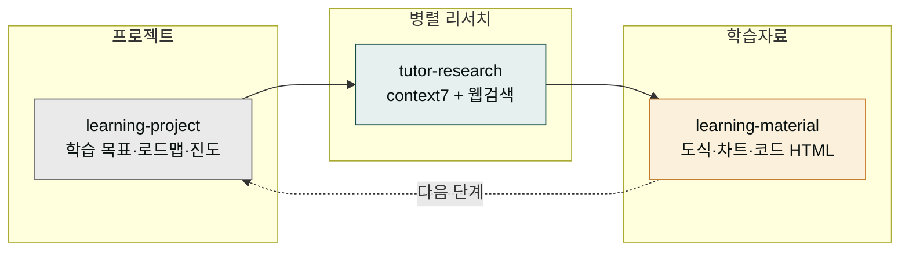

# moai-tutor

> 배우는 사람(수강생·학습자) 본인이 쓰는 개인 AI 튜터. 질문하면 최신 정보를 병렬로 조사해, 도식과 예제가 풍부한 HTML 학습자료를 만들어 줍니다.



## 무엇을 하는 플러그인인가

`moai-tutor`는 claude code·claude cowork 사용법, 영어, 프로그래밍 개념 등 **어떤 주제든** 학습자가 스스로 깊이 공부할 수 있게 돕습니다. 먼저 내 학습 목표와 수준에 맞는 프로젝트·로드맵을 세우고, 막히는 개념이 생기면 공식 문서(context7)와 웹을 **병렬로** 조사해 최신 정보를 끌어옵니다. 마지막으로 그 내용을 도식·차트·수식·코드가 들어간 한 편의 HTML 학습자료로 정리해 줍니다.

가르치는 사람(강사·교수·교사)을 위한 [`moai-education`](../moai-education/)과 달리, `moai-tutor`는 **배우는 사람** 관점에 맞춰져 있습니다. 강의를 만드는 도구가 아니라, 내가 배우는 것을 빠르게 이해하고 자료로 남기는 도구입니다.

## 설치



1. `moai-core` 설치 후 `moai-tutor` 옆의 **+** 버튼을 눌러 설치합니다.
2. 번들된 context7 MCP가 함께 활성화되어 라이브러리·SDK 공식 문서 조회가 가능합니다(별도 API 키 불필요).


[GitHub 저장소](https://github.com/modu-ai/cowork-plugins/tree/main/moai-tutor)를 클론한 뒤 `~/.claude/plugins/`에 배치합니다.



## 핵심 스킬 (3개)

| 스킬 | 용도 |
|---|---|
| `learning-project` | 학습 목표·수준 진단, 단계별 로드맵(Bloom 6단계), 진도 추적·학습 전용 CLAUDE.md 스캐폴딩 |
| `tutor-research` | 질문을 리서치 축으로 분해 → context7(공식 문서) + 웹검색(최신 정보) 병렬 조사·교차검증 → 출처 검증 종합본 |
| `learning-material` | 학습목표·핵심개념·도식·예제·복습 구조의 단일 HTML. mermaid·ECharts·KaTeX·highlight.js·AOS 조건부 로딩 |

## 학습 워크플로우 특화

- **병렬 리서치** — 공식 문서(context7)와 웹검색을 한 번에 돌려 최신·정확한 근거를 모읍니다. 상충 시 공식 문서를 우선합니다.
- **조건부 시각화** — 도식·차트·수식·코드가 필요한 곳에만 라이브러리를 주입합니다(순수 텍스트 자료는 JS 0). 자세한 큐레이션은 `learning-material`의 `references/cdn-libraries.md`에 정리돼 있습니다.
- **0-JS 원칙 보존** — 업무 보고서용 [`moai-content`](../moai-content/) `html-report`의 디자인 토큰은 공유하되, 학습자료 렌더러는 별도라 보고서의 0-JS 원칙을 건드리지 않습니다.
- **자기주도 사이클** — 학습 → 조사 → 자료화 → 다음 단계로 이어지는 반복 루프를 진도 파일로 추적합니다.

## 대표 체인

**개인 학습 풀 사이클**

```text
learning-project(로드맵·진도) → tutor-research(병렬 조사) → learning-material(HTML 학습자료) → (반복)
```

**단발성 학습자료**

```text
tutor-research(주제 조사) → learning-material(도식·예제 HTML)
```

**코드·라이브러리 학습**

```text
tutor-research(context7 공식 문서 중심) → learning-material(코드 하이라이트 + 시퀀스 도식)
```

## 사용 예시


> claude code 서브에이전트 공부할 학습 프로젝트 만들어줘. 입문이고 하루 1시간.


→ `learning-project` 자동 호출 → 수준 진단 → 단계별 로드맵 → 진도 추적·학습 전용 CLAUDE.md 생성.


> claude cowork의 Skills와 Sub-agents 차이를 최신 정보로 조사해서 알려줘


→ `tutor-research` 자동 호출 → context7 + 웹검색 병렬 조사 → 출처 교차검증 종합본.


> 방금 조사한 내용으로 도식이랑 예제 들어간 HTML 학습자료 만들어줘


→ `learning-material` 자동 호출 → 시퀀스 도식(mermaid) + 코드 하이라이트 + 복습 질문 HTML.

## 다른 플러그인과의 경계

| 비슷해 보이지만 다른 영역 | 사용해야 할 스킬 |
|---|---|
| 강사가 만드는 강의 커리큘럼·학습 목표 설계 | [`moai-education`](../moai-education/) `curriculum-designer` |
| 시험·평가 문제 출제 | [`moai-education`](../moai-education/) `assessment-creator` |
| 학술 논문·문헌 검토 리서치 | [`moai-education`](../moai-education/) `research-assistant` |
| 0-JS 단일파일 업무 보고서 | [`moai-content`](../moai-content/) `html-report` |
| 발표용 슬라이드·문서(.docx) | [`moai-office`](../moai-office/) |

## 다음 단계

- [`moai-education`](../moai-education/) — 가르치는 사람을 위한 교육 콘텐츠
- [`moai-content`](../moai-content/) — 업무 보고서·콘텐츠 렌더링

---

### Sources

- [modu-ai/cowork-plugins](https://github.com/modu-ai/cowork-plugins)
- [moai-tutor 디렉터리](https://github.com/modu-ai/cowork-plugins/tree/main/moai-tutor)
