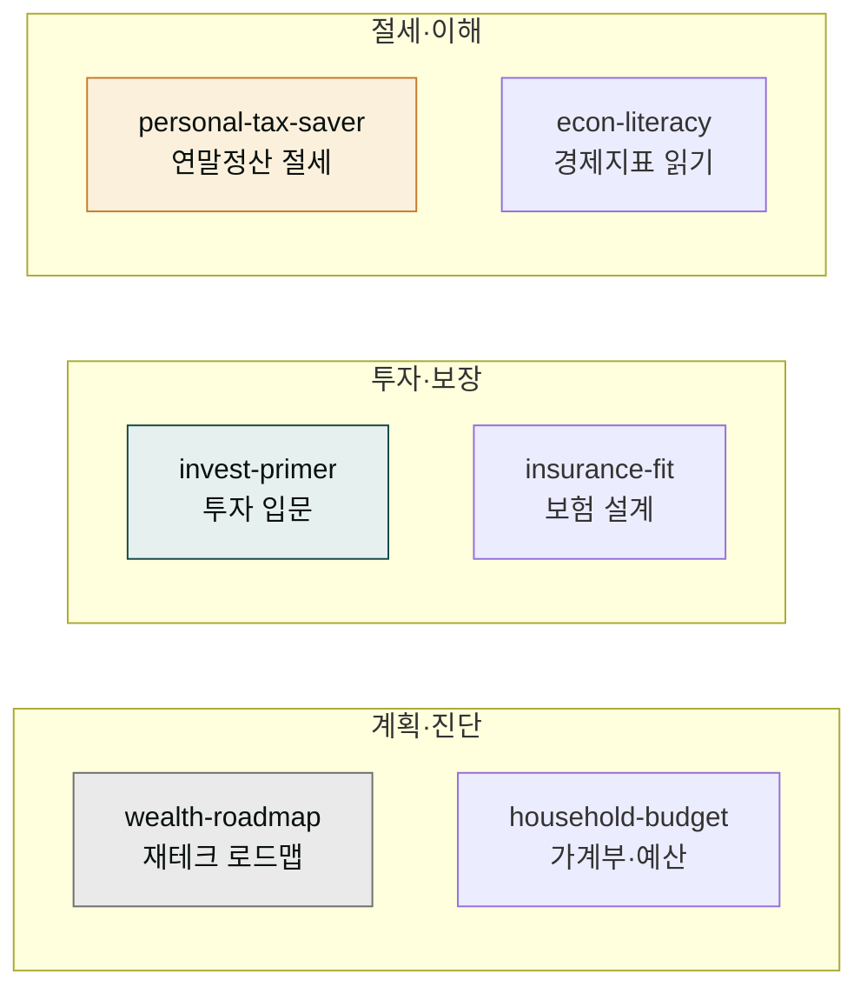

# moai-wealth

> 직장인·1인 가구·사회초년생의 개인 자산관리 6개 스킬을 제공합니다.



## 무엇을 하는 플러그인인가

### 한 번에 모든 과를 돌고 오는 내 돈의 종합병원

`moai-wealth`는 한마디로 '내 돈의 종합건강검진 센터'입니다. 종합병원에 들르면 한 번에 안과·치과·내과·정형외과를 차례로 돌며 몸의 여러 면을 점검하듯, 이 플러그인은 내 돈의 여러 면(종잣돈, 예산, 투자, 보험, 세금, 경제상식)을 한 곳에서 순서대로 돌봅니다. 여기서 스킬(skill)이란 "이런 돈 문제가 생기면 이렇게 풀어라"라는 절차를 파일로 저장해 둔 것으로, 한 분야씩 전문화된 진료과에 비유할 수 있습니다.

각 진료과가 내 삶의 서로 다른 순간에 필요하듯, 여섯 스킬도 돈의 흐름을 따라 배치됩니다. **예방의학**에 해당하는 `wealth-roadmap`은 내 재무 현황을 먼저 진단해 어디가 부족한지(종잣돈, 저축률, 부채 비율)를 찾아냅니다. 진단이 끝나면 **식단 처방**처럼 매일 쓸 시스템을 만드는 `household-budget`이 통장 쪼개기와 50/30/20 예산(필요·쾌락·저축을 5:3:2로 나누는 비율)으로 돈이 새어나가지 않게 합니다. 시스템이 잡히면 **운동 처방**인 `invest-primer`가 모은 돈을 굴리는 법(분산·장기·리스크 원칙)을 가르쳐주고, **보험 점검**인 `insurance-fit`은 혹시 모를 위험에 대비해 필요한 보험만 남기도록(과보험 솎아내기) 도와줍니다. **세금 환급**은 `personal-tax-saver`가 연말정산에서 돌려받을 수 있는 돈을 놓치지 않게 하고, 마지막으로 `econ-literacy`는 뉴스에 나오는 **건강상식**(금리·물가·환율)을 내 지갑 관점에서 읽는 법을 알려줍니다.

이 플러그인의 핵심 원리는 '한 번에 큰돈을 번다'가 아닙니다. 진단 → 시스템 → 운용 → 지키기라는 단계로 내 돈을 차곡차곡 돌보는 것입니다. 병원 한 번 방문으로 모든 과를 돌고 오듯, 한 번의 요청으로 재무 상태를 처음부터 끝까지 점검할 수 있다는 점이 이 플러그인이 주는 가장 큰 장점입니다.

### 한 줄 요청이 하나의 산출물로 완성되는 흐름

위 여섯 스킬은 제각각 따로 놀지 않습니다. 사용자가 "재테크 시작하고 싶다"고 한 줄을 던지면(입력), 주방장이 요리를 완성하듯 스킬들이 차례로 맥락을 이어받으며 하나의 결과물을 만들어 냅니다(산출물). 주방에 비유하면 손님의 주문이 들어오면 재료 손질 → 기본 조리 → 플레이팅 순서로 요리가 조립되는 것과 같습니다.

먼저 `wealth-roadmap`이 "지금 어디쯤 있고, 어디로 갈 것인가"를 진단해 재료를 다듬습니다(현재 자산·부채·목표 파악). 그 맥락을 `household-budget`이 받아 매달 쓸 예산 시스템을 조리하고, 다시 그 시스템 위에서 `invest-primer`가 모은 돈을 굴리는 투자 첫걸음을 플레이팅합니다. 앞 스킬이 만든 진단·예산·목표라는 맥락이 다음 스킬로 자연스럽게 넘어가기 때문에, 사용자는 매번 처음부터 상황을 다시 설명할 필요 없이 하나의 완성된 재테크 로드맵을 받게 됩니다.


`moai-wealth`는 종잣돈 모으기부터 자산 배분, 투자 입문, 보험 점검, 연말정산 환급 극대화, 경제지표를 내 돈 관점에서 읽는 법까지 직장인의 개인 자산관리 전반을 돕습니다. 통장 쪼개기·50/30/20 예산 같은 실천 가능한 프레임과 생애주기별 보험·투자·은퇴 관점이 2026년 한국 기준으로 반영되어 있습니다.

법인·사업자 세무(3.3% 원천징수·부가세·종합소득세)와 K-IFRS 재무제표는 [`moai-finance`](../moai-finance/)가 맡고, 개인 자산관리는 `moai-wealth`로 역할이 분리됩니다.


**개인 재무 면책 고지**: 본 플러그인은 일반적인 재무 정보·교육 목적이며, 공인 투자·세무 자문을 대체하지 않습니다. 구체적 투자·세무 결정은 자격을 갖춘 전문가와 상담하세요. 투자에는 원금 손실 위험이 따릅니다.


## 설치



1. `moai-core` 설치 후 `moai-wealth` 옆의 **+** 버튼을 눌러 설치합니다.


[GitHub 저장소](https://github.com/modu-ai/cowork-plugins/tree/main/moai-wealth)를 클론한 뒤 `~/.claude/plugins/`에 배치합니다.



## 핵심 스킬 (6개)

| 스킬 | 용도 |
|---|---|
| `wealth-roadmap` | 재무 현황 진단 → 목표 설정 → 종잣돈 단계 → 자산 배분 → 자동화. 재테크 시작 로드맵 |
| `household-budget` | 통장 쪼개기, 가계부 작성, 50/30/20 예산, 소비 회고 루틴, 새는 돈 찾기 |
| `invest-primer` | 분산·장기·리스크 원칙, 자산군(주식·ETF·부동산·채권) 입문, 초보 포트폴리오, 투자 사기 회피 |
| `insurance-fit` | 필요한 보험 진단(실손·암·종신·연금), 과보험 점검, 생애주기별 보험 리모델링 |
| `personal-tax-saver` | 근로자 연말정산 절세 — 소득공제 vs 세액공제, 항목별 공제 전략, 환급 극대화 |
| `econ-literacy` | 금리·환율·물가·GDP·고용 지표를 내 자산 관점에서 읽기, 경기 사이클 이해 |

## 한국 개인 재무 환경 특화

- **2026년 기준** 연말정산 공제 항목·한도, 금융소득 과세 반영
- **통장 쪼개기·50/30/20** 등 실천 가능한 예산 프레임
- **생애주기별** 보험·투자·은퇴 설계 관점
- **경제지표를 내 돈 관점**에서 해석 (금리 상승 → 대출·예금 영향 등)

## 대표 체인

**재테크 첫걸음 풀 코스**

```text
wealth-roadmap(목표·진단) → household-budget(예산 시스템) → invest-primer(투자 시작)
```

**생애주기 자산 점검**

```text
wealth-roadmap(현황 진단) → insurance-fit(보험 리모델링) → econ-literacy(시장 환경 읽기)
```

**연말 머니 정산**

```text
household-budget(소비 회고) → personal-tax-saver(연말정산 절세) → wealth-roadmap(내년 목표)
```

## 사용 예시


> 사회초년생인데 재테크 어떻게 시작해야 할지 로드맵 짜줘


→ `wealth-roadmap` 자동 호출 → AskUserQuestion(소득·목표·기간) → 재무 현황 진단 → 종잣돈 단계 → 자산 배분 → 자동화 5단계 로드맵.


> 월급 280만원인데 통장 쪼개기랑 예산 배분 어떻게 하지?


→ `household-budget` 자동 호출 → 50/30/20 예산 + 통장 4분할 + 소비 회고 루틴.


> 연말정산 환급 더 받으려면 12월 전에 뭘 챙겨야 해?


→ `personal-tax-saver` 자동 호출 → 소득공제 vs 세액공제 진단 → 항목별 공제 전략 → 환급 극대화 체크리스트.

## 다른 플러그인과의 경계

| 비슷해 보이지만 다른 영역 | 사용해야 할 스킬 |
|---|---|
| 법인·사업자 세무(3.3%·부가세·종소세) | [`moai-finance`](../moai-finance/) `tax-helper` |
| K-IFRS 재무제표·법인 결산 | [`moai-finance`](../moai-finance/) `financial-statements` |
| 주식 종목 시세 조회(KRX) | [`moai-finance`](../moai-finance/) `korean-stock-search` |
| 개인 목표·습관·회고 관리 | [`moai-productivity`](../moai-productivity/) `goal-planner` |

## 다음 단계

- [`moai-finance`](../moai-finance/) — 법인 세무·결산·재무제표
- [`moai-productivity`](../moai-productivity/) — 개인 목표·습관·자기관리

---

### Sources

- [modu-ai/cowork-plugins](https://github.com/modu-ai/cowork-plugins)
- [moai-wealth 디렉터리](https://github.com/modu-ai/cowork-plugins/tree/main/moai-wealth)
- [홈택스 연말정산 간소화](https://www.hometax.go.kr/) — 국세청
- [금융감독원 파인](https://fine.fss.or.kr/) — 금융상품·보험 비교
