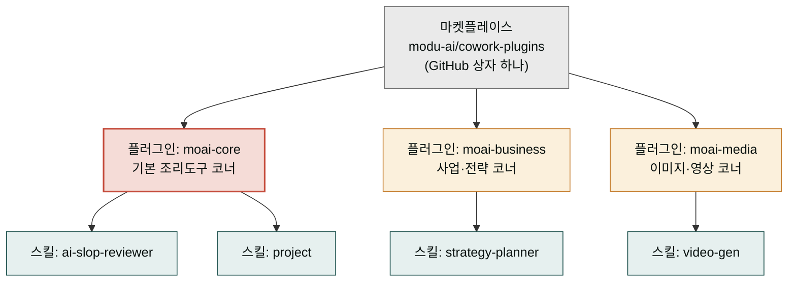
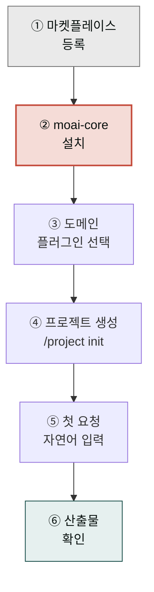

`modu-ai/cowork-plugins` 마켓플레이스를 Claude Cowork에 등록하고 첫 스킬 체인을 실행하기까지의 전체 흐름을 정리한 페이지입니다. 처음부터 끝까지 약 **10분** 소요됩니다.

## 사전 체크

- [Cowork 설치](../../cowork/install/) 완료
- 작업할 **로컬 폴더** 하나 준비 (Windows에서는 짧은 경로를 권장합니다)

## 마켓플레이스·플러그인·스킬 한눈에 보기

본격 설정에 들어가기 전에 세 단어부터 정리하겠습니다. 이 페이지 전체에서 "21개 플러그인·107개 스킬"이라는 문장이 계속 나오는데, 셋이 어떻게 포함되는지를 머릿속에 그려두어야 다음 6단계가 왜 이 순서인지 이해할 수 있습니다.

큰 마트(대형 마켓플레이스)에 비유하면 한눈에 들어옵니다. 마트 안에는 신선식품·생활용품·가전 같은 **코너**(플러그인)가 있고, 각 코너마다 진열된 **개별 상품**(스킬)이 있습니다. 한 번에 모든 코너를 들를 필요는 없고, 오늘 저녁 메뉴에 맞춰 필요한 코너(moai-business 같은)만 장보기를 하면 됩니다. 이때 `moai-core`는 어느 요리에든 가장 먼저 들러야 하는 **기본 조리도구 코너**(칼·도마·기본 양념)로, 없으면 아무리 좋은 재료를 사 와도 손을 댈 수 없습니다.

정리하면 위계는 `마켓플레이스 ⊃ 플러그인 ⊃ 스킬` 한 방향입니다. 마켓플레이스는 GitHub에 올라 있는 큰 상자 하나(`modu-ai/cowork-plugins`)이고, 그 안을 분야별로 나눈 21개의 묶음이 플러그인, 다시 그 묶음 안에 들어 있는 개별 기능 하나하나가 스킬입니다. 스킬이 실제로 일을 하는 가장 작은 단위이고, 플러그인은 "어떤 분야의 스킬을 한 묶음으로 설치할까"를 고르는 선택 단위입니다.



> **한 줄 요약**: 마켓플레이스(상자) 안에 플러그인(코너)이 있고, 플러그인 안에 스킬(상품)이 있습니다. `moai-core`는 어느 코너에서든 먼저 들러야 하는 조리도구 코너입니다.

## 전체 흐름



1. **마켓플레이스 등록**

   Cowork **좌측 사이드바 → 사용자 지정(Customize)** 메뉴로 진입합니다.

   

   1. **알림 배지** — Customize 메뉴에 새로운 항목이 있음을 나타냅니다.

   플러그인 설정 화면에서 **마켓플레이스 추가**를 선택합니다.

   

   1. **+ 버튼(설정 그룹)** — 새 설정 그룹을 추가합니다.
   2. **플러그인 설정 + 버튼** — 플러그인 섹션을 확장합니다.
   3. **"마켓플레이스 추가" 메뉴** — 마켓플레이스 URL을 입력하는 진입점입니다.

   마켓플레이스 추가 대화상자에서 다음 URL을 입력합니다.

   

   ```text
   modu-ai/cowork-plugins
   ```

   

   1. **URL 입력 필드** — GitHub `owner/repo` 형식 또는 전체 git 리포지토리 URL을 입력합니다.

   동기화가 끝나면 21개 플러그인·107개 스킬 목록이 표시됩니다.

2. **`moai-core` 설치**

   
   **반드시 `moai-core`부터** 설치합니다. 여기에 `/project init` 마법사와 모든 텍스트 체인에 필요한 `ai-slop-reviewer`가 포함되어 있습니다.
   

   왜 `moai-core`가 다른 플러그인보다 반드시 먼저여야 할까요. 부엌을 새로 차릴 때 냄비·도마·기본 양념(=`moai-core`)을 먼저 세팅해 놓아야 본격 요리(=도메인 플러그인의 작업)가 가능한 것과 같습니다. 조리도구 없이 재료만 사 오면 손을 댈 수 없듯, `moai-core` 없이 도메인 플러그인만 깔아두면 자동 호출과 검수가 작동하지 않습니다.

   `moai-core` 안에는 크게 두 가지가 들어 있습니다. 하나는 **라우터**인데, 주방장이 주문표를 보고 "이 요리는 누가 만들지" 요리사(스킬)를 지정해 불러주는 안내 역할입니다. 사용자가 자연어로 요청하면 라우터가 그 문장을 읽고 알맞은 스킬을 골라 불러줍니다. 다른 하나는 **`ai-slop-reviewer`** 로, 텍스트 산출물 맨 마지막에 붙어 AI 특유의 기계적 어투를 솎아내는 품질 담당입니다. 둘 다 없으면 아무리 좋은 도메인 스킬을 깔아도 "무엇을 언제 부를지"와 "결과가 자연스러운지"를 잡아줄 주춧돌이 빠지게 됩니다.

   마켓플레이스 동기화 후 플러그인 목록에서 `moai-core`를 찾습니다.

   

   1. **알림 아이콘** — 새 플러그인이 사용 가능함을 알립니다.
   2. **검색 입력** — "cowork-plugins"로 마켓플레이스를 검색합니다.
   3. **토글 스위치** — 전체 플러그인을 한 번에 활성화/비활성화합니다.
   4. **Moai core 카드 + 버튼** — 이 버튼을 클릭하여 핵심 플러그인을 설치합니다.

   `moai-core` 옆의 **+** 버튼을 클릭하면 설치가 완료됩니다.

   

   1. **Moai core** — 왼쪽 사이드바의 핵심 기능 카테고리입니다.
   2. **Moai master** — 메인 화면의 플러그인 항목으로, AI 기반 작업 자동화/최적화 기능을 제공합니다.
   3. **"설치되지 않음" 상태** — 설치 전 상태를 나타냅니다. + 버튼을 누르면 설치됩니다.

3. **도메인 플러그인 선택**

   `moai-core`라는 조리도구 코너를 갖췄다면, 이제 오늘 만들 메뉴에 맞춰 들를 **도메인 플러그인**(코너)을 고릅니다. 백화점 층별 안내도에 비유하면 쉽습니다. 지하 식품관(moai-media), 1층 화장품(moai-content), 2층 패션(moai-business)처럼 층(플러그인)마다 전문 매대(스킬)가 따로 있고, 방문 목적에 따라 갈 층을 고르는 구조입니다. 핵심은 **한 층에 모든 것이 있지 않다**는 점입니다. 목적별로 층을 먼저 고른 뒤, 그 층에서 필요한 스킬을 고르는 2단계 선택입니다.

   아래 지도는 21개 플러그인을 비즈니스·콘텐츠·미디어·오피스·법무·재무·운영·리서치 등 분야 그룹으로 묶고, 각 플러그인 안에 핵심 스킬 2-4개를 함께 표시한 생태계 지도입니다. "내 작업은 어느 그룹인가"를 먼저 찾으면 어느 플러그인을 깔면 될지 한눈에 잡을 수 있습니다.


   이번에 진행할 작업에 맞춰 플러그인을 추가합니다. 예시는 다음과 같습니다.

   - 사업계획서 → `moai-business`, `moai-office`
   - 블로그 발행 → `moai-content`, `moai-media`
   - 계약서 검토 → `moai-legal`, `moai-office`
   - 이미지 생성 → `moai-media` (+ `GEMINI_API_KEY` 필요)

   21개 모두를 한 번에 설치할 필요는 없습니다.

4. **프로젝트 생성 및 `/project init`**

   Cowork에서 좌측 사이드바 **프로젝트** 섹션의 **+ 새 프로젝트**를 눌러 프로젝트를 만들고, 프로젝트 설정 화면에서 **작업 폴더 연결** 항목에 앞서 준비한 로컬 폴더를 지정합니다. 프로젝트·폴더 개념이 낯설다면 [프로젝트와 메모리](../../cowork/projects-memory/) 페이지를 먼저 참고하세요. 이후 대화창에 다음을 입력합니다.

   ```text
   /project init
   ```

   `moai-core:project` 스킬이 실행되어 **7단계 흐름**(Interview → Detect → Chain → Confirm → Generate → APIKey → First Run)을 진행합니다. 자세한 내용은 [moai-core 상세](../moai-core/)에서 확인할 수 있습니다. 약 3-5분 안에 프로젝트용 `CLAUDE.md`가 루트에 생성됩니다.

5. **첫 요청**

   이제 자연어로 요청하면 `moai-core`의 라우터가 적합한 스킬을 자동으로 호출합니다.

   ```text
   우리 SaaS의 Series A용 IR 덱 초안 만들어줘.
   타깃 고객은 한국 중소제조업체야.
   ```

   체인 예시: `investor-relations → pptx-designer → ai-slop-reviewer`

6. **산출물 확인**

   PPTX 파일이 작업 폴더에 저장되고, 대화창에 **진단 → 수정 → 주요 변경사항** 3블록의 AI 슬롭 검수 리포트가 함께 표시됩니다.

## API 키·커넥터 등록 (선택)

일부 플러그인은 외부 서비스 키가 필요합니다.

| 플러그인 | 필요한 키·커넥터 |
|---|---|
| `moai-media` | `GEMINI_API_KEY`, `HIGGSFIELD_API_KEY`, `HIGGSFIELD_SECRET`, `ELEVENLABS_API_KEY` |
| `moai-business` (DART 공시 연동) | DART MCP |
| `moai-data` | 공공데이터포털·KOSIS API 키 |
| `moai-content:blog` (WordPress 자동 업로드) | WordPress MCP |

키는 프로젝트 루트의 `.moai/credentials.env`에 저장됩니다. 절대 외부 저장소에 커밋하지 마세요.

## 잘 안 될 때

- **스킬이 자동으로 호출되지 않을 때**: `moai-core`가 설치돼 있는지, `/project init`이 실행됐는지 확인합니다.
- **Word·PPT 파일이 깨질 때**: `moai-office`가 설치돼 있는지, Python 의존성(`python-docx`, `python-hwpx` 등)이 갖춰졌는지 확인합니다.
- **AI 슬롭 검수가 실행되지 않을 때**: 요청에 "빠르게"라는 표현이 포함되면 검수가 스킵될 수 있습니다. "검수까지 돌려줘"라고 명시하세요.

## 다음 단계

- [`moai-core` 상세](../moai-core/)
- [`moai-content` 상세](../moai-content/)
- [Cowork 플러그인 사용](../../cowork/plugins/) — Cowork 환경 통합 가이드

---

### Sources

- [modu-ai/cowork-plugins README](https://github.com/modu-ai/cowork-plugins)
- [Use plugins in Claude Cowork](https://support.claude.com/en/articles/13837440)
