MoAI Cowork Plugins은 지속적인 개발을 통해 새로운 기능을 추가하고 기존 기능을 개선합니다. 이 페이지에서는 버전 관리 정책과 릴리스 노트에 대한 정보를 제공합니다.

```mermaid
flowchart TD
    V10["v1.0<br/>초기 릴리스"] --> V12["v1.2<br/>미디어·MCP"]
    V12 --> V13["v1.3<br/>AI 슬롭·체이닝"]
    V13 --> V15["v1.5<br/>상권분석·문서"]
    V15 --> V16["v1.6<br/>pdf-writer"]
    V16 --> V20["v2.0<br/>B2B 6스킬"]
    V20 --> V21["v2.1<br/>humanize-korean"]
    V21 --> V22["v2.2<br/>html-report"]
    V22 --> V23["v2.3<br/>커머스 통합"]
    V23 --> V24["v2.4<br/>인사이트 통합"]
    V24 --> V25["v2.5<br/>메타 광고 audit"]
    V25 --> V26["v2.6<br/>vault grounding"]
    V26 --> V27["v2.7<br/>프로모션·재구매"]
    V27 --> V28["v2.8<br/>D2C 35종 완결"]
    V28 --> V29["v2.9<br/>프롬프트 빌더 3"]
    V29 --> V210["v2.10<br/>moai-book 신규"]
    V210 --> V211["v2.11<br/>media 정리·재정의"]
    V211 --> V212["v2.12<br/>moai-design 신규"]
    V212 --> V213["v2.13<br/>Higgsfield 이미지·영상"]
    V213 --> V214["v2.14<br/>Claude Design 정합성"]
    V214 --> V215["v2.15<br/>Meta 광고·NotebookLM"]
    V215 --> V216["v2.16<br/>개인·일잘러 3종"]
    V216 --> V217["v2.17<br/>공공데이터·코디네이터"]
    V217 --> V218["v2.18<br/>에이전트 모델 전환"]

    style V10 fill:#eaeaea,stroke:#6e6e6e,color:#09110f
    style V217 fill:#d6ebe7,stroke:#1c7c70,color:#09110f
    style V218 fill:#fbf0dc,stroke:#c47b2a,stroke-width:2px,color:#09110f
```



## 버전 관리 정책

### 버전 형식

- **주 버전 (Major)**: 주요 아키텍처 변경 또는 호환성 파괴 변경
- **부 버전 (Minor)**: 새로운 플러그인 또는 스킬 추가
- **패치 버전 (Patch)**: 버그 수정 및 기능 개선

### 업데이트 방법

최신 버전으로 업데이트하려면 다음 명령어를 사용하세요:

```bash
/plugin marketplace update cowork-plugins
```

업데이트 후 플러그인 상세 페이지를 다시 진입하여 새로운 기능을 확인하세요.

### 버전 확인

현재 설치된 버전을 확인하려면:

```bash
/plugin info cowork-plugins
```

## 릴리스 노트

각 버전의 상세 변경 사항은 다음 페이지에서 확인할 수 있습니다:

- [v2.18.0 (최신)](v2.18/) - **Cowork 에이전트 모델 전환 — 플러그인 번들 코디네이터 제거 + /project 맞춤 에이전트** — v2.17.0이 도입한 플러그인 번들 코디네이터 sub-agent 14개를 전면 제거하고, `/project`가 사용자 프로젝트에 맞춤 sub-agent를 직접 생성하는 **Agent Synthesis(Phase 3.5)** 모델로 일원화. 프로젝트 에이전트는 플러그인 번들보다 우선순위가 높고 Cowork가 자동 로드하며 새 세션에서 활성화. moai-core:project 스킬 현대화(27 플러그인/173 스킬 정합·Phase 2 화이트리스트 동적 도출·bare `/project` 기본 동작) · moai-office 5 SKILL.md의 삭제된 doc-qa 참조 정정. **27 플러그인·173 스킬 유지 · 기능적 비파괴 · Breaking change 없음**
- [v2.17.0](v2.17/) - **Cowork-fit 재설계 마무리 — 공공데이터 조회 플러그인 + 코디네이터 sub-agent 11종** — 한국 공공·시세 조회를 한곳에 모은 신규 **moai-public-data**(KRX 종목·법원경매·국토부 실거래가·공공데이터포털/KOSIS 4 조회, 별도 API 키 불필요) + Cowork 전용 **코디네이터 sub-agent 11종**(상품 출시·상세페이지·원고·사업계획·채용·법무 검토·메타 광고·미디어·문의 분류·UX 점검·재무 리포트 조립). 60여 스킬 `ai-slop-reviewer → humanize-korean` 후처리 체이닝 표준화 · 설명·트리거 STANDARD 정리 · moai-pm·moai-sales·moai-bi manifest 정직화 · 이미지·영상 Higgsfield 단일화 · WordPress 발행 wiring. **26 → 27 플러그인 · 170 → 173 스킬 · Breaking change 없음**
- [v2.16.0](v2.16/) - **개인·일잘러 도메인 3종 신규** — 직장인 개인의 재무·자기관리·소통 영역을 vault 분석 기반 커버리지 공백 충전으로 채운 신규 3 플러그인 18 스킬. **moai-wealth**(개인 재무·재테크 6: 재테크 로드맵·가계부·투자 입문·보험 설계·연말정산 절세·경제지표 읽기) · **moai-productivity**(자기관리·생산성 7: 회고·목표·시간·습관·자기돌봄·노션·주간보고) · **moai-comms**(직장 커뮤니케이션 5: 보고·회의·피드백·갈등·면담·협상). 법인 세무 moai-finance·팀 PM moai-product·공식 인사 moai-hr와 역할 분리. **23 → 26 플러그인 · 152 → 170 스킬 · 동기화 지점 176 → 198 · Breaking change 없음**
- [v2.15.0](v2.15/) - **Meta 공식 Ads AI Connectors OAuth + NotebookLM 슬라이드 프롬프트 신규 2 스킬** — Meta Ads MCP 공식 OAuth 커넥터로 캠페인·광고세트·광고 자연어 생성·수정·예산·온오프(신규 리소스 PAUSED 기본값·쓰기 동작 사용자 승인). NotebookLM Video Overview·슬라이드용 한국어 소스·대본·구조·나노바나나 이미지 프롬프트 설계. **23 플러그인·152 스킬·동기화 지점 175 유지·Breaking change 없음**. Meta OAuth 2.0 정정(정적 토큰·서드파티 3종 제거).
- [v2.14.0](v2.14/) - **Claude Design 보조 docs·스킬 정합성 보완** — Anthropic 공식 발표(2026-04-17) 정확 반영. (A) 코드 기반 프로토타입(음성·비디오·셰이더·3D) 카테고리 명시 (B) Canva 네이티브 파트너십(CEO Melanie Perkins 인용)·마케팅 후속 워크플로우 (C) 통합 빌더 단기 로드맵 ("coming weeks") (D) Brilliant·Datadog 공식 도입 사례 인용. claude-design-prompt-builder에 프론티어 미디어 보조 패턴 + claude-design-handoff-reader에 두 경로 분기 표 신규. **23 플러그인·150 스킬 유지·동기화 지점 175 유지·Breaking change 없음**
- [v2.13.0](v2.13/) - **moai-media higgsfield-image·higgsfield-video 신규 2 스킬** — Higgsfield MCP 직접 호출, higgsfield.ai 공식 11 이미지 모델 + 11 영상 모델 + 6 비디오 프리셋(UGC·Unboxing·Product review·Hyper motion·TV spot·Wild Card)·캐릭터 일관성(Soul Characters·Kling Avatars 2.0)·비동기 잡 폴링 통합. 23 플러그인 유지·148 → 150 스킬
- [v2.12.3](v2.12.3/) - **moai-content:card-news 콘텐츠 정련** — 10 구성 패턴 작명·5 디자인 톤·8단계 워크플로우·채널별 캡션·분량 확장 가이드 다듬기. Breaking change 없음
- [v2.12.2](v2.12.2/) - **moai-content:card-news 보강** — 10 구성 패턴·5 디자인 톤·통합 프롬프트 추가
- [v2.12.1](v2.12.1/) - **moai-office docx·pptx 모던 디자인 시스템 대형 보강** — Claude 브랜드 톤(Anthropic Orange) 기반 10 큐레이션 팔레트·9 슬라이드 아키타입·5 폰트 페어링·QA 검수 10단계. Breaking change 없음
- [v2.12.0](v2.12/) - **신규 플러그인 `moai-design`** — Claude Design(claude.ai/design) 보조 풀스택 5 스킬. claude-design-brief 6요소 자동 채움 · claude-design-system-prep DESIGN.md 합성 · claude-design-prompt-builder 시니어 UX 10패턴 · claude-design-handoff-reader Claude Code 핸드오프 번들 분석 · claude-design-slop-check AI 슬롭 검수. docs-site에 클로드 디자인 섹션 10페이지 동시 신설. **22 → 23 플러그인 · 143 → 148 스킬**
- [v2.11.1](v2.11.1/) - **v2.11.0 후속 정정 PATCH** — fal-ai 완전 제거(Higgsfield 단일), `/project init` Phase 2/4 Inventory·Gap Detection 추가, hugo.toml SSOT 도입, 홈 v2.10 카드 정정. 22 플러그인·143 스킬 유지. 동기화 지점 166 → 167
- [v2.11.0](v2.11/) - **moai-media 16→4 정리 · 플러그인 페이지 책임 경계 재정렬 · docs-site 일관성 정비** — 이미지·영상·음성 wrapper 12개 제거(Higgsfield · ElevenLabs MCP 직접 사용으로 환원). moai-commerce/media/education/bi/career 페이지 재작성. **22 플러그인 유지 · 155 → 143 스킬 · 동기화 지점 178 → 166**. Breaking change 없음
- [v2.10.x](v2.10/) - **신규 플러그인 `moai-book`** — 한국 출판사 제출용 원고 풀스택 8 스킬(컨셉서·페르소나·목차·저자 약력·제안서·출판사 매칭·본문·퇴고). 실용서·인문·기술·소설 4 장르 자동 분기. KPIPA·국립국어원·도서정가제·30+ 한국 출판사 + 자비 출판 5 플랫폼. **21 → 22 플러그인 · 147 → 155 스킬 · 동기화 지점 178**
- [v2.9.x](v2.9/) - **"Wave 5 — moai-media 이미지 프롬프트 빌더 3종"** — GPT-image-2(OpenAI 6-Block)·Gemini 3 Pro Image(Google 5-component)·Midjourney v8.1(키워드+`--파라미터`) 공식 가이드 그대로 적용. AskUserQuestion 프리셋 + 3개 모델 동시 변환. 144 → 147 스킬
- [v2.8.x](v2.8/) - **"Wave 4 — moai-commerce 한국 D2C 풀스택 완결"** — moai-commerce 신규 7(리뷰·VOC·구독·인플루언서·얼리팬·트렌드·시즌). 137 → 144 스킬, Wave 1-4 누적 (iii) 결정 완결
- [v2.7.x](v2.7/) - **"Wave 3 — 프로모션·재구매·이미지 파이프라인"** — moai-commerce 신규 3. 134 → 137 스킬
- [v2.6.x](v2.6/) - **"Wave 1 vault grounding + Wave 2 보강"** — moai-commerce 신규 3(LTV/CAC·push·compliance-kr) + Higgsfield Quick Wins 6 + 안 C 정리 3 + Wave 2 보강 3(AARRR·6질문·시장 세분화). 130 → 134 스킬
- [v2.5.x](v2.5/) - **"메타 광고 audit 3-Layer 인프라"** — moai-marketing 신규 1(meta-ads-analyzer) + 자체 MCP 서버 moai-ads-audit + agricidaniel/claude-ads 방법론 한국화. 129 → 130 스킬
- [v2.4.x](v2.4/) - **moai-commerce·moai-marketing 인사이트 통합** — 13건(신규 5 + 강화 8). coupang-ad-optimizer·commerce-margin-calculator·commerce-automation-audit·landing-page-conversion-audit·pixel-audit. 124 → 129 스킬
- [v2.3.x](v2.3/) - **moai-commerce 17 신규 + moai-education 2 신규** — 시장조사·JTBD·페르소나·상품명·채널 메시지·통합전략 도메인 확장 + MCP 4커넥터 셋업 + Track C 책임 경계 정리. 108 → 124 스킬
- [v2.2.x](v2.2/) - **마크다운 → 단일 파일 HTML 변환** — html-report 신규 스킬, 6개 보고서 모드, 외부 의존성 0, 12-25KB 산출물
- [v2.1.x](v2.1/) - **한국어 AI 티 정밀 윤문 도입** (epoko77-ai/im-not-ai 포팅) — humanize-korean 신규 스킬, 10대 카테고리 × 40+ 패턴 SSOT, 의미 100% 보존 가드, A/B/C/D 등급 자동 판정
- [v2.0.x](v2.0/) - **한국 B2B 시장 특화 6스킬 도입** (NomaDamas/k-skill 포팅) — 인터넷등기소·국토부 실거래가·식약처·법원경매·KRX·바른한글
- [v1.6.x](v1.6/) - skill-builder 리네임, skill-tester self-contained, pdf-writer 신규
- [v1.5.x](v1.5/) - 소상공인365 상권분석, 정부지원사업 통합, 한국어 문서 사이트 정식 오픈
- [v1.3.x](v1.3/) - AI 슬롭 검수 도입, 스킬 체이닝, 명령어 변경
- [v1.2.x](v1.2/) - 미디어 플러그인 추가, MCP 서버 번들링
- [v1.0.x](v1.0/) - 초기 릴리스

## 업그레이드 가이드

### 안전 업그레이드

MoAI Cowork Plugins의 업그레이드는 일반적으로 안전하게 진행할 수 있습니다:

1. **백업**: 현재 작업 중인 프로젝트를 백업하세요
2. **업데이트**: `/plugin marketplace update cowork-plugins` 실행
3. **재시작**: Claude Desktop을 재시작하여 새 플러그인 로드
4. **테스트**: 기존 작업이 정상적으로 동작하는지 확인

### 호환성 정보

- **v2.18.x**: 이전 버전과 완전 호환 — Breaking change 없음 (플러그인 번들 코디네이터 sub-agent 14개 전면 제거, 기능적 비파괴. `/project` Agent Synthesis로 프로젝트 맞춤 sub-agent 생성, 새 세션에서 활성화. 27 플러그인·173 스킬 유지, 외부 API 키 불필요)
- **v2.17.x**: 이전 버전과 완전 호환 — Breaking change 없음 (신규 플러그인 moai-public-data 4 스킬 추가, 별도 활성화 필요. 이미지·영상 직접 생성은 Higgsfield MCP 단일로 환원. 외부 API 키 불필요)
- **v2.16.x**: 이전 버전과 완전 호환 — Breaking change 없음 (신규 플러그인 3종 moai-wealth·moai-productivity·moai-comms 18 스킬 추가, 별도 활성화 필요. 외부 API 키 불필요)
- **v2.15.x**: 이전 버전과 완전 호환 — Breaking change 없음 (meta-ads-manager·notebooklm-slide-prompt 신규 2 스킬. Meta 광고 운영은 OAuth 커넥터 인증 필요)
- **v2.14.x**: 이전 버전과 완전 호환 — Breaking change 없음 (Claude Design 관련 docs·스킬 정합성 보완만, 신규 스킬·플러그인 없음. moai-design 사용자는 업데이트 후 prompt-builder·handoff-reader 본문 새 섹션 확인)
- **v2.13.x**: 이전 버전과 완전 호환 — Breaking change 없음 (moai-media 신규 2 스킬 higgsfield-image·higgsfield-video. Higgsfield 첫 사용 시 OAuth 1회 필요)
- **v2.12.x**: 이전 버전과 완전 호환 — Breaking change 없음 (신규 플러그인 moai-design 5 스킬 추가, 별도 활성화 필요)
- **v2.11.x**: 이전 버전과 완전 호환 — Breaking change 없음 (moai-media 16→4 정리, 외부 MCP 직접 사용으로 환원. 플러그인 페이지 책임 경계 재정렬)
- **v2.10.x**: 이전 버전과 완전 호환 — Breaking change 없음 (신규 플러그인 moai-book 8 스킬 추가, 별도 활성화 필요)
- **v2.9.x**: 이전 버전과 완전 호환 — Breaking change 없음 (moai-media 프롬프트 빌더 3 스킬 추가)
- **v2.8.x**: 이전 버전과 완전 호환 — Breaking change 없음 (moai-commerce 신규 7 스킬, Wave 4)
- **v2.7.x**: 이전 버전과 완전 호환 — Breaking change 없음 (moai-commerce 신규 3 스킬, Wave 3)
- **v2.6.x**: 이전 버전과 완전 호환 — Breaking change 없음 (moai-commerce 신규 3 + Higgsfield 정리)
- **v2.5.x**: 이전 버전과 완전 호환 — Breaking change 없음 (meta-ads-analyzer + MCP 서버 추가)
- **v2.4.x**: 이전 버전과 완전 호환 — Breaking change 없음 (5 신규 + 8 강화 스킬, moai-commerce·moai-marketing 인사이트 통합)
- **v2.3.x**: 이전 버전과 완전 호환 — Breaking change 없음 (17 신규 + 6 강화 스킬 추가, Track C 페어 정리는 stub으로 v2.5.0까지 호환)
- **v2.2.x**: 이전 버전과 완전 호환 — Breaking change 없음 (html-report 신규 스킬 추가)
- **v2.1.x**: 이전 버전과 완전 호환 — Breaking change 없음 (humanize-korean 신규 스킬 추가)
- **v2.0.x**: 이전 버전과 완전 호환 — Breaking change 없음 (한국 B2B 특화 6스킬 추가)
- **v1.5.x**: 이전 버전과 완전 호환
- **v1.3.x**: 주요 명령어 변경 (`/moai` → `/project`)
- **v1.2.x**: 새 플러그인 추가로 확장성 증대
- **v1.0.x**: 초기 버전으로 최소 기능 제공

## 변경 사항 유형

### Added (신규 추가)
- 새로운 플러그인 추가
- 새로운 스킬 기능
- 새로운 API 연동
- 새로운 템플릿

### Changed (변경)
- 기존 스킬 기능 개선
- 사용자 인터페이스 변경
- 성능 향상
- 내부 구조 변경

### Fixed (수정)
- 버그 수정
- 안전성 개선
- 성능 문제 해결
- 사용성 개선

### Removed (제거)
- 더 이상 사용되지 않는 기능
- 중복된 스킬 통합
- 오래된 API 연동 제거

## 릴리스 일정

- **주요 릴리스**: 분기별 (3월, 6월, 9월, 12월)
- **보완 릴리스**: 필요 시 (보통 매월)
- **긴급 업데이트**: 중요한 버그나 보안 문제 시

## 피드백 및 기여

릴리스 노트에 기여하거나 개선 제안이 있으면 [GitHub 이슈](https://github.com/modu-ai/cowork-plugins/issues)를 통해 알려주세요.

### Sources
- GitHub 저장소: [https://github.com/modu-ai/cowork-plugins](https://github.com/modu-ai/cowork-plugins)
- 마켓플레이스: [https://claude.com/marketplace](https://claude.com/marketplace)
- 릴리스 노트: [https://github.com/modu-ai/cowork-plugins/releases](https://github.com/modu-ai/cowork-plugins/releases)
