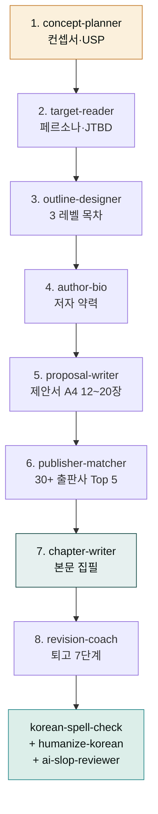

**릴리스 날짜**: 2026-05-17
**버전**: v2.10.0 (MINOR)
**업데이트 명령**: `/plugin marketplace update cowork-plugins`



## Highlights

v2.10.0은 **"신규 플러그인 `moai-book` — 한국 출판사 제출용 원고 풀스택 8 스킬"** 출시입니다. 도서 컨셉서부터 출판사 매칭·본문 집필·퇴고까지 **8 단계 워크플로우를 단일 플러그인**에 통합했습니다.

실용서·인문·기술서·소설 **4 장르 자동 분기**가 모든 스킬에 내장되어, 장르를 한 번만 지정하면 이후 단계가 그 장르의 한국 출판사 컨벤션(어미·시점·문체·인용·표기)을 자동으로 따릅니다. KPIPA 국민독서실태조사·국립국어원 어문규범·도서정가제·교보문고·알라딘 베스트셀러 통합 차트가 데이터 소스로 통합되어 있습니다.

**21 → 22 플러그인 · 147 → 155 스킬 · 동기화 지점 169 → 178**. Breaking change 없음.

## What's New

### moai-book 신규 1 플러그인 + 8 스킬

| 단계 | 스킬 | 핵심 출력 | LOC |
|---|---|---|---|
| 1 | `book-concept-planner` | 한 줄(15자)/30자/300자 요약 + USP 3축 + 포지셔닝 매트릭스 + 자비 vs 투고 의사결정 | 409 |
| 2 | `book-target-reader` | 4축 페르소나(인구·라이프·정체성·소비) + JTBD 3 차원 + 페인 4 분면 + 5인 인터뷰 검증 | 355 |
| 3 | `book-outline-designer` | 부·장·꼭지 3 레벨 트리 + 5요소 시놉시스 + 200자 원고지 분량 배분 + 페르소나 여정 4단계 검증 | 352 |
| 4 | `book-author-bio` | 3 신뢰 신호 + 3 길이(50·200·500자) + 저자의 말 500-800자 + SNS 채널별 변형 | 387 |
| 5 | `book-proposal-writer` | 출판기획서 5섹션 + 샘플 챕터 + 마케팅 플랜 5 카테고리 = A4 12-20장 + D-90/+30/+90 타임라인 | 501 |
| 6 | `book-publisher-matcher` | 30+ 출판사 4 차원 평가(장르 40% · 규모 25% · 계약 20% · 채널 15%) + Top 5 + 차순위 시나리오 | 446 |
| 7 | `book-chapter-writer` | 꼭지 단위 5 요소(훅 10%·본문 70%·클라이맥스 10%·정리 5%·연결 5%) + 4 장르 문체 프리셋 | 382 |
| 8 | `book-revision-coach` | 퇴고 7 단계(어법·문체·논리·인용·분량·시각자료·일관성) + 6 일관성 차원 + 4 체인 검수 순서 | 420 |

총 **3,252 LOC**, **60+ 테스트 케이스**.

### 풀 워크플로우 (8 스킬 + 후처리 체이닝)

```text
book-concept-planner
  → book-target-reader
  → book-outline-designer
  → book-author-bio
  → book-proposal-writer
  → book-publisher-matcher
  → book-chapter-writer
  → book-revision-coach
  → moai-content:korean-spell-check
  → moai-content:humanize-korean       # AI 티 정밀 윤문 (필수)
  → moai-core:ai-slop-reviewer         # 최종 검수 (필수)
```

### 한국 출판 컨텍스트 (2026 기준)

- **KPIPA**: 한국 출판 시장 데이터·국민독서실태조사·표준 양식
- **국립국어원**: 한글 맞춤법·외래어 표기법·우리말 우선 가이드
- **도서정가제**: 신간 18개월 정가 + 최대 10% 가격할인 + 5% 적립
- **베스트셀러 통합**: 교보문고·알라딘·예스24 3사
- **한국 출판사 30+**:
  - IT: 한빛미디어·인사이트·제이펍·길벗 IT
  - 실용: 웅진·다산북스·길벗·메가스터디북스
  - 인문: 민음사·문학동네·창비·휴머니스트·은행나무·돌베개
  - 문학: 문학과지성사·자음과모음
  - 아동: 비룡소·사계절·창비 어린이
- **신인 등단**: 문학동네신인상·창비신인상·민음 신인 발굴 + 한국출판문화상·한국과학기술도서상
- **자비 출판 5 대안**: 부크크(POD)·텀블벅 출판 펀딩·인디고·카카오 브런치북·출판사 자비

## 사용 예시


> AI 영어 회화 앱 운영 후기를 책으로 묶고 싶어. 30·40대 직장인 타깃, 실용서.


→ `book-concept-planner` 자동 호출 → AskUserQuestion(장르: 실용서 / 자비 vs 투고 / 분량) → 컨셉서·USP·포지셔닝 매트릭스 → 다음 단계 `book-target-reader` 자동 체이닝.


> 실용서 원고 다 썼는데 어느 출판사에 보내야 할지 모르겠어.


→ `book-publisher-matcher` 호출 → 장르·분량·저자 약력 입력 → 30+ 출판사 4 차원 평가 → Top 5 우선순위 + D-0/+14/+45/+90 차순위 시나리오 + 협상 포인트 7 체크리스트.

## 비교: moai-research vs moai-book

`moai-research:grant-writer`나 `paper-writer`와 혼동하지 않게 정리합니다.

| 용도 | 권장 플러그인 |
|---|---|
| 정부지원사업 신청서 | `moai-business:kr-gov-grant` |
| 학술 논문 작성 | `moai-research:paper-writer` |
| **한국 출판사 제출용 단행본 원고** | **`moai-book` (신규)** |
| 블로그·뉴스레터 | `moai-content:blog` / `newsletter` |

## Quality

- 8 스킬 4차원 루브릭 자가 평가: 가중 평균 **0.85** (통과 기준 0.70 ✅)
- ai-slop 자체 검수: 8 스킬 모두 **APPROVE**
- frontmatter v2.0.0 정책 준수 (metadata 블록 0건, version 단일 필드)
- vault 외부 참고 자료 원문 비유·표현 직접 인용 0건 — 자체 재구성

## Migration

- **Breaking change 없음** — 신규 플러그인이므로 기존 사용자 영향 없음
- `moai-book` 사용 시 `moai-content`(맞춤법·humanize) + `moai-core`(ai-slop-reviewer) 함께 설치 권장
- 퇴고 단계에서 `humanize-korean` + `ai-slop-reviewer`는 **필수** — AI 티 잔존 시 출판사 거절 사유

## 동기화 지점 (178)

| 범주 | 경로 | 개수 |
|---|---|---|
| 마켓플레이스 | `.claude-plugin/marketplace.json` | 1 |
| 플러그인 매니페스트 | `<plugin>/.claude-plugin/plugin.json` | 22 (moai-book 신규 1 추가) |
| 스킬 frontmatter | `<plugin>/skills/<skill>/SKILL.md` | 155 (moai-book 신규 8 추가) |

## 업그레이드 방법

```bash
# Claude Code
/plugin marketplace update cowork-plugins
# 이후 플러그인 상세 재진입 시 moai-book 노출
# 신규 플러그인이므로 별도 + 버튼으로 활성화 필요
```

기존 워크플로우 그대로 동작합니다. moai-book은 별도 활성화가 필요한 신규 플러그인입니다.

## 관련 문서 & 출처

- **moai-book 플러그인 페이지**: [/plugins/moai-book/](/plugins/moai-book/)
- **GitHub 저장소**: [modu-ai/cowork-plugins/tree/main/moai-book](https://github.com/modu-ai/cowork-plugins/tree/main/moai-book)
- **GitHub 릴리스**: [v2.10.0](https://github.com/modu-ai/cowork-plugins/releases/tag/v2.10.0)
- **CHANGELOG**: [v2.10.0 섹션](https://github.com/modu-ai/cowork-plugins/blob/main/CHANGELOG.md#2100---2026-05-17)
- **KPIPA**: [한국출판문화산업진흥원](https://www.kpipa.or.kr/)
- **국립국어원**: [한글 맞춤법](https://www.korean.go.kr/)
