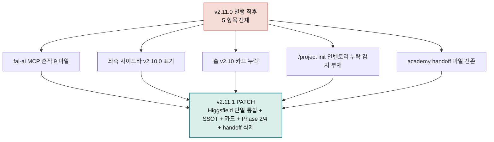

**릴리스 날짜**: 2026-05-18
**버전**: v2.11.1 (PATCH, 최신)
**업데이트 명령**: `/plugin marketplace update cowork-plugins`



## Highlights

v2.11.0 발행 직후 사용자(GOOS)가 발견한 5건의 정정 사항을 묶은 PATCH 릴리스입니다. 사용자 워크플로우 영향은 없습니다 — 모두 표시·문서·메타 영역 정정.

- **fal-ai MCP 완전 제거** — 이미지·영상 직접 생성은 **Higgsfield MCP 단일 통합**. 9 파일 32건 정리
- **`/project init` 강화** — Phase 2 Inventory(cowork-plugins 화이트리스트 필터) + Phase 4 Gap Detection(누락 감지 + 설치 안내) + Re-entry(`/project init resume`)
- **hugo.toml SSOT 도입** — 좌측 사이드바·footer·version-badge 모든 표시 위치가 `[params] version` 한 줄로 자동 반영
- **홈 카드 라벨 정정** — v2.11.0이 두 번 표시되던 것을 v2.10.0(moai-book 8 스킬)로 정정
- **academy handoff 삭제** — 외부 사이트(academy.mo.ai.kr)가 강의 안내를 담당하므로 저장소 내부 문서 불필요

22 플러그인·143 스킬 유지. 동기화 지점 166 → **167** (hugo.toml SSOT 추가). Breaking change 없음.

## What's Changed

### fal-ai → Higgsfield 단일 통합

번들 MCP가 **2종(higgsfield · elevenlabs)**으로 정리됨. fal-ai MCP는 사용하지 않음.

| 사용 영역 | 이전 (v2.11.0 잔재) | 이후 (v2.11.1) |
|---|---|---|
| 이미지 생성 | Higgsfield / fal-ai OR | **Higgsfield 단일** (Soul·DOP·Speak·Character) |
| 영상 생성 | Higgsfield / fal-ai OR | **Higgsfield 단일** |
| 토킹헤드 | Higgsfield Speak | **Higgsfield 단일** |
| 캐릭터 관리 | Higgsfield Character | **Higgsfield 단일** |
| 음성 | ElevenLabs MCP | ElevenLabs MCP (그대로) |
| 번들 MCP | 3종 (higgsfield·elevenlabs·fal-ai) | **2종 (higgsfield·elevenlabs)** |

### `/project init` Phase 2 Inventory (구체 메커니즘)

이전 v2.11.0에서는 "설치된 플러그인 자동 감지" 명세가 추상적이었음. v2.11.1은 구체 메커니즘 도입:

- **cowork-plugins 22 화이트리스트 필터** — `~/.claude/plugins/` 안에서 22 플러그인만 인정. 다른 마켓플레이스 출처 플러그인은 인벤토리 완전 제외
- **모든 SKILL.md 완전 스캔** — 각 cowork 플러그인 안의 모든 `skills/*/SKILL.md` 발견 + `name:` 추출
- **system reminder 교차 검증** — 현재 세션의 user-invocable skills 중 cowork 출처만 필터
- **inventory.json 저장** — `.moai/cache/inventory.json`에 (skill, plugin, confidence) 저장

### `/project init` Phase 4 Gap Detection (신규)

체인 설계 후 누락 플러그인 자동 감지 → AskUserQuestion 4 옵션:

1. (권장) 설치 안내 + 사용자 완료 후 재개 — `/plugin install moai-X` 명령 표시
2. 누락 스킬 제외하고 진행
3. 대체 스킬로 변경
4. 중단

진행 상태는 `.moai/cache/init-progress.json`에 저장. 사용자가 설치 완료 후:

- `/project init resume` 입력 또는
- "이어서 진행" / "설치 완료" 자연어 발화

로 진행 재개 가능.

### hugo.toml SSOT — 좌측 사이드바·footer 자동 반영

```toml
[params]
  # SSOT — 이 두 줄만 갱신하면 모든 표시 위치 자동 반영
  version = "2.11.1"
  releaseDate = "2026-05-18"
```

`layouts/partials/version-badge.html`이 `{{ site.Params.version }}`을 참조하므로 좌측 사이드바·footer·badge 모든 표시 위치가 자동 갱신됩니다.

### 홈 페이지 "최근 릴리스" 카드 정정

이전: v2.11.0 카드가 두 번 표시 (두 번째가 moai-book 내용인데 라벨이 v2.11.0)
이후: v2.11.1 → **v2.11.0** → **v2.10.0** → v2.9.0 → ... 순서

## 사용 예시

```bash
/plugin marketplace update cowork-plugins
```

플러그인 상세 재진입 → v2.11.1·143 스킬·moai-media 4 스킬 표시.


> /project init


→ Phase 1 인터뷰 → **Phase 2 cowork 22 화이트리스트 인벤토리** → Phase 3 체인 설계 → **Phase 4 누락 감지** (누락 시 설치 안내 + Re-entry 명령 표시) → Phase 5-8 진행.


> /project init resume


→ 누락 플러그인 설치 완료 후 진행 재개. `.moai/cache/init-progress.json`에서 이전 상태 복원.

## 업그레이드 방법

1. 마켓플레이스 갱신:

```
/plugin marketplace update cowork-plugins
```

2. 플러그인 상세 재진입 시 v2.11.1 / 143 스킬 / moai-media 4 스킬 / 좌측 사이드바 "MoAI-Cowork 문서 v2.11.1" 표시 확인

3. **호환성** — Breaking change 없음. 기존 워크플로우 그대로 동작합니다.

## 영향 받는 사용자

- **모든 사용자**: 영향 없음 — 기존 워크플로우 그대로 동작
- **`/project init` 사용자**: 이번부터 누락 플러그인 자동 감지 + 설치 안내 흐름 추가
- **이미지·영상 직접 생성 사용자**: Higgsfield MCP 단일 통합 (fal-ai 사용 안 함)

## 동기화 지점 (167)

| 범주 | 경로 | 개수 |
|---|---|---|
| 마켓플레이스 | `.claude-plugin/marketplace.json` | 1 |
| 플러그인 매니페스트 | `<plugin>/.claude-plugin/plugin.json` | 22 |
| 스킬 frontmatter | `<plugin>/skills/<skill>/SKILL.md` | 143 |
| Hugo SSOT | `docs-site/hugo.toml [params] version` | 1 (신규) |

## 관련 문서 & 출처

- [v2.11.0 릴리스 노트](/releases/v2.11/) (이전 MINOR)
- [v2.10.0 릴리스 노트](/releases/v2.10/) (moai-book 신규)
- [moai-media 플러그인 페이지](/plugins/moai-media/) (4 스킬)
- [CHANGELOG](https://github.com/modu-ai/cowork-plugins/blob/main/CHANGELOG.md#2111---2026-05-18)
- GitHub 저장소: [modu-ai/cowork-plugins](https://github.com/modu-ai/cowork-plugins)
