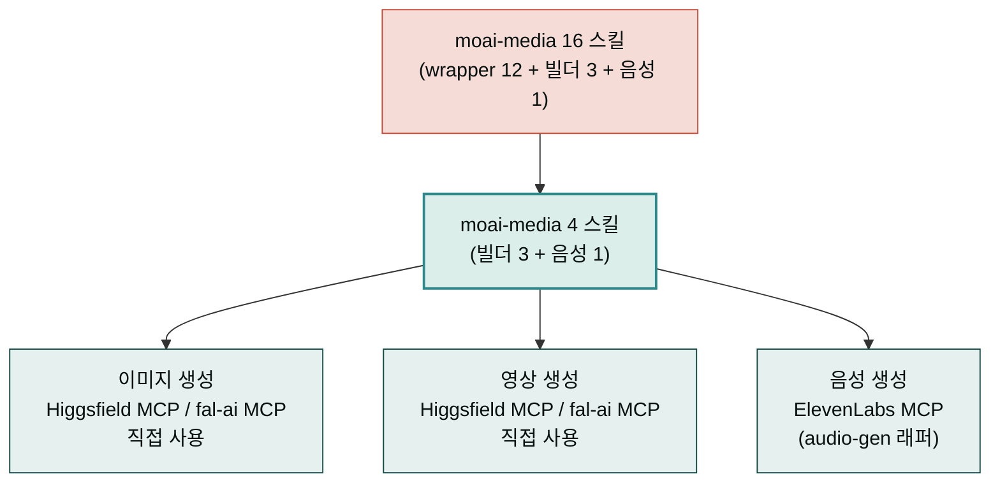

**릴리스 날짜**: 2026-05-18
**버전**: v2.11.0 (MINOR, 최신)
**업데이트 명령**: `/plugin marketplace update cowork-plugins`



## Highlights

v2.11.0은 **"플러그인 책임 경계 재정렬 + docs-site 일관성 정비"** 릴리스입니다.

- **moai-media 16→4 축소** — 이미지·영상·음성 직접 호출 wrapper 12개를 제거하고 외부 MCP(Higgsfield · ElevenLabs · fal-ai) 직접 사용으로 환원. 본 저장소는 **프롬프트 텍스트 빌더 + ElevenLabs 음성**으로 책임 경계를 명확화했습니다.
- **5 플러그인 페이지 재정의** — moai-commerce · moai-media · moai-education · moai-bi · moai-career 각 페이지의 책임 경계와 도메인 카탈로그를 다시 정렬했습니다.
- **docs-site 정비** — 물결 `~` strikethrough 정정 266+ 파일, mermaid 가로→세로 67 파일, 터미널 prompt shortcode 통일, hugo.toml SSOT 도입.

22 플러그인 유지, **155 → 143 스킬**, 동기화 지점 178 → **166**. Breaking change 없음 — 기존 워크플로우 그대로 동작합니다.

## What's Changed

### moai-media 16 → 4 스킬 (12 제거, 4 유지)

| 카테고리 | 유지 스킬 | 책임 |
|---|---|---|
| 이미지 프롬프트 빌더 | `gpt-image-2-prompt` | OpenAI Cookbook 6-Block(Subject·Action·Scene·Composition·Lighting·Style&Text) + 편집 시 Change/Preserve/Constraints 2열 + 다국어(한·일·중·힌·벵골) |
| 이미지 프롬프트 빌더 | `gemini-3-image-prompt` | Google AI 5-component 영문 문장형 + 카메라 하드웨어 지정 + Reference image 14 슬롯 + Search Grounding |
| 이미지 프롬프트 빌더 | `midjourney-v8-prompt` | 키워드+`--파라미터` 구조 + `--sref`/`--oref`/`--cw`/`--p` 3대 reference + 6대 비용 함정 자동 검사 |
| 음성 | `audio-gen` | ElevenLabs MCP — 32개 언어 더빙·BGM·효과음·음성복제 |

**제거된 12 스킬** (외부 MCP가 직접 지원):

- `nano-banana`, `image-gen` — 이미지 생성은 Higgsfield MCP / fal-ai MCP / ChatGPT / Google AI Studio 직접 사용
- `video-gen`, `speech-video` — 영상·토킹헤드는 Higgsfield MCP / fal-ai MCP 직접 사용
- `character-mgmt` — Higgsfield Character / LoRA는 Higgsfield MCP 직접 호출
- `fal-gateway` — fal-ai MCP 직접 호출로 환원
- `media-moodboard`, `media-gpt-image2-builder`, `media-model-router`, `media-channel-ad-packager`, `media-ai-disclosure`, `media-canva-magic-layer` — 책임 경계 정리로 제거

### 5 플러그인 페이지 재정의

| 플러그인 | 변경 후 |
|---|---|
| **moai-commerce** | 35 스킬 도메인 카탈로그(시장조사·JTBD·페르소나·상품명·통합전략 등 9 카테고리)로 재작성 |
| **moai-media** | 이미지 프롬프트 빌더 3종 + audio-gen 4 스킬로 재작성. Higgsfield MCP 단일 통합 |
| **moai-education** | 강사·교수·교사 교육 콘텐츠 풀스택으로 재정의. `course-curriculum-design`은 1일~16주 모든 코스 형식 지원, `course-followup-sequence`는 코스 종료 후 후기 자산화로 일반화 |
| **moai-bi** | `executive-summary` 산출물을 `html-report` 중심으로 재정의. 단일 HTML 파일에 이미지·CSS·JS 모두 인라인 + pdf/docx/pptx/hwpx 변환은 옵션 |
| **moai-career** | 한국 취준생·재직자 2026 채용 데이터 반영(팀핏 면접·핀셋 채용·AI 진정성·4 플랫폼 MAU·헤드헌터 5축·NCS·블라인드) |

### docs-site 일관성 정비

- **물결 strikethrough 사고 정정** — 266+ 파일 1,000+ 변환 (`~문구~` 가독성 깨짐 일괄 정정)
- **mermaid 가로(LR) → 세로(TD) 변환** — 67 파일 77 블록, 모바일 가독성 개선
- **터미널 prompt shortcode 통일** — 모든 터미널 예시에 `` 적용, 첫 행만 `>`로 시작하고 이어지는 줄은 들여쓰기
- **hugo.toml SSOT 도입** — 좌측 사이드바·footer·badge 자동 반영
- **삭제 페이지 정리** — 메뉴·링크 정리

## 사용 예시

기존 워크플로우는 그대로 동작합니다. 이미지·영상이 필요한 경우 외부 MCP를 직접 사용합니다.


> 제품샷 이미지 프롬프트 만들어줘. GPT-image-2용으로.


→ `gpt-image-2-prompt` 자동 호출 → AskUserQuestion(프리셋: 제품샷·인물·일러스트·풍경) → 6-Block 구조 영문 프롬프트 + 3개 모델별 변형 출력 → ChatGPT 또는 OpenAI API에 그대로 복붙.


> 16주 정규 코스 종료 후 후기 자산화 시퀀스 짜줘.


→ `course-followup-sequence` 호출 → AskUserQuestion(코스 형식: 1일·8주·16주·연수) → D+1~D+30 후기 수집 시퀀스 + 채널별 자산화 가이드.

## 업그레이드 방법

```bash
# Claude Code
/plugin marketplace update cowork-plugins
# 이후 플러그인 상세 재진입 시 moai-media 4 스킬로 표시
```

기존에 moai-media wrapper 스킬(`nano-banana`·`image-gen`·`video-gen` 등)을 자연어로 호출하던 워크플로우는 다음 외부 MCP로 환원해 직접 사용하면 됩니다.

| 기존 wrapper | 환원 후 |
|---|---|
| `nano-banana`, `image-gen` (이미지 생성) | Higgsfield MCP `higgsfield.soul.*` / fal-ai MCP / ChatGPT(GPT-image-2) / Google AI Studio(Gemini 3 Pro Image) |
| `video-gen` (영상 생성) | Higgsfield MCP `higgsfield.dop.*` / fal-ai MCP (Kling·Veo·Hailuo·Luma·Pika) |
| `speech-video` (토킹헤드) | Higgsfield MCP `higgsfield.speak.*` |
| `character-mgmt` (캐릭터 관리) | Higgsfield MCP `higgsfield.character.*` |
| `fal-gateway` (fal.ai 통합) | fal-ai MCP 직접 호출 |
| `media-*` wrapper | 외부 MCP + 프롬프트 빌더 3종 조합 |

번들 MCP 3종(`fal-ai` · `elevenlabs` · `higgsfield`)은 v2.6.0부터 포함되어 있어 사용자 측 추가 설치는 불필요합니다.

## 영향 받는 사용자

- **moai-media 미사용자**: 영향 없음 — 기존 워크플로우 그대로
- **moai-media wrapper 직접 호출하던 사용자**: 위 환원 표대로 외부 MCP 직접 호출로 전환. v2.6.0부터 번들된 MCP를 사용하므로 추가 설치 없음
- **docs-site 즐겨찾기 사용자**: 삭제된 페이지는 메뉴에서 제거됨. 다른 페이지는 그대로

## 동기화 지점 (166)

| 범주 | 경로 | 개수 |
|---|---|---|
| 마켓플레이스 | `.claude-plugin/marketplace.json` | 1 |
| 플러그인 매니페스트 | `<plugin>/.claude-plugin/plugin.json` | 22 |
| 스킬 frontmatter | `<plugin>/skills/<skill>/SKILL.md` | 143 (moai-media 16→4 = -12) |

## 관련 문서 & 출처

- **moai-media 플러그인 페이지**: [/plugins/moai-media/](/plugins/moai-media/)
- **moai-education 플러그인 페이지**: [/plugins/moai-education/](/plugins/moai-education/)
- **moai-career 플러그인 페이지**: [/plugins/moai-career/](/plugins/moai-career/)
- **moai-bi 플러그인 페이지**: [/plugins/moai-bi/](/plugins/moai-bi/)
- **moai-commerce 플러그인 페이지**: [/plugins/moai-commerce/](/plugins/moai-commerce/)
- **GitHub 저장소**: [modu-ai/cowork-plugins](https://github.com/modu-ai/cowork-plugins)
- **GitHub 릴리스**: [v2.11.0](https://github.com/modu-ai/cowork-plugins/releases/tag/v2.11.0)
- **CHANGELOG**: [v2.11.0 섹션](https://github.com/modu-ai/cowork-plugins/blob/main/CHANGELOG.md#2110---2026-05-18)
- **외부 MCP 참고**:
  - Higgsfield: [higgsfield.ai](https://higgsfield.ai/)
  - ElevenLabs: [elevenlabs.io](https://elevenlabs.io/)
  - fal.ai: [fal.ai](https://fal.ai/)
