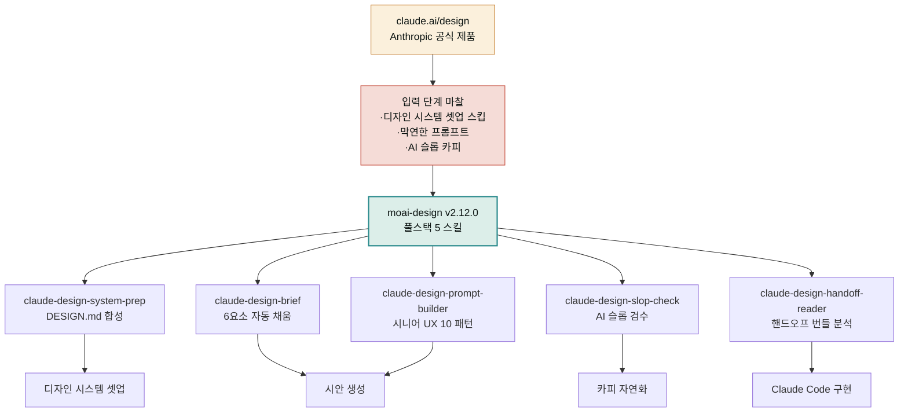

**릴리스 날짜**: 2026-05-20
**버전**: v2.12.0 (MINOR, 최신)
**업데이트 명령**: `/plugin marketplace update cowork-plugins`



## Highlights

Anthropic이 2026-04-17에 출시한 [Claude Design](https://claude.ai/design)을 한국 사용자가 더 잘 쓸 수 있게 받쳐 주는 신규 플러그인을 도입했습니다. 더불어 docs-site에 클로드 디자인 섹션 10페이지(개요 + 9 상세)를 함께 신설했습니다.

- **신규 플러그인 `moai-design`** — Claude Design 보조 풀스택 5 스킬
- **docs-site 클로드 디자인 섹션 10페이지** — 한국어 진입점 (코워크와 플러그인 사이 top-level 섹션)
- 22 → **23 플러그인** · 143 → **148 스킬** · 동기화 지점 167 → **172**
- Breaking change 없음

## What's New

### 신규 플러그인: moai-design

[claude.ai/design](https://claude.ai/design)에서 디자인을 만들 때 그 앞과 뒤를 받쳐 주는 5개 스킬:

| 스킬 | 사용 시점 | 핵심 결과물 |
|---|---|---|
| **claude-design-brief** | Claude Design 프롬프트 작성 단계 | 6요소(Project·Audience·Pages·Tone·Reference·Constraints) 복붙용 프롬프트 + AI 슬롭 회피 블록 자동 포함 |
| **claude-design-system-prep** | 디자인 시스템 셋업 직전 | 브랜드 자산(코드·Figma·실물·사전 빌트인 5 유형) → DESIGN.md 합성 + 업로드 가이드 |
| **claude-design-prompt-builder** | 특정 UX 영역 작업 | 시니어 UX 10 패턴(IA·리서치·디자인 시스템·카피·온보딩·휴리스틱·대시보드·접근성·폼·테스트) 중 자동 선택 + 완성된 프롬프트 |
| **claude-design-handoff-reader** | Claude Code 인계 직전 | 핸드오프 번들(README·design-tokens·components·layout·chat-history) 분석 요약 + Claude Code 지시 1줄 |
| **claude-design-slop-check** | 결과 카피 검수 | 영문(Reimagine your·Unleash your)·한국어(혁신적인·차세대) 슬롭 패턴 검출 + 수정 대안 3개 |

### docs-site 클로드 디자인 섹션 10페이지

코워크와 플러그인 사이 top-level 섹션에 한국어 가이드 10페이지 신설:

| 페이지 | 내용 |
|---|---|
| [개요](../../claude-design/) | 학습 경로·작동 방식·역할별 추천 |
| [시작하기](../../claude-design/getting-started/) | 입력 4종·첫 프롬프트 6요소·Hello World 5종·30분 워크플로우 |
| [디자인 시스템 설정](../../claude-design/design-system/) ★ | 자산 5종·6단계 셋업·Figma·GitHub·CSS 토큰·멀티 시스템·Published 토글 |
| [리파인먼트](../../claude-design/refinement/) | 4가지 조작·컨텍스트 누적·AI 슬롭 회피·시니어 UX 10 패턴 |
| [협업과 공유](../../claude-design/collaboration/) | Org-scoped 공유·3권한·그룹 대화·데이터 거버넌스 |
| [내보내기·핸드오프](../../claude-design/export-handoff/) | 6 출력 형식·핸드오프 번들 내부 구조 |
| [역할별 사용 사례](../../claude-design/use-cases/) | 창업자·PM·디자이너·마케터 + 한국 SaaS·D2C·어드민 시나리오 |
| [베스트 프랙티스](../../claude-design/best-practices/) | 10대 원칙·통합 프롬프트 템플릿·보안 체크리스트 |
| [요금제와 한도](../../claude-design/pricing-limits/) | Pro·Max·Team·Enterprise + RBAC 4단계 롤아웃 |
| [제한 사항·로드맵](../../claude-design/limitations/) | Research Preview·9 제한·v0·Lovable·Bolt 비교 |

### 사용 예시 프롬프트

다음을 그대로 Cowork에서 입력해 보세요.

```
"우리 SaaS 가격 페이지 시안을 Claude Design으로 만들고 싶어. 브리프 작성 도와줘"
"우리 회사 브랜드 자산을 모아서 Claude Design 디자인 시스템 셋업 준비해 줘"
"접근성 점검을 Claude Design에서 하고 싶다. 시니어 컨설턴트 프롬프트 만들어 줘"
"Claude Design 결과 카피에서 AI 티 검수해 줘"
"Claude Code 핸드오프 번들 받았는데 어떻게 해야 할지 분석해 줘"
```

## Changed

- `marketplace.json` `metadata.description` 갱신 (v2.12.0 highlights 추가, plugins[] 배열에 moai-design)
- `metadata.version`: 2.11.1 → 2.12.0
- 모든 `plugin.json` · `SKILL.md` `version` 필드: 2.11.1 → 2.12.0 일괄 bump (164 → 172 지점)
- docs-site 갱신: `hugo.toml [params] version`, `_index.md`, `plugins/_index.md`, `releases/_index.md`, `data/menu/main.yaml`
- 좌측 사이드바: 코워크 ↘ **클로드 디자인** ↘ 플러그인 ↘ 클로드 디자인 보조(moai-design)

## Fixed

해당 없음 (PATCH 사항 없음 — MINOR 신규 추가)

## Removed

해당 없음

## 업그레이드 방법

```bash
/plugin marketplace update cowork-plugins
```

업데이트 후 플러그인 상세 페이지를 다시 진입하면 새로운 `moai-design` 플러그인이 보입니다. 기존 워크플로우는 그대로 동작합니다.

### 추가 활성화 (선택)

`moai-design` 플러그인을 사용하려면 마켓플레이스에서 별도로 활성화하세요. 기본은 비활성 상태입니다.

## 호환성

- **Breaking change 없음**: 기존 플러그인·스킬은 모두 그대로 동작
- **버전 동기화**: marketplace.json + 23 plugin.json + 148 SKILL.md = 172 지점 모두 v2.12.0
- **새 스킬 활용**: Cowork 채팅에서 `/claude-design-brief` 등 슬래시 자동완성으로 호출 가능

## 동기화 지점 카운트

| 범주 | 지점 수 | 변화 |
|---|---|---|
| marketplace.json | 1 | 유지 |
| plugin.json | 23 | +1 (moai-design) |
| SKILL.md frontmatter version | 148 | +5 |
| hugo.toml `[params] version` SSOT | 1 | 유지 |
| **합계** | **173** | 167 → 173 |

## 관련 문서 & 출처

- [클로드 디자인 섹션 (이 docs-site의 10 페이지 가이드)](../../claude-design/)
- [moai-design 플러그인 상세 페이지](../../plugins/moai-design/)
- [Introducing Claude Design by Anthropic Labs](https://www.anthropic.com/news/claude-design-anthropic-labs)
- [Using Claude Design for prototypes and UX](https://claude.com/resources/tutorials/using-claude-design-for-prototypes-and-ux)
- [Set up your design system in Claude Design](https://support.claude.com/en/articles/14604397-set-up-your-design-system-in-claude-design)
- [Claude Design admin guide](https://support.claude.com/en/articles/14604406-claude-design-admin-guide-for-team-and-enterprise-plans)
- [GitHub — moai-design 플러그인 소스](https://github.com/modu-ai/cowork-plugins/tree/main/moai-design)
