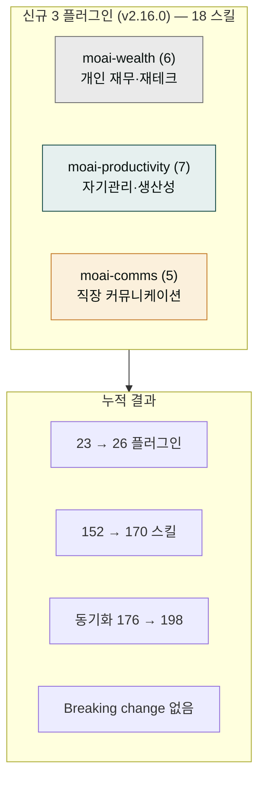

**릴리스 날짜**: 2026-06-13
**버전**: v2.16.0 (MINOR, 최신)
**업데이트 명령**: `/plugin marketplace update cowork-plugins`



## Highlights

v2.16.0은 **개인·일잘러(직장인) 도메인 3종 신규** 출시입니다. 그동안 cowork-plugins는 사업계획·이커머스·법무·세무 같은 **업무 산출물** 도메인이 두터웠던 반면, 직장인 개인이 매일 부딪히는 재무·자기관리·소통 영역은 비어 있었습니다. vault 분석으로 이 커버리지 공백을 확인하고 세 플러그인으로 충전했습니다.

- **moai-wealth** — 직장인 개인 자산관리(재테크 로드맵·가계부·투자·보험·연말정산·경제지표). 법인 세무 [`moai-finance`](../../plugins/moai-finance/)와 역할 분리.
- **moai-productivity** — 자기관리·생산성(회고·목표·시간·습관·자기돌봄·노션·주간보고). 팀 PM [`moai-product`](../../plugins/moai-product/)와 역할 분리.
- **moai-comms** — 직장 대인 커뮤니케이션(보고·회의·피드백·갈등·면담·협상). 공식 인사 [`moai-hr`](../../plugins/moai-hr/)·문서 [`moai-content`](../../plugins/moai-content/)와 역할 분리.

마켓플레이스 23 → **26 플러그인**, 152 → **170 스킬**. 동기화 지점 176 → **198**. Breaking change 없음.

## What's New

### moai-wealth — 개인 재무·재테크 (6 스킬)

- **플러그인 페이지**: [/plugins/moai-wealth/](../../plugins/moai-wealth/)
- **GitHub 디렉터리**: [moai-wealth](https://github.com/modu-ai/cowork-plugins/tree/main/moai-wealth)

직장인·1인 가구·사회초년생의 개인 자산관리 전반을 2026년 한국 기준으로 안내합니다.

| 스킬 | 핵심 기능 |
|---|---|
| `wealth-roadmap` | 재무 현황 진단 → 목표 설정 → 종잣돈 단계 → 자산 배분 → 자동화 5단계 로드맵 |
| `household-budget` | 통장 쪼개기·50/30/20 예산·소비 회고 루틴·새는 돈 찾기 |
| `invest-primer` | 분산·장기·리스크 원칙, 자산군 입문, 초보 포트폴리오, 투자 사기 회피 |
| `insurance-fit` | 필요 보험 진단(실손·암·종신·연금), 과보험 점검, 생애주기 리모델링 |
| `personal-tax-saver` | 근로자 연말정산 절세 — 소득공제 vs 세액공제, 환급 극대화 |
| `econ-literacy` | 금리·환율·물가·GDP·고용 지표를 내 자산 관점에서 읽기 |


**개인 재무 면책 고지**: 본 플러그인은 일반적인 재무 정보·교육 목적이며, 공인 투자·세무 자문을 대체하지 않습니다. 구체적 결정은 자격을 갖춘 전문가와 상담하세요.


### moai-productivity — 자기관리·생산성 (7 스킬)

- **플러그인 페이지**: [/plugins/moai-productivity/](../../plugins/moai-productivity/)
- **GitHub 디렉터리**: [moai-productivity](https://github.com/modu-ai/cowork-plugins/tree/main/moai-productivity)

회고·목표·시간·습관·자기돌봄·노션·주간보고까지 개인 생산성 전반을 다룹니다.

| 스킬 | 핵심 기능 |
|---|---|
| `goal-planner` | 12주 계획·만다라트·개인 OKR·신년 목표 로드맵. 목표를 루틴으로 전환 |
| `retro-builder` | 주간·연간 회고 — KPT·한 줄 회고·키워드 회고. 가볍게 돌아보기 |
| `time-system` | 블록식스·덩어리 시간·우선순위·야근 줄이기·주간 계획 |
| `habit-routine` | 작심3일 극복·모닝 루틴·습관 트래커·꾸준함의 구조 |
| `self-care` | 번아웃·자기돌봄 — 마음 기초체력·회복 루틴·멘탈 관리 |
| `notion-template-kit` | 노션 올인원 업무관리·대시보드·목표/회고 템플릿 구조 설계 |
| `weekly-report` | 직장 주간업무보고(격식체·구어체) — 기존 `moai-pm/weekly-report` 흡수 |

### moai-comms — 직장 커뮤니케이션·소프트스킬 (5 스킬)

- **플러그인 페이지**: [/plugins/moai-comms/](../../plugins/moai-comms/)
- **GitHub 디렉터리**: [moai-comms](https://github.com/modu-ai/cowork-plugins/tree/main/moai-comms)

기술이 아니라 태도와 구조로 풀어가는 직장 대인 커뮤니케이션 소프트스킬 모음입니다.

| 스킬 | 핵심 기능 |
|---|---|
| `report-speak` | 결론 먼저·두괄식 보고, 상사 유형별 보고, 상대 뇌에 꽂히는 설명 |
| `meeting-facilitator` | 아젠다 설계, 산으로 가는 회의 방지, 의사결정·회의록·후속 액션 |
| `feedback-loop` | 부정적 피드백 소화, 건설적 피드백 전달(SBI), 중간 피드백 요청 |
| `conflict-handler` | 소통빌런 유형별 대응, 정중한 거절, 감정 분리, 거리 두기 |
| `negotiation-1on1` | 1:1 면담 준비, 설득 구조 설계, 요청·부탁·정중한 거절, 협상 |

## Changed

- 마켓플레이스 플러그인 카운트: 23 → **26** (+3 신규)
- 마켓플레이스 스킬 카운트: 152 → **170** (+18 신규)
- 동기화 지점: 176 → **198** (marketplace 1 + plugin.json 24 + SKILL.md 170 + hugo.toml SSOT 등)
- `marketplace.json` `plugins[]` 배열에 `moai-wealth`·`moai-productivity`·`moai-comms` 3종 추가
- 루트 README 배지(Version 2.16.0 · Plugins 26 · Skills 170) + 하이라이트 섹션
- docs-site `_index.md`·`plugins/_index.md` 카탈로그·카운트 갱신 + 신규 3 플러그인 페이지

## Fixed

해당 없음.

## Removed

해당 없음. Breaking change 없음 — 기존 워크플로우 그대로 동작.

## 업그레이드 방법

1. **마켓플레이스 캐시 갱신**:

   ```text
   /plugin marketplace update cowork-plugins
   ```

2. **신규 3 플러그인 설치** — `moai-wealth`·`moai-productivity`·`moai-comms`는 별도 활성화가 필요합니다. 마켓플레이스 상세에서 각 플러그인 옆 **+** 버튼을 누르세요.

3. **별도 API 키 불필요** — 세 플러그인 모두 외부 API 키 없이 동작합니다.

기존 워크플로우(v2.15.0까지)는 그대로 동작합니다. 신규 스킬을 켜지 않아도 기존 23개 플러그인 동작에는 영향이 없습니다.

## 사용 예시

```text
> 사회초년생인데 재테크 어떻게 시작해야 할지 로드맵 짜줘
→ moai-wealth/wealth-roadmap → 현황 진단 → 종잣돈 단계 → 자산 배분 → 자동화 로드맵
```

```text
> 신년 목표 세웠는데 12주 계획법으로 실천 가능하게 쪼개줘
→ moai-productivity/goal-planner → 12주 압축 → 주간 마일스톤 → 루틴 연결
```

```text
> 내일 팀장님한테 프로젝트 지연 보고해야 하는데 어떻게 말해야 깔끔할까?
→ moai-comms/report-speak → 두괄식 결론 구조 → 상사 유형별 톤 → 30초 보고 스크립트
```

```text
> 연말정산 환급 더 받으려면 12월 전에 뭘 챙겨야 해?
→ moai-wealth/personal-tax-saver → 소득공제 vs 세액공제 → 항목별 공제 전략
```

## 관련 문서 & 출처

- **CHANGELOG**: [전체 변경 사항](https://github.com/modu-ai/cowork-plugins/blob/main/CHANGELOG.md)
- **moai-wealth 플러그인 페이지**: [/plugins/moai-wealth/](../../plugins/moai-wealth/)
- **moai-productivity 플러그인 페이지**: [/plugins/moai-productivity/](../../plugins/moai-productivity/)
- **moai-comms 플러그인 페이지**: [/plugins/moai-comms/](../../plugins/moai-comms/)
- **이전 릴리스 노트**: [v2.15.0](../v2.15/) · [v2.14.0](../v2.14/) · [v2.13.0](../v2.13/)
