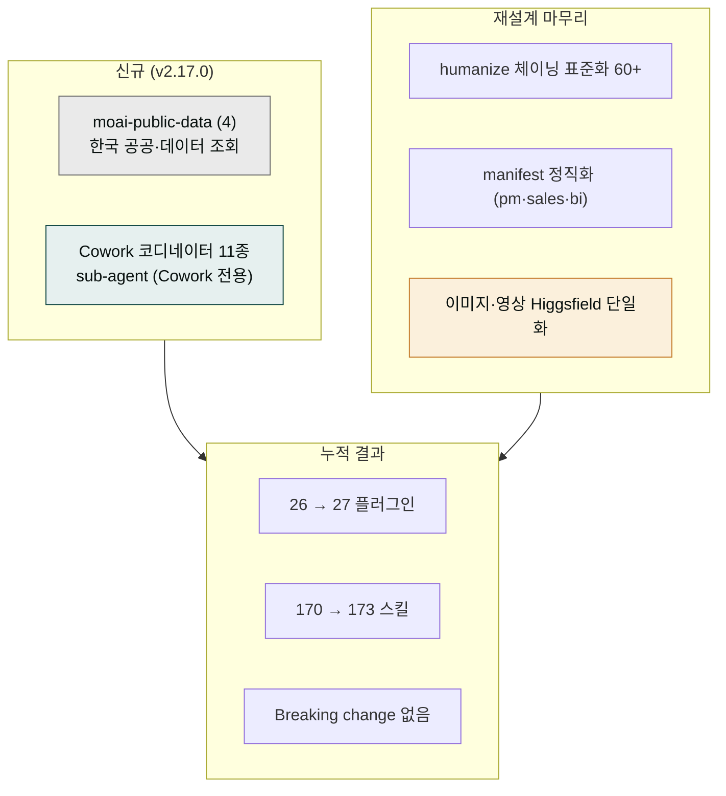

**릴리스 날짜**: 2026-06-14
**버전**: v2.17.0 (MINOR, 최신)
**업데이트 명령**: `/plugin marketplace update cowork-plugins`



## Highlights

v2.17.0은 **Cowork-fit 재설계의 마무리** 릴리스입니다. 한국 공공·데이터 조회를 한곳에 모은 신규 플러그인 **moai-public-data**를 추가하고, Cowork(Claude Cowork) 전용 **코디네이터 sub-agent 11종**으로 여러 스킬을 잇는 복합 워크플로우를 한 번에 실행할 수 있게 했습니다. 동시에 60여 개 스킬의 윤문 체이닝을 표준화하고, 설명·트리거 문구를 일관된 형식으로 정리하며, 일부 플러그인의 매니페스트를 실제 제공 범위에 맞춰 정직하게 다듬었습니다.

- **moai-public-data** — KRX 종목·법원경매·국토부 실거래가·공공데이터포털/KOSIS 조회를 한 플러그인에 통합. 별도 API 키 없이 read-only 조회.
- **Cowork 코디네이터 sub-agent 11종** — 상품 출시·상세페이지·원고 집필·사업계획·채용·법무 검토·메타 광고·미디어 파이프라인·문의 일괄 분류·UX 점검·재무 리포트 조립을 여러 스킬 체인으로 묶어 실행하는 Cowork 전용 에이전트.
- **체이닝 표준화 + manifest 정직화** — 60여 스킬에 `ai-slop-reviewer → humanize-korean` 후처리 체인을 표준 적용, 설명·트리거 문구 정리, moai-pm·moai-sales·moai-bi 매니페스트를 실제 제공 스킬 범위로 정직화.

마켓플레이스 26 → **27 플러그인**, 170 → **173 스킬**. Breaking change 없음.


**Cowork 전용 기능 안내**: sub-agent는 Claude Cowork·Claude Code 환경에서 동작합니다. 일반 Claude 채팅에서는 스킬만 사용할 수 있으며, 코디네이터 sub-agent와 hooks는 표시되지 않습니다(회색 처리).


## What's New

### moai-public-data — 한국 공공·데이터 조회 (4 스킬)

- **플러그인 페이지**: [/plugins/moai-public-data/](../../plugins/moai-public-data/)
- **GitHub 디렉터리**: [moai-public-data](https://github.com/modu-ai/cowork-plugins/tree/main/moai-public-data)

흩어져 있던 한국 공공·시세 조회 기능을 조회 전담 플러그인 하나로 모았습니다. 모두 read-only이며 별도 API 키 발급이 필요 없습니다.

| 스킬 | 핵심 기능 |
|---|---|
| `korean-stock-search` | KRX(한국거래소) 상장 종목 검색 + 종목 기본정보·일별 시세 조회 (read-only 일별 snapshot) |
| `court-auction-search` | 대법원 법원경매정보 부동산 매각공고를 매각기일·법원·기준으로 조회, 사건번호 단건 직접 조회 |
| `real-estate-search` | 국토교통부 실거래가로 아파트·오피스텔·연립다세대·단독다가구·상업업무용 매매·전월세 시세 조회 |
| `public-data` | 공공데이터포털(data.go.kr)·KOSIS 통계청 실시간 통계 조회·분석 |


**조회 면책 고지**: 본 플러그인의 시세·통계 조회 결과는 정보 제공 목적이며, 투자 자문이 아닙니다. 실시간 호가·체결은 제공하지 않습니다. 실제 거래·투자 결정은 공식 출처와 전문가 확인을 거치세요.


### Cowork 코디네이터 sub-agent 11종 (Cowork 전용)

여러 스킬을 순서대로 잇는 복합 워크플로우를 한 번의 요청으로 실행하는 Cowork 전용 코디네이터입니다. 각 플러그인의 핵심 스킬 체인을 자동으로 호출합니다.

| 코디네이터 | 묶는 워크플로우 |
|---|---|
| `commerce-launch` | 상품 출시 — 시장조사·상품명·채널 메시지·통합 전략 체인 |
| `detail-page-orchestrator` | 상세페이지 기획·카피·이미지 프롬프트 일괄 |
| `book-manuscript` | 도서 원고 — 컨셉서·목차·본문·퇴고 풀스택 체인 |
| `business-plan` | 사업계획 — 전략·문서·검수 체인 |
| `hiring` | 채용 — 공고·평가·면접·온보딩 묶음 |
| `legal-review` | 법무 검토 — 계약서·NDA·컴플라이언스 일괄 검토 |
| `meta-ads` | 메타 광고 — 운영·분석·보고 체인 |
| `media-pipeline` | 미디어 — 이미지·영상·음성 생성 파이프라인 |
| `ticket-triage-batch` | 고객 문의 일괄 분류·응대 초안 |
| `ux-audit` | 제품 UX 점검 묶음 |
| `finance-report-assembler` | 재무 리포트 조립 — 데이터·요약·검수 체인 |

## Changed

- 마켓플레이스 플러그인 카운트: 26 → **27** (+1 신규 moai-public-data)
- 마켓플레이스 스킬 카운트: 170 → **173** (+3 순증)
- **체이닝 표준화** — 60여 텍스트 산출물 스킬에 `ai-slop-reviewer → humanize-korean` 후처리 체인을 표준 적용
- **설명·트리거 STANDARD 정리** — 스킬 `description`과 트리거 문구를 일관된 형식으로 통일
- **manifest 정직화** — moai-pm·moai-sales·moai-bi의 플러그인 설명을 실제 제공 스킬 범위에 맞춰 정직하게 조정(과장된 로드맵 표기 정리)
- **taxonomy 정리** — 도메인 분류 정돈
- **Connector D(OpenAI) 제거 → Higgsfield 단일** — 이미지·영상 직접 생성은 Higgsfield MCP 단일 통합으로 정리
- **WordPress 발행 wiring** — 콘텐츠 발행 경로 연결

## Fixed

- 일부 플러그인 매니페스트와 실제 제공 스킬 범위 불일치 정정(정직화).

## Removed

- **Connector D(OpenAI) 경로 제거** — 이미지·영상 직접 생성은 Higgsfield MCP 단일로 환원. 기존 워크플로우는 Higgsfield 경로로 그대로 동작.

## 업그레이드 방법

1. **마켓플레이스 캐시 갱신**:

   ```text
   /plugin marketplace update cowork-plugins
   ```

2. **신규 플러그인 설치** — `moai-public-data`는 별도 활성화가 필요합니다. 마켓플레이스 상세에서 플러그인 옆 **+** 버튼을 누르세요.

3. **별도 API 키 불필요** — `moai-public-data`의 4개 조회 스킬은 모두 외부 API 키 없이 동작합니다.

4. **Cowork 코디네이터 sub-agent** — Claude Cowork·Claude Code 환경에서 자동으로 인식됩니다. 별도 설정이 필요 없습니다.

기존 워크플로우(v2.16.0까지)는 그대로 동작합니다. 신규 플러그인을 켜지 않아도 기존 26개 플러그인 동작에는 영향이 없습니다.

## 사용 예시

```text
> 잠실 리센츠 2024년 매매 실거래가 찾아줘
→ moai-public-data/real-estate-search → 국토부 실거래가 조회 → 단지·면적별 매매가 정리
```

```text
> 삼성전자 최근 일별 시세 조회해줘
→ moai-public-data/korean-stock-search → KRX 종목 검색 → 일별 snapshot 시세
```

```text
> 상품 출시 준비 처음부터 끝까지 한 번에 도와줘
→ commerce-launch 코디네이터 → 시장조사 → 상품명 → 채널 메시지 → 통합 전략 체인
```

```text
> 우리 회사 분기 재무 리포트 조립해줘
→ finance-report-assembler 코디네이터 → 데이터 → 요약 → 검수 체인
```

## 관련 문서 & 출처

- **CHANGELOG**: [전체 변경 사항](https://github.com/modu-ai/cowork-plugins/blob/main/CHANGELOG.md)
- **moai-public-data 플러그인 페이지**: [/plugins/moai-public-data/](../../plugins/moai-public-data/)
- **이전 릴리스 노트**: [v2.16.0](../v2.16/) · [v2.15.0](../v2.15/) · [v2.14.0](../v2.14/)
- **국토교통부 실거래가**: [실거래가 공개시스템](https://rt.molit.go.kr/)
- **대법원 법원경매정보**: [courtauction.go.kr](https://www.courtauction.go.kr/)
- **공공데이터포털**: [data.go.kr](https://www.data.go.kr/) · KOSIS 국가통계포털
