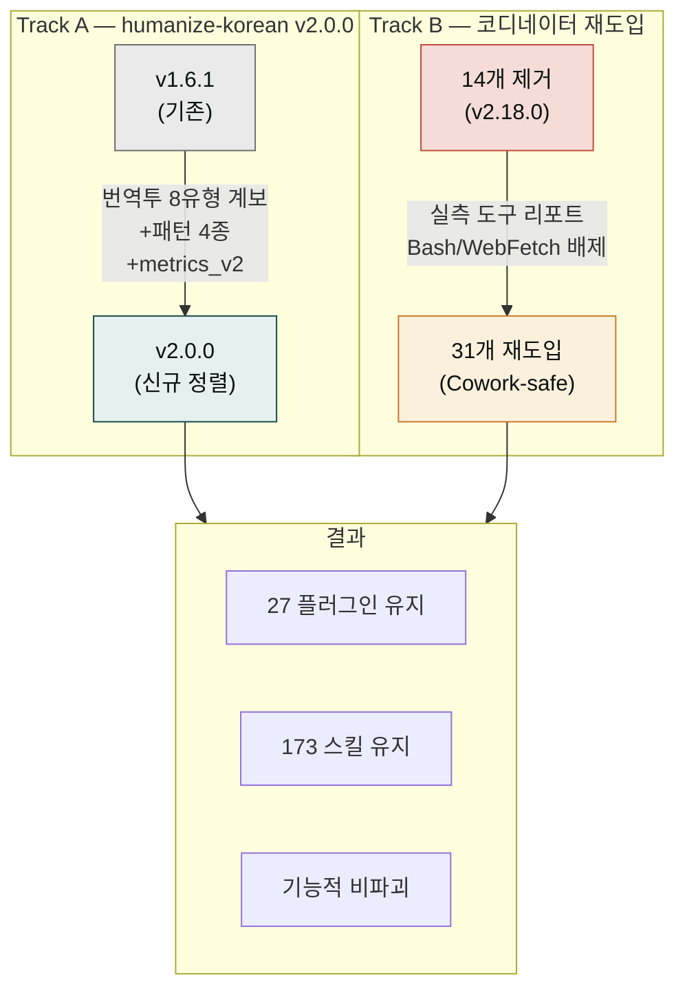

**릴리스 날짜**: 2026-06-15
**버전**: v2.19.0 (MINOR)
**업데이트 명령**: `/plugin marketplace update cowork-plugins`



## Highlights

v2.19.0은 두 갈래 통합 릴리스입니다.

**Track A**: `moai-content:humanize-korean`을 upstream [epoko77-ai/im-not-ai](https://github.com/epoko77-ai/im-not-ai) v1.6.1 → v2.0.0으로 정렬했습니다. 한국 번역학계가 정립한 8유형 번역투 계보를 분류 체계에 통합하고, 신규 패턴 4종(A-16·A-18·A-19·E-7)과 post-editese 14메트릭 레이어를 추가했습니다. 22→24 테스트 전부 PASS.

**Track B**: v2.18.0에서 제거했던 플러그인 번들 코디네이터를 **Cowork-safe 형태로 선별 재도입**했습니다. 플러그인 서브에이전트의 실측 리포트(Read/Grep/Glob/Write/Edit/WebSearch 동작, Bash·WebFetch 미동작)를 근거로, 도구 제약에 맞는 31개를 24 플러그인에 부착했습니다. v2.18.0 `/project` Agent Synthesis와 공존합니다.

카운트 **27 플러그인 / 173 스킬 유지**(변동 없음). Breaking change 없음.


**기존 워크플로우 그대로 동작합니다**: 스킬 수·플러그인 수가 변동 없으며, 재도입된 코디네이터는 기존 체인에 추가적인 편의를 제공합니다. humanize-korean 업데이트는 하위 호환 — 기존 호출이 그대로 동작하며 새 패턴과 메트릭은 옵션 레이어입니다.


## What's New

### humanize-korean — 신규 패턴 4종

| 패턴 ID | 유형 | 심각도 | 설명 |
|---------|------|--------|------|
| A-16 | 영어 대명사 직역 | S1 | "그것은", "이것은" 식 대명사 과잉 직역 |
| A-18 | 관계절 좌향 수식 | S2 | 영어식 관계절을 한국어 앞수식으로 그대로 배치 |
| A-19 | 이중 조사 결합 | S2 | "에서의", "으로부터의" 식 이중 조사 |
| E-7 | 청자 경어법 일관성 손실 | S2 | 문장마다 경어 레벨이 일관되지 않음 |

A-17(무정물 '-들' 부착)은 외부 회차 양성 0건 → v2.1 재평가로 hold.

### post-editese 메트릭 레이어

- `references/metrics_v2.py` — 번역투 14개 정량 신호. simplification·normalisation·interference 3축. Python 표준 라이브러리만 사용.
- `references/baseline_v2.json` — 5장르 placeholder 임계값.
- `references/scholarship.md` — 한국 번역학계 8유형 출처(Baker·Toury·Toral) + caveat 6건.

### Cowork-safe 코디네이터 31개

24 플러그인에 `moai-*/agents/` 코디네이터를 부착했습니다. 선별 기준: 멀티스텝 체인·배치·QA가 필요한 고가치 스킬 클러스터. 단일 스킬 플러그인(bi·lifestyle·pm)은 의도적 제외.

- **도구 구성**: Read · Grep · Glob · Write · Edit · WebSearch (Bash·WebFetch 배제 — Cowork 서브에이전트 미지원)
- **텍스트 산출 마감**: 모든 텍스트 출력 체인은 `moai-core:ai-slop-reviewer → moai-content:humanize-korean`으로 종료
- **분포**: commerce 4 · marketing 3 · business·content 각 2 · 그 외 18 플러그인 1개씩

## Changed

- **humanize-korean 분류 체계 v1.6 → v2.0** — `ai-tell-taxonomy.md` 머리말에 8유형 번역투 계보 통합. `quick-rules.md`·`rewriting-playbook.md`(PE 통합 체크리스트 15항목)·`SKILL.md`(attribution v2.0.0, Phase 2 post-editese 옵션, 런타임 배너 정리) 동기화.
- **전체 버전 동기화 2.18.0 → 2.19.0** — marketplace.json + 27 plugin.json + 173 SKILL.md.

## Fixed

- **humanize-korean `tests/test_metrics.py` 경로 복구** — v1.6.1 verbatim 포팅 시 upstream 레이아웃(`.claude/skills/...`)이 cowork 레이아웃(`moai-content/skills/...`)으로 적응되지 않아 `import metrics` 실패하던 사전 결함 수정(22 테스트 전부 실행·통과).

## Migration

- **v2.18.0의 `/project` Agent Synthesis는 그대로 유지됩니다**. 이번 플러그인 번들 에이전트는 마켓플레이스 기본 제공 코디네이터로, 사용자 프로젝트 맞춤 에이전트와 공존합니다.
- 플러그인 에이전트는 Cowork에서 자동 노출됩니다(설치 버전 갱신 후). 셸 실행·웹페이지 fetch가 필요한 작업은 부모 세션이 담당합니다.
- **카운트 변동 없음** — 27 플러그인 / 173 스킬 그대로입니다.

## 업그레이드 방법

1. **마켓플레이스 캐시 갱신**:

   ```text
   /plugin marketplace update cowork-plugins
   ```

2. **플러그인 상세 재진입** — 업데이트 후 플러그인 상세 페이지를 다시 열어 새 버전(v2.19.0)이 반영됐는지 확인하세요.

3. **API 키 재등록 불필요** — 이번 릴리스는 커넥터·키 정책을 바꾸지 않습니다.

기존 워크플로우(v2.18.0까지)는 그대로 동작합니다.

## 사용 예시

```text
> 이 문장 번역투 느낌이 있는지 봐줘, 있으면 고쳐줘
→ humanize-korean v2.0 → A-16·A-18·A-19·E-7 패턴 포함 전수 점검 → 등급 판정 → 수정본
```

```text
> 사업계획서 처음부터 끝까지 만들어줘
→ moai-business 코디네이터 → strategy-planner → docx-generator → ai-slop-reviewer → humanize-korean
```

## 관련 문서 & 출처

- **CHANGELOG**: [전체 변경 사항](https://github.com/modu-ai/cowork-plugins/blob/main/CHANGELOG.md)
- **upstream 라이브러리**: [epoko77-ai/im-not-ai](https://github.com/epoko77-ai/im-not-ai) (MIT, humanize-korean 원본)
- **moai-content 플러그인 페이지**: [/plugins/moai-content/](../../plugins/moai-content/)
- **이전 릴리스 노트**: [v2.18.0](../v2.18/) · [v2.17.0](../v2.17/) · [v2.16.0](../v2.16/)
