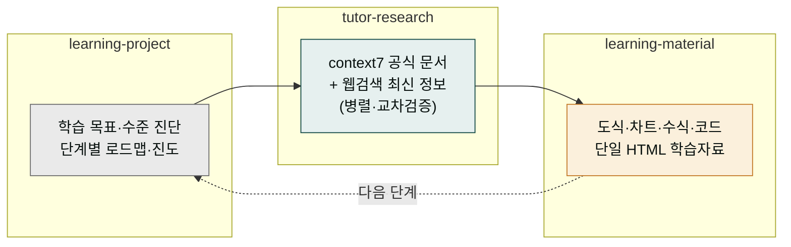

**릴리스 날짜**: 2026-06-16
**버전**: v2.20.0 (MINOR, 최신)
**업데이트 명령**: `/plugin marketplace update cowork-plugins`



## Highlights

v2.20.0은 **학습자(수강생) 전용 `moai-tutor` 플러그인**을 새로 추가합니다. 가르치는 사람을 위한 [`moai-education`](../../plugins/moai-education/)과 분리된, **배우는 사람** 관점의 도메인입니다.

학습 질문을 던지면 공식 문서(context7)와 웹검색을 **병렬로** 조사해 최신·정확한 근거를 모으고, 그 내용을 도식·차트·수식·코드 하이라이트가 들어간 한 편의 HTML 학습자료로 정리합니다. claude code·cowork·영어 등 어떤 주제든 스스로 깊이 학습하는 워크플로우입니다.

카운트 **27 → 28 플러그인 / 173 → 176 스킬**. Breaking change 없음.


**기존 워크플로우 그대로 동작합니다**: 신규 플러그인 추가만 있고 기존 플러그인·스킬·워크플로우는 변경되지 않았습니다.


## What's New

### moai-tutor — 학습자 개인 AI 튜터 (3 스킬)

| 스킬 | 용도 | 문서 |
|------|------|------|
| `learning-project` | 학습 목표·수준 진단, 단계별 로드맵(Bloom 6단계), 진도 추적·학습 전용 CLAUDE.md 스캐폴딩 | [SKILL.md](https://github.com/modu-ai/cowork-plugins/blob/main/moai-tutor/skills/learning-project/SKILL.md) |
| `tutor-research` | 질문을 리서치 축으로 분해 → context7 + 웹검색 병렬 조사·교차검증 → 출처 검증 종합본 | [SKILL.md](https://github.com/modu-ai/cowork-plugins/blob/main/moai-tutor/skills/tutor-research/SKILL.md) |
| `learning-material` | 학습목표·핵심개념·도식·예제·복습 구조의 단일 HTML. CDN 라이브러리 조건부 로딩 | [SKILL.md](https://github.com/modu-ai/cowork-plugins/blob/main/moai-tutor/skills/learning-material/SKILL.md) |

### context7 MCP 번들

`moai-tutor/.mcp.json`에 context7(`alwaysLoad`)을 번들해, 설치 시 라이브러리·SDK·CLI 공식 문서 조회가 함께 활성화됩니다. 별도 API 키가 필요 없습니다(npx 자동 설치).

### 2026 CDN 라이브러리 스택 큐레이션

`learning-material` 렌더러가 사용하는 영역별 최고 라이브러리를 [`references/cdn-libraries.md`](https://github.com/modu-ai/cowork-plugins/blob/main/moai-tutor/skills/learning-material/references/cdn-libraries.md)에 정리했습니다.

| 영역 | 채택 | 라이선스 |
|------|------|----------|
| 다이어그램 | Mermaid v11 | MIT |
| 차트 | Apache ECharts v5 | Apache-2.0 |
| 코드 하이라이트 | highlight.js v11 | BSD-3 |
| 수식 | KaTeX v0.16 | MIT |
| 스크롤 효과 | AOS v2 | MIT |

콘텐츠가 실제로 쓸 때만 주입하는 **조건부 로딩**(순수 텍스트 자료는 JS 0)이며, [`moai-content:html-report`](../../plugins/moai-content/)의 0-JS 원칙은 그대로 보존합니다.

## Changed

- **전체 버전 동기화 2.19.0 → 2.20.0** — marketplace.json + 28 plugin.json + 176 SKILL.md.
- 루트 README·`marketplace.json` 카탈로그에 moai-tutor 추가, 배지(28 플러그인 · 176 스킬)·총 산출물 표 갱신.

## Migration

- 신규 플러그인 추가만 있고 기존 플러그인·스킬·워크플로우는 변경되지 않습니다(기능적 비파괴).
- 마켓플레이스 캐시를 갱신한 뒤 `moai-tutor`를 설치하면 됩니다.

## 업그레이드 방법

1. **마켓플레이스 캐시 갱신**:

   ```text
   /plugin marketplace update cowork-plugins
   ```

2. **플러그인 설치** — `moai-core` 설치 후 `moai-tutor` 옆 **+** 버튼으로 설치하면 context7 MCP가 함께 활성화됩니다.

3. **API 키 재등록 불필요** — context7은 npx로 자동 설치되며 키가 필요 없습니다.

기존 워크플로우(v2.19.0까지)는 그대로 동작합니다.

## 사용 예시

```text
> claude code 서브에이전트 공부할 학습 프로젝트 만들어줘. 입문이고 하루 1시간.
→ learning-project → 수준 진단 → 단계별 로드맵 → 진도 추적·CLAUDE.md 생성
```

```text
> claude cowork Skills와 Sub-agents 차이를 최신 정보로 조사해서 HTML 학습자료로 만들어줘
→ tutor-research(context7 + 웹검색 병렬) → learning-material(시퀀스 도식 + 코드 HTML)
```

## 관련 문서 & 출처

- **CHANGELOG**: [전체 변경 사항](https://github.com/modu-ai/cowork-plugins/blob/main/CHANGELOG.md)
- **moai-tutor 플러그인 페이지**: [/plugins/moai-tutor/](../../plugins/moai-tutor/)
- **moai-tutor 디렉터리**: [GitHub](https://github.com/modu-ai/cowork-plugins/tree/main/moai-tutor)
- **이전 릴리스 노트**: [v2.19.0](../v2.19/) · [v2.18.0](../v2.18/) · [v2.17.0](../v2.17/)
