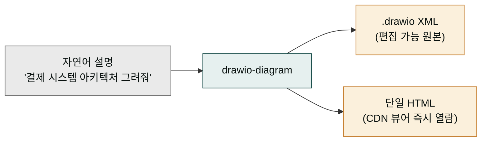

**릴리스 날짜**: 2026-06-16
**버전**: v2.21.0 (MINOR, 최신)
**업데이트 명령**: `/plugin marketplace update cowork-plugins`



## Highlights

v2.21.0은 콘텐츠·문서 작업의 **도식(digram) 역량**을 강화하고, `humanize-korean`에 **한국적 정서·결(양성 축)** 지식을 추가하며, `/project`가 **에이전트까지 활용**하도록 확장합니다.

- **`drawio-diagram` 신규 스킬** — 자연어를 편집 가능한 `.drawio` + 단일 HTML 두 산출물로. mermaid로 부족한 정교한 셰이프·클라우드 아이콘·편집 가능 원본. CLI 설치 불필요(브라우저 CDN 뷰어).
- **`humanize-korean` 한국적 정서·결 K 카테고리** — 기존 A~J(제거 대상 음성 패턴)에 **K(지향 대상 양성 축)** 4종을 추가해 "빼기"를 넘어 "채우기"까지. 2026 학술 근거(LREAD·translationese) 교차 검증.
- **`/project` agent-aware 강화** — `/project init`이 스킬뿐 아니라 설치된 플러그인의 코디네이터 에이전트까지 동적 스캔·체인 설계.

카운트 **28 플러그인(유지) / 173 → 177 스킬**(+drawio-diagram). 기능·인터페이스 Breaking change 없음.


**기존 워크플로우 그대로 동작합니다**: 신규 스킬 1개 추가 + 기존 스킬 정량 강화만 있고, 기존 플러그인·스킬·인터페이스는 변경되지 않았습니다.


## What's New

### `drawio-diagram` — 편집 가능한 draw.io 다이어그램 렌더러 (moai-content 신규 스킬)

자연어 설명(또는 구조화된 명세)을 받아 **두 가지 산출물**을 만듭니다.

1. **`.drawio` 파일** — draw.io 웹/데스크톱에서 추가 편집 가능한 mxGraph XML
2. **단일 `.html` 파일** — draw.io CDN 뷰어(`viewer-static.min.js`, Apache-2.0)를 임베드해 설치 없이 브라우저에서 즉시 열람

**6개 프리셋**: `erd` · `uml-class` · `sequence` · `architecture` · `ml-pipeline` · `flowchart`

**책임 경계 vs mermaid**: 빠른 텍스트 기반 플로우·시퀀스는 mermaid, 정교한 셰이프·클라우드 아이콘·수동 레이아웃·편집 가능 원본이 필요하면 이 스킬.

| 산출물 | 형태 | 비고 |
|--------|------|------|
| `<slug>.drawio` | mxGraph XML | draw.io(app.diagrams.net)에서 편집 |
| `<slug>.html` | 단일 파일 | CDN 뷰어 임베드, 폴백 시 XML 텍스트 보존 |

- **SKILL.md**: [GitHub](https://github.com/modu-ai/cowork-plugins/blob/main/moai-content/skills/drawio-diagram/SKILL.md)
- **온라인 문서**: [/plugins/moai-content/](../../plugins/moai-content/) (`drawio-diagram` 섹션)
- **영감 원본**: [Agents365-ai/drawio-skill](https://github.com/Agents365-ai/drawio-skill) (MIT) — MoAI 환경에 맞게 재구현(CLI 의존 제거, CDN 뷰어 전환)


`moai-tutor:learning-material`은 이 스킬의 `.drawio` 도식을 학습자료에 ```drawio` 블록으로 조건부 임베드합니다(mermaid 보완용).


### `humanize-korean` 한국적 정서·결 K 카테고리 강화 (taxonomy v2.1)

기존 `humanize-korean`은 A~J **음성(제거) 축** — 번역투·AI 관용구·형식명사 같은 "AI 티"를 빼는 데 집중했습니다. v2.21.0은 여기에 **K 양성(지향) 축** 4종을 추가해 "자연스럽게 빼기"를 넘어 "한국적 정서로 채우기"까지 아우릅니다.

| K 패턴 | 축 | 내용 |
|--------|-----|------|
| K-1 정서온도 | 양성 | 안전한 일반성 ↔ 체온·구체. 예시의 온도 조절 |
| K-2 절제·곡언 | 양성 | 과장을 절제로, 곡언(두루 말하기)으로 순화 |
| K-3 구어 호흡·여백 | 양성 | 호흡·여백·말끝(장르 가드 강함) |
| K-4 정서 아크 | 양성 | 담화 단위 감정 흐름 |

**본진 추가**: E-8(다어절 경계 띄어쓰기 기계적 균일성, S2) · E-7 보강(3단계 화계 선택 framework) · 머리말에 모델별 번역투 시그니처 점검 힌트(GPT 계열=수식어 명사구+대명사 / Qwen 계열=한자어 명사화+calque).

**학술 근거**: Park & Han 2026 LREAD(arXiv:2601.19913) · translationese(arXiv:2602.16469) · KatFish 2025 교차. 전부 자체 저작·학술 원전 직접 인용. **메트릭·테스트·baseline 무변경**(parity 안전) — 기존 윤문 결과는 동일합니다.

### `/project` agent-aware 강화 (moai-core)

`/project init`이 스킬뿐 아니라 **에이전트(코디네이터)**까지 활용하도록 강화했습니다.

- **Phase 2 에이전트 인벤토리** — 설치된 플러그인의 `agents/*.md` frontmatter를 동적 스캔해 사용 가능한 코디네이터를 파악
- **Phase 3 코디네이터 우선** — 멀티스텝 체인은 코디네이터 에이전트를 우선 매핑하고, 없을 때 인라인 스킬 체인으로 폴백
- **`agent-catalog.md` SSOT 신규** — 코디네이터 인지·체인 설계 단일 진실(28 코디네이터 헤더)
- **기존 에이전트 우선** — stale 중복 매핑 2곳 정정(사용자가 이미 가진 에이전트가 새로 만드는 것보다 우선)

## Changed

- **스킬 카운트 173 → 177** — `drawio-diagram` 1개 신규(moai-content 14 → 15 스킬). 플러그인 28개 유지.
- **전체 버전 동기화 2.20.0 → 2.21.0** — marketplace.json + 28 plugin.json + 177 SKILL.md (206개 지점).
- **`moai-tutor:learning-material` drawio 연동** — ```drawio` 블록을 인식해 draw.io 뷰어를 조건부 임베드(`references/cdn-libraries.md` §6 신규). mermaid는 그대로 유지.
- 루트 README·docs-site 카탈로그에 drawio-diagram 추가, 배지(177 스킬)·플러그인 스킬 수 표 갱신.
- **기존 부채 정합 — 5개 플러그인 README 스킬 테이블** — 게이트 4(스킬 테이블 실측 일치) 28/28 플러그인 달성. moai-business(`ai-diagnostic` 추가), moai-commerce(삭제 스킬 잔재 6행 제거 + `marketplace-coupang-ads` 추가), moai-education(`course-curriculum-design` rename stub 추가), moai-marketing(`meta-ads-manager` 추가), moai-media(`higgsfield-image`·`higgsfield-video` 추가). 각 플러그인 README 스킬 수 배지·도입부 카운트를 실측에 정합.

## Fixed

- 해당 없음.

## Removed

- 해당 없음.

## Migration

- 신규 스킬 1개 추가 + 기존 스킬 정량 강화만 있고 기존 인터페이스는 변경되지 않습니다(기능적 비파괴).
- 마켓플레이스 캐시를 갱신하면 `drawio-diagram`이 `moai-content`에 추가됩니다.

## 업그레이드 방법

1. **마켓플레이스 캐시 갱신**:

   ```text
   /plugin marketplace update cowork-plugins
   ```

2. **플러그인 상세 재진입** — `moai-content`를 다시 열면 `drawio-diagram`이 스킬 목록에 나타납니다.

3. **API 키·설치 불필요** — draw.io CDN 뷰어는 브라우저가 직접 로드하므로 추가 설정이 없습니다.

기존 워크플로우(v2.20.0까지)는 그대로 동작합니다.

## 사용 예시

```text
> 결제 시스템 마이크로서비스 아키텍처 draw.io로 그려줘
→ drawio-diagram (architecture 프리셋) → .drawio + 단일 HTML 산출
```

```text
> 이 ChatGPT 칼럼 초안을 사람이 쓴 것처럼 윤문해줘. 한국적 정서 살려서.
→ humanize-korean — A~J 음성 제거 + K 양성(정서온도·절제) 충전
```

## 관련 문서 & 출처

- **CHANGELOG**: [전체 변경 사항](https://github.com/modu-ai/cowork-plugins/blob/main/CHANGELOG.md)
- **moai-content 플러그인 페이지**: [/plugins/moai-content/](../../plugins/moai-content/) (`drawio-diagram` · `humanize-korean` 섹션)
- **drawio-diagram SKILL.md**: [GitHub](https://github.com/modu-ai/cowork-plugins/blob/main/moai-content/skills/drawio-diagram/SKILL.md)
- **draw.io 원본 영감**: [Agents365-ai/drawio-skill](https://github.com/Agents365-ai/drawio-skill) (MIT)
- **humanize-korean 학술 근거**: Park & Han 2026 LREAD (arXiv:2601.19913) · translationese (arXiv:2602.16469)
- **이전 릴리스 노트**: [v2.20.0](../v2.20/) · [v2.19.0](../v2.19/) · [v2.18.0](../v2.18/)
