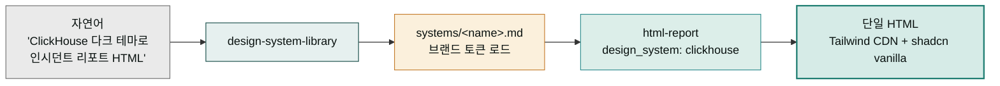

**릴리스 날짜**: 2026-06-16
**버전**: v2.22.0 (MINOR, 최신)
**업데이트 명령**: `/plugin marketplace update cowork-plugins`



## Highlights

v2.22.0은 HTML 보고서·랜딩·문서에 **즉시 적용 가능한 브랜드 디자인 시스템 라이브러리**를 추가합니다. Claude·ClickHouse·Clay 같은 기본 테마부터 Notion·Linear·Stripe·Vercel·Figma·Sentry 같은 글로벌 브랜드 56종의 디자인 토큰(색·타이포·radius·spacing)을 한곳에 모아 두고, `html-report`에 시스템 이름을 지정하면 해당 브랜드 무드가 단일 파일 HTML에 즉시 반영됩니다.

- **`design-system-library` 신규 스킬** — 56개 브랜드 디자인 시스템 토큰 SSOT. 빌드 단계 없이 Tailwind Play CDN + shadcn 스타일 vanilla 컴포넌트로 렌더.
- **자동 추천 휴리스틱** — 산출물 성격(보고서→claude warm / 데이터 리포트→clickhouse 다크 / 랜딩→clay playful)에 맞춰 테마 자동 추천.
- **Claude Design 연동** — `claude-design-system-prep`가 이 라이브러리 시스템을 DESIGN.md 합성 소스로 사용해 claude.ai/design 핸드오프 지침으로 제공.

카운트 **28 플러그인(유지) / 177 → 178 스킬**(+design-system-library). 기능·인터페이스 Breaking change 없음.


**기존 워크플로우 그대로 동작합니다**: 신규 스킬 1개 추가만 있고, 기존 플러그인·스킬·인터페이스는 변경되지 않았습니다. `design_system`을 지정하지 않으면 기존 `html-report` 0의존 템플릿이 그대로 쓰입니다(하위 호환).


## What's New

### `design-system-library` — 56개 브랜드 디자인 시스템 라이브러리 (moai-design 신규 스킬)

글로벌 브랜드 56종의 디자인 시스템(token 기반 분석 결과)을 단일 진실 원천으로 보관하고, HTML 산출물에 적용 가능한 형태로 제공합니다.

**기본 3테마**(모든 HTML 산출물의 기본 선택지):

| 테마 | 무드 | 적합 산출물 |
|------|------|-------------|
| `claude` | warm editorial (cream `#faf9f5` + coral `#cc785c`) | 보고서·사업계획서·편집성 문서 |
| `clickhouse` | high-contrast engineering (near-black + electric yellow) | 기술 리포트·데이터 대시보드·API 문서 |
| `clay` | playful B2B (cream + 6-color saturated cards) | 랜딩·마케팅·제품 소개 |

**나머지 53종**: Notion·Linear·Stripe·Vercel·Figma·Sentry·Raycast·Mintlify·PostHog·Supabase 계열 등. 전체 56개는 [`systems/registry.md`](https://github.com/modu-ai/cowork-plugins/blob/main/moai-design/skills/design-system-library/systems/registry.md)에서 휘도 기반 분류(light 33·dark 13·warm 2·후속 8)와 함께 확인할 수 있습니다.

**두 소비 경로**:

1. **html-report / HTML 문서 렌더** — `design_system` 파라미터로 시스템 선택 → Tailwind Play CDN config + shadcn vanilla 컴포넌트로 단일 파일 HTML 렌더
2. **Claude Design 핸드오프** — `claude-design-system-prep`가 본 라이브러리 시스템을 DESIGN.md 합성 소스로 사용 → `design-handoff`의 references/context에 지침 포함

**핵심 원칙**:

- 라이브러리는 데이터(token + 분석) SSOT — 렌더 로직은 소비자(html-report)가 소유
- Tailwind Play CDN으로 단일 파일·외부 빌드 없이 브랜드 토큰 적용(인터넷 연결 필요)
- shadcn 컴포넌트는 React가 아닌 **vanilla HTML/CSS로 재현**(단일 파일·React 불필요)
- 기존 html-report 0의존 템플릿 유지 — `design_system` 미지정 시 하위 호환

**분류 진행 상황**: 56개 중 48종은 휘도 기반 분류 완료(light 33·dark 13·warm 2). 8종(theverge·tesla·starbucks·spotify·mastercard·lovable·lamborghini·kraken)은 colors 구조 후속 보완 예정입니다.

- **SKILL.md**: [GitHub](https://github.com/modu-ai/cowork-plugins/blob/main/moai-design/skills/design-system-library/SKILL.md)
- **56개 카탈로그**: [`systems/registry.md`](https://github.com/modu-ai/cowork-plugins/blob/main/moai-design/skills/design-system-library/systems/registry.md) (GitHub)
- **온라인 문서**: [/plugins/moai-design/](../../plugins/moai-design/) (`design-system-library` 섹션)

## Changed

- **스킬 카운트 177 → 178** — `design-system-library` 1개 신규(moai-design 5 → 6 스킬). 플러그인 28개 유지.
- **전체 버전 동기화 2.21.0 → 2.22.0** — marketplace.json + 28 plugin.json + 178 SKILL.md (208개 지점) + hugo.toml SSOT.
- 루트 README·docs-site 카탈로그에 design-system-library 추가, 배지(178 스킬)·moai-design 스킬 수 표(5 → 6) 갱신.

## Fixed

- 해당 없음.

## Removed

- 해당 없음.

## Migration

- 신규 스킬 1개 추가만 있고 기존 인터페이스는 변경되지 않습니다(기능적 비파괴).
- 마켓플레이스 캐시를 갱신하면 `design-system-library`가 `moai-design`에 추가됩니다.

## 업그레이드 방법

1. **마켓플레이스 캐시 갱신**:

   ```text
   /plugin marketplace update cowork-plugins
   ```

2. **플러그인 상세 재진입** — `moai-design`을 다시 열면 `design-system-library`가 스킬 목록에 나타납니다.

3. **API 키·설치 불필요** — Tailwind Play CDN은 브라우저가 직접 로드하므로 추가 설정이 없습니다(인터넷 연결만 필요).

기존 워크플로우(v2.21.0까지)는 그대로 동작합니다.

## 사용 예시

```text
> 결제 게이트웨이 502 장애를 ClickHouse 스타일 다크 테마로 인시던트 리포트 HTML로 만들어줘
→ design-system-library (clickhouse) → html-report design_system=clickhouse → 단일 HTML
```

```text
> 신제품 랜딩 페이지를 Clay 스타일(컬러 카드)로 HTML로 만들어줘
→ design-system-library (clay) → html-report design_system=clay → 단일 HTML
```

```text
> 사업계획서를 Claude 디자인(warm cream + coral) HTML로 렌더해줘
→ design-system-library (claude) → html-report design_system=claude → 단일 HTML
```

## design-system-library vs 기존 html-report

| 구분 | 언제 쓰나 |
|------|-----------|
| `html-report` (design_system 미지정) | 0의존 self-contained 출력이 필요할 때(이메일 첨부·오프라인·인쇄). 기존 템플릿 유지. |
| `html-report` + `design_system: <브랜드>` | 특정 브랜드 무드가 필요할 때. Tailwind Play CDN 로드(인터넷 필요). |
| `claude-design-system-prep` + 라이브러리 | Claude Design(claude.ai/design) 핸드오프용 DESIGN.md를 만들 때. |

## 관련 문서 & 출처

- **CHANGELOG**: [전체 변경 사항](https://github.com/modu-ai/cowork-plugins/blob/main/CHANGELOG.md)
- **moai-design 플러그인 페이지**: [/plugins/moai-design/](../../plugins/moai-design/) (`design-system-library` 섹션)
- **design-system-library SKILL.md**: [GitHub](https://github.com/modu-ai/cowork-plugins/blob/main/moai-design/skills/design-system-library/SKILL.md)
- **56개 시스템 레지스트리**: [`systems/registry.md`](https://github.com/modu-ai/cowork-plugins/blob/main/moai-design/skills/design-system-library/systems/registry.md) (GitHub)
- **Tailwind Play CDN**: [cdn.tailwindcss.com](https://tailwindcss.com/docs/installation/play-cdn)
- **shadcn/ui**(참고 원본 컴포넌트 사상): [ui.shadcn.com](https://ui.shadcn.com/)
- **이전 릴리스 노트**: [v2.21.0](../v2.21/) · [v2.20.0](../v2.20/) · [v2.19.0](../v2.19/)
