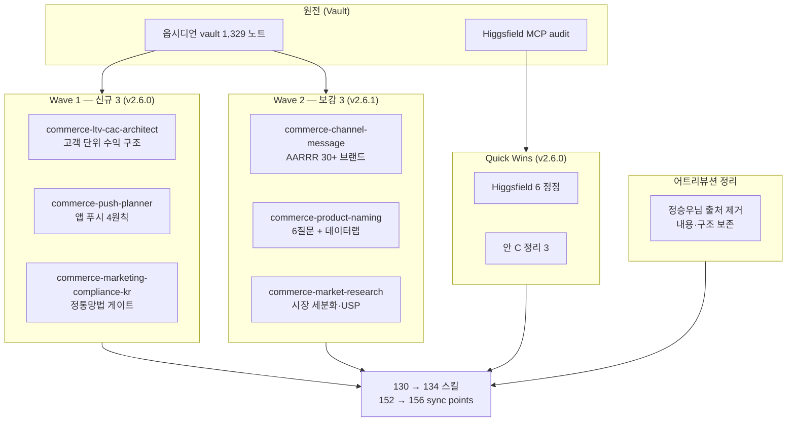

**릴리스 날짜**: 2026-05-16
**버전**: v2.6.0 (MINOR) + v2.6.1 (PATCH)
**업데이트 명령**: `/plugin marketplace update cowork-plugins`



## Highlights

v2.6.x는 cowork-plugins의 **한국 D2C 풀스택 첫 본격 확장**입니다. 옵시디언 vault 1,329 노트를 시드로 한 commerce 신규 3 스킬 + Higgsfield 작업 정정 + 어트리뷰션 정책 변경이 한 묶음입니다.

**v2.6.0 (MINOR)** — Wave 1 신규 3 스킬: `commerce-ltv-cac-architect` (고객 1명 평생 수익) + `commerce-push-planner` (앱 푸시 4원칙) + `commerce-marketing-compliance-kr` (정통망법 자동 게이트, 과태료 1회 최대 3,000만원 회피). Higgsfield Quick Wins 6 (MCP 설정·툴명·요금 stale 정정). 어트리뷰션 정책 변경 — 정승우님 자료 공식 어트리뷰션 모두 제거(GOOS 컨펌), 내용·구조·버전 표기는 그대로 보존하여 사용자 경험 무변동.

**v2.6.1 (PATCH)** — Wave 2 보강 3: `commerce-channel-message` (AARRR 단계별 한국 30+ 브랜드 풀스택) + `commerce-product-naming` (6질문 + 데이터랩 4단계) + `commerce-market-research` (4축 세분화 + USP 3 차별 축). Higgsfield 안 C 책임 경계 명확화 3(`media-model-router`·`video-gen`·`fal-gateway`).

마켓플레이스 130 → **134 스킬**. 동기화 지점 152 → **156**. Breaking change 없음.

## What's New

### moai-commerce 신규 3 스킬 (Wave 1, v2.6.0)

**`commerce-ltv-cac-architect`** — 고객 단위 수익 구조 설계

- **SKILL.md GitHub URL**: [moai-commerce/skills/commerce-ltv-cac-architect/SKILL.md](https://github.com/modu-ai/cowork-plugins/blob/main/moai-commerce/skills/commerce-ltv-cac-architect/SKILL.md)
- **문서 페이지**: [/plugins/moai-commerce/](/plugins/moai-commerce/)
- **공식 외부 참고**: 한국 D2C 카테고리별 벤치마크 (화장품·식품·패션·가전·펫·구독 SaaS)

핵심 기능:

- 6대 지표 연결 모델: CAC → 재구매율 → 구매주기 → ARPU → 공헌이익 → LTV
- LTV/CAC ratio 진단: <1 손실, 1-3 손익분기, 3-5 건강, ≥5 우수
- Payback Period 자동 + 광고 의존도 진단(30%+ 위험, 11-15% 정상)
- 손익분기 ROAS 자동 + 채널·세그먼트별 재구매율 분해
- 광고 의존도 탈출 6단계 로드맵 (Month 1-6)
- 페어 분리: `commerce-margin-calculator` = 단품 마진, 본 스킬 = 고객 1명 평생 수익

**`commerce-push-planner`** — 앱 푸시 전용 기획 스킬

- **SKILL.md GitHub URL**: [moai-commerce/skills/commerce-push-planner/SKILL.md](https://github.com/modu-ai/cowork-plugins/blob/main/moai-commerce/skills/commerce-push-planner/SKILL.md)
- **문서 페이지**: [/plugins/moai-commerce/](/plugins/moai-commerce/)

핵심 기능:

- 4원칙: 왜·언제·누구에게·어떻게
- Timely·Personal·Actionable 3요소 자가 점검
- 카피 변형 3안: (1) 오늘만 vs 매일, (2) 누구나 vs 너에게만, (3) 숫자 vs 게이미피케이션 vs 브랜딩
- 한국 30+ 브랜드 레퍼런스: 토스·배민·오늘의집·쿠팡·에이블리·지그재그·29CM·인프런·야놀자·퍼블리·넷플릭스·듀오링고
- 클릭률 예측 가이드
- 페어 분리: `commerce-channel-message` = 카톡/SMS/이메일, 본 스킬 = 앱 푸시 전용

**`commerce-marketing-compliance-kr`** — 한국 정통망법 광고·정보성 메시지 자동 게이트

- **SKILL.md GitHub URL**: [moai-commerce/skills/commerce-marketing-compliance-kr/SKILL.md](https://github.com/modu-ai/cowork-plugins/blob/main/moai-commerce/skills/commerce-marketing-compliance-kr/SKILL.md)
- **공식 외부 참고**: [정보통신망 이용촉진 및 정보보호 등에 관한 법률 제50조](https://www.law.go.kr/법령/정보통신망이용촉진및정보보호등에관한법률)

핵심 기능:

- 6대 점검: (1) 광고성 판정, (2) 옵트인, (3) 야간 발송 21시-익일 8시 차단, (4) (광고) 표기 위치, (5) 무료 수신거부 명시, (6) 발신자 정보
- BLOCK/PASS 판정 + 구체 fix 가이드
- 위반 조항: 제50조 1·3·4항, 제76조
- 채널별 베스트/워스트 패턴 카탈로그
- 과태료 위험 회피: 1회 위반 최대 3,000만원 + 책임자 1년 이하 징역

### moai-commerce 보강 3 스킬 (Wave 2, v2.6.1)

| 스킬 | 보강 내용 |
|------|----------|
| `commerce-channel-message` | "AARRR 단계별 한국 30+ 브랜드 메시지 풀스택" 섹션 추가. Acquisition·Activation·Retention·Revenue·Referral 5단계 × 5-9 브랜드 (토스·당근·29CM·인프런·배민·쿠팡·에이블리 등). 3요소 체크리스트(Timely·Personal·Actionable) + 단계별 발송 빈도 권장 |
| `commerce-product-naming` | "6질문 상품 파악 프레임 + 데이터랩 트렌드 워크플로우" 섹션 추가. 6질문(Primary Buyer·Motive·Search Intent·USP·Channel-Fit·Seasonality) + 네이버 데이터랩 4단계(트렌드·연관키워드·인구통계·시즌) + 통합 체크리스트(4개 이상 PASS) |
| `commerce-market-research` | "시장 세분화 + USP 추출 프로세스 (MD 11년차 관점)" 섹션 추가. 4축 세분화(인구·심리·행동·맥락) + 5축 평가(시장크기·성장률·경쟁·진입비용·강점) + USP 3 차별 축(What·How·Why) + 검증 질문 + 다운스트림 일관성 매핑 |

### moai-media Higgsfield Quick Wins 6 (v2.6.0)

`research-2026-05-16/higgsfield-audit.md` §7 즉시 자동 수정 후보 적용:

- `character-mgmt`: MCP 설정 `"command": "uvx"` + `"args": ["higgsfield-mcp"]` → `"command": "higgsfield-mcp"` (CONNECTORS.md pip install 정책과 일치) + "베타 기간 무료" stale → "공식 사이트 요금제 확인"
- `fal-gateway`: MCP URL `https://fal.ai` → `https://mcp.fal.ai/mcp` + Authorization `Key ${FAL_KEY}` → `Bearer ${FAL_KEY}`
- `video-gen`: MCP 툴명 `generate_video_dop` → `higgsfield.generate_video_dop` (네임스페이스 통일)
- `speech-video`: MCP 툴명 `generate_speech_video` → `higgsfield.generate_speech_video`

### moai-media 안 C 책임 경계 명확화 3 (v2.6.1)

audit §6 안 C 권장 적용:

- `media-model-router`: description '백엔드 통합: Kling 3 (Higgsfield MCP) + Veo 3·Seedance 2.0 (fal-gateway 위임)' 명시 + 카테고리 매트릭스 아래 '백엔드 매핑' 표 추가
- `video-gen`: description '(범용·단순 영상 전용)' 명시 + '광고 영상 + 카테고리 자동 라우팅이 필요하면 페어 스킬 media-model-router 사용' 안내 추가
- `fal-gateway`: description 'media-model-router의 Veo 3·Seedance 2.0 라우팅도 본 스킬을 백엔드로 사용' 명시 + 트리거 키워드 'Veo 3', 'Seedance' 추가

## Changed

- 마켓플레이스 스킬 카운트: 130 → **134** (+4 신규 3 + Wave 4 사전 0 ... 실제로는 신규 3만 추가 + 보강만 PATCH)
- 동기화 지점: 152 → **156** (marketplace 1 + plugin.json 21 + SKILL.md 134)
- `moai-commerce` plugin.json `description` v2.6.0/v2.6.1 신규 항목 추가
- `marketplace.json` `plugins[]` 배열의 `moai-commerce` description 갱신
- 루트 README 배지(Version 2.6.1 · Skills 134) + 하이라이트 섹션
- 어트리뷰션 정책: 정승우님 자료 공식 attribution 모두 제거 (출처 클로즈만 제거, 내용·구조·버전 표기는 보존)
- NOTICE.md: 정승우님 자료 섹션 + 다른 섹션 내 잔여 언급 3건 제거 (moai-cowork 자체 제작 교재 섹션은 유지)
- moai-commerce 9 SKILL.md + moai-marketing 5 파일 + 2 README 출처 클로즈 제거 (내용 무변동)

## Fixed

- `character-mgmt` MCP 설정 stale (`uvx` → `higgsfield-mcp` 직접 실행)
- `fal-gateway` MCP URL stale (`https://fal.ai` → `https://mcp.fal.ai/mcp`)
- `fal-gateway` Authorization 헤더 stale (`Key` → `Bearer`)
- `video-gen`·`speech-video` MCP 툴명 네임스페이스 불일치 정정

## Removed

- 정승우님 자료 공식 어트리뷰션 (출처 클로즈만 제거, 내용·구조·버전 표기는 보존)
- NOTICE.md "정승우님 자료 (Course Material — Permitted Use)" 섹션
- moai-cowork 자체 제작 교재 섹션은 그대로 유지

## 업그레이드 방법

1. **마켓플레이스 캐시 갱신**:

   ```text
   /plugin marketplace update cowork-plugins
   ```

2. **`moai-commerce` 플러그인 상세 재진입** — 새 스킬 3종이 자동 감지됩니다.

3. **Higgsfield MCP 사용자**: `pip install higgsfield-mcp` 명령으로 패키지가 설치되어 있는지 확인. MCP 설정과 URL은 자동 업데이트되었습니다.

4. **정승우님 자료를 직접 참조하던 외부 사용자**: 본 버전부터 어트리뷰션 없음. 자체 NOTICE 작성 시 cowork-plugins MIT 라이선스 + 본 리포 출처만 표기 가능.

기존 워크플로우(v2.5.0까지의 메타 광고 audit 3-Layer 인프라 포함)는 그대로 동작합니다.

## 사용 예시

```text
> 우리 화장품 D2C 브랜드의 LTV/CAC 분석해줘. 6개월 매출 데이터 첨부.
→ commerce-ltv-cac-architect → 6대 지표 분해 → 광고 의존도 진단 → 탈출 로드맵
```

```text
> 앱 푸시 카피 변형 3안 만들어줘. 신규 회원 가입 유도, 30대 여성 대상.
→ commerce-push-planner → 4원칙 + Timely·Personal·Actionable + 3안 (오늘만/누구나/숫자)
```

```text
> 우리 브랜드 카톡 발송 정통망법 점검해줘. 야간 21시 발송 가능?
→ commerce-marketing-compliance-kr → 6대 점검 → BLOCK 판정 → 옵트인 + 시간 + 표기 + 수신거부 가이드
```

## 관련 문서 & 출처

- **CHANGELOG**: [전체 변경 사항](https://github.com/modu-ai/cowork-plugins/blob/main/CHANGELOG.md#260---2026-05-16)
- **moai-commerce 플러그인 페이지**: [/plugins/moai-commerce/](/plugins/moai-commerce/)
- **정통망법 제50조 원문**: [국가법령정보센터](https://www.law.go.kr/법령/정보통신망이용촉진및정보보호등에관한법률)
- **Higgsfield audit 원본**: `research-2026-05-16/higgsfield-audit.md`
- **vault grounding 명세**: `research-2026-05-16/vault-ecom.md` §A-3

## 후속 (v2.7.0 + v2.8.0 진행)

- Wave 3 (v2.7.0): 신규 2 (`commerce-promotion-planner`·`commerce-repurchase-timer`) + `commerce-product-image-pipeline`
- Wave 4 (v2.8.0): commerce MED/LOW 7 (review·voc·subscription·influencer·early-fan·trend·season)
