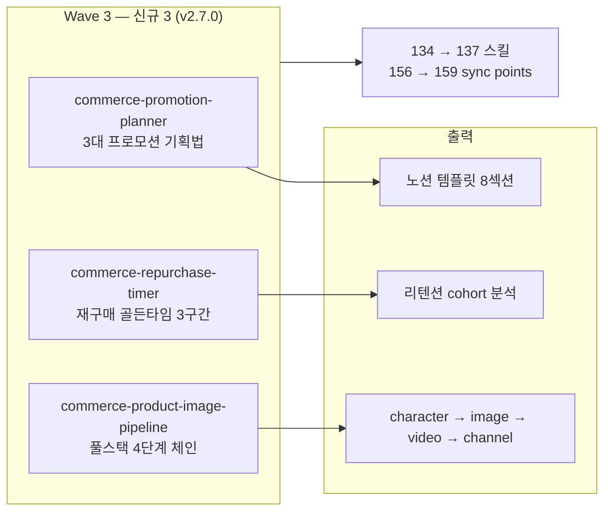

**릴리스 날짜**: 2026-05-16
**버전**: v2.7.0 (MINOR)
**업데이트 명령**: `/plugin marketplace update cowork-plugins`



## Highlights

v2.7.0은 **"Wave 3 — 프로모션·재구매·이미지 파이프라인"** 출시입니다. v2.6.0의 Wave 1 vault grounding 후속 첫 신규 스킬 출시로, 한국 D2C 셀러가 (1) 신상품/이벤트 프로모션 기획, (2) 재구매 골든타임 관리, (3) 이미지·영상 풀스택 파이프라인을 한 플러그인 안에서 처리할 수 있게 합니다.

마켓플레이스 134 → **137 스킬**. 동기화 지점 156 → **159**. Breaking change 없음.

## What's New

### moai-commerce 신규 3 스킬

**`commerce-promotion-planner`** — 3대 프로모션 기획법(이슈화·얼리버드·한정) 전담

- **SKILL.md GitHub URL**: [moai-commerce/skills/commerce-promotion-planner/SKILL.md](https://github.com/modu-ai/cowork-plugins/blob/main/moai-commerce/skills/commerce-promotion-planner/SKILL.md)
- **문서 페이지**: [/plugins/moai-commerce/](/plugins/moai-commerce/)
- **케이스 원전**: 비플레인 '듣보잡' 스몰 D2C 12배 매출 케이스

핵심 기능:

- 3대 프로모션 기획법: 이슈화·얼리버드·한정
- 브랜드 단계(신생·스몰·중대형) × 목표(인지도·충성고객·즉각매출) 매트릭스
- 명목·스토리·혜택 3종 세트(HARD)
- 벤치마킹 케이스 3개 (명목·스토리·혜택 각 1개)
- 실무 체크리스트 6항목
- 노션 템플릿 페이지 구조(1~8 섹션) 자동 생성
- 페어 분리: `commerce-integrated-strategy` = 전체 매출 전략, 본 스킬 = 단일 프로모션 기획서

**`commerce-repurchase-timer`** — 재구매 골든타임 엔진

- **SKILL.md GitHub URL**: [moai-commerce/skills/commerce-repurchase-timer/SKILL.md](https://github.com/modu-ai/cowork-plugins/blob/main/moai-commerce/skills/commerce-repurchase-timer/SKILL.md)

핵심 기능:

- 골든타임 3구간 모델:
  - 리마인드 0.8T — 메시지 톤 가벼움, 채널 앱 푸시, 인센티브 0~5%
  - 데드라인 1.1T — 톤 긴급, 채널 카톡 친구톡 + 이메일, 인센티브 10~15%
  - 휴면 1.5T — 톤 위닝백, 채널 카톡 + SMS, 인센티브 25~40% + 사은품
- 리드 스코어링 8개 행동: 구매 후 7일 재방문 +10 / 후기 작성 +25 / 친구 초대 +30 / 미접속 60일 -20 / 수신거부 -100 등
- 리텐션 cohort 분석 가이드 (M+1·M+3·M+12 해석 기준)
- 한국 10 카테고리 표준 주기 매트릭스 — 화장품·면도기·콘택트렌즈·반려동물·영양제·잉크·향수 등

**`commerce-product-image-pipeline`** — 상품 이미지·영상 풀스택 파이프라인 오케스트레이터

- **SKILL.md GitHub URL**: [moai-commerce/skills/commerce-product-image-pipeline/SKILL.md](https://github.com/modu-ai/cowork-plugins/blob/main/moai-commerce/skills/commerce-product-image-pipeline/SKILL.md)
- **공식 외부 참고**: [Higgsfield MCP](https://higgsfield.ai), [fal.ai](https://fal.ai)

핵심 기능:

- 4단계 체인 자동 호출: `character-mgmt` → `image-gen` (Soul) → `video-gen` (DOP) → `media-channel-ad-packager`
- 3 시나리오: 신규 D2C 캐릭터 없음 / 브랜드 마스코트 보유 / 모델 캐릭터 = 가상 인플루언서
- 이미지 5축: Hero·Lifestyle·Detail·Use-case·Result
- 영상 모션 프리셋 자동 선택: 스킨케어=slow_zoom / 패션=pan_left / 식품=orbit
- 채널 변환: 메타 1:1·9:16 / 네이버 GFA / 카카오 모먼트 1:1·16:9
- `media-ai-disclosure` 자동 체인 (광고심의·소비자보호법 대응)
- 비용 추정: ₩2,300~4,000/상품 1건
- 페어 분리: `detail-page-image` = 13섹션 합성 PNG 1장, `media-model-router` = 광고 영상 라우팅, 본 스킬 = 풀스택 체인 오케스트레이션

## Changed

- 마켓플레이스 스킬 카운트: 134 → **137** (+3 신규)
- 동기화 지점: 156 → **159** (marketplace 1 + plugin.json 21 + SKILL.md 137)
- `moai-commerce` plugin.json `description` v2.7.0 신규 항목 추가
- `marketplace.json` `plugins[]` 배열의 `moai-commerce` description 갱신
- 루트 README 배지(Version 2.7.0 · Skills 137) + 하이라이트 섹션
- `moai-commerce/README.md` 스킬 테이블 신규 3 행 추가

## Fixed

해당 없음.

## Removed

해당 없음. Breaking change 없음 — 기존 워크플로우 그대로 동작.

## 업그레이드 방법

1. **마켓플레이스 캐시 갱신**:

   ```text
   /plugin marketplace update cowork-plugins
   ```

2. **`moai-commerce` 플러그인 상세 재진입** — 새 스킬 3종이 자동 감지됩니다.

3. **이미지·영상 파이프라인 사용 시**: `HIGGSFIELD_API_KEY` + `FAL_KEY` 두 환경변수가 모두 등록되어 있어야 합니다. 미설정 시 부분 체인만 동작.

기존 워크플로우(v2.6.x까지의 Wave 1 + Wave 2 보강 포함)는 그대로 동작합니다.

## 사용 예시

```text
> 신상품 출시 프로모션 기획해줘. 비건 화장품, 스몰 D2C, 인지도 목표.
→ commerce-promotion-planner → 매트릭스 분석 → 이슈화 추천 → 명목·스토리·혜택 3종 → 노션 템플릿 8섹션
```

```text
> 재구매 시점 메시지 캠페인 설계해줘. 화장품 카테고리, 평균 주기 45일.
→ commerce-repurchase-timer → 골든타임 3구간(36일·50일·68일) → 채널 + 인센티브 + 리드 스코어링
```

```text
> 신상품 광고용 이미지·영상 풀세트 만들어줘. 스킨케어, 모델 캐릭터 있음.
→ commerce-product-image-pipeline → character-mgmt → image-gen(5축) → video-gen(slow_zoom) → 채널 변환(메타·네이버·카카오)
```

## 관련 문서 & 출처

- **CHANGELOG**: [전체 변경 사항](https://github.com/modu-ai/cowork-plugins/blob/main/CHANGELOG.md#270---2026-05-16)
- **moai-commerce 플러그인 페이지**: [/plugins/moai-commerce/](/plugins/moai-commerce/)
- **moai-media 페어 스킬**: [character-mgmt](https://github.com/modu-ai/cowork-plugins/blob/main/moai-media/skills/character-mgmt/SKILL.md) · [image-gen](https://github.com/modu-ai/cowork-plugins/blob/main/moai-media/skills/image-gen/SKILL.md) · [video-gen](https://github.com/modu-ai/cowork-plugins/blob/main/moai-media/skills/video-gen/SKILL.md) · [media-channel-ad-packager](https://github.com/modu-ai/cowork-plugins/blob/main/moai-media/skills/media-channel-ad-packager/SKILL.md)
- **Higgsfield API**: [higgsfield.ai](https://higgsfield.ai)
- **fal.ai**: [fal.ai](https://fal.ai)
- **vault grounding 명세**: `research-2026-05-16/vault-ecom.md` §A-3 HIGH-4 / HIGH-5

## 후속 (v2.8.0 예정)

- Wave 4: commerce MED/LOW 7 (review·voc·subscription·influencer·early-fan·trend·season) — 신규 7
