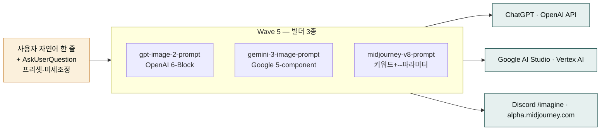

**릴리스 날짜**: 2026-05-17
**버전**: v2.9.0 (MINOR)
**업데이트 명령**: `/plugin marketplace update cowork-plugins`



## Highlights

v2.9.0은 **"Wave 5 — moai-media 이미지 프롬프트 빌더 3종"** 출시입니다. GPT-image-2(OpenAI), Gemini 3 Pro Image(Google Nano Banana Pro), Midjourney v8.1 공식 가이드를 **그대로** 적용한 빌더 스킬이 한 번에 3종 추가됐습니다.

핵심은 책임 분리입니다 — 본 빌더 3종은 **프롬프트 텍스트 산출 전용**이고, 실제 이미지 생성은 기존 페어 스킬(`media-gpt-image2-builder`·`nano-banana`)이 담당합니다. 자연어 한 줄과 AskUserQuestion 프리셋(제품샷·인물·일러스트·풍경)으로 컨텍스트를 수집하고, 동일 입력을 3개 모델별 어조로 **동시** 변환해 복붙 가능한 텍스트를 출력하므로 모델 간 비교·이식이 즉시 가능합니다.

마켓플레이스 144 → **147 스킬**. 동기화 지점 166 → **169**. Breaking change 없음.

## What's New

### moai-media 신규 3 스킬

| 스킬 | 공식 가이드 | 핵심 차별점 |
|---|---|---|
| `moai-media:gpt-image-2-prompt` | [OpenAI Cookbook](https://developers.openai.com/cookbook/examples/multimodal/image-gen-models-prompting-guide) 6-Block (Subject·Action·Scene·Composition·Lighting·Style&Text) | 편집 시 Change/Preserve/Constraints 2열 로직. 텍스트 verbatim·ALL CAPS·다국어(한·일·중·힌·벵골) 규칙 |
| `moai-media:gemini-3-image-prompt` | [Google AI Developers](https://ai.google.dev/gemini-api/docs/models/gemini-3-pro-image-preview) 5-component (영문 문장형, Creative Director 어조) | 카메라 하드웨어 지정(Fujifilm·GoPro·iPhone). Reference image 14 슬롯. Search Grounding 활성화. Thinking vs Fast 모드. SynthID 워터마크 안내 |
| `moai-media:midjourney-v8-prompt` | [Midjourney Parameter List](https://docs.midjourney.com/hc/en-us/articles/32859204029709-Parameter-List) 키워드+`--파라미터` | `--sref`/`--oref`/`--cw`/`--p` 3대 reference 시스템 deep dive. 6대 비용 함정 자동 검사(`--hd --q 4` 16x cost, `--cw 100` 상속 함정, `--cref` deprecation 자동 교체) |

### 공통 사양 (3 스킬 동일)

- **AskUserQuestion 라운드 ≤ 3, 질문 ≤ 7** — 프리셋 + 미세조정 + 화면비·텍스트·고급옵션
- **출력 형식** — 3개 모델 프롬프트 코드블록 + 권장 파라미터 + 한국어 해설 + 페어 스킬 안내
- **책임 경계** — 프롬프트 텍스트 산출 전용 (실제 이미지 생성은 페어 스킬 호출)
- **4 프리셋** — 제품샷·인물·일러스트·풍경 × 4 슬롯 공유, 모델별 어조 변환만 다름
- **테스트** — references 4개 + presets 4개 + tests/test-cases.yaml 5~6 케이스 + 회귀 베이스라인
- **루브릭 자가 평가** — 0.805 ~ 0.815 (통과 기준 0.70 ✅)

### 트리거 키워드 (책임 경계)

| 본 스킬 | 트리거 | 분리된 기존 스킬 |
|---|---|---|
| `gpt-image-2-prompt` | "GPT 이미지 프롬프트", "ChatGPT 이미지 프롬프트" | `media-gpt-image2-builder` (GPT 5장 자동 생성) |
| `gemini-3-image-prompt` | "Gemini 이미지 프롬프트", "나노바나나 프롬프트", "Nano Banana Pro 프롬프트" | `nano-banana` (Gemini 직접 호출) |
| `midjourney-v8-prompt` | "미드저니 프롬프트", "MJ 프롬프트", "--sref 프롬프트", "--oref 프롬프트" | (기존 MJ 스킬 없음 — 신규 도메인) |

## 사용 예시


> 한국 30대 여성 모델이 화이트 톤 카페에서 라떼 들고 있는 이미지 프롬프트 만들어줘. 3개 모델 다.


→ `gpt-image-2-prompt` 자동 호출 → AskUserQuestion(프리셋: 인물 / 화면비: 9:16 / 텍스트: 없음) → 동일 입력을 OpenAI 6-Block · Gemini 5-component · Midjourney 키워드+파라미터로 **동시** 출력. 복붙 → ChatGPT · Google AI Studio · Discord `/imagine`에 그대로 입력.


> 미드저니 v8.1 스타일 코드 --sref로 같은 톤 시리즈 만들고 싶어.


→ `midjourney-v8-prompt` 자동 호출 → `--sref` deep dive 가이드 → 6대 비용 함정 자동 검사(`--hd --q 4` 16x cost 경고) → 안전한 프롬프트 텍스트.

## Migration

- **Breaking change 없음** — 기존 워크플로우 그대로 동작
- moai-media 사용자: Wave 5 신규 3 스킬 자동 사용. 별도 설정 없음
- 본 빌더 출력 프롬프트는 OpenAI / Google / Midjourney 공식 가이드 형식이므로 외부 도구(ChatGPT 웹, Google AI Studio, Discord `/imagine`, Sora 등) 호환

## 동기화 지점 (169)

| 범주 | 경로 | 개수 |
|---|---|---|
| 마켓플레이스 | `.claude-plugin/marketplace.json` | 1 |
| 플러그인 매니페스트 | `<plugin>/.claude-plugin/plugin.json` | 21 |
| 스킬 frontmatter | `<plugin>/skills/<skill>/SKILL.md` | 147 (Wave 5 신규 3 + 누적) |

## 업그레이드 방법

```bash
# Claude Code
/plugin marketplace update cowork-plugins
# 이후 플러그인 상세 재진입 시 신규 3 스킬 노출
```

이전 버전과 100% 호환 — 기존 워크플로우 그대로 동작합니다.

## 관련 문서 & 출처

- **GPT-image-2**: [OpenAI Cookbook 공식 가이드](https://developers.openai.com/cookbook/examples/multimodal/image-gen-models-prompting-guide) · [GitHub Notebook](https://github.com/openai/openai-cookbook/blob/main/examples/multimodal/image-gen-models-prompting-guide.ipynb)
- **Gemini 3 Pro Image**: [Google AI for Developers](https://ai.google.dev/gemini-api/docs/models/gemini-3-pro-image-preview) · [Google DeepMind](https://deepmind.google/models/gemini-image/pro/) · [Google Cloud Blog](https://cloud.google.com/blog/products/ai-machine-learning/ultimate-prompting-guide-for-nano-banana) · [Vertex AI docs](https://docs.cloud.google.com/vertex-ai/generative-ai/docs/models/gemini/3-pro-image)
- **Midjourney v8.1**: [Parameter List](https://docs.midjourney.com/hc/en-us/articles/32859204029709-Parameter-List) · [Style Reference](https://docs.midjourney.com/hc/en-us/articles/32180011136653-Style-Reference) · [Omni Reference](https://docs.midjourney.com/hc/en-us/articles/36285124473997-Omni-Reference)
- **GitHub 릴리스**: [v2.9.0](https://github.com/modu-ai/cowork-plugins/releases/tag/v2.9.0)
- **CHANGELOG**: [v2.9.0 섹션](https://github.com/modu-ai/cowork-plugins/blob/main/CHANGELOG.md#290---2026-05-17)
