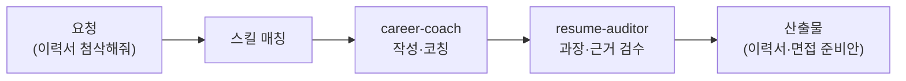

이직을 결심한 날 밤, 몇 년 만에 이력서 파일을 열어 본 적 있으신가요? 어디서부터 고쳐야 할지 막막하고, 면접 예상 질문은 검색할수록 불안만 커지죠. 커리어코치는 그 밤에 옆에 앉아 주는 직원입니다. 운동으로 치면 대회에 대신 나가 주는 것이 아니라, 자세를 교정하고 실전 스파링을 붙어 주는 퍼스널 트레이너입니다.

스킬 5종은 이력서·자기소개서 작성/첨삭, 포트폴리오 구성 가이드, 면접 코칭(예상 질문과 모의 면접), 이직 전략 설계, 주니어 온보딩(입사 초기 90일을 잘 버티는 적응 전략)을 다룹니다. 분명히 해 둘 경계가 있습니다: 이 직원은 **구직자 편**입니다. 지원서를 "받아서 평가하는" 고용주 관점은 [인사·채용 담당](../recruiter/)이 따로 맡습니다. 같은 서류를 반대편에서 보는 두 직원인 셈이라, 커리어코치로 쓴 이력서를 인사·채용 담당의 눈으로 미리 점검해 보는 조합도 가능합니다.

지원 서류는 사실과 다르게 부풀려지는 순간 독이 되기 때문에, 근거 없는 성과 서술을 잡아내는 검수 직원이 붙어 있습니다.

## 스킬 카탈로그

business-\* / career-\* 계열 5종의 전체 목록입니다.



## 에이전트

**career-coach**(실행 직원)가 이력서·자기소개서·포트폴리오·면접 준비를 돕고, **resume-auditor**(검수 직원)가 서류를 독립 검증합니다. 특히 "매출 300% 성장 주도" 같은 문장에 근거가 있는지, 채용 담당자가 봤을 때 의심스러운 과장이 없는지를 다른 눈으로 확인합니다.



## 대표 시나리오 3선

**1. 경력 이력서 리뉴얼.** "5년 차 마케터인데 이 이력서 첨삭해줘. 지원 공고는 이거야"라고 하면 `business-resume-builder`가 공고 요건에 맞춰 성과 중심으로 재구성하고, resume-auditor가 근거 없는 서술을 걸러 냅니다.

**2. 면접 전날 모의 면접.** "내일 이 회사 면접인데 예상 질문 뽑고 연습 상대 해줘"라고 요청하면 `business-interview-coach`가 공고·이력서 기반 예상 질문을 만들고 답변을 함께 다듬습니다.

**3. 이직 타이밍 전략.** "지금 이직하는 게 맞을까? 연차랑 시장 상황 보고 조언해줘"라고 하면 `career-transition-strategist`가 현재 커리어 자산과 목표를 정리해 이동 경로 시나리오를 제시합니다. 입사가 결정되면 `career-junior-onboarding`이 첫 90일 적응 전략으로 이어집니다.

**잘 안 될 때** — 첨삭 결과가 밋밋하면 재료 부족이 원인인 경우가 많습니다. 담당 업무 나열 대신 "무엇을, 어떻게, 그래서 어떤 숫자가 바뀌었는지" 에피소드를 2~3개 먼저 적어 주고 다시 요청해 보세요.
