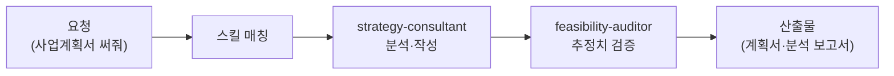

창업을 준비하다 보면 질문이 꼬리를 뭅니다. "이 시장이 정말 돈이 될까?", "사업계획서는 어디서부터 써야 하지?", "받을 수 있는 정부 지원사업이 있다던데 뭐가 나한테 맞지?" 컨설턴트는 이 질문들을 함께 붙잡고 늘어지는 직원입니다. 등산으로 치면 정상까지 대신 올라 주는 것이 아니라, 지도를 펴고 코스와 날씨와 준비물을 함께 점검해 주는 산악 가이드입니다.

스킬 6종은 사업계획서 작성, 비즈니스 모델 설계, 시장 분석(TAM/SAM/SOM — 전체 시장·유효 시장·실제 도달 가능한 시장 규모를 3단계로 나눠 추정하는 방법), 경영 진단 브리프, 정부 지원사업 매칭, 상권분석 보고서(소상공인시장진흥공단 데이터 기반)를 다룹니다. 예비 창업자부터 이미 가게를 운영 중인 소상공인까지, "전략"이라는 말이 부담스러운 분들도 자연어로 편하게 쓸 수 있게 설계되어 있습니다.

시장 규모 추정과 매출 전망은 낙관 편향이 스미기 가장 쉬운 영역이라, 숫자를 의심하는 검수 직원이 반드시 붙습니다.

## 스킬 카탈로그

business-\* 계열 전략 스킬 6종의 전체 목록입니다.



## 에이전트

**strategy-consultant**(실행 직원)가 사업계획서·비즈니스 모델·시장 분석을 만들고, **feasibility-auditor**(검수 직원)가 읽기 전용으로 시장 규모 계산, 매출 전망, 지원사업 자격 매핑을 독립 검증합니다. "이 숫자는 어디서 나왔나?"를 집요하게 묻는 역할입니다.



## 대표 시나리오 3선

**1. 창업 아이디어 검증.** "직장인 대상 도시락 구독 사업, 될까?"라고 물으면 `business-startup-launchpad`가 아이디어를 구조화하고 `business-market-analyst`가 TAM/SAM/SOM으로 시장 크기를 추정합니다. feasibility-auditor가 추정 근거의 비약을 짚어 줍니다.

**2. 정부 지원사업 찾기.** "예비창업자인데 신청할 수 있는 지원사업 찾아줘"라고 하면 `business-kr-gov-grant`가 업력·업종·지역 조건에 맞는 후보를 정리하고 신청 준비물을 안내합니다. 공고 마감일과 세부 자격은 반드시 원문 공고에서 재확인하세요.

**3. 입지 상권분석.** "이 동네에 카페 열려고 하는데 상권 분석해줘"라고 요청하면 `business-sbiz365-analyst`가 유동인구·경쟁 밀도·업종 매출 데이터를 바탕으로 보고서를 만듭니다.

**잘 안 될 때** — 시장 규모가 터무니없이 크게 나오면 SOM(실제 도달 가능 시장) 정의를 좁혀 다시 요청하세요. "전국"이 아니라 "우리 동네 반경 3km"처럼 범위를 못 박으면 추정이 현실적으로 바뀝니다.
