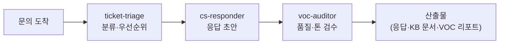

고객 문의는 늘 한꺼번에 몰려옵니다. 단순 배송 문의와 환불 요청, 그리고 당장 불이 붙은 VIP 컴플레인이 같은 받은편지함에 섞여 있죠. CS매니저는 이 편지함을 대신 열어 주는 직원입니다. 응급실의 트리아지 간호사가 환자를 중증도 순으로 분류하듯, 문의를 급한 것과 미룰 수 있는 것으로 나누고 각각의 응답 초안까지 준비해 줍니다.

스킬 6종은 티켓 트리아지(문의를 유형·긴급도별로 분류하는 작업), 응답 초안, 에스컬레이션(현장에서 해결이 어려운 건을 윗선이나 담당 부서로 넘기는 절차) 관리, 지식베이스(자주 묻는 질문과 해결책을 모아 둔 문서 저장소) 작성, VOC(Voice of Customer — 고객의 소리) 분석, 채널 메시지 작성을 다룹니다. 원래 셀러에 있던 VOC·채널 메시지 업무가 이 직원으로 이관되어, [셀러](../seller/)와 짝을 이뤄 쓰기 좋습니다. 셀러가 주문·상품을 맡고 CS매니저가 고객 대화를 맡는 분업입니다.

고객에게 나가는 문장은 회사의 얼굴이기 때문에, 응답 품질을 따로 검사하는 검수 직원이 붙어 있습니다.

## 스킬 카탈로그

business-\* / commerce-\* 계열 고객지원 스킬 6종의 전체 목록입니다.



## 에이전트

**cs-responder**(실행 직원)가 티켓 분류·응답 초안·지식베이스 작성을 수행하고, **voc-auditor**(검수 직원)가 응답 초안의 품질과 톤, VOC 분석의 해석을 독립 검증합니다. 화난 고객에게 나가는 답장일수록 두 번째 눈의 가치가 큽니다.



## 대표 시나리오 3선

**1. 아침 문의함 정리.** "밤새 들어온 문의 분류해서 급한 것부터 알려줘"라고 하면 `business-ticket-triage`가 유형·긴급도별로 정리하고, 각 건의 응답 초안(`business-draft-response`)까지 붙여 줍니다.

**2. VIP 컴플레인 대응.** "단골 고객이 크게 화났어. 어떻게 답하지?"라고 요청하면 `business-escalation-manager`가 사과·보상·재발 방지 구조의 대응안을 잡고, voc-auditor가 톤이 방어적이지 않은지 검수합니다.

**3. 반복 문의를 지식베이스로.** "이번 달 문의 중 반복되는 것 모아서 FAQ로 만들어줘"라고 하면 `commerce-voc-triage`가 반복 패턴을 뽑고 `business-kb-article`이 FAQ 문서로 정리합니다.

**잘 안 될 때** — 응답 초안의 톤이 회사 스타일과 다르면, 잘 쓴 기존 답변 2~3개를 예시로 붙여 "이 톤으로"라고 요청하세요. 예시 한두 개가 긴 설명보다 효과적입니다. 그리고 환불·보상처럼 금전이 걸린 답변은 발송 전 반드시 사람이 최종 확인해야 합니다.
