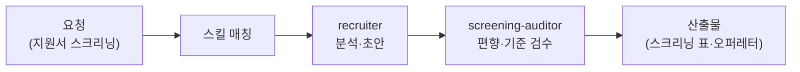

사람을 뽑는 일은 회사의 가장 큰 투자이면서, 정작 담당자는 서류 더미에 파묻히기 쉬운 일입니다. 지원서 수십 통을 읽고, 공고 문구를 다듬고, 합격자에게 보낼 오퍼레터(채용 조건을 담은 제안서)를 쓰고, 입사 후에는 성과평가 양식까지. 인사·채용 담당은 이 채용 파이프라인 전체를 받아 주는 직원입니다. 맛집 주방으로 치면, 재료(지원서)를 다듬어 셰프(면접관)가 요리에만 집중할 수 있게 해 주는 프렙 담당입니다.

스킬 6종은 채용 공고 분석, 이력서 스크리닝(요건 대비 지원서를 1차 분류하는 작업), 오퍼레터/근로계약서 초안, 성과평가 설계, People Ops(입퇴사·근태 등 인사 운영 실무)를 다룹니다. 중요한 경계가 하나 있습니다: 이 직원은 **고용주 편**입니다. 이력서를 "쓰는" 구직자 관점 지원은 [커리어코치](../career/)로 분리되어 있습니다. 같은 이력서를 놓고도 뽑는 쪽과 지원하는 쪽의 이해관계가 다르기 때문입니다.

채용 판단은 사람의 인생이 걸린 결정이라, 스크리닝 결과를 재검토하는 검수 직원이 붙습니다.

## 스킬 카탈로그

business-\* 계열 인사 스킬 6종의 전체 목록입니다.



## 에이전트

**recruiter**(실행 직원)가 공고 분석·스크리닝·오퍼레터·평가 설계를 수행하고, **screening-auditor**(검수 직원)가 스크리닝 결과를 독립 검증합니다. 특히 평가 기준이 일관되게 적용됐는지, 무관한 요소가 판단에 스며들지 않았는지를 다른 눈으로 다시 봅니다.



## 대표 시나리오 3선

**1. 공고 품질 점검.** "이 채용 공고 지원자 입장에서 어떻게 보이는지 분석해줘"라고 하면 `business-job-analyzer`가 요건의 모호한 부분과 매력 포인트 누락을 짚어 개선안을 제시합니다.

**2. 지원서 1차 스크리닝.** "지원서 20건을 이 요건 기준으로 분류해줘"라고 요청하면 `business-resume-screener`가 요건 충족도 기준으로 서류를 분류하고 판단 근거를 표로 남깁니다. 최종 합불 판단은 반드시 사람이 합니다.

**3. 오퍼레터와 계약서 초안.** "합격자에게 보낼 오퍼레터 초안 만들어줘. 연봉과 입사일은 이렇고"라고 하면 `business-draft-offer`와 `business-employment-manager`가 조건이 명확히 담긴 초안을 만들어 줍니다.

**잘 안 될 때** — 스크리닝 결과가 기대와 다르면 요건 정의가 모호한 경우가 대부분입니다. "필수 요건"과 "우대 요건"을 명확히 나눠 다시 요청해 보세요. 또한 근로계약서 초안은 노무사 검토를 거쳐 사용하는 것이 안전합니다.
