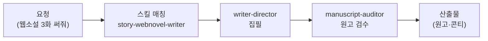

책 한 권, 웹툰 한 편이 세상에 나오기까지는 글쓰기 말고도 수많은 공정이 있습니다. 컨셉 기획, 목차 설계, 출판사 제안서, 회차 구성, 콘티, 표지 시안, 그리고 끝없는 퇴고. 작가 직원은 이 전 공정을 함께 뛰는 창작 파트너입니다. 요리로 치면 레시피 개발부터 플레이팅까지 옆에서 거드는 수셰프에 가깝습니다 — 맛의 최종 결정은 언제나 셰프(작가 본인)의 몫이지만, 준비와 정리는 훨씬 빨라집니다.

스킬은 크게 두 갈래입니다. 출판 계열(book-\*)은 컨셉 기획·목차·챕터 집필·출판사 매칭·퇴고 코칭을, 스토리 계열(story-\*)은 웹툰·웹소설·시나리오·콘티·표지·IP 피치(작품을 영상화·게임화 등으로 파는 제안 자료)를 다룹니다. 여기에 한국어 인문화 윤문(AI가 쓴 티를 지우고 사람 글처럼 다듬는 후처리)과 맞춤법 점검이 더해져 총 23종입니다. Higgsfield MCP(클로드가 외부 서비스와 연결되는 표준 통로)로 이미지·영상 생성도 연동됩니다.

특히 이 직원에는 검수 전담 에이전트가 따로 있어서, 원고를 "쓰는 눈"과 "읽는 눈"이 분리되어 있다는 점이 특징입니다.

## 스킬 카탈로그

출판(book-\*) 8종 + 스토리(story-\*) 12종 + 윤문·맞춤법 계열로 구성됩니다.



## 에이전트

작가 직원은 실행 직원과 검수 직원을 분리해 둡니다. **writer-director**가 기획·집필을 수행하고, **manuscript-auditor**는 읽기 전용(readonly) 권한으로 원고·회차·시나리오·출판 제안서를 회의적인 시선으로 검사합니다. 쓴 사람이 스스로 채점하지 않게 만드는 구조라, 설정 붕괴나 개연성 구멍을 잡는 데 유리합니다.



## 대표 시나리오 3선

**1. 출판 기획부터 제안서까지.** "30대 직장인 대상 재테크 에세이를 쓰고 싶어"라고 하면 `book-concept-planner` → `book-target-reader` → `book-outline-designer` → `book-proposal-writer` 흐름으로 컨셉·독자 정의·목차·출판사 제안서가 순서대로 나옵니다.

**2. 웹툰 시즌 기획과 회차 집필.** "로맨스 판타지 웹툰 시즌 1 기획해줘"라고 요청하면 `story-webtoon-planner`가 시즌 구조를, `story-character-sheet`가 캐릭터 시트를, `story-webtoon-episode`가 회차 대본을 만들어 줍니다. 콘티(`story-conti`)와 표지 시안(`story-cover-art`)까지 이어집니다.

**3. AI 티 지우기 퇴고.** 초고를 붙여 넣고 "사람이 쓴 것처럼 다듬어줘"라고 하면 `general-humanize-korean`이 의미와 사실은 보존한 채 기계적인 문장 패턴만 걷어냅니다.

**잘 안 될 때** — 긴 원고를 한 번에 요청하면 중간에 흐름이 끊길 수 있습니다. 챕터·회차 단위로 나눠 요청하고, 앞 회차 요약을 함께 붙여 주면 일관성이 크게 좋아집니다.

## MCP 연동

- **higgsfield** — Higgsfield 이미지·영상 생성 서비스와 연결되어 표지 시안, 웹툰 아트, 프리비즈(영상화 전 미리보기) 제작에 쓰입니다. Higgsfield 계정 인증이 필요합니다.
