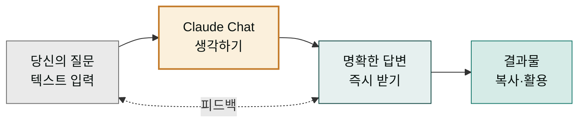

Claude Chat은 대화형 AI 어시스턴트로, 텍스트 기반의 자연스러운 상호작용을 통해 작성, 분석, 문제 해결, 브레인스토밍 등 다양한 작업을 수행할 수 있습니다.

## Claude Chat이란 — 살아 있는 백과사전 같은 AI 친구

백과사전을 켜서 질문하면 일방적으로 답변을 읽는 것과 달리, Claude Chat은 당신과 실시간으로 대화합니다. "이메일 초안을 써 줄 수 있나요?", "이 계약서를 쉽게 설명해 줄 수 있나요?", "내일 회의에서 어떻게 설명할까?" 같은 질문에 바로 답변하고, 당신의 피드백에 따라 그 자리에서 다시 수정합니다.

Claude Chat의 특징:
- **자연스러운 대화**: 일상의 말 그대로 입력하면 됨
- **깊이 있는 이해**: 복잡한 문서나 개념을 읽고 설명
- **즉시 실행**: 작업 결과를 바로 가져올 수 있음
- **개인화 가능**: 당신의 스타일에 맞게 조정 가능

Claude Chat은 생각을 정리하는 데 도움을 주는 똑똑한 친구 같은 존재입니다.

## 주요 기능

| 기능 | 설명 | 예시 |
|---|---|---|
| **텍스트 작성** | 이메일, 문서, 카피 작성 | "광고 카피 10개를 만들어 줄 수 있나요?" |
| **분석·요약** | 긴 텍스트를 읽고 핵심 정리 | "이 계약서의 핵심 조항을 3줄로 정리해 줘" |
| **설명·학습** | 개념을 쉽게 설명 | "인공지능이 뭔가요?" |
| **코드 도움** | 코드 작성·버그 수정 | "Python에서 CSV를 읽는 코드를 보여 줘" |
| **브레인스토밍** | 아이디어 생성 | "마케팅 캠페인 아이디어 10개를 제안해 줘" |
| **파일 분석** | 업로드한 파일 읽기·분석 | 이미지, PDF, 문서 분석 |

## 읽는 순서

처음이라면 아래 순서를 권장합니다. 특히 ②와 ③은 이 섹션의 두 기둥입니다 — **프롬프트 작성법**은 "요청 문장을 어떻게 쓸까"를, **컨텍스트 엔지니어링 기초**는 "Claude가 무엇을 아는 상태에서 요청을 받게 할까"를 다룹니다. 이 두 가지만 익혀도 결과 품질이 눈에 띄게 달라집니다.

1. **[첫 대화 시작하기](first-chat/)** — Claude Desktop을 열고 처음 대화를 시작하는 법
2. **[프롬프트 작성법](prompts/)** — 더 잘 부탁하는 기초 5원칙 (프롬프트 엔지니어링)
3. **[컨텍스트 엔지니어링 기초](context-engineering/)** — Claude의 작업 기억을 관리하는 법
4. **[Projects 기능](projects/)** — 대화와 파일을 주제별로 정리하는 법
5. **[주요 기능 살펴보기](features/)** — 파일 첨부, 이미지 분석, 음성 모드 등
