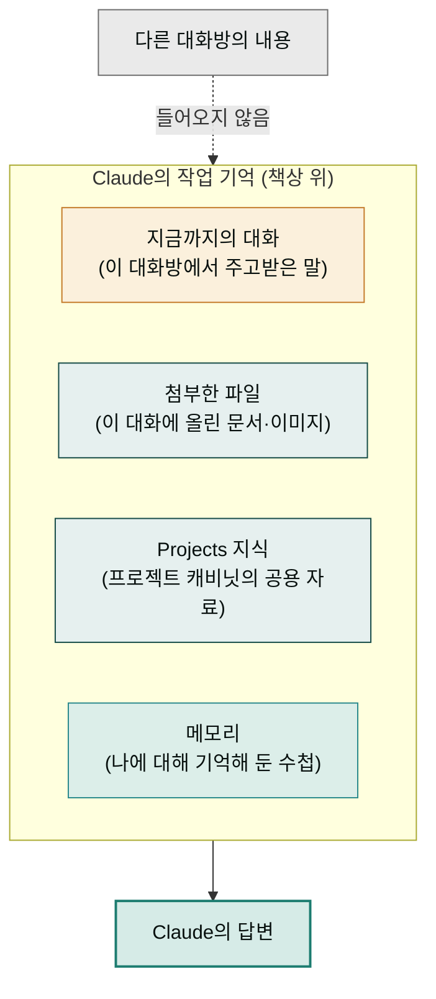

좋은 프롬프트를 쓰는 법을 익혔다면, 그다음 단계는 **Claude가 지금 무엇을 알고 있는 상태에서 내 요청을 받는가**를 관리하는 일입니다. Claude가 지금 이 순간 참고할 수 있는 정보 전체 — 지금까지의 대화 내용, 첨부한 파일, 프로젝트에 올려둔 자료 — 를 **컨텍스트**(context)라고 부릅니다. 그리고 이 컨텍스트를 알맞게 채우고 비우는 기술이 **컨텍스트 엔지니어링**입니다.

비유하자면 컨텍스트는 Claude의 **책상 위**입니다. 아무리 유능한 직원이라도 책상 위에 없는 서류는 참고할 수 없고, 반대로 책상이 서류 더미로 뒤덮이면 정작 중요한 한 장을 놓칩니다. 좋은 결과의 절반은 좋은 요청(프롬프트)에서, 나머지 절반은 책상 위 정리(컨텍스트)에서 나옵니다.

한 가지 더 알아둘 것은 책상의 **크기가 정해져 있다**는 점입니다. 대화가 아주 길어지거나 큰 파일을 여러 개 올리면 책상이 가득 차서, Claude가 오래된 내용을 흐릿하게 기억하거나 응답이 느려질 수 있습니다. 그래서 "무엇을 올릴까"만큼 "무엇을 올리지 않을까"도 중요합니다.

## 무엇이 컨텍스트에 들어가나

핵심은 마지막 회색 상자입니다. **다른 대화방의 내용은 기본적으로 컨텍스트에 들어오지 않습니다.** 어제 다른 대화에서 열심히 설명한 내용을 오늘 새 대화의 Claude는 모릅니다(메모리에 저장된 것 제외). "지난번에 말했잖아"가 통하지 않는 이유이고, 아래 네 가지 도구를 구분해 쓰는 이유입니다.

## 네 가지 도구, 각각 언제 쓰나

### 파일 첨부 — 이번 대화에서만 쓸 자료

클립(📎) 버튼으로 올리는 파일은 **그 대화방 책상 위에만** 올라갑니다. 한 번 보고 말 자료 — 이번에 검토할 계약서, 오늘 요약할 회의록 — 에 알맞습니다. 다른 대화에서는 다시 올려야 합니다.

**이럴 때**: "이 견적서(첨부) 검토해줘" — 검토가 끝나면 다시 볼 일 없는 일회성 자료.

### Projects 지식 — 계속 쓸 공용 자료

같은 자료를 대화마다 반복해 올리고 있다면 그 자료는 [Projects](../projects/)의 지식(캐비닛)으로 옮길 신호입니다. 프로젝트에 올린 자료는 그 프로젝트 안의 **모든 대화**에서 자동으로 참고됩니다.

**이럴 때**: 회사 소개서, 제품 가격표, 어투 가이드 — 어느 대화에서든 전제가 되는 자료.

### 대화 이어가기 — 맥락이 쌓인 주제

같은 주제의 후속 작업은 새 대화 대신 **기존 대화**에서 이어가세요. 앞선 논의·수정 이력이 전부 책상 위에 있으니 "아까 두 번째 버전에서 마지막 문단만 바꿔줘" 같은 요청이 통합니다. 단, 주제가 바뀌면 새 대화를 여는 것이 좋습니다 — 다른 주제의 서류가 책상에 섞이면 정확도가 떨어집니다.

**이럴 때**: 보고서 초안 → 수정 → 최종본처럼 한 산출물을 여러 번 다듬는 작업.

### 메모리 — 나에 대한 상시 정보

자료가 아니라 **나 자신에 대한 정보** — 선호 어투, 직무, 우리 회사 업종 — 는 [메모리](../memory/)에 맡기세요. "앞으로 기억해줘: 내 보고서는 항상 3단 구성"이라고 말해두면 어떤 새 대화에서도 적용됩니다.

**이럴 때**: 프로젝트를 가리지 않고 항상 똑같이 적용됐으면 하는 개인 취향·기본 정보.

| 도구 | 적용 범위 | 이런 정보에 |
|---|---|---|
| 파일 첨부 | 이 대화만 | 일회성 검토 자료 |
| Projects 지식 | 프로젝트 안 모든 대화 | 반복 참고하는 공용 자료 |
| 대화 이어가기 | 이 대화만 | 진행 중인 작업의 수정 이력 |
| 메모리 | 모든 대화 | 나의 취향·기본 정보 |

## 긴 문서 다루는 요령

100쪽짜리 보고서나 수십 개 파일을 다룰 때는 두 가지 요령이 결과 품질을 크게 좌우합니다.

**첫째, 나눠서 요청하세요.** "이 100쪽을 한 번에 다 분석해줘"보다 "먼저 목차와 각 장의 한 줄 요약만 뽑아줘 → 그중 3장을 자세히 분석해줘"처럼 단계로 나누면, 매 단계 책상 위에 꼭 필요한 부분만 올라가서 훨씬 깊이 있는 답이 나옵니다. [프롬프트 5원칙](../prompts/)의 '단계별 요청'과 같은 원리입니다.

**둘째, 핵심을 먼저 말하세요.** 긴 자료를 올릴 때는 "이 중에서 내가 알고 싶은 건 위약금 조항 하나야"처럼 관심사를 먼저 못 박아 주세요. Claude가 100쪽 전체를 균등하게 훑는 대신 핵심 부분에 집중합니다. 상사가 두꺼운 서류를 건네며 "3장만 보면 돼"라고 말해주는 것과 같습니다.

## 실패 사례: 컨텍스트 과적재와 교정

흔한 실패 장면 하나를 보겠습니다. 한 사용자가 하나의 대화방에서 아침에는 계약서 검토를, 점심에는 블로그 원고를, 오후에는 매출 엑셀 분석을 이어서 시켰습니다. 파일도 그때그때 계속 올렸습니다. 저녁쯤 "아까 그 문단 고쳐줘"라고 하자 Claude가 블로그가 아닌 계약서 문장을 고쳐 왔고, 매출 분석에는 블로그의 과장된 어투가 섞여 나왔습니다.

원인은 단순합니다 — **책상 위에 서로 무관한 서류 세 무더기가 쌓여 있었기 때문**입니다. 대화가 길어질수록 "아까 그것"이 가리키는 대상은 흐려지고, 앞 주제의 말투와 내용이 뒤 주제로 새어 들어갑니다.

교정 방법은 다음과 같습니다.

1. **주제마다 새 대화** — 계약서·블로그·매출 분석은 각각 다른 대화방에서. 대화방 이름을 주제로 바꿔두면 나중에 찾기도 쉽습니다.
2. **반복 자료는 Projects로** — 세 주제 모두에서 참고하는 회사 기본 정보는 프로젝트 지식에 한 번만.
3. **길어진 대화는 요약 후 이사** — 이미 뒤섞였다면 "지금까지 결정된 사항만 요약해줘"라고 받아서, 그 요약을 들고 새 대화에서 다시 시작하세요. 책상을 한 번 싹 치우고 필요한 메모 한 장만 옮기는 셈입니다.

**잘 안 될 때** — 대화가 길어지며 응답이 느려지거나 앞 내용을 잊은 듯하면, 그것이 바로 책상이 가득 찼다는 신호입니다. 위 3번 요령(요약 후 새 대화)으로 옮기면 대부분 해결됩니다.

## 다음 단계

- **[Projects 기능](../projects/)** — 캐비닛(지식) 만들고 관리하는 법
- **[메모리 기능](../memory/)** — 기억시키기·확인·삭제하는 법
- **[프롬프트 작성법](../prompts/)** — 요청 문장 자체를 다듬는 5원칙
