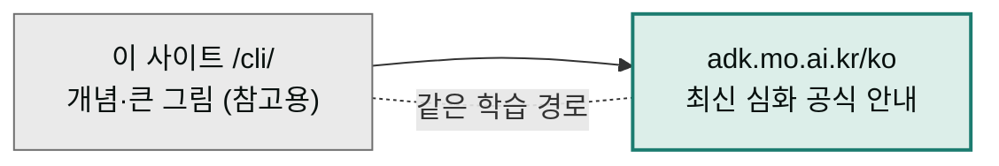

터미널에서 Claude Code와 MoAI를 다루는 개발자를 위한 축입니다. 명령어 한 줄로 코드를 짜고, 테스트를 돌리고, 개발 사이클 전체를 자동화하는 세계 — 그 심화 학습은 이제 전용 사이트에서 이어집니다.

## 최신 심화 문서는 여기서 보세요


**<https://adk.mo.ai.kr/ko>**

Claude Code 설치·설정·워크플로우부터 MoAI-ADK의 `/moai plan → run → sync` 개발 사이클까지, 개발자용 심화 문서 전체가 한국어로 정리되어 있습니다. CLI 관련 최신 내용은 항상 이 사이트가 기준입니다.


이 사이트(`모두의 클로드`)의 `/cli` 하위 문서들은 **참고용**으로 유지됩니다. 큰 그림과 개념 잡기에는 여전히 유용하지만, 명령어 옵션이나 세부 절차처럼 자주 바뀌는 내용은 위의 adk.mo.ai.kr/ko 문서가 더 최신입니다. 두 사이트가 다르게 말한다면 adk.mo.ai.kr/ko를 따르세요.

## 이 축의 참고 섹션

아래 다섯 섹션은 읽는 순서가 곧 난이도 상승 경로입니다. 개념과 흐름 위주로 훑고, 세부는 공식 안내 문서로 넘어가는 동선을 권합니다.

| 순서 | 섹션 | 다루는 질문 |
|------|------|------------|
| 1 | [시작하기](./start/) | CLI 환경은 무엇이고, 어떻게 설치해서 처음 실행하는가? |
| 2 | [핵심 개념](./concepts/) | MoAI-ADK의 SPEC·DDD·TRUST 5 설계 철학은 무엇인가? |
| 3 | [일상 사용](./daily/) | 매일 반복해서 쓰는 명령어 흐름은 어떻게 짜는가? |
| 4 | [MoAI-ADK](./moai-adk/) | `/moai plan → run → sync` 개발 사이클은 어떻게 돌아가는가? |
| 5 | [레퍼런스](./reference/) | CLI 명령어 색인, 비용 최적화, 고급 주제는 어디서 찾는가? |

## 다음 단계

- **Claude Code가 처음이라면** → <https://adk.mo.ai.kr/ko>에서 설치 안내부터 시작하세요.
- **개념을 먼저 잡고 싶다면** → 이 사이트의 [핵심 개념](./concepts/)을 읽고 공식 안내 문서로 넘어가세요.
- **데스크탑 앱에서 플러그인으로 개발 사이클을 쓰고 싶다면** → [플러그인 설치·운용](/plugins/)에서 `moai` 플러그인을 설치하세요.

---

### Sources

- 클로드 코드 한국어 공식 안내 문서: <https://adk.mo.ai.kr/ko>
- Claude Code 공식 문서(영문): <https://code.claude.com/docs>
