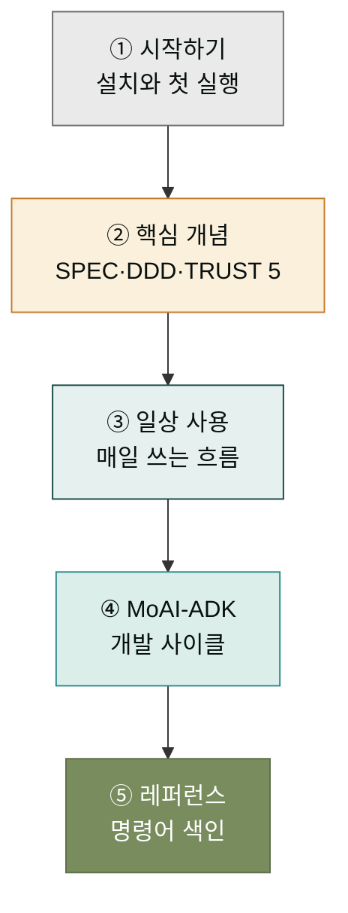

## 왜 CLI 축이 따로 있을까요?

`모두의 클로드` 사이트는 두 종류 사용자를 동시에 돕고 있습니다. 한 부류는 Claude Desktop 앱으로 시작하는 비개발자이고, 다른 한 부류는 **터미널에서 명령어를 직접 치는 개발자**입니다. 두 부류가 만나는 Claude의 지능은 같지만, 작업 환경이 달라 익숙한 동선도 다릅니다. 이 CLI 축은 후자 — 데스크탑 앱이 아니라 **명령어와 바이너리**로 Claude와 MoAI를 다루는 분들을 위한 학습 경로입니다.

이미 데스크탑 축의 [Code 섹션](../code/)에서 Claude Code의 기본기를 다뤘다면, 이 CLI 축은 그 다음 단계에 해당합니다. Code 섹션이 "처음 코딩 보조 도구로 Claude Code를 써 보자"라는 입문이라면, CLI 축은 "이제 명령어 라인에서 MoAI의 개발 사이클까지 끌어올려 보자"는 심화입니다. 두 축은 경쟁이 아니라 연속선입니다 — 같은 Claude 엔진 위에 더 정밀한 제어 층이 올라가는 구조입니다.

## 이 축의 5개 섹션

이 CLI 축은 다음 5개 섹션으로 구성되어 있으며, 읽는 순서가 곧 학습 난이도 상승 경로입니다. 한 섹션을 마치면 자연스럽게 다음 섹션으로 넘어가는 동선으로 설계했습니다.

| 순서 | 섹션 | 다루는 질문 |
|------|------|------------|
| 1 | [시작하기](./start/) | CLI 환경은 무엇이고, 어떻게 설치해서 처음 실행하는가? |
| 2 | 핵심 개념 | MoAI-ADK의 SPEC·DDD·TRUST 5 설계 철학은 무엇인가? |
| 3 | 일상 사용 | 매일 반복해서 쓰는 명령어 흐름은 어떻게 짜는가? |
| 4 | MoAI-ADK | `/moai plan → run → sync` 개발 사이클은 어떻게 돌아가는가? |
| 5 | 레퍼런스 | CLI 명령어 색인, 비용 최적화, 고급 주제는 어디서 찾는가? |

각 섹션은 단순한 명령어 사전이 아니라, "왜 이 명령어가 존재하는가 — 언제 쓰는가 — 어떻게 쓰는가"를 잇는 이야기로 쓰였습니다. 명령어 자체는 레퍼런스 섹션에서 한꺼번에 정리하므로, 앞의 4개 섹션에서는 흐름과 맥락에 집중해 주세요.

## 이 축의 독자

이 CLI 축은 다음과 같은 분들을 가정하고 씁니다.

- **데스크탑 Code 섹션을 마친 초보 개발자** — Claude Code의 기본기를 익혔고, 이제 MoAI의 구조적 개발 사이클까지 넘어가려는 분.
- **기존 CLI 친숙 개발자** — 터미널로 코딩하는 것에 거부감이 없고, Claude Code + MoAI 조합으로 생산성을 올리려는 분.
- **플러그인에서 바이너리로 넘어가는 사용자** — 데스크탑에서 moai-code 플러그인을 쓰다가, `moai` 바이너리까지 설치해 더 강력한 자동화를 원하는 분.

세 부류 모두를 위해 톤은 "친화적 기술 용어"를 유지합니다. 개발 용어는 정확히 쓰되, 그 용어가 왜 필요한지를 비유로 풀어 설명하는 방식입니다.

## 학습 경로 추천

처음 이 CLI 축에 들어온 분이라면 다음 동선을 권합니다. 한 페이지를 읽고 다음 페이지로 넘어가는 자연스러운 동선입니다.

이 동선을 따라가면, 설치 직후 막막했던 CLI 환경이 "왜 이 명령어가 있는지, 언제 치는지"까지 자기 것으로 만들 수 있습니다. 특별히 급한 분은 레퍼런스 섹션부터 훑어도 좋지만, 맥락 없이 명령어만 외우면 결국 다시 돌아오게 되므로 한 번은 순서대로 읽기를 권합니다.

## 다음 단계

가장 먼저 할 일은 CLI 환경을 갖추는 것입니다. 아직 Claude Code를 설치하지 않았다면 [시작하기](./start/) 섹션의 설치 페이지로 들어가세요. 이미 Claude Code는 있고 MoAI-ADK 바이너리만 더하고 싶다면, [핵심 개념](./concepts/)에서 MoAI의 설계 철학을 먼저 읽고 [MoAI-ADK 섹션](./moai-adk/)으로 건너뛰는 동선도 가능합니다.

---

### Sources

- Claude Code 공식 문서: <https://code.claude.com/docs>
- MoAI-ADK CLI 명령어 원본 문서: <https://adk.mo.ai.kr/ko/workflow-commands/>
- 데스크탑 Code 섹션 (이 축의 입문 편): [`/code/`](../../code/)
