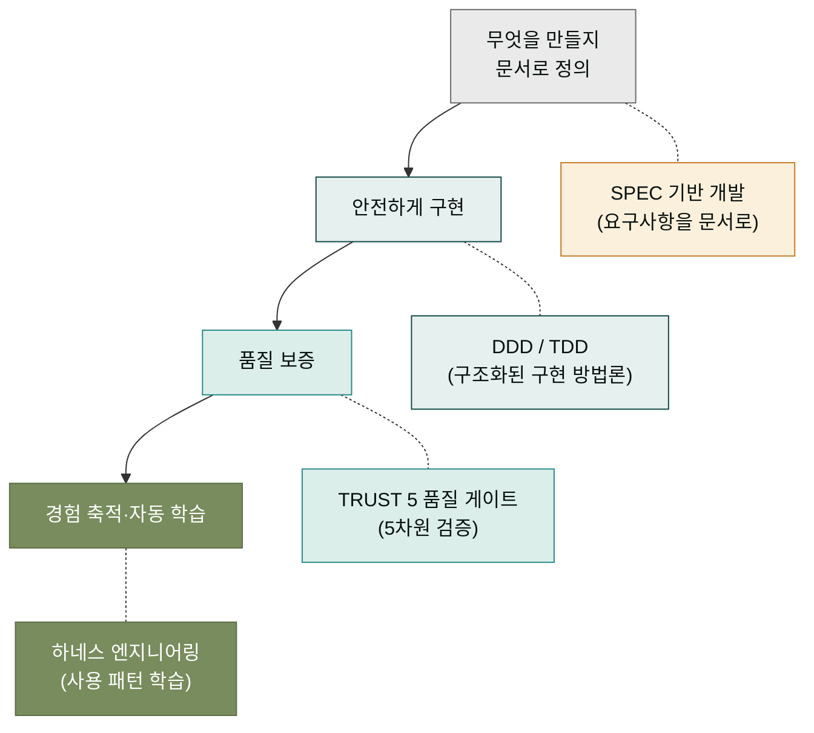

## 핵심 개념 섹션이 필요한 이유

CLI 축의 첫 단계에서 `/moai plan → run → sync` 사이클을 한 번 돌려보았습니다. 사이클의 형태는 체감했지만, "왜 하필 이 세 단계인가", "왜 SPEC이라는 문서 양식이 필요한가", "왜 자동으로 테스트를 검증하는가" 같은 질문은 여전히 남습니다. 이 핵심 개념 섹션은 그 '왜'에 답합니다.

왜를 알아야 하는 이유는 단순합니다. MoAI의 명령어는 그 자체로는 외울 것이 많아 보이지만, 설계 원리 몇 가지로 압축됩니다. 원리를 알면 명령어가 체계로 정렬되어 외우지 않아도 됩니다. 반대로 원리 없이 명령어만 외우면 비슷한 상황에서 매번 문서를 찾아야 합니다. 이 섹션이 그 원리를 한 번에 정리해 주는 자리입니다.

## 4가지 핵심 개념 미리보기

이 섹션은 4가지 개념을 다룹니다. 각각 독립된 페이지에서 자세히 다루고, 이 인덱스 페이지에서는 그 관계를 한눈에 봅니다.

이 4개의 개념은 위에서 아래로 흐르는 한 줄의 이야기로 읽을 수 있습니다. "무엇을 만들지 **정의**하고(SPEC), **안전하게** 구현하며(DDD/TDD), **품질**을 보증하고(TRUST 5), 그 과정의 **경험을 축적**한다(하네스)." 이 한 줄이 MoAI의 전부입니다. 모든 명령어는 이 흐름의 어디엔가 속합니다.

## 학습 순서

각 개념은 순서대로 읽는 것을 권합니다. 앞 개념이 뒤 개념의 전제가 되기 때문입니다.

| 순서 | 페이지 | 다루는 질문 |
|------|--------|------------|
| 1 | [SPEC 기반 개발](./spec-system.md) | 요구사항을 어떻게 명확하게 정의하고 관리하는가? |
| 2 | [DDD와 TDD](./ddd-tdd.md) | 기존 코드를 망가뜨리지 않고 어떻게 개선하는가? |
| 3 | [TRUST 5 품질 게이트](./trust5.md) | 코드 품질을 어떤 기준으로 보장하는가? |
| 4 | [하네스 엔지니어링](./harness.md) | 사용자의 경험을 시스템이 어떻게 학습하는가? |

각 페이지는 앞 페이지의 개념 위에 다음 개념을 얹습니다. 예를 들어 TRUST 5를 이해하려면 DDD가 무엇인지 알아야 하고, DDD를 이해하려면 SPEC이 무엇인지 알아야 합니다. 처음부터 순서대로 읽으면 자연스럽게 한 편의 이야기처럼 읽힙니다.

## 데스크탑 축과의 연결

이 4가지 개념은 CLI 축만의 것이 아닙니다. 데스크탑 Code 섹션을 거쳐 온 독자라면 이미 "Claude가 코드를 읽고 수정하는구나" 정도는 체감했을 것입니다. 이 핵심 개념 섹션은 그 체감 위에 "그렇다면 왜 구조화된 사이클이 필요한가"라는 다음 단계 질문에 답합니다.

데스크탑 Code 섹션이 "Claude Code를 처음 써 보자"라면, 이 핵심 개념 섹션은 "Claude Code를 더 잘 쓰기 위해 어떤 구조가 도움이 되는가"를 다룹니다. 같은 도구를 다루되 관점이 다른 것입니다. 이 관점 차이가 이해되면, 왜 CLI 환경이 데스크탑 환경의 '심화'에 해당하는지도 자연스럽게 잡힙니다.

## 다음 단계

[SPEC 기반 개발](./spec-system.md)부터 시작합시다. SPEC은 MoAI 사이클의 출발점이며, SPEC 없이는 DDD도 TRUST 5도 이야기할 수 없습니다.

---

### Sources

- MoAI-ADK 핵심 개념 원본 문서: <https://adk.mo.ai.kr/ko/core-concepts/>
- SPEC 기반 개발 상세: <https://adk.mo.ai.kr/ko/core-concepts/spec-based-dev/>
- TRUST 5 품질 시스템: <https://adk.mo.ai.kr/ko/core-concepts/trust-5/>
