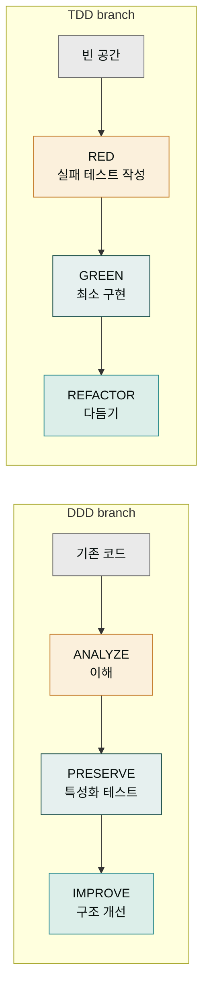
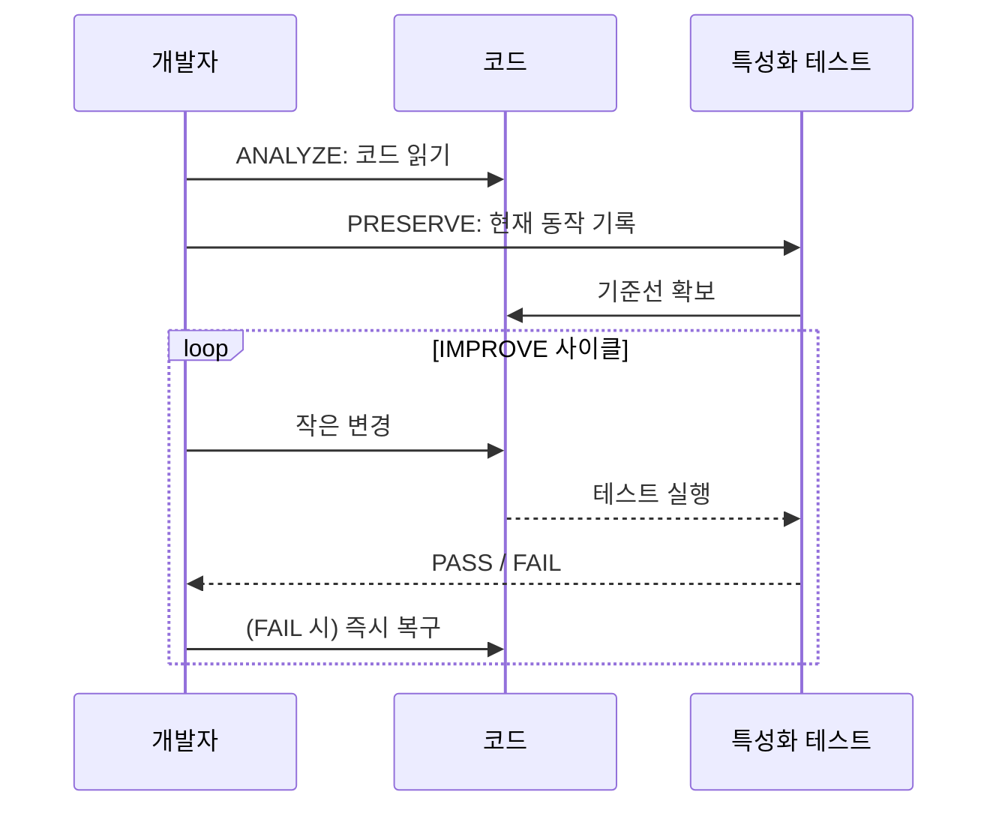
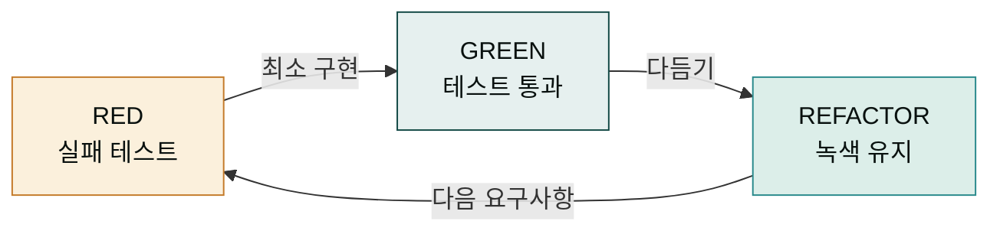

## 두 가지 방법론, 왜 갈라져 있을까

SPEC으로 "무엇을 만들지"는 정했습니다. 다음 문제는 "어떻게 만들 것인가"입니다. 같은 SPEC이라도 접근 방식에 따라 결과가 다릅니다. 빈 공간에서 새로 짜는 경우, 이미 있는 코드를 고치는 경우, 버그를 잡는 경우 — 상황마다 어울리는 방법론이 다릅니다. MoAI는 두 가지 방법론을 상황에 따라 선택해 씁니다.

**DDD**(Domain-Driven Development)는 기존 코드를 안전하게 개선할 때 씁니다. **TDD**(Test-Driven Development)는 새 기능을 처음부터 만들 때 씁니다. 이름이 비슷해 보이지만 출발점이 정반대입니다. DDD는 "이미 있는 행동을 망가뜨리지 않는 것"에서 시작하고, TDD는 "원하는 행동을 먼저 테스트로 정의하는 것"에서 시작합니다.

두 방법론 모두 세 단계를 가집니다. 단계 수는 같지만 각 단계가 하는 일은 다릅니다. 위 다이어그램에서 두 갈래를 비교해 보세요. 왼쪽(DDD)은 이미 있는 코드에서 시작해 그것을 이해하고 보존하고 개선합니다. 오른쪽(TDD)은 빈 공간에서 시작해 테스트를 쓰고 구현하고 다듬습니다.

## DDD — 기존 코드를 다루는 방법

오래된 건물을 리모델링한다고 상상해 봅시다. 무너뜨리고 새로 짓는 것이 가장 빨라 보이지만, 그 건물에 살고 있는 사람들의 생활이 멈춥니다. 그래서 좋은 리모델링은 (1) 현재 구조를 **이해**하고 (2) 거주자의 생활 패턴을 **보존**하며 (3) 구조를 **개선**합니다. DDD는 소프트웨어에서 같은 일을 합니다.

- **ANALYZE (이해)** — 기존 코드가 현재 어떻게 동작하는지 읽어들입니다. 모듈 의존성, 부작용, 암묵적 계약을 파악합니다. 이 단계에서는 고치지 않고 이해에만 집중합니다.
- **PRESERVE (보존)** — 현재 동작을 그대로 잡아둘 **특성화 테스트(characterization test)**를 씁니다. 이 테스트는 "현재 동작이 이렇다"를 기록해 둔 것이지, "이렇게 되어야 한다"는 주장이 아닙니다. 리모델링 중에 행동이 바뀌면 이 테스트가 즉시 알려줍니다.
- **IMPROVE (개선)** — 구조를 조금씩 바꿉니다. 하나 바꾸고 → 테스트 돌리고 → 통과하면 커밋. 이 과정을 반복하면 큰 사고 없이 구조가 개선됩니다.

특성화 테스트가 없는 리팩터링은 "눈 감고 리모델링"과 같습니다. DDD의 핵심은 PRESERVE 단계에서 안전망을 먼저 치는 것입니다. 이 안전망이 있으면 큰 변경도 두려움 없이 진행할 수 있습니다.

## TDD — 새 코드를 다루는 방법

새로 짓는 건물이라면 리모델링 규칙은 필요 없습니다. 대신 건축 도면(테스트)을 먼저 그립니다. "이 기둥은 무게 5톤까지 버텨야 한다"는 도면을 먼저 그리고, 그 도면에 맞게 시공합니다. 도면에 맞지 않으면 시공을 다시 합니다. TDD는 소프트웨어에서 이 방식을 씁니다.

- **RED (실패 테스트 작성)** — 원하는 행동을 테스트로 먼저 씁니다. 아직 구현이 없으므로 이 테스트는 실패합니다. 실패하는 것 자체가 정상입니다.
- **GREEN (최소 구현)** — 테스트를 통과할 최소한의 코드만 씁니다. 화려하게 짜지 않습니다. 통과하면 다음으로 넘어갑니다.
- **REFACTOR (다듬기)** — 테스트가 통과하는 상태를 유지하면서 코드를 다듬습니다. 중복 제거, 이름 개선, 구조 정리. 다듬는 동안 테스트가 계속 녹색이어야 합니다.

이 세 단계를 빠르게 반복하는 것이 TDD의 핵심입니다. 한 번에 큰 덩어리를 구현하지 않고, 작은 단위로 계속 돌립니다. 이렇게 하면 "내가 방금 무엇을 망가뜨렸는지"를 즉시 알 수 있습니다.

## 언제 DDD, 언제 TDD?

선택 기준은 단순합니다. 이미 코드가 있으면 DDD, 새 코드면 TDD. 표로 정리하면 다음과 같습니다.

| 상황 | 추천 | 이유 |
|------|------|------|
| 레거시 코드를 리팩터링 | DDD | 현재 동작을 먼저 잡아야 안전 |
| 테스트 커버리지 < 10%인 기존 프로젝트 | DDD | 안전망부터 깔아야 함 |
| 완전히 새로운 기능 | TDD | 도면부터 그리는 게 자연스러움 |
| 기존 프로젝트에 새 모듈 추가 | TDD | 새 모듈은 빈 공간에서 시작 |
| 버그 수정 | TDD (변형) | 먼저 버그를 재현하는 실패 테스트 작성 |

MoAI는 프로젝트 상태를 보고 자동으로 어느 쪽을 쓸지 추천합니다. `quality.yaml`의 `development_mode` 설정으로 명시적 선택도 가능합니다. 특별한 이유가 없다면 자동 추천을 따르면 됩니다.

## 두 방법론의 공통점 — 작게, 자주, 검증하며

DDD와 TDD는 출발이 달라 보이지만, 핵심 원칙은 같습니다. **작게 나누고, 자주 검증하고, 한 번에 하나만 바꾸는 것.** 이 원칙은 두 방법론 모두에서 반복됩니다. 사이클 한 번에 큰 변화를 만들지 않습니다. 작은 변화를 여러 번 쌓아 큰 결과를 만듭니다.

이 원칙이 중요한 이유는, 인간의 인지 능력이 한 번에 다루기 어려운 복잡함을 소프트웨어 개발이 가지고 있기 때문입니다. 한 번에 큰 것을 바꾸면 어디서 문제가 왔는지 추적이 안 됩니다. 작게 쪼개면 문제가 생겨도 직전 변경만 의심하면 됩니다. 이것이 MoAI가 모든 사이클을 "작게 자주"로 운영하는 이유입니다.

## 다음 단계

이제 "무엇을 만들지(SPEC)"와 "어떻게 만들지(DDD/TDD)"가 정렬되었습니다. 다음은 [TRUST 5 품질 게이트](./trust5.md)에서 그 결과물의 품질을 어떻게 보증하는지를 봅니다. 품질은 '느낌'이 아니라 5가지 차원으로 정의됩니다.

---

### Sources

- DDD 방법론 원본 문서: <https://adk.mo.ai.kr/ko/core-concepts/ddd/>
- TDD 워크플로우 가이드: <https://adk.mo.ai.kr/ko/getting-started/quickstart/>
- MoAI run 단계 상세: <https://adk.mo.ai.kr/ko/workflow-commands/moai-run/>
