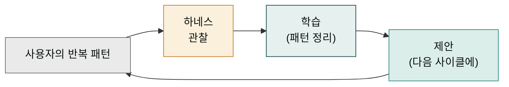
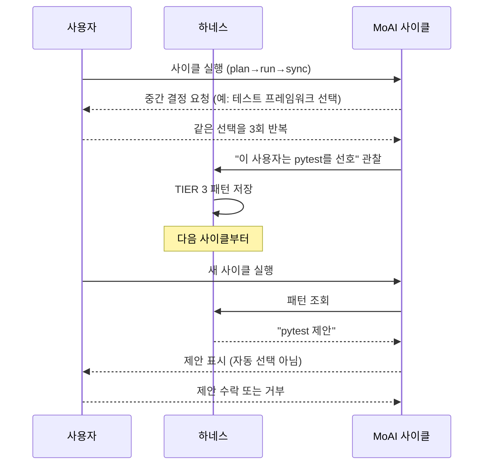
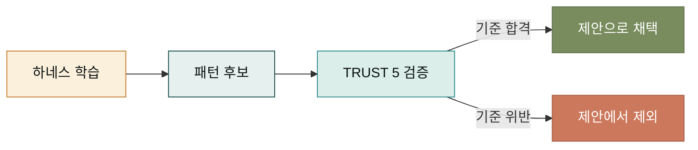

## 하네스가 왜 필요한가 — 선생님의 노하우 비유

경험이 쌓인 선생님은 학생이 어디서 헤맬지 미리 압니다. 매번 같은 실수가 반복되는 지점을 알고, 미리 보충 자료를 준비해 둡니다. 이 선생님의 노하우는 처음부터 있었던 것이 아니라, 수많은 학생을 가르치며 축적된 것입니다. 소프트웨어 개발 도구도 비슷한 노하우를 축적할 수 있으면 좋겠습니다 — 사용자가 반복해서 하는 실수, 반복해서 묻는 질문, 반복해서 쓰는 패턴을 기억해 두면, 다음에는 미리 도움을 줄 수 있습니다.

MoAI의 하네스(harness)가 이 역할을 합니다. 하네스는 사용자와 MoAI 사이에서, 사용자의 패턴을 관찰하고 학습해, 다음 사이클에 제안으로 되돌려주는 서브시스템입니다. 단순한 설정 파일이 아니라, 사용자가 쓸수록 똑똑해지는 '적응형 층'입니다.



이 루프가 계속 돌면, 같은 사용자는 시간이 갈수록 더 빠르게 작업하게 됩니다. 반복 결정을 하네스가 대신 제안하므로, 사용자는 핵심 결정에만 집중할 수 있습니다.

## 하네스의 4계층 구조

하네스는 한 덩어리가 아니라 4개 계층으로 이루어집니다. 각 계층은 서로 다른 시간 규모로 작동합니다. 빠른 것부터 느린 것까지, 사용자 경험을 여러 각도에서 지원합니다.

```mermaid
flowchart TD
    H["하네스 서브시스템"] --> L1["TIER 1<br/>정적 템플릿"]
    H --> L2["TIER 2<br/>동적 규칙"]
    H --> L3["TIER 3<br/>학습된 패턴"]
    H --> L4["TIER 4<br/>제안·자동화"]

    L1 -. 빠름 .-> L2
    L2 -. .-> L3
    L3 -. 느림 .-> L4

    style H fill:#fbf0dc,stroke:#c47b2a,color:#09110f
    style L1 fill:#e6f0ef,stroke:#144a46,color:#09110f
    style L2 fill:#e6f0ef,stroke:#144a46,color:#09110f
    style L3 fill:#e6f0ef,stroke:#144a46,color:#09110f
    style L4 fill:#e6f0ef,stroke:#144a46,color:#09110f
```

- **TIER 1 (정적 템플릿)** — 프로젝트 초기에 깔리는 기본 규칙. 모든 사용자에게 같은 출발선을 줍니다.
- **TIER 2 (동적 규칙)** — 프로젝트가 자라면서 붙는 규칙. 팀의 컨벤션, 언어별 설정이 여기에 들어갑니다.
- **TIER 3 (학습된 패턴)** — 사용자의 반복 행동에서 추출한 패턴. "이 사용자는 보통 이렇게 한다"를 기억합니다.
- **TIER 4 (제안·자동화)** — 학습된 패턴을 바탕으로 다음 행동을 제안. 가장 느리게 축적되지만 가장 강력합니다.

계층이 낮은 것일수록 빠르게 효과를 보고, 높은 것일수록 시간이 지나야 빛을 발합니다. 새 프로젝트에서는 TIER 1만 있어도 쓸만하고, 몇 달 쓰면 TIER 3~4가 무르익습니다.

## 학습 루프 — 관찰에서 제안까지

하네스가 어떻게 학습하는지, 한 사이클을 따라가 봅시다. 사용자가 어떤 결정을 반복하면 하네스는 그것을 잡아냅니다.



중요한 점은 하네스가 **제안**만 하고 **자동 결정**하지 않는다는 것입니다. 학습되었다고 해서 사용자의 선택을 덮어쓰지 않습니다. 제안을 보여주고 사용자가 결정하도록 합니다. 이 절제가 중요한 이유는, 잘못 학습된 패턴이 자동 적용되면 사용자가 도구를 불신하게 되기 때문입니다. 하네스는 조언자일 뿐 지시자가 아닙니다.

## 하네스가 학습하는 것과 학습하지 않는 것

하네스가 모든 것을 학습하는 것은 아닙니다. 학습 대상과 비학습 대상을 명확히 구분합니다.

- **학습하는 것** — 선호하는 테스트 프레임워크, 커밋 메시지 스타일, 자주 쓰는 SPEC 패턴, 언어별 린터 설정. 프로젝트 단위로 안정적인 패턴.
- **학습하지 않는 것** — 비밀번호, API 키 등 민감 정보. 일회성 결정. 사용자가 명시적으로 "기억하지 마"라고 한 것.

이 구분은 보안과 프라이버시 때문입니다. 하네스가 사용자의 모든 입력을 기억하면 민감 정보가 노출될 수 있습니다. MoAI는 학습 대상을 명시적으로 제한해 이 위험을 피합니다.

## 하네스의 일상 체감

하네스를 직접 의식하지 않아도, 일상에서 자주 체감하게 됩니다. 몇 가지 사례를 봅시다.

- **처음 SPEC을 쓸 때** — 질문이 많아 조금 피로합니다. 이것은 하네스가 아직 학습되지 않은 상태입니다.
- **세 번째 SPEC부터** — 비슷한 질문에 같은 답을 하면, 하네스가 자동 완성을 제안합니다. 입력이 줄어듭니다.
- **한 달이 지난 시점** — 많은 결정이 제안으로 대체되어, SPEC 작성이 처음보다 훨씬 빠릅니다.
- **다른 팀원이 합류할 때** — 그 팀원에게 내 하네스 패턴이 (프로젝트 설정으로) 전달되어, 팀 전체의 일관성이 유지됩니다.

이 사례들은 하네스가 '추가 기능'이 아니라 '시간이 갈수록 가치가 커지는 자산'이라는 점을 보여줍니다. 처음에는 학습 비용이 들지만, 장기적으로 큰 이득이 됩니다.

## 하네스와 TRUST 5의 관계

하네스는 TRUST 5 품질 게이트와 협력합니다. 하네스가 학습한 패턴이 품질 기준에 부합하는지, TRUST 5가 검증합니다. 예를 들어 하네스가 "이 사용자는 import 정렬을 안 한다"고 학습했더라도, Unified 차원이 그것을 허용하지 않으면 제안에서 빠집니다. 품질 기준이 하네스의 학습에 우선합니다.



이 관계 덕분에 하네스가 "잘못된 관행"을 학습해서 퍼뜨리는 일이 없습니다. 학습의 방향이 항상 품질 기준 안쪽으로 정렬됩니다.

## 다음 단계

이제 핵심 개념 4가지 — SPEC·DDD/TDD·TRUST 5·하네스 — 를 모두 살펴봤습니다. 다음은 [일상 사용 섹션](../daily/_index.md)에서 이 개념들이 매일 어떻게 쓰이는지를 봅니다. 개념이 흐름으로 바뀌는 것을 체감하게 될 것입니다.

---

### Sources

- 하네스 엔지니어링 원본 문서: <https://adk.mo.ai.kr/ko/core-concepts/harness-engineering/>
- MoAI 하네스 학습 시스템: <https://adk.mo.ai.kr/ko/workflow-commands/moai-harness/>
- Tier 4 자동 업데이트 가이드: <https://adk.mo.ai.kr/ko/advanced/>
