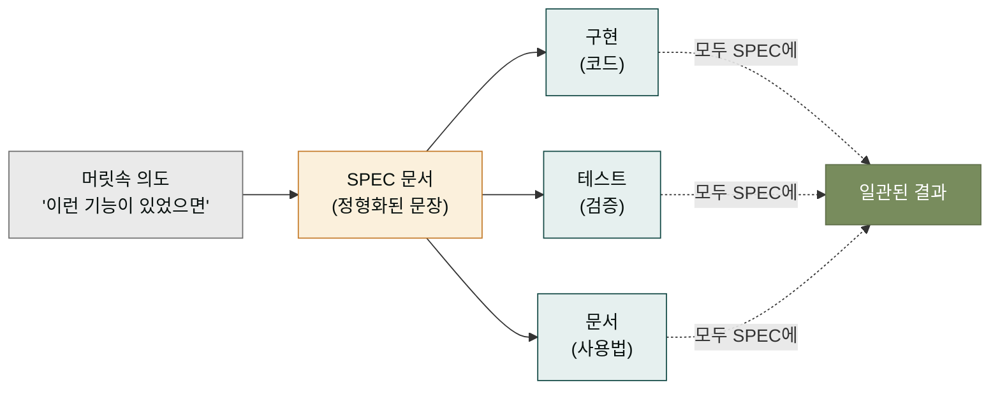
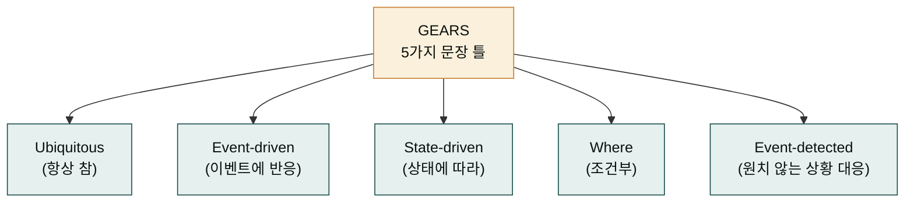

## SPEC이 왜 필요한가 — 요리 레시피의 비유

요리를 할 때 레시피가 없으면 어떻게 될까요. 숙련된 요리사는 머릿속에서 진행하겠지만, 보통 사람은 소금을 얼마나 넣었는지, 불을 얼마나 쎄게 했는지 잊어버립니다. 그래서 레시피 노트를 씁니다. 레시피의 가치는 두 가지입니다. 첫째, 다음에 같은 요리를 할 때 그대로 따라 하면 같은 맛이 나옵니다 (재현성). 둘째, 다른 사람에게 요리법을 전달할 때 노트 한 권으로 끝납니다 (전달성).

SPEC은 소프트웨어 개발의 레시피 노트입니다. "무엇을 만들 것인가"를 문장으로 정리해 두면, 다음에 같은 기능을 다시 만들 때 재현할 수 있고, 다른 개발자에게 전달할 때 문서 하나로 끝납니다. Claude는 지능적이지만 머릿속에 든 요구사항을 한 번에 이해하지 못합니다. 그래서 문서로 명시해 두는 것이 도움이 됩니다 — 이것이 SPEC이 존재하는 첫 번째 이유입니다.



SPEC 한 장이 구현·테스트·문서 모두의 기준이 됩니다. 세 가지가 각자의 해석으로 갈라지지 않고 하나로 모입니다. 이것이 SPEC의 두 번째 이유입니다 — 일관성의 기준점 역할입니다.

## GEARS 표기법 — 명확한 문장을 위한 다섯 가지 틀

SPEC을 처음 쓰면 "사용자가 로그인할 수 있어야 한다"처럼 모호한 문장이 나오기 쉽습니다. "할 수 있어야 한다"가 무슨 뜻인지, 언제, 어떤 조건에서인지 명확하지 않습니다. 이 모호함을 없애기 위해 MoAI는 **GEARS**라는 다섯 가지 문장 틀을 사용합니다.

GEARS는 다음 다섯 가지 패턴으로 요구사항 문장을 정형화합니다. 각 패턴은 상황에 따라 골라 씁니다.



각 패턴이 어떤 경우에 쓰이는지 예문으로 보면 빠릅니다.

- **Ubiquitous (항상 참)** — "The system shall validate user input." 항상 참이어야 하는 규칙. 언제나 발동합니다.
- **Event-driven (이벤트에 반응)** — "When the user clicks submit, the system shall display a confirmation dialog." 특정 이벤트가 일어났을 때 동작.
- **State-driven (상태에 따라)** — "While maintenance mode is on, the system shall block new logins." 특정 상태에서만 적용.
- **Where (조건부)** — "Where two-factor authentication is enabled, the system shall require OTP." 특정 조건이 켜져 있을 때만 적용.
- **Event-detected (원치 않는 상황 대응)** — "When the API rate limit is exceeded, the system shall return a 429 status." 예외 상황에서 어떻게 대응할지.

왜 굳이 다섯 가지로 나눌까요? 한 가지 통일된 틀로 모든 요구사항을 표현하면 모호해집니다. 상황마다 어울리는 틀이 다르고, 틀을 명시하면 그 요구사항이 어떤 상황에서 발동하는지 문장만 봐도 드러납니다. 자연어보다 정확하고, 법률 문장보다 읽기 쉬운 균형이 GEARS입니다.

## SPEC 문서의 수명주기

SPEC 문서는 한 번 쓰고 끝이 아니라, 한 기능이 태어나서 죽을 때까지 함께 살아갑니다. 문서는 다음 8단계의 수명주기를 가집니다.

```mermaid
stateDiagram-v2
    [*] --> draft: 최초 작성
    draft --> planned: 계획 확정
    planned --> in-progress: 구현 시작
    in-progress --> implemented: 구현 완료
    implemented --> completed: 문서·검증 종료
    completed --> [*]
    implemented --> superseded: 새 SPEC으로 대체
    completed --> archived: 보관
    planned --> rejected: 폐기 결정
    rejected --> [*]
```

각 상태는 SPEC의 '현재 위치'를 나타냅니다. `draft`는 작성 중, `planned`는 구현 전 확정, `in-progress`는 구현 중, `implemented`는 코드는 완성, `completed`는 문서·검증까지 종료. 이후 `superseded`(새 버전으로 대체), `archived`(과거 기록으로 보관), `rejected`(폐기)의 종료 상태 중 하나로 끝납니다.

왜 이렇게 상태를 세분할까요? 한 SPEC이 지금 어디에 서 있는지 알면, 다음에 무엇을 해야 할지 명확해집니다. `draft` 상태의 SPEC은 아직 구현하면 안 되고, `implemented` 상태의 SPEC은 문서화 단계로 넘어가야 합니다. 상태를 모르면 같은 일을 두 번 하거나, 중요한 단계를 건너뛰게 됩니다.

## SPEC이 사이클에서 하는 일

다시 `/moai plan → run → sync` 사이클로 돌아가 봅시다. SPEC은 이 사이클 전체를 관통합니다.

- **plan** 단계는 SPEC 문서를 **만듭니다**. 사용자 요청을 GEARS로 정리해 `.moai/specs/SPEC-XXX-001/spec.md`로 저장합니다.
- **run** 단계는 SPEC 문서를 **읽고 구현**합니다. 코드는 SPEC에 적힌 각 요구사항을 한 줄씩 만족해야 합니다.
- **sync** 단계는 구현 결과를 SPEC에 **반영**합니다. 진행 상태(`progress.md`)가 최신화되고, 완료 시점에 SPEC의 상태가 `implemented`로 바뀝니다.

이렇게 SPEC은 단순한 '초안 문서'가 아니라 사이클 전체의 기준점입니다. 사이클이 돌 때마다 SPEC은 새로운 정보를 흡수하고, 상태를 바꾸고, 다음 사이클의 입력이 됩니다.

## 자주 하는 오해 두 가지

SPEC을 처음 접하면 두 가지 오해를 흔히 합니다. 미리 짚고 넘어갑시다.

**오해 1: "SPEC은 관료적 문서라 코딩을 느리게 만든다."** — 작은 규모에서는 사실입니다. 하지만 규모가 커지면 반대가 됩니다. SPEC 없이 머릿속으로만 진행하면, 한 달 후에는 "왜 이렇게 구현했더라"를 재구성해야 합니다. SPEC은 그 재구성 비용을 앞당겨 지불하는 것입니다.

**오해 2: "SPEC은 한 번 쓰면 안 바꾸는 계약서다."** — 아닙니다. SPEC은 살아있는 문서입니다. 구현 중 요구사항이 바뀌면 SPEC도 같이 바뀝니다. 오히려 SPEC이 안 바뀌면 코드와 문서가 어긋나는 'drift' 현상이 생깁니다. MoAI는 코드 변경과 SPEC 변경을 같은 커밋에 묶어 drift를 방지합니다.

## 다음 단계

SPEC이 무엇인지 알았으니, [DDD와 TDD](./ddd-tdd.md)에서 그 SPEC을 어떻게 안전하게 구현하는지를 봅니다. 안전하다는 것은 — 기존에 잘 돌아가던 기능을 실수로 망가뜨리지 않는다는 뜻입니다.

---

### Sources

- SPEC 기반 개발 원본 문서: <https://adk.mo.ai.kr/ko/core-concepts/spec-based-dev/>
- GEARS 표기법 가이드: <https://adk.mo.ai.kr/ko/workflow-commands/moai-plan/#gears-notation>
- SPEC 프론트매터 스키마: <https://adk.mo.ai.kr/ko/contributing/>
