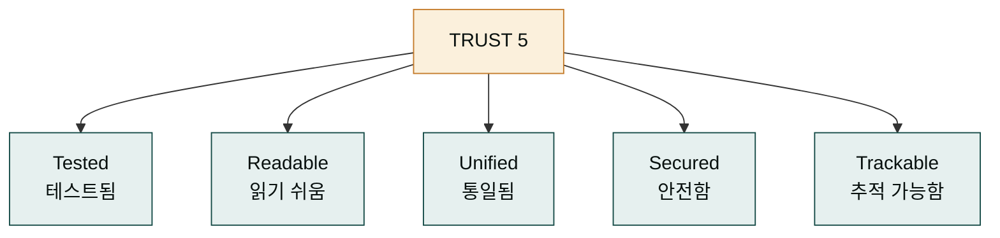
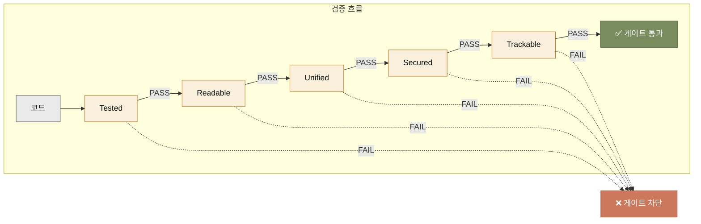
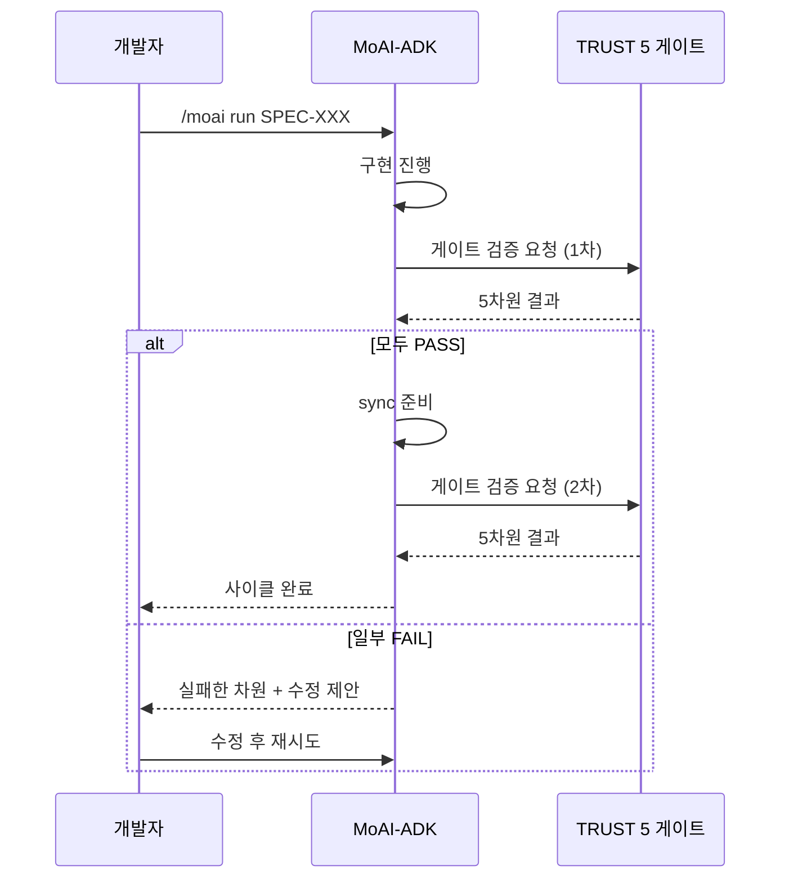

## '좋은 코드'를 어떻게 정의할까

"이 코드 좋은 코드인가요?"라는 질문에 답하기는 생각보다 어렵습니다. 경험 많은 개발자는 "느낌이 좋다"고 말하지만, 그 느낌을 다른 사람에게 전달하기 어렵습니다. 팀마다, 언어마다, 시대마다 '좋음'의 기준이 다릅니다. 그래서 팀은 코드 리뷰에서 자주 논쟁합니다 — 주관적 기준으로는 합의가 안 되기 때문입니다.

TRUST 5는 이 문제에 대한 MoAI의 답입니다. 좋은 코드를 다섯 가지 차원으로 정의하고, 각 차원을 기계적으로 검증합니다. '느낌'이 아니라 명시적 기준이 되어, 논쟁을 줄이고 자동화의 기반을 만듭니다. 다섯 차원의 머리글자를 따서 **TRUST**라고 부릅니다.

다섯 차원 모두를 만족하는 코드는 '좋은 코드'로 인정됩니다. 하나라도 빠지면 품질 게이트가 닫혀 다음 단계로 넘어갈 수 없습니다. 이 게이트가 사이클마다 작동해 일관된 품질을 보증합니다.

## 다섯 차원의 의미

각 차원이 무엇을 잴까요? 차원별로 한 줄 요약과 검증 방법을 정리합니다.

- **Tested (테스트됨)** — 코드가 테스트로 검증되어 있는가? 자동 테스트가 없는 코드는 '동작한다'는 보장이 없습니다. 차원 측정: 테스트 커버리지와 통과율.
- **Readable (읽기 쉬움)** — 이름과 구조가 의미를 잘 전달하는가? 좋은 코드는 읽는 사람의 시간을 아껴줍니다. 차원 측정: 린터(linter) 경고 수, 함수 길이.
- **Unified (통일됨)** — 코드 스타일이 프로젝트 전체에 일관된가? 들여쓰기 하나, import 순서 하나까지 통일되면 코드를 읽는 비용이 크게 줄어듭니다. 차원 측정: 포매터 경고 수.
- **Secured (안전함)** — 알려진 보안 취약점이 없는가? 입력값 검증, 자격증명 관리, OWASP Top 10 대응이 기본입니다. 차원 측정: 보안 스캐너 결과.
- **Trackable (추적 가능함)** — 변경 이력이 명확한가? 누가 언제 무엇을 바꿨는지 알 수 있어야 합니다. 차원 측정: 커밋 메시지 규칙 준수 여부.

다섯 차원이 직렬로 연결된 것은 한 번에 하나만 검증한다는 뜻이 아닙니다. 실제로는 병렬로 검증합니다. 하지만 하나라도 FAIL이면 게이트가 닫힌다는 점을 시각적으로 보여주기 위해 직렬로 그렸습니다. 어느 차원에서 실패했는지 정확히 알 수 있으므로, 수정도 빠릅니다.

## 게이트가 작동하는 시점

TRUST 5 게이트는 사이클 안에서 두 번 작동합니다. 한 번은 `/moai run` 직후, 구현이 끝났을 때. 또 한 번은 `/moai sync` 직전, 문서 정리 전에. 두 시점에 같은 기준을 적용해 일관성을 유지합니다.

실패한 차원이 있으면 MoAI는 어느 차원에서 무엇이 문제인지 보고합니다. 추상적인 "품질이 부족합니다"가 아니라 "Tested 차원: auth 패키지 커버리지 60%, 임계값 85% 미달"처럼 구체적으로. 이 구체성이 있으면 다음에 무엇을 고쳐야 할지 바로 압니다.

## 다섯 차원의 균형

중요한 점은 다섯 차원이 **독립적이라는** 것입니다. 하나를 높이려 다른 것을 희생할 수 없습니다. 예를 들어 테스트 커버리지를 100%로 올리기 위해 의미 없는 테스트를 잔뜩 넣으면 Tested는 오르지만 Readable이 떨어집니다. TRUST 5는 한 차원만 파고드는 편법을 허용하지 않습니다.

균형 잡힌 개선이 중요한 이유는, 코드베이스가 자라면서 가장 약한 차원이 전체의 병목이 되기 때문입니다. 보안이 약하면 아무리 테스트가 많아도 치명적 사고가 납니다. 추적 가능성이 떨어지면 아무리 코드가 깔끔해도 유지보수가 어렵습니다. 다섯 차원을 동시에 관리하는 것이 장기적으로 가장 저렴합니다.

## 일상에서 TRUST 5 체감하기

TRUST 5는 사이클 게이트로만 작동하지 않습니다. 일상 코드 작성에서도 체감할 수 있습니다. 몇 가지 사례를 봅시다.

- **새 함수를 작성할 때** — 함수가 하는 일을 한 줄로 설명할 수 없다면 Readable 차원이 경고합니다. 함수를 쪼갤 신호입니다.
- **import 문이 섞일 때** — Unified 차원이 자동 정렬을 제안합니다. 수동 정렬은 잊히기 쉽지만 게이트가 강제하면 늘 정렬된 상태가 유지됩니다.
- **사용자 입력을 받을 때** — Secured 차원이 검증 로직 누락을 잡아냅니다. "이 입력은 반드시 정수여야 한다"를 게이트가 잊지 않습니다.
- **커밋 메시지를 쓸 때** — Trackable 차원이 규칙(예: `feat(SPEC-XXX): ...`)을 강제합니다. 나중에 변경 이력을 찾기 쉬워집니다.

이 사례들은 TRUST 5가 '심사'가 아니라 '일상의 동료'라는 점을 보여줍니다. 게이트가 시키는 대로 하다 보면, 좋은 습관이 저절로 배입니다.

## 다음 단계

품질의 기준을 알았으니, [하네스 엔지니어링](./harness.md)에서 이 품질 기준을 바탕으로 사용자 경험을 시스템이 어떻게 학습하는지를 봅니다. 하네스는 반복되는 사용 패턴을 잡아 다음 사이클의 제안으로 바꾸는 장치입니다.

---

### Sources

- TRUST 5 품질 시스템 원본 문서: <https://adk.mo.ai.kr/ko/core-concepts/trust-5/>
- MoAI 품질 게이트 가이드: <https://adk.mo.ai.kr/ko/quality-commands/>
- OWASP Top 10 보안 기준: <https://owasp.org/www-project-top-ten/>
