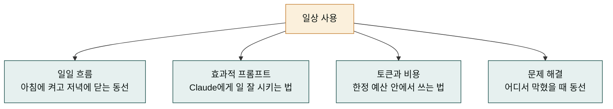
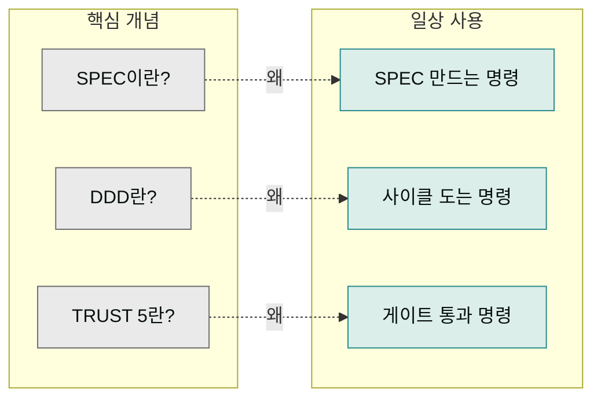

## 일상 사용 섹션에서 다루는 것

핵심 개념 섹션에서 SPEC·DDD·TRUST 5·하네스가 무엇인지는 알겠는데, "그래서 아침에 컴퓨터를 켜면 뭘 치면 되나요?"라는 질문은 여전히 남습니다. 일상 사용 섹션은 이 질문에 답합니다. 개념이 아니라 실제 반복되는 패턴을 다룹니다.

이 섹션이 필요한 이유는, 개념을 아는 것과 실제로 치는 것 사이에 gap이 있기 때문입니다. SPEC이 무엇인지는 알아도 "오늘 새 기능을 추가하려면 구체적으로 몇 줄의 명령어를 쳐야 하는가"는 별개의 질문입니다. 일상 사용 섹션은 이 '손이 외우는 패턴'을 잡아줍니다.

## 일상의 네 가지 패턴

이 섹션은 네 가지 일상 패턴을 다룹니다. 각 패턴은 자주 반복되는 상황에 대한 대응입니다.

- **일일 흐름** — 아침에 작업을 시작할 때 어떤 명령을 먼저 치는가. 하루를 마무리할 때 무엇을 확인하는가.
- **효과적 프롬프트** — Claude에게 요청을 어떻게 써야 원하는 결과를 한 번에 받는가.
- **토큰과 비용** — Claude 사용량에 따른 비용을 어떻게 관리하는가. 특히 GLM 백엔드를 언제 쓰는가.
- **문제 해결** — 명령어가 실패하거나 결과가 이상할 때 어디서 원인을 찾는가.

## 학습 순서

각 패턴은 순서대로 읽는 것을 권하지만, 꼭 그래야 하는 것은 아닙니다. 당장 급한 주제가 있다면 그 페이지부터 읽어도 됩니다.

| 순서 | 페이지 | 다루는 질문 |
|------|--------|------------|
| 1 | [일일 흐름](./daily-flow.md) | 하루 작업의 처음과 끝을 어떻게 짜는가? |
| 2 | [효과적 프롬프트](./prompts.md) | Claude에게 어떻게 요청해야 잘 받는가? |
| 3 | [토큰과 비용](./tokens-cost.md) | 비용을 줄이면서 품질을 유지하려면? |
| 4 | [문제 해결](./debugging.md) | 어디서 막혔을 때 어디를 보는가? |

## 핵심 개념과 일상의 연결

일상 사용 섹션은 핵심 개념을 그대로 쓰되, 관점을 바꿉니다. 핵심 개념은 '왜'를 다루고, 일상 사용은 '어떻게'를 다룹니다. 예를 들어 SPEC이 왜 필요한지는 핵심 개념에서, "오늘 새 SPEC을 만들 때 어떤 명령을 치는지"는 일상 사용에서 다룹니다.

이 두 섹션을 같이 보면, 개념이 명령이 되고 명령이 다시 개념을 강화하는 루프가 잡힙니다. 왜를 알면 명령이 외워지고, 명령을 치면서 왜를 다시 체감합니다.

## 이 섹션의 독자

이 섹션은 다음 분들을 가정하고 씁니다.

- **첫 사이클을 이미 돌린 분** — 시작하기 섹션의 실습을 마쳤고, 이제 매일 쓸 패턴을 잡고 싶은 분.
- **기존 CLI 친숙 분** — 개념은 건너뛰고 일상 명령 패턴부터 보고 싶은 분.
- **생산성을 높이고 싶은 분** — 매일 비슷한 작업을 반복하며, 이것을 줄일 방법을 찾는 분.

어느 부류든, 이 섹션의 페이지는 '읽고 나서 바로 오늘 작업에 써먹을 수 있는' 패턴을 제공합니다.

## 다음 단계

[일일 흐름](./daily-flow.md)부터 시작합시다. 하루의 동선을 한 번 잡아두면 나머지 패턴들은 그 동선의 일부로 자연스럽게 자리잡습니다.

---

### Sources

- MoAI 일상 사용 패턴 원본 문서: <https://adk.mo.ai.kr/ko/claude-code/>
- MoAI 유틸리티 명령어: <https://adk.mo.ai.kr/ko/utility-commands/>
- Claude Code 일상 사용 가이드: <https://code.claude.com/docs/en/common-workflows>
