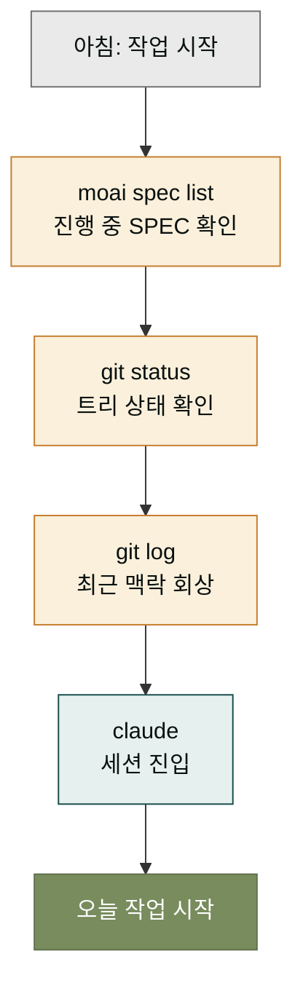
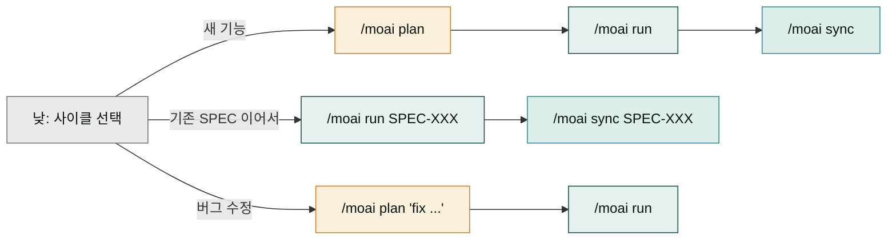
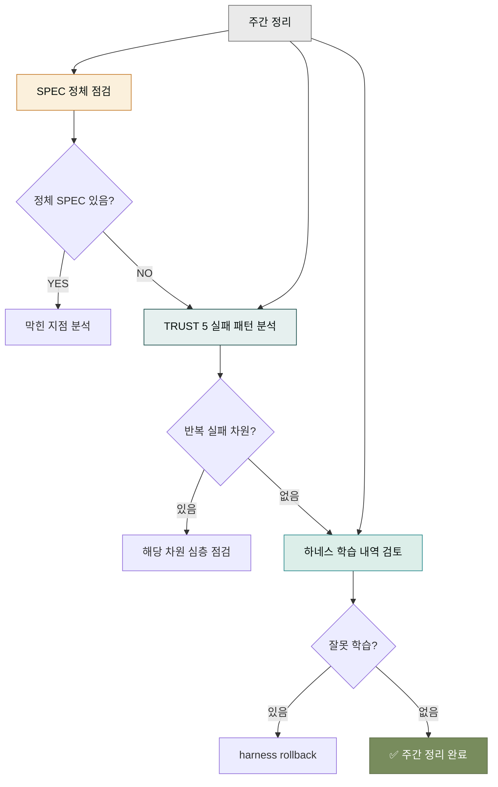

## 하루의 동선을 잡는 이유

작업 흐름이 정해져 있지 않으면, 매일 "오늘은 뭘 먼저 하지"부터 고민하게 됩니다. 이 고민은 에너지를 빼앗고, 결국 비슷한 일을 매일 다른 순서로 하게 만듭니다. 반대로 동선이 잡혀 있으면, 아침에 결정 에너지를 핵심 문제에 쓸 수 있습니다. 동선은 반복되는 결정을 자동화하는 틀입니다.

이 페이지는 하루의 CLI 작업 동선을 제안합니다. 모든 사용자에게 맞는 정해진 동선은 없지만, 시작점으로 삼을 만한 기본 동선을 잡아 드립니다. 몇 주 쓰다 보면 본인에게 맞게 변형하게 됩니다. 그 변형의 출발점이 이 페이지입니다.

## 아침 동선 — 작업 시작

작업을 시작할 때 가장 먼저 할 일은 '현재 상태 확인'입니다. 전날 어디까지 했는지, 진행 중인 SPEC은 무엇인지, 작업 트리는 깨끗한지를 봅니다.

```bash
# 1. 진행 중인 SPEC 목록 보기
moai spec list --status in-progress

# 2. 현재 트리 상태 확인
git status

# 3. 최근 커밋 회상
git log --oneline -5

# 4. Claude Code 세션 시작
claude
```

이 네 명령이 아침 1분을 정리합니다. SPEC 목록은 "오늘 어떤 SPEC을 이어서 할까"를 알려주고, `git status`는 트리가 깨끗한지(이전 작업이 남아 있지 않은지)를 보여주며, 최근 커밋은 맥락을 떠올리게 합니다. 그 다음 Claude Code 세션에 들어가면 됩니다.



이 다섯 단계가 아침 1-2분 안에 끝납니다. 간단하지만, 이 순서를 건너뛰면 전날 맥락을 잃어 첫 30분을 헤매게 됩니다. 아침 1분을 투자해 30분을 사는 셈입니다.

## 낮 동선 — 사이클 돌리기

본격적인 작업 시간입니다. 어떤 작업을 하느냐에 따라 동선이 갈라집니다. 새 기능이면 plan→run→sync 사이클, 기존 코드 개선이면 그 SPEC의 run만 이어서, 버그 수정이면 새 SPEC을 열어 fix 사이클을 돌립니다.



중요한 점은 사이클 사이사이에 `/clear`를 치는 것입니다. Claude Code 세션의 컨텍스트 창은 한정되어 있어, 한 사이클이 끝나면 초기화하는 것이 다음 사이클의 성능에 좋습니다. 특히 plan 다음에는 반드시 `/clear`를 치고 run으로 넘어가야 합니다 — 그렇지 않으면 plan 단계의 탐색적 대화가 run 단계의 구현을 흐립니다.

```
> /moai plan "..."
> (질문에 답변, SPEC 생성)
> /clear                          ← 여기 반드시 clear
> /moai run SPEC-XXX-001
> (구현 진행)
> /clear                          ← 여기도 권장
> /moai sync SPEC-XXX-001
```

`/clear`는 진행 상태를 날리는 것이 아닙니다. 진행 상태는 `.moai/specs/`에 안전하게 저장되어 있으므로, Claude Code 세션을 초기화해도 다음 사이클이 그 파일에서 이어받습니다.

## 저녁 동선 — 작업 마무리

하루를 마무리할 때는 "내일 아침에 다시 시작할 수 있는 상태"를 만들어 둡니다. 진행 중인 작업이 있으면 커밋해 두고, 완료한 작업은 push하며, 다음 날 할 일을 SPEC progress에 메모해 둡니다.

```bash
# 1. 완료된 작업 커밋 (아직 안 했다면)
git status
git add . && git commit -m "feat(SPEC-XXX-001): Mn ... "

# 2. 진행 중 작업도 중간 커밋 (WIP)
git add . && git commit -m "wip: SPEC-XXX-001 Mn 진행 중"

# 3. 내일 시작점 메모 (progress.md에 자동 기록됨)
# /moai sync 가 끝난 상태라면 이미 최신화되어 있음

# 4. Claude Code 세션 종료
exit
```

저녁 커밋의 핵심은 "WIP(Work In Progress)라도 커밋한다"는 것입니다. 진행 중인 코드를 작업 트리에 남겨두면 다음 날 사고가 났을 때 날아갑니다. 중간 커밋은 보험입니다. WIP 커밋은 다음 날 `git reset --soft HEAD~1`로 풀고 이어서 하면 됩니다.

## 일주일 동선 — 주간 정리

매일의 동선 위에 일주일 단위의 정리 동선이 있습니다. 주말이나 한 주의 끝에 진행합니다.

- **SPEC 상태 점검** — 진행 중인 SPEC들이 정체되어 있지 않은지. 한 주 이상 `in-progress`에 머물러 있다면 막힌 지점이 있는지 확인합니다.
- **TRUST 5 게이트 리포트 확인** — 이번 주에 실패한 게이트가 있었는지. 반복적으로 같은 차원에서 실패한다면 그 차원을 깊이 보아야 합니다.
- **하네스 학습 내역 검토** — 학습된 패턴 중 잘못된 것은 없는지. 있으면 `/moai harness rollback`으로 되돌립니다.



주간 정리는 한 시간以内로 끝나지만, 장기적으로 큰 차이를 만듭니다. 매일의 작업이 쌓여 어디로 가고 있는지를 한 번 보는 자리입니다.

## 자주 하는 실수 세 가지

일상 동선에서 반복되는 실수를 미리 짚어둡니다.

**실수 1: 사이클 사이에 `/clear` 안 치기** — 컨텍스트 창이 꽉 차서 Claude 응답 품질이 떨어집니다. 특히 plan 후 run 전에는 반드시 clear.
**실수 2: WIP 커밋 안 하고 퇴근** — 다음 날 트리가 사라지거나 꼬여 처음부터 다시 해야 합니다. 10초 커밋이 하루를 살립니다.
**실수 3: 아침 동선 건너뛰기** — 전날 맥락 없이 바로 코딩 시작하면 30분을 헤맵니다. 1분 투자로 30분 절약.

## 다음 단계

동선은 잡았으니, 다음은 [효과적 프롬프트](./prompts.md)에서 Claude에게 일을 잘 시키는 법을 봅니다. 아무리 좋은 동선도, 프롬프트가 부실하면 사이클이 금방 막힙니다.

---

### Sources

- MoAI 워크플로우 명령어: <https://adk.mo.ai.kr/ko/workflow-commands/>
- Claude Code 일상 워크플로우: <https://code.claude.com/docs/en/common-workflows>
- MoAI 진행 상태 관리: <https://adk.mo.ai.kr/ko/utility-commands/>
