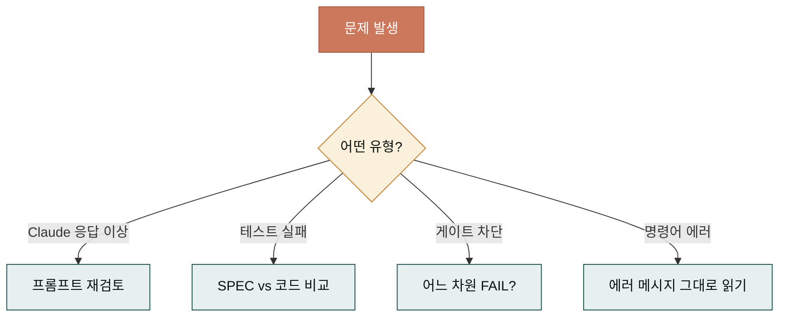
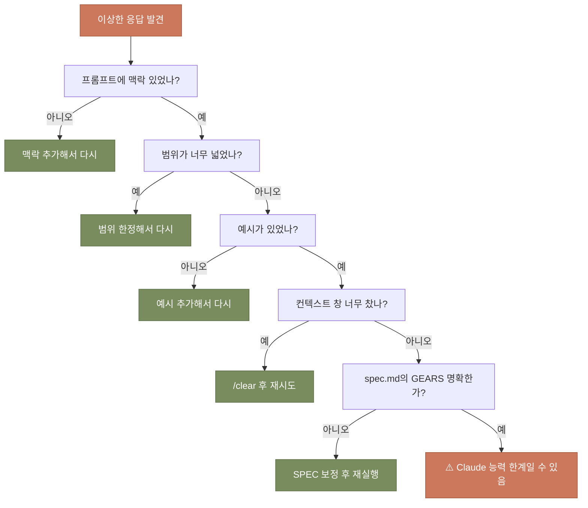
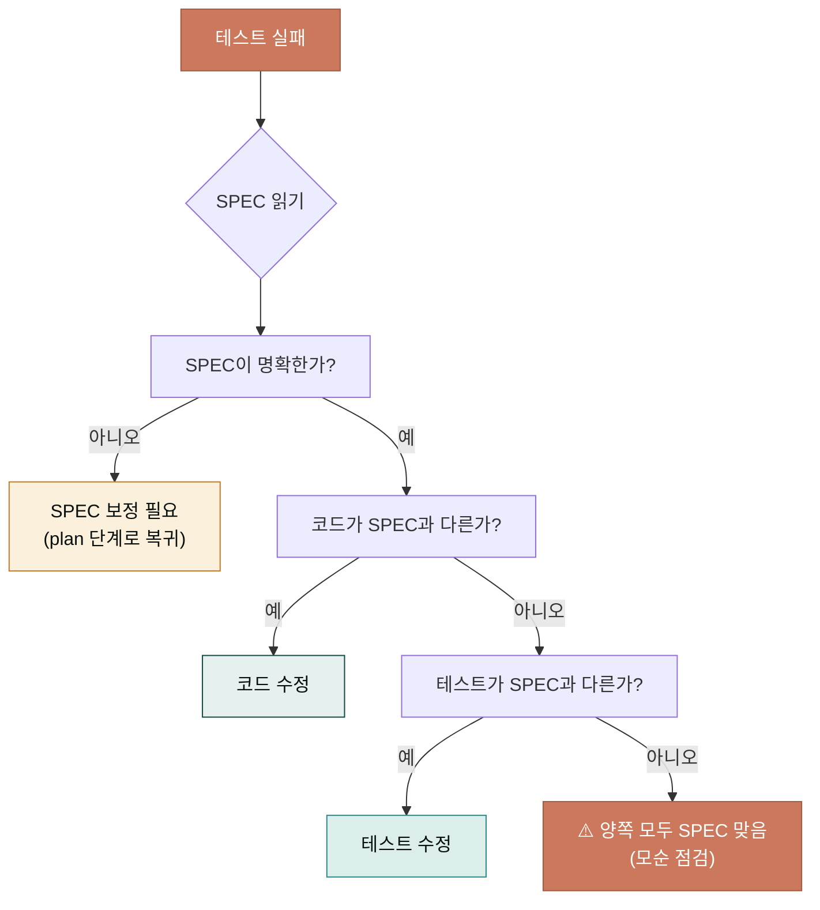
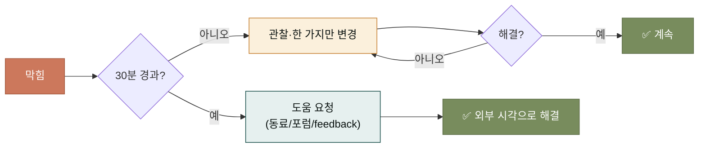

## 막혔을 때의 동선이 중요한 이유

사이클을 돌리다 보면 반드시 막히는 순간이 옵니다. Claude가 이상한 답을 주거나, 테스트가 실패하거나, TRUST 5 게이트가 안 닫히거나, 명령어가 에러를 뱉거나. 막히는 것 자체는 피할 수 없지만, 막혔을 때 어디서 원인을 찾는지를 아는 것은 큰 차이를 만듭니다.

이 페이지는 자주 만나는 문제 유형별로 점검 동선을 잡아 줍니다. 막힐 때마다 무작정 다시 시도하지 말고, 이 페이지의 동선을 따라 원인을 좁혀 가기를 바랍니다. 대부분의 문제는 5-10분 안에 원인이 드러납니다.

## 문제 유형별 1차 동선

문제는 크게 네 유형으로 나뉩니다. 유형별로 먼저 봐야 할 곳이 다릅니다.



먼저 문제 유형을 분류하는 것이 1단계입니다. 유형을 잘못 분류하면 엉뚱한 곳에서 원인을 찾습니다. "Claude 응답이 이상한데 왜 이러지" 하면서 게이트 설정을 고치는 식입니다. 유형을 정확히 분류하면 절반은 해결된 것이나 다름없습니다.

## 유형 1 — Claude 응답이 이상할 때

Claude가 엉뚱한 답을 주거나, 요청을 무시하거나, 같은 질문을 반복할 때. 이 경우 90%는 프롬프트 문제입니다. Claude의 능력 부족이 아니라 내 요청의 불명확함이 원인입니다.

점검 순서는 다음과 같습니다.



이 점검 순서를 따라가면 대부분의 '이상한 응답'이 해결됩니다. 맥락·범위·예시 중 하나가 빠졌거나, 컨텍스트 창이 너무 찼거나, SPEC 문서의 GEARS가 모호한 경우가 대부분입니다. [효과적 프롬프트](./prompts.md) 페이지의 세 축을 다시 점검해 보세요.

## 유형 2 — 테스트가 실패할 때

`/moai run` 중에 테스트가 실패하면, 그 실패는 두 가지 중 하나입니다. (a) 코드가 SPEC을 잘못 구현했거나, (b) 테스트 자체가 잘못 작성되었거나. 어느 쪽인지 판별하는 것이 먼저입니다.



중요한 점은 테스트 실패 시 무작정 코드만 고치지 않는 것입니다. SPEC을 먼저 읽고, 코드와 테스트 중 어느 쪽이 SPEC에서 벗어났는지 봅니다. 코드가 틀렸으면 코드를, 테스트가 틀렸으면 테스트를 고칩니다. 둘 다 SPEC에 맞는데 실패하면 SPEC 자체가 모순인 경우이므로 plan 단계로 돌아가 SPEC을 다듬어야 합니다.

## 유형 3 — 게이트가 닫힐 때 (TRUST 5)

TRUST 5 게이트가 닫히면 어느 차원에서 실패했는지 정확히 알려줍니다. 그 차원에 집중해서 수정합니다.

- **Tested FAIL** — 커버리지가 임계값 미달이거나, 테스트가 실패한 코드가 있음. 실패한 테스트를 찾아 원인을 분석합니다.
- **Readable FAIL** — 린터가 경고한 부분이 있음. 긴 함수, 모호한 이름, 복잡한 조건문을 정리합니다.
- **Unified FAIL** — 포매터가 지적한 부분이 있음. 들여쓰기, import 순서 등을 정리합니다.
- **Secured FAIL** — 보안 스캐너가 취약점을 찾음. 입력값 검증, 자격증명 관리를 점검합니다.
- **Trackable FAIL** — 커밋 메시지가 규칙을 안 지킴. `feat(SPEC-XXX): ...` 형태로 다시 씁니다.

각 차원의 구체적 수정법은 [TRUST 5 품질 게이트](../concepts/trust5.md) 페이지를 참고하세요. 게이트가 닫힐 때마다 그 차원의 페이지를 다시 보면 자연스럽게 익숙해집니다.

## 유형 4 — 명령어가 에러를 뱉을 때

`moai` 또는 `claude` 명령어 자체가 에러를 뱉으면, 그 에러 메시지가 가장 좋은 단서입니다. 에러 메시지를 무시하지 말고 끝까지 읽습니다.

```bash
# 일반적인 에러 점검 순서
1. 에러 메시지 끝까지 읽기 (보통 원인+해결책이 같이 있음)
2. 최근 변경 사항 회상 (방금 뭘 바꿨는지)
3. 문서의 troubleshooting 페이지 확인
4. moai doctor 로 환경 점검
```

자주 만나는 에러와 해법을 표로 정리합니다.

| 에러 메시지 | 원인 | 해법 |
|------------|------|------|
| `command not found: moai` | PATH에 없음 | 터미널 재시작 또는 `source ~/.zshrc` |
| `spec not found: SPEC-XXX-001` | SPEC ID 오타 또는 미생성 | `moai spec list` 로 실제 ID 확인 |
| `permission denied` | 파일 권한 | `chmod +x` 또는 소유자 확인 |
| `index.lock` (git) | 다른 git 프로세스 | 잠시 대기 후 재시도, 5초 sleep |
| `connection refused` (Claude) | 네트워크 또는 인증 | `claude` 재로그인 |

에러 메시지가 영어라도 끝까지 읽으세요. Claude Code와 MoAI의 에러 메시지는 원인과 해법을 같이 적어주는 경우가 많습니다. "Error: SPEC-XXX-001 not found, run `moai spec list` to see available specs"처럼 다음에 할 일을 알려주는 형태입니다.

## 막혔을 때의 자세 — 세 가지 원칙

문제 해결에서 자세가 중요합니다. 기술보다 자세가 더 큰 차이를 만듭니다.

**원칙 1: 추측하지 말고 관찰하라.** "아마 이것 때문일 거야"라고 가정하고 고치지 마세요. 로그를 보고, 에러 메시지를 읽고, 상태를 확인한 뒤에 손을 댑니다. 추측은 두 번 세 번 시도를 낳습니다.

**원칙 2: 한 번에 하나만 바꿔라.** 문제가 있을 때 여러 가지를 한 번에 바꾸면 어느 것이 효과가 있었는지 알 수 없습니다. 한 번에 하나씩만 바꾸고 결과를 봅니다.

**원칙 3: 30분 이상 막히면 도움을 구하라.** 혼자 사투하지 마세요. 30분 넘게 막혔다면 남에게 물어보는 것이 더 빠릅니다. 동료, 포럼, `/moai feedback` 명령(이슈 리포트) 등을 활용하세요.



## 다음 단계

이것으로 일상 사용 섹션을 마쳤습니다. 다음은 [MoAI-ADK 섹션](../moai-adk/_index.md)에서 `/moai plan → run → sync` 사이클 자체를 깊이 파봅니다. 일상에서 매일 쓰는 사이클이 내부적으로 어떻게 작동하는지를 알면, 문제가 생겼을 때 더 빨리 원인을 잡을 수 있습니다.

---

### Sources

- MoAI 트러블슈팅 가이드: <https://adk.mo.ai.kr/ko/getting-started/faq/>
- MoAI 고급 주제: <https://adk.mo.ai.kr/ko/advanced/>
- Claude Code 문제 해결: <https://code.claude.com/docs/en/troubleshooting>
